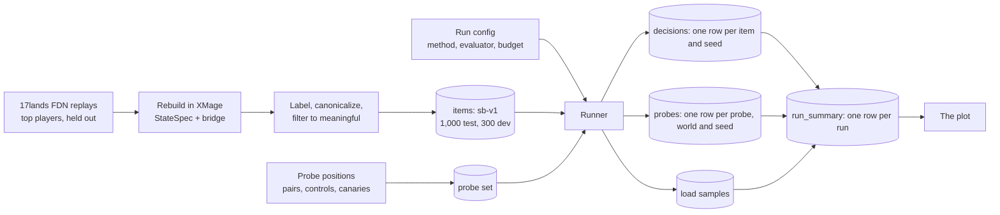

# Search benchmark: decision quality, hidden information and compute

A proposal for comment, written 2026-09-27. **Nothing here has been built or run.**

**What we'd like feedback on: the first experiment (§2).** It compares four search methods from
three families (today's MCTS, PIMC and IS-MCTS) at four search budgets, with two evaluators, on
about 1,000 decisions made by top 17lands players, and tests each method for hidden-information
leaks. §3 collects follow-up ideas. They're there for context and don't need review yet.

**The question.** Which search plays limited best while respecting hidden information, and what
does it cost? Deep tree search guided by trained policy and value networks is what made AlphaZero
and KataGo strong. Magic's rules engines are far slower than chess or Go engines, so today's Magic
agents search a few actions deep, or not at all. This benchmark measures what more search, and
better search, buys.

It builds on two earlier docs:

- [docs/008](008-gameplay-data.md) rebuilds 17lands decisions in XMage. Its pipeline supplies the
  test positions and the human labels.
- [docs/009](009-hidden-information.md) shows that MageZero's search reads hidden cards, and
  surveys the search families that don't. Its leak probes (§8.2) grow into the hidden-information
  test.

## Summary

**The first experiment** (§2):

| | |
|---|---|
| **Search methods** | MageZero's MCTS today, which searches the real game, hidden cards included (the reference); PIMC with 1 and with 4 sampled worlds; IS-MCTS, one information-set tree with a fresh sampled world every iteration |
| **Budgets** | 100, 300, 1,000 and 3,000 simulations per decision; 10,000 optional for the best method |
| **Evaluators** | offline search, where a heuristic scores positions (CPU only); and a trained network from experiment #2 (MageZero v0.2.0) |
| **References** | the rule heuristic and the network's policy, both with no search; XMage's MAD AI; chance |
| **Decision quality** | agreement with top 17lands players on 1,000 held-out decisions |
| **Hidden information** | a pass/fail leak test on about two dozen probe scenarios; it colors the plot |
| **Compute** | pod-seconds per decision on the RTX 3090 pod at full load |
| **Runs** | 4 methods × 4 budgets × 2 evaluators = 32; a backprop-discount sweep, 12 more; the references |
| **Cost** | about 39 pod-hours (~$19.50) for the network runs; offline search runs on the laptop. IS-MCTS needs about a week of engine work first |

<picture>
  <source media="(prefers-color-scheme: dark)" srcset="img/012-frontier-dummy-dark.png">
  
</picture>

*Dummy numbers: they show the format, not a result (§2.8).*

**What it decides:**

- **The price of fairness:** how the fair methods' agreement compares with today's search, which
  reads hidden cards, at the same compute.
- **Whether more simulations buy agreement,** and where the curves flatten.
- **Whether one sampled world is enough,** or four are worth it.
- **Whether one information-set tree beats separate trees:** IS-MCTS against PIMC, at the same
  budget and at the same compute.
- **Whether offline search and a trained network tell the same story.**
- **Whether a backprop discount helps,** and whether it helps fair search as much as it helps the
  clairvoyant search.

**The main risk is the proxy.** In chess, adding search to a human-like network gained about 390
Elo against strong players while its move-matching rose 0.2 points. Stockfish at depths 11–15
matched human moves about equally well despite large strength gaps. So agreement may separate
broken search from decent search, and still miss the difference between good and better (§2.10).
The first experiment reports agreement only. Testing agreement against win rate is the first
follow-up (§3.1).

**Questions for reviewers** are in §2.11.

---

## 1. Background

### 1.1 Where search stands in this project

| | Experiment #1 | Experiment #2 (running) | For comparison |
|---|---|---|---|
| Simulations per decision | 96, with tree reuse | 300, with tree reuse | AlphaZero: 800 per move in self-play (Silver et al. 2018) |
| Fresh simulations actually run | median 32 at a budget of 100, in 12 offline games on its engine (docs/008 §6) | not measured | — |
| Hidden cards | the search runs on the real game, hands and library order included (docs/009 §3) | the network no longer sees the opponent's hand, but the search still does | every surveyed system keeps the acting policy a function of what the player could know (docs/009 §4) |
| Measured throughput | about 41 simulations/s with the network, 84 without (docs/003 §4.1) | 215–258 simulations/s across a whole pod, network on, in its pilots (docs/006, docs/010) | — |

**Why it matters.** The search sets three things at once:

- **how well an agent plays** once it's trained;
- **the training targets**, because policy targets are the root visit counts and value targets
  blend in the root value;
- **what self-play costs**: about 200 searches per game (docs/009 §3.5 counts ~106 rows per
  player), times thousands of games.

### 1.2 Why agreement, not win rate

Win rate is the real measure. But it's expensive and slow to resolve:

- **A 400-game match** resolves a difference of about 7 points (docs/008 §7.5). At about 200
  searches per game, that's about 85,000 searches per configuration.
- **A 1,000-decision benchmark** runs 1,000 searches, one per decision, and every configuration
  sees the same decisions. Paired comparisons on fixed positions cut noise further.

That is roughly an **80× saving** per configuration. The price is validity: agreement with humans
is a proxy (§2.10).

### 1.3 What already exists

Most of the machinery exists from docs/008 and docs/009:

- **Test positions.** 17lands FDN turns rebuild in XMage: every visible card is pinned down in
  88.7% of turn-start states, and a scripted replay of a whole recorded turn lands on the next
  snapshot in about 89% of turns (docs/008 §4).
- **Labels.** Attacks are exact. Priority plays are known per turn as an unordered set. Targets are
  exact when settled by what died. Blocks are unique in about 88% of combats (docs/008 §3.3, §7.1).
- **A search driver.** The coach runs K determinized MageZero searches on a rebuilt position, each
  on a fresh tree, with the opponent's hand drawn from a belief built on 17lands decks. It returns
  every option's visits and Q (docs/008 §8).
- **Leak probes.** Two controlled position pairs show today's search playing around a
  counterspell only when it's really there, and valuing a cantrip by the card it will draw
  (docs/009 §3.4).

Early numbers from those docs show the metric has range:

| On held-out 17lands decisions | Agreement |
|---|---|
| gen 33's priority head, turn-start decisions whose label has no land | 16.2% |
| "play a land, else the biggest spell" | 39.6% |
| gen 33's trunk with heads retrained on 30k human decisions | 57.9% |
| Coach, offline search, K = 8 × 300 simulations: its best action is in the human's set (chance ≈ 50%) | 72.7% (n = 242) |
| Coach, gen 33 network, same setting | 57.3% (n = 143) |

The first three rows are docs/008 §7.3, the last two §8.3. The two sets of rows use different
decisions and labels, so compare within a set, not across.

## 2. The first experiment

### 2.1 The grid

**Search methods.**

| Method | What it does | Hidden information | Available? |
|---|---|---|---|
| **Clairvoyant MCTS** (MageZero's MCTS today) | AlphaZero-style PUCT on an exact copy of the real game: both hands, both libraries in order, both decks | reads them (docs/009 §3). It's the reference, expected to fail the test | exists |
| **PIMC, 1 world** | re-deals the opponent's hand and shuffles both libraries once, from a belief, then searches that world (Ginsberg 2001; named by Long et al. 2010) | never sees the real ones | the coach op does it |
| **PIMC, 4 worlds** | four re-dealt worlds, each with a quarter of the budget; the chosen option has the most visits summed over them | never sees the real ones | the coach op does it (it ranks by mean Q today, so the benchmark adds summed visits) |
| **IS-MCTS** (single-observer, the published form) | one tree whose nodes are what the searcher can tell apart (information sets). Every iteration deals a fresh world from the belief and follows only the options legal in it, so statistics are shared across worlds (Cowling, Powley & Whitehouse 2012) | never sees the real ones | to build: about a week of engine work (§2.9) |

- **The belief** for PIMC and IS-MCTS is the 17lands deck model (docs/008 §8.2). It picks a real
  17lands deck of the opponent's colors, consistent with the cards seen so far, and deals the
  hand from its unseen cards. The same belief is used on the test decisions and on the probes.
- **PIMC** is also called ensemble determinization. It's the standard first step in card games,
  and it's what upstream XMage's own Monte Carlo player does (docs/009 §4.1, §7).
- **IS-MCTS sees many more worlds than PIMC:** a fresh one every iteration, so hundreds per
  search, where PIMC splits its budget between four. It pays for that in engine work. MageZero
  caches one game state per node, valid in only one world, so each IS-MCTS iteration replays its
  path from the root in the new world. That's the scripted replay MageZero already uses to rebuild
  a node's state, started from the root instead of the parent.
- **How IS-MCTS is built** (docs/009 §6.4):
  - options get world-independent keys, since the opponent's Refute is a different object in each
    world;
  - selection uses availability counts, since an option like "Cast Refute" exists only in some
    worlds;
  - each node is scored once, in the world of the iteration that creates it. OpenSpiel's IS-MCTS
    takes priors the same way. Scoring every node in every world would multiply the network calls
    by the tree's depth (docs/009 §6.3);
  - the opponent's nodes are shared across worlds, as published. That risks piling the plays of
    every hand the opponent might hold into one node, which hurt plain IS-MCTS in Dou Di Zhu
    (docs/009 §6.3). Keying them by the opponent's own information is a follow-up.
- **The particle form,** which draws each iteration's world from a fixed set and caches a state per
  node and world, is a follow-up too (§3.4).

**Budgets.** 100, 300, 1,000 and 3,000 fresh simulations per decision, with a fresh tree for each
decision, as the coach does. For PIMC with 4 worlds and for IS-MCTS, the budget is the total
across the worlds. The best method optionally also runs at 10,000.

**Evaluators: what scores a position inside the tree.**

- **Offline search.** MageZero's offline mode: a heuristic (`GameStateEvaluator3`, a score of life,
  hand size and board) scores positions, and the priors are uniform. It's what gen 0 plays with.
  It runs on CPU and is deterministic given a seed. Its weak spot is combat: yes/no and target
  decisions inherit their parent's score until a priority decision lies below them, so attacks and
  blocks need larger budgets (docs/008 §6).
- **A trained network** from experiment #2, trained on MageZero v0.2.0. The default is run 1's
  final checkpoint, which learned from self-play only. Run 2 started from a network pretrained on
  human decisions, which raises agreement for reasons that have nothing to do with search (§2.10).
  So its starting network appears only as a no-search reference. Both runs end around Sept 29.
  Priors stay off, as in experiment #2, so the search uses only the network's value head.

**Held fixed at today's defaults.** Exploration constant c = 1; unvisited options valued at 0;
final choice by most visits; backprop discount 0.99, except in the sweep below; duplicate-state
pruning off (draft-zero's default). Tree reuse and exploration noise are off. Tuning any of the
others is a follow-up (§3.5).

**One setting is swept: the backprop discount (E2b).** MageZero backs a leaf's value up the tree
with a factor of 0.99 per ply, so a result k plies away counts as 0.99^k of itself. The sweep was
suggested in review: MuZero used a discount, and in MageZero it smoothed out degenerate play, such
as skipping through combat to reach a good top card, or stalling with pointless activations when
the opponent plays something strong. (MuZero discounted by 0.997 per step in Atari, though not in
its board games: Schrittwieser et al. 2020.)

- **Arms:** 1.0 (no discount), 0.95 and 0.9, next to E2's 0.99. At 1,000 simulations, for
  clairvoyant MCTS and PIMC with 4 worlds, with both evaluators. IS-MCTS is left out: at its cost
  per simulation, the sweep would add about 10 pod-hours.
- **The prediction to test:** the discount helps clairvoyant MCTS more than PIMC. Skipping combat
  to reach a good top card needs the search to know the top card, and only the clairvoyant search
  does. A comment in MageZero's search points the same way: "make true stochastic MCTS (hidden
  feature set + MCTS discount works for now)". If the discount helps PIMC just as much, it's a
  genuine improvement for every method.
- **What to watch:** a per-ply discount also shrinks a distant loss. A loss 20 plies away counts as
  −0.82 at 0.99 and −0.36 at 0.95, which in principle rewards delaying it. The per-type results on
  holds and attacks show whether the discount trades one kind of stalling for another.

**References.** Chance (uniform over the options). The rule heuristic ("play a land, else the
biggest spell; attack when power is at least the best blocker's toughness") and the network's
policy, both with no search. XMage's MAD AI, its standard bot, which runs its own minimax search.

### 2.2 The decisions

**Source.** 17lands' public FDN PremierDraft replay data (CC BY 4.0), rebuilt in XMage by
docs/008's pipeline.

**Whose decisions.** Players with `user_game_win_rate_bucket` ≥ 0.60 and at least 100 games,
docs/008's "top" group (90,719 games). The bucket includes the game itself, so without the
100-game floor the filter selects on the outcome (docs/008 §3.5).

**Held out.** Only games outside every imitation table, docs/008 §7.3's and experiment #2 run 2's,
with both sides of a mirrored game excluded together. A network trained on a decision mustn't be
scored on it.

**Clean states only.** Fidelity tiers T0 and T1 (docs/008 §4.3), turns 3–12, and, for anything
past the turn start, only turns whose replay reproduced.

**Spread.** At most two decisions per game, so at least 650 games, so that no game dominates and
the confidence intervals stay honest.

**Splits.** The first experiment tunes nothing, so it reports on a **test split of 1,000**. A
**dev split of 300**, drawn the same way from other games, is used to dry-run the harness and is
kept for the follow-ups' tuning. Both are frozen and versioned as `sb-v1`.

**The mix.** A default for reviewers to challenge:

| Decision type | Test | Dev | Label | Kept only when |
|---|---|---|---|---|
| Spell choice: the first main-phase priority after the land drop, in a turn in which the human cast a spell | 300 | 90 | the set of that turn's spells legal at this moment (docs/008 §7.3's set label, without the land) | at least two distinct castable spells, or a real choice between casting and holding |
| Hold: the human cast nothing in its main phases, with castable spells and the mana for them | 100 | 30 | Pass | a spell was castable |
| Mid-turn priority, from replayed turns | 100 | 30 | the turn's remaining plays, in any order | as for spell choice |
| Attack: "attack with X?" per creature | 225 | 65 | exact, from the recorded attackers | a potential blocker could block X, or the defender has mana open |
| Block: "what does this creature block?" | 150 | 45 | exact, where the pairing is unique | some block changes whether a creature dies |
| Target: removal and tricks | 125 | 40 | exact, where the target is settled by what died | at least two targets that aren't equivalent |
| **Total** | **1,000** | **300** | | |

The decision types match how MageZero asks its questions: "attack with X?" once per creature, and
blocks one blocker at a time. Mulligans are out, since they're switched off in this repo's
self-play. So are modes and X values, which 17lands doesn't record.

### 2.3 Scoring, and order and timing

Humans and agents can make the same decision in a different order or phase. Casting a creature
before or after the land drop, or in the first or second main phase, rarely matters. Choosing a
different removal target always does. The first experiment handles this four ways:

1. **Canonical actions.** Options that are the same decision get one key before anything is
   compared: copies of the same card in hand, identical tokens or creatures as attackers or
   targets, basic lands of the same name. As a general rule, two options whose resulting states
   encode identically are the same option. Today's search gives duplicate cards separate root
   children, which split their visits (15.2% of decisions, docs/008 §6), so the benchmark merges
   them before scoring.
2. **Order-free set labels.** At a priority decision, any play the human made later that turn
   counts as a match, since 17lands records a turn's plays without their order. Pass also counts
   when the human attacked and the remaining plays could wait for the second main phase (the
   coach's convention, docs/008 §7.3).
3. **Meaningful decisions only.** The filters in the table above drop decisions with only one real
   option. Land-only turns, 47% of docs/008's turn-start labels, are left out.
4. **Macro-averaging.** The headline weights each decision type equally, so the most common type
   can't carry it.

A fifth way, playing out whole turns and comparing their end states, is a follow-up (§3.7).

| Score | Definition | Use |
|---|---|---|
| **A_set** (headline) | the search's chosen action, canonicalized, is in the human's label set | the plot |
| A_soft | the share of the root's visits on the human's set | a lower-variance companion to A_set; it rewards near-misses |
| A_strict | the chosen action is exactly the human's single recorded action | exact-label decisions only |

Each score is reported per decision type and per turn band too, with a cluster-bootstrap CI over
games. At n = 1,000, one configuration's A_set is known to about ±3 points (95% CI). Two
configurations that disagree on 20% of items differ with a standard error of about 1.4 points, so
paired differences of about 3 points are detectable.

**The ceiling.** Top players aren't consistent with each other, or with themselves, so no agent
reaches 100%. The ceiling can't be measured directly, because meaningful positions almost never
recur. E0 puts a floor under it: the agreement, with no search, of run 2's starting network, which
was pretrained on human decisions. The plot's band is a placeholder.

### 2.4 Hidden cards in the test positions

A rebuilt 17lands state doesn't know the opponent's hand: 17lands records only its size. So each
item's XMage game fills the opponent's hand and both libraries from the belief, with a fixed seed
per item, the same for every configuration.

- **PIMC and IS-MCTS ignore this filler.** They sample their own worlds, and the leak test checks
  that they do.
- **Clairvoyant MCTS reads the filler.** On this benchmark it peeks at a guess, not at the truth,
  and behaves roughly like PIMC with one world.
- **So the agreement benchmark can't see a leak,** and it can't reward one. That's why the
  hidden-information test is separate.
- **Never fill hands with hindsight.** Turn replay puts the opponent's later plays into its hand
  (docs/008 §4.5). That would let the clairvoyant search read real information, so the benchmark
  never builds hands that way.

### 2.5 The hidden-information test: the plot's color

**Three classes, one pass/fail line:**

| Class | Definition | Example |
|---|---|---|
| **Peeks** | its decisions depend on hidden cards the player can't know | MageZero's MCTS today; XMage's MAD AI, whose simulated cantrips draw the real next card (docs/009 §7) |
| **Hides approximately** | never reads the hidden cards, but uses something a real player lacks | PIMC that samples from the opponent's *true* decklist, which leaks whether a counterspell is in it at all |
| **Hides fully** | its decisions depend only on what the player could know: public state, its own hand and decklist, cards it legitimately saw, and a prior over the opponent's deck built from public data | PIMC or IS-MCTS with the 17lands deck model |

**Only "hides fully" passes.** Passing doesn't mean the search reasons *well* about hidden cards.
PIMC plans as if it will learn the sampled world after this move, and both PIMC and plain IS-MCTS
let the simulated opponent see the searcher's hand (docs/009 §5.2). Those are weaknesses of
quality, not leaks. The follow-ups test them (§3.6).

**The probes.** Each is a pair of worlds that look identical to the agent and differ only in cards
it can't see. A fair search decides the same in both, within noise. The pairs cover every channel
docs/009 §3.2 found:

| Probe | What differs between the two worlds |
|---|---|
| Opponent's hand | a counterspell / lands; a combat trick / lands; removal / lands; a board wipe / lands |
| Own next draw | a castable card / a dead land on top, with a cantrip in hand (docs/009's second position) |
| Opponent's next draw | what the opponent draws next turn |
| Opponent's decklist | the deck holds counterspells / none, with nothing blue shown yet |
| Tree reuse | the previous decision was searched in a different world |
| Random seeds | the engine's shuffles use different seeds, with the search's seeds held fixed |

- **Two versions of each:** a realistic one, and an extreme one (seven counterspells against seven
  lands, a library of bombs against a library of lands). The extreme versions make even a weak
  leak show up in a handful of seeds.
- **Known-card controls:** the opponent's hand holds a card the agent saw bounced there, or a
  revealed card, or the agent scried a card to the top. Here the worlds *should* give different
  decisions, so a method can't pass by ignoring information.
- **Canaries:** every hidden card in the real game is replaced by an inert placeholder card. A
  fair search re-deals the hidden zones, so no canary should ever reach its tree. The engine
  counts any it copies, encodes, draws or casts.

That's about two dozen probe scenarios.

**The rule.** A pair passes if the paired difference in each option's Q has a 95% CI inside ±0.1,
and the chosen-action distributions don't differ (Fisher p > 0.01). Seeds start at 16 per world
and double, up to 64, until the CI is narrow enough to decide. For scale, docs/009 measured a gap
of +0.31 [0.21, 0.41] for today's search (a clear fail) and +0.03 [−0.01, 0.07] for PIMC (a pass).
**A method passes if it passes every pair and every control and touches no canary, at 3,000
simulations,** the largest budget in the grid. Deep trees reach leaks that shallow ones don't: the
board-wipe pair needs a tree that crosses into the opponent's turn.

**How it runs.**

- **With offline search, on the laptop.** The leak lives in the world the search explores, not in
  the evaluator: docs/009 measured the same leak with the heuristic and with the network. So the
  verdict is per method, not per evaluator.
- **The network is spot-checked** on the counterspell and cantrip pairs.
- **Expected results, from docs/009:** clairvoyant MCTS fails the counterspell and cantrip pairs,
  and MAD AI fails the cantrip pair. PIMC and IS-MCTS should pass, if their shared world sampler
  follows three rules:
  1. **Deal from the deck model,** not the opponent's real deck. On constructed positions the
     coach deals from the real deck by default, which fails the decklist pair.
  2. **Deal from the set of unseen cards, with the search's own seed.** In docs/009's test, the
     real hand shifted where cards sat in the library before the shuffle, so 2 of 16 sampled
     worlds differed between the two worlds.
  3. **Keep cards the player legitimately knows.** The coach's hand-resampling mode redraws the
     whole hand, which would shuffle away a creature the player saw bounced there.
- **IS-MCTS gets one more check:** a node's encoding must be the same in every world. Any
  difference is information the encoder shouldn't have (docs/009 §6.4).

### 2.6 Compute

**The reference pod.** A RunPod Secure RTX 3090 with a 31.1-core quota and 116 GB of RAM, at
$0.50/hr: experiment #2's pod type (docs/006). Its reported 256 cores are the host's, not ours
(docs/005).

**The headline: pod-seconds per decision at full load.** The harness runs enough searches at once
to keep the pod saturated, then divides the wall-clock time by the number of decisions.

- It converts directly to money: 1 pod-second is $0.00014, so 4 pod-seconds per decision is $0.56
  per 1,000 decisions.
- It's what self-play pays, since a training run keeps the pod full too.
- It doesn't depend on how a method spreads one search across cores, as long as the pod stays busy.

**Also recorded:**

- **Latency:** the wall-clock of one decision with the whole pod given to it, which is what a
  human opponent would wait for. PIMC's worlds parallelize trivially; one IS-MCTS tree doesn't.
- **Engine-independent counts:** fresh simulations, network evaluations and their batch sizes,
  engine steps, game copies, tree nodes and peak memory. Faster engines exist, and these counts
  let the results be re-costed on one.
- **A time breakdown per decision:** the rules engine, inference, and queueing for the inference
  server.
- **System load,** sampled every few seconds: CPU from the container's cgroup counters (psutil
  reads the host's and is wrong in a container, docs/006), GPU utilization, VRAM, heap and GC pauses
  per JVM, and the server's batch sizes.

**System settings** are held fixed: 7 JVMs × 4 threads, generational ZGC, one shared inference
server with its HTTP pool sized to the game threads, and fp16 (docs/006, docs/010).

**What drives the cost of a decision:**

1. **Simulations per decision:** the budget. Every simulation in the benchmark is fresh.
2. **The cost of one simulation:** the engine replays from the parent's state to the next decision,
   then one network or heuristic evaluation. XMage's copy machinery was 37% of profile samples
   (WillWroble/MageZero#3). With the network on, inference is about half of each simulation
   (docs/003 §4.1).
3. **Tree size.** Today every simulation also walks the whole tree (§2.9), so a simulation costs
   more the bigger the tree gets.
4. **Worlds.** Each sampled world costs a game copy and a belief sample. IS-MCTS deals one every
   iteration and replays its path from the root, so its cost per simulation grows with the tree's
   depth.
5. **Serving the network:** batch sizes, server replicas and fp16. The network path ran 2.6×
   below offline search on this pod (docs/006), and each JVM sends at most 4 states per request.
6. **Layout.** 7 JVMs × 4 threads beat 1 × 28 by 3.3× offline (docs/006).
7. **How deep and wide the tree grows:** decision types with many options (targets, per-creature
   attacks) and opponent responses add nodes. Depth isn't a setting today (§3.3).

**A rough scale.** docs/006 and docs/010 measured about 550 simulations/s across the pod for
offline search and 215–258 with the network.

| Simulations per decision | Pod-seconds per decision, network | Pod-seconds per decision, offline | Network cost per 1,000 decisions |
|---|---|---|---|
| 100 | 0.4 | 0.2 | $0.06 |
| 300 | 1.2 | 0.55 | $0.17 |
| 1,000 | 4 | 1.8 | $0.56 |
| 3,000 | 12 | 5.5 | $1.67 |
| 10,000 | 40 | 18 | $5.56 |

These throughput figures came from self-play with tree reuse, and they undercount (docs/006). E0
re-measures them. On the laptop, the coach ran about 600 offline simulations/s per worker
(docs/008 §8.1).

### 2.7 The runs

| Exp | Offline search (laptop) | Trained network (pod) | Pod-hours |
|---|---|---|---|
| **E0** References and calibration | chance, the rule heuristic, MAD AI; a second seed for PIMC with 4 worlds at 1,000, for test–retest noise; throughput per method, including IS-MCTS's cost per simulation | the network's policy with no search; the same for run 2's starting network, pretrained on human decisions (the ceiling's floor); the same second seed; throughput | ~2 |
| **E1** The hidden-information test | the full probe set for all four methods and MAD AI | the counterspell and cantrip pairs | ~1 |
| **E2** Method × budget | 4 methods × 4 budgets = 16 runs | the same 16 runs | ~29 |
| **E2b** Backprop discount | 1.0, 0.95 and 0.9 at 1,000 simulations, for clairvoyant MCTS and PIMC with 4 worlds: 6 runs | the same 6 runs | ~7 |
| | | **Total** | **~39 (~$19.50)** |

IS-MCTS's pod-hours assume a simulation costs about three times today's, since it replays its
path from the root. That's a guess, and E0 measures it. The optional 10,000-simulation runs for the
best method add about 11 pod-hours (~$5.50), or about 33 if the best method is IS-MCTS. The offline
runs total about 34M simulations: hours to a day on the laptop, or about 24 pod-hours if moved to
the pod.

**Order:**

1. **Build** the pieces in §2.9. No pod is needed. IS-MCTS is the long pole, at about a week, and
   everything else can run while it's built.
2. **Laptop:** E0's and E1's offline parts, then E2's and E2b's offline runs, as soon as the
   harness works, and IS-MCTS's as soon as it's built.
3. **Pod, after experiment #2's runs end around Sept 29:** E0's and E1's network parts, then E2's
   and E2b's network runs.
4. **Write-up:** the plot, per-type breakdowns, and a short report.

### 2.8 The plot

The plot at the top of this doc is a dummy with made-up numbers.

- **Two panels,** offline search and the trained network, sharing both axes.
- **Axes:** A_set against pod-seconds per decision, on a log scale.
- **Each line** is one method across the four budgets. Budgets are labelled on one line per panel.
- **The color is the hidden-information test.** Colored, filled markers pass. Gray, hollow markers
  read hidden cards and fail.
- **References** sit at the far left: the rule heuristic and the policy network, with no search.
- **The shaded band** stands in for the unknown ceiling (§2.3).

Two companion plots use the same rows: agreement by decision type, and E2b's agreement against the
discount for each method and evaluator. The script that draws the dummy is
`tools/search_bench/dummy_frontier_plot.py`.

<details>
<summary>The dummy data, as a table</summary>

| Panel | Method | Passes? | 100 → 300 → 1k → 3k simulations (dummy) |
|---|---|---|---|
| Offline search | IS-MCTS | yes | 49.5% → 55.5% → 61.5% → 64.5% |
| | PIMC, 4 worlds | yes | 48% → 53% → 57% → 60% |
| | Clairvoyant MCTS | no | 48.5% → 52.5% → 55.5% → 57.5% |
| | PIMC, 1 world | yes | 47.5% → 51.5% → 54% → 55% |
| | Rule heuristic, no search | yes | 46% at 0.0006 pod-s |
| | XMage MAD AI | no | 50% at 1.5 pod-s |
| Trained network | IS-MCTS | yes | 51.5% → 57.5% → 64.5% → 67.5% |
| | PIMC, 4 worlds | yes | 50% → 55% → 59.5% → 62.5% |
| | Clairvoyant MCTS | no | 50.5% → 54.5% → 58% → 60.5% |
| | PIMC, 1 world | yes | 49.5% → 53.5% → 56.5% → 58% |
| | Policy network, no search | yes | 44% at 0.004 pod-s |

Pod-seconds are simulations ÷ 550 (offline) or ÷ 250 (network), times 1.0, 1.05, 1.1 and 3.0 for
clairvoyant MCTS, PIMC with 1 and 4 worlds, and IS-MCTS.

</details>

### 2.9 What has to exist first

| Piece | Where | Builds on |
|---|---|---|
| Item builder: sample, rebuild, label, canonicalize, filter, split, freeze | `src/draftzero/gameplay/`, a new `search_bench` module | `seventeenlands.py`, `reconstruct.py`, `labels.py`, `turnreplay.py` |
| A benchmark mode for the coach op: method (IS-MCTS included), budget, backprop discount and seeds per request; summed visits for PIMC; the whole root back; per-search counters and timers | `java/mzbridge` | the `coach` op, which can't set the discount today |
| **IS-MCTS,** behind a flag: world-independent action keys, a world dealt every iteration with its path replayed from the root, availability counts in the selection rule. The long pole: about a week | the XMage fork | `ComputerPlayerMCTS2`, `MCTSNode`; the replay reuses `validateState`'s scripted path; design in docs/009 §6.4 |
| The bridge built against the v0.2.0 bundle (the local build links exp #1's v0.1 jars) | `java/mzbridge` | run 2's handoff did the same |
| The leak test: pairs, extreme versions, controls, canaries | `tools/gameplay/` | `hidden_info_leak.py`, `MadProbe.java` |
| A pod runner: bridge workers plus the inference server, a queue that keeps the pod full, cgroup-based load sampling | `deploy/`, `src/draftzero/` | `tools/throughput_bench.py` |
| Analysis: scores, cluster bootstrap, paired tests, the plot | `tools/search_bench/` | the dummy script |

**Search issues to fix first.** These were found while reading the code for this doc. Each would
bias a result, and each fix is small:

| Issue | Where | What it would bias |
|---|---|---|
| Every iteration walks the whole tree (for the node and depth limits), and the duplicate-state search runs even when pruning is off | `ComputerPlayerMCTS2`, `MCTSNode` | cost at 3,000 simulations and more |
| The virtual loss is from the searcher's view. At an opponent node, a child waiting for its network evaluation scores +1, attracts the next simulation, and that simulation waits | `ComputerPlayerMCTS2`, `MCTSNode2` | the opponent's side of every network search. It affects all four methods alike, but should be fixed anyway |
| The budget is enforced only once a priority decision exists below the root, so small decisions can overrun it | `ComputerPlayerMCTS2` | cost per decision: record the simulations actually run |
| The MageZero constructor reseeds the RNG to a constant | `ComputerPlayerMCTS2` | seed-to-seed variation; the bridge seeds what it can |

Two more matter only for the follow-ups. A race can reset a node's priors to uniform, but priors
are off here. The budget also counts visits reused from the previous tree, but the benchmark
starts every decision with a fresh tree.

### 2.10 Risks

**The proxy.** Agreement with top players stands in for quality.

- **For it:**
  - The agents differ a lot. Gen 33 was at chance with four or more options, where human-trained
    heads reached 70% (docs/008 §7.3).
  - In chess, stronger engines predicted human moves better at almost every rating (Maia:
    McIlroy-Young et al. 2020).
  - In Go, AlphaGo's policy accuracy tracked the strength of the whole system: "small
    improvements in accuracy led to large improvements in playing strength" (Silver et al. 2016).
  - Search and human-likeness can rise together: in chess and Go, search regularized toward a
    human policy predicted human moves better *and* played stronger (piKL: Jacob et al. 2022).
- **Against it:**
  - **Agreement barely registers strength that comes from search.** Adding MCTS to a human-like
    chess network raised its performance against 2,500-rated players from about 2,140 to 2,530
    Elo, while its move-matching went from 55.7% to 55.9% (Allie: Zhang et al. 2025).
  - **It can flatten as search deepens.** Stockfish at depths 11 to 15 matched humans almost
    equally despite large strength gaps, and depth 1 beat depth 5 (McIlroy-Young et al. 2020).
  - **Our own data shows no skill signal among humans.** Top-1 accuracy was flat across win-rate
    bands, and the coach's grades didn't track player skill (docs/008 §7.3, §8.3).
  - **Human choices are noisy and carry style,** so a few points of agreement may be style, not
    skill.
  - **A human-trained network agrees with humans by construction.** That's why run 2's starting
    network is only a reference here.

  So the first experiment claims agreement only. If the curves stay flat as budgets grow, the
  proxy may be saturating, as in chess, and the follow-ups in §3.1 decide.
- **IS-MCTS is new code.** A bug could cost it agreement for reasons that have nothing to do with
  the method. It gets the same leak test, plus unit tests on small positions whose right answer is
  known.
- **IS-MCTS differs from PIMC in more than the tree.** It sees far more worlds, and pays more
  engine work per simulation. The plot's compute axis compares them at equal cost, and the particle
  form in the follow-ups separates the two effects (§3.4).
- **Opponent branching.** Shared opponent nodes pile up the plays of every hand the opponent might
  hold, which hurt plain IS-MCTS in Dou Di Zhu (docs/009 §6.3). The first experiment measures the
  published form. The fix is a follow-up (§3.7).
- **The network carries open-hand habits.** Experiment #2's networks don't see the opponent's hand,
  but their training targets came from a search that did (docs/009 §3.5). Their values may suit
  clairvoyant trees, which could flatter clairvoyant MCTS in the network panel.
- **Offline search is weak at combat** at small budgets (§2.1). Per-type results will show it.
- **The discount sweep is small:** two methods at one budget. A discount that helps at 1,000
  simulations may not help at 100 or at 3,000.
- **Labels are imperfect.** Set labels are lenient, the orders of replayed turns are imputed, block
  pairings are unique only 88% of the time, and states are reconstructions.
- **The data is early-format.** The FDN file covers the set's first five weeks (docs/008 §3.1).
- **The hidden cards in each item are guesses.** Humans faced the real, unknown hand. In
  hidden-information-sensitive spots this adds noise, equally for every method.
- **Network search isn't deterministic.** Up to four evaluations are in flight at once. The second
  seed in E0 measures how much that matters.
- **The leak test can miss a leak.** Passing every probe doesn't prove there's none anywhere. The
  canary check and code review reduce the risk.

### 2.11 Questions for reviewers

1. **The proxy.** Is agreement with top 17lands players a sound first measure at our agents'
   strength? What would convince you it tracks play?
2. **The methods.** Are clairvoyant MCTS, PIMC with 1 and 4 worlds, and IS-MCTS the right first
   comparison? Is there anything cheap to add?
3. **IS-MCTS in practice.** If you've used it for Magic or a similar game: how do you handle the
   opponent's branching, actions across worlds, and the cost of re-dealing and replaying every
   iteration?
4. **The budgets.** Is 100 to 3,000 simulations the right range? Is 10,000 worth adding?
5. **The discount.** Are 1.0, 0.99, 0.95 and 0.9 the right values, and is 1,000 simulations the
   right budget to test them at?
6. **The evaluators.** Are offline search and one trained network the right pair, and which
   experiment #2 network?
7. **The decisions.** Is the mix in §2.2 right? Is a decision type missing, or not worth its
   place?
8. **Order and timing.** Are the four ways of handling them in §2.3 enough?
9. **The leak test.** What would you add to the probes in §2.5? Is the pass rule strict enough?
10. **Compute.** Pod-seconds at full load, or latency: which matters more to you?

---

## 3. Follow-up ideas

These come after the first experiment, roughly in the order we'd run them. They're here so
reviewers can see where this could go. No feedback is needed on them yet.

### 3.1 First: does agreement predict strength?

- **Validation by play (E9).** Five configurations that pass the leak test, spread from no search
  to the best fair method at 300 simulations, each play 400 games against a fixed fair yardstick:
  PIMC with offline search at 100 simulations. If agreement ranks them the way win rate does,
  agreement is trusted for screening. About 43 pod-hours at 400 games each, or half that at 200
  games (±7 points instead of ±5). Variance reduction could cut it further: AIVAT, which uses a
  value function as a control variate, needed about 44× fewer games in poker (Burch et al. 2018).
- **A human-free companion score (A_ref).** Agreement with a reference search: the best
  configuration from the first experiment at 30,000 simulations, on 300 test items. It shows
  whether a configuration is converging on what more compute would choose, and separates
  configurations where human agreement is flat. It isn't a quality measure on its own, since a
  flawed value network converges to flawed choices. About 10 pod-hours.

### 3.2 More search methods

A search method is a point on six axes:

| Axis | Levels |
|---|---|
| **A. How hidden cards enter the search** | A0 the real game (today) · A1 blind: the opponent never responds (XMage's MAD AI) · A2 one sampled world · A3 K sampled worlds, one tree each, root statistics combined (PIMC) · A4 one information-set tree with a world per iteration: a fresh one (IS-MCTS), or one of K fixed ones (particle IS-MCTS) · A5 a tree per player (multiple-observer IS-MCTS) |
| **B. The belief behind the worlds** | B1 the opponent's true decklist minus what's been seen, which leaks the deck's composition · B2 a deck drawn from 17lands decks consistent with the cards seen (`belief.py`, docs/008 §8.2) · B3 B2 weighted by how likely each world makes the opponent's actual plays under a policy network, or drawn from a learned belief network |
| **C. The simulated opponent** | C1 minimizes the searcher's value in the sampled world, seeing the searcher's hand (today) · C2 a policy opponent that acts from an imperfect-information policy evaluated from its own seat · C3 its own tree (A5) |
| **D. Leaves and depth** | D1 the network's value, on inputs from the searcher's information · D2 the offline heuristic · D3 a short rollout, then D1 or D2 · D4 any of these under a ply cap or a horizon cap (§3.3) |
| **E. Budget and its split** | simulations per decision · K worlds or particles · a budget per decision type · early stopping |
| **F. Selection and the final choice** | exploration constant · first-play urgency · which priors are on, their temperature and bonus · Gumbel root selection · final choice by visits, value, or a lower confidence bound |

Axis A decides whether the true hidden cards reach the search, and B how good the guesses are. C
decides whether counterspells, tricks and bluffs get the value they have in human games (docs/009
§5.2).

The candidates, each a point in that space. The first experiment covers M0 to M3.

| Code | Method | Axes | Hidden information | Fixes | Known weakness | Cost vs today, same simulations | Build effort |
|---|---|---|---|---|---|---|---|
| M0 | **MageZero MCTS today** (clairvoyant PUCT) | A0 C1 D1 | peeks | — | reads hands, draws, decks | 1× | exists |
| M1 | **PIMC, one world** | A2 B2 C1 | hides fully | the leak | "probability matching": holds the bomb in the ~12% of searches that sample a counter (docs/009 §5.4) | ~1× | the coach does it |
| M2 | **PIMC, K worlds** | A3 B2 C1 | hides fully | the leak; averages over worlds | strategy fusion, non-locality; the opponent sees the searcher's hand; K small trees | ~1.1× | the coach does it; days for self-play |
| M3 | **IS-MCTS** (single-observer) | A4 B2 C1 | hides fully | the searcher's strategy fusion; one deeper tree; many more worlds | opponent branching (the union of every possible hand's plays); the opponent still sees the searcher's hand; each iteration replays from the root | ~3× (a guess) | about a week; in the first experiment |
| M4 | M2 or M3 **with inference** | B3 | hides fully | tells such as "passed with 1UU open" | needs a policy model; judge it by play, not accuracy (docs/009 §4.1) | + K × observed actions network calls | days after M2 |
| M5 | M2 or M3 **with a ply or horizon cap** | D4 | hides fully | spends budget on breadth | misses what lies past the cap | cheaper per simulation | hours |
| M6 | M2 or M3 **with a policy opponent** | C2 | hides fully | ambush and bluff value | the opponent is only as good as its policy head | ~1.5× | a week, plus an opponent-seat policy head |
| M7 | **Multiple-observer IS-MCTS with self-determinization** (long term) | A5 C3 | hides fully | the opponent decides from its own information | expensive; bluffing emerged only in tiny games (docs/009 §6.3) | 2× or more | weeks; research |
| M8 | **Gumbel root** on M2 or M3 | F | as its base | better use of very small budgets | helps least at large budgets | ~1× | days |
| M9 | **PIMC repairs** (long term): EPIMC reasons over information sets for the first few plies; αμ plays one move in every world | A3+ | hides fully | strategy fusion; αμ also non-locality | EPIMC was tested on phantom games, αμ on bridge declarer play (Arjonilla et al. 2024; Cazenave & Ventos 2021) | 1–3× | weeks |
| M10 | **Equilibrium search** (long term): Smooth UCT at the root; online outcome sampling, ReBeL, Student of Games, Obscuro | — | hides fully | exploitability, bluff frequencies. Student of Games beat a determinization bot in Scotland Yard even at 10M simulations (Schmid et al. 2023) | a limited hand has millions of possibilities (docs/009 §5.3) | high | research |
| M11 | **Search anchored to a human policy** (piKL) on M2 or M3 | F | as its base | human-likeness and strength together (Jacob et al. 2022) | raises agreement by construction, so only play can judge it | ~1× | days, given a human policy head |
| M12 | **Particle IS-MCTS:** M3 drawing each iteration's world from a fixed set of K, with a cached state per node and world | A4 B2 C1 | hides fully | M3's replay cost | sees only K worlds, and how they're chosen matters (MAPLE: Li et al. 2026) | ~1.2× | a week after M3 |

Three more families were considered and left out: belief-state AlphaZero for POMDPs (BetaZero:
Moss et al. 2024), planning over abstractions of information states from reconnaissance blind
chess (Clark 2021), and searching sampled subsets of a huge action space (Sampled MuZero: Hubert
et al. 2021), which may matter for targets and modes.

**On the starting ranking.** The ranking suggested before this doc (via Gemini) was IS-MCTS with
belief sampling, then IS-MCTS with value-net cutoffs, then PIMC as the best initial baseline.
Mostly agreed, with five changes:

- **Run PIMC and IS-MCTS side by side.** docs/009 §6.5 recommended PIMC first, as the baseline
  IS-MCTS has to beat. The first experiment runs both, at the same budgets. PIMC also has
  the closest precedent. In Legends of Code and Magic, a drafted card game, PIMC with policy and
  value networks beat the champion bot 51.4% of the time, against 26.8% without search, and gained
  nothing past 32 worlds (Rubin 2026, preprint).
- **Belief sampling is its own axis.** Every fair method samples worlds from a belief, PIMC
  included, so the belief's quality (B1–B3) is crossed with the tree structure in E4. docs/008
  §8.2 found non-land beliefs weak today (recall 0.047), so better beliefs may matter as much as
  the tree.
- **Value-net cutoffs are how MageZero already works.** Every leaf is scored by the network, and
  there are no rollouts (docs/009 §3.1). What's new would be a depth or horizon cap (§3.3, E3). The
  cutoff is fair only if the network sees nothing hidden.
- **The simulated opponent is missing (axis C).** Neither IS-MCTS nor PIMC stops the simulated
  opponent seeing the searcher's hand, and that's what erases a counterspell's ambush and bluff
  value in self-play (docs/009 §5.2). The policy opponent (M6) is the cheap fix, multiple-observer
  IS-MCTS (M7) the principled one.
- **Small budgets need their own tools.** XMage's speed puts us there. Gumbel root selection
  (M8) was built for them: in training, Gumbel MuZero learned reliably with 2 simulations per move
  on 9×9 Go, where MuZero failed at 16 or fewer. Its policy-improvement guarantee assumes the
  visited actions' values are estimated correctly (Danihelka et al. 2022). Visit counts are a poor
  policy anyway when simulations are few relative to the options (Grill et al. 2020), and Magic's
  options are many.

### 3.3 Depth and horizon

**MageZero has no depth or horizon setting, and never measures depth.** The only size setting is
simulations per decision, with a time limit and hard-coded safety caps (100,000 nodes, a depth of
1,000, 300 s). Each simulation descends by PUCT to a leaf, runs the engine to the next decision,
scores it, and expands it. How deep a tree gets follows from the budget, the branching and the
priors. Each node stores its depth, but nothing reads it.

**A ply is small in Magic.** A ply is one decision point. In MageZero's tree those are:

- **priority,** whenever the player has something to play besides passing, and always at the combat
  checkpoints (beginning of combat, declare attackers, declare blockers). A lone Pass elsewhere is
  collapsed;
- **"attack with X?"**, one yes/no question per creature, never collapsed;
- **targets,** one pick per node plus "stop choosing", and **blocks,** one question per blocker;
- **modes, X values and amounts,** up to 65 options.

Mana payment, trigger order and replacement effects aren't searched. Both seats get nodes, and the
opponent's minimize the searcher's value. So one turn holds many plies, and an attack alone is one
per creature. A tree three or four plies deep often doesn't reach the opponent's response, let
alone the next turn. That's the 3–4-action depth reported for current Magic agents, most of which
are minimax bots with an explicit depth, like XMage's MAD AI.

**Proposed:**

- **Record depth for every search**, in plies (the maximum, the mean leaf depth, the principal
  variation's) and in game time: how far the principal variation reaches (the same step, the same
  turn, the opponent's turn, the next own turn), and whether the tree contains a draw.
- **A ply cap** d: a node at depth d is scored, not expanded. Depth 0 is the policy's choice with no
  search; depth 1 scores each option's resulting state.
- **A horizon cap:** don't expand past the end of the current step, the current turn, or the
  opponent's next turn.

Both would be swept at a large budget (E3), so that the cap, not the budget, binds. The hypothesis:
agreement rises until the tree sees the opponent's responses and its next turn, then flattens,
because the value network covers the rest.

### 3.4 Budgets, worlds and beliefs

- **Worlds against depth.** At a fixed total budget, K worlds × S simulations each, with K from 1
  to 32. docs/009 §5.4 suggests starting at K = 3–4. Cowling, Ward & Powley (2012) found 20–100
  trees best within 10,000 simulations in simplified Magic, and Rubin (2026) found no gain past 32
  worlds in Legends of Code and Magic. Allocating simulations across worlds adaptively is a newer
  idea (Kowalski et al. 2026, preprint).
- **Particle IS-MCTS** (M12): IS-MCTS drawing each iteration's world from a fixed set of 4, 16 or
  64, with a cached state per node and world. That avoids replaying from the root, so it's cheaper
  per simulation. It also separates the effect of the shared tree from the effect of seeing more
  worlds (MAPLE; OpenSpiel's IS-MCTS).
- **Beliefs.** The three tiers of axis B, on the same items.
- **Budgets by decision type.** docs/008 §6 found offline combat decisions at 300 simulations to be
  noise, and recommends at least 1,000 for attacks and blocks.
- **Early stopping.** Stop when the leading action can't be overtaken with the remaining budget, as
  Leela Chess Zero's `SmartPruningFactor` does ([lc0 options](https://lczero.org/dev/wiki/lc0-options/)).
  It saves compute on easy decisions.
- **Larger budgets:** 10,000 and 30,000 simulations, once the whole-tree walks are fixed.

### 3.5 Other settings worth sweeping

"Today" is the XMage fork's `v0.2-generalist` with draft-zero's configs. Selection is AlphaGo's
PUCT, adapted from Rosin (2011): `sign·Q + c·P·√N_parent / (1 + n)`, with `sign` −1 at the
opponent's nodes.

| Setting | Today | Values to test | Why it might matter |
|---|---|---|---|
| Exploration constant c | 1, hard-coded (`ComputerPlayerMCTS.C_PUCT`) | 0.5, 1, 2, 4 | balances the prior against the values; interacts with how good the prior is |
| First-play urgency (the value assumed for an unvisited option) | 0, neutral | 0; the parent's value; the parent's value − 0.2; a loss | Magic has many rarely sensible options, targets especially |
| Priors: which heads are on (priority, target, yes/no, opponent) | all off in experiment #2 (`curriculum_exp2.yml`); never used offline | off; on | a human-trained prior is ROADMAP D8's question |
| Prior temperature and bonus | 1.5; a +0.1 bonus on every option except Pass and mana abilities (draft-zero omits the key, so the default applies; MageZero's own config sets 0), after which priors no longer sum to 1 | temperature 1, 1.5, 2; bonus 0, 0.1 | gen 33 passed on 80% of turns where humans only cast (docs/008 §7.3) |
| Final choice | most visits; ties go to the first child | most visits; best value; lower confidence bound | Leela Zero introduced choosing by a lower confidence bound, and KataGo adopted it (Wu 2019) |
| PIMC aggregation | the coach averages each option's Q over worlds and ranks by it; the first experiment uses summed visits | summed visits; mean Q | docs/009 §5.4 proposes summed visits |
| Duplicate actions | copies of a card are separate root children with one prior, and split their visits (15.2% of decisions, docs/008 §6) | merged in the search; not | spends visits on real alternatives |
| `prune_duplicate_states` | off: draft-zero's `game.yml` omits the key (MageZero's own sets it on) | on; off | transpositions: two orders of the same plays reach one state |
| `backprop_discount` | 0.99 per ply | swept in the first experiment (E2b); extend it to IS-MCTS and to other budgets | prefers faster wins; changes long-horizon values |
| Leaf evaluator | the network's value, or the offline heuristic | network; heuristic; a blend | AlphaGo blended its value network with rollouts |
| Opponent responses | a node whenever the opponent has something to play, and at combat checkpoints | as today; only instant-speed plays that could matter; none (MAD-style, blind) | fewer irrelevant opponent nodes deepen the tree |
| Evaluations in flight per search | one thread, up to 4 pending network calls, with a virtual loss of −1 | 1, 4, 8, 16 | latency against quality |
| Draws inside the tree | the real library order (clairvoyant); fixed per sampled world (PIMC); re-dealt every iteration (IS-MCTS) | fixed per world; re-sampled per iteration | the first experiment compares the two, but together with the tree |
| Simulation budget or time budget | simulations | simulations; a fixed time | a fixed time shows engine-speed differences |

Tree reuse and root noise stay off in every benchmark run: reuse leaks across worlds, and
exploration noise has no place in an evaluation.

### 3.6 Behavioural scenarios

These test how a search reasons about hidden cards, beyond whether it reads them. Each is a
constructed position family, varied over how likely the hidden answer is:

| Scenario | Skilled play with hidden information | Play that knows the cards | Needs |
|---|---|---|---|
| **Bomb into a possible counterspell** | casts when a counter is unlikely, and holds more often as it becomes likely | casts exactly when there's no counter | one ply |
| **Two bombs, a possible counter** | leads with the weaker bomb to draw the counter | casts the stronger bomb whenever no counter is there | the next turn |
| **Attack into open mana** | attacks unless a trick is likely | attacks exactly when there's no trick | the opponent's response |
| **Creatures in hand, a possible board wipe** | holds some back when a wipe is plausible for the opponent's colours | dumps its hand exactly when there's no wipe | the opponent's next turn |
| **Trick against removal (the holder's side)** | keeps mana up on the opponent's turn to ambush | — | a simulated opponent that can't see the trick |
| **The holder of a counterspell** | holds up mana more when the opponent may hold a bomb it can't see | — | the same |
| **A cantrip and an unseen top card** | casts it or not whatever the top card is | casts it when the next card is good | one ply |

- **Measured as a response curve:** the probability of the "play into it" action, against how
  likely the answer is. A skilled fair agent's curve falls smoothly: it plays into unlikely answers
  and around likely ones. A clairvoyant agent's curve is a step at whatever card is really there.
- **The two holder-side rows need an information-set opponent** (axis C). With today's in-tree
  opponent, which sees the searcher's hand, ambush and bluff have no value (docs/009 §5.2).

### 3.7 The follow-up experiments

Pod-hours at the first experiment's throughput assumptions.

| # | Question | Arms | Items | Pod-h |
|---|---|---|---|---|
| **E9** | Does agreement predict win rate? (§3.1) | 5 configurations × 400 games | games | ~44 |
| — | A_ref, the deep reference search (§3.1) | the best configuration at 30,000 simulations | 300 test | ~10 |
| **E3** | Depth and horizon (§3.3) | the best method at 3,000 with ply caps 1, 2, 4, 8 and horizons (end of step, turn, opponent's turn) | dev | ~7 |
| **E4** | Worlds and beliefs (§3.4) | PIMC with K = 1–32; particle IS-MCTS with 4, 16 and 64 worlds; IS-MCTS with the opponent's nodes keyed by its own information; all at a fixed 1,000; beliefs B1–B3 | dev, then test | ~7 |
| **E5** | Other settings (§3.5), plus Gumbel root and human anchoring | about 24 single-setting arms on the best method at 1,000; the 3 best combinations confirmed at 1,000 and 3,000 | dev, then test | ~21 |
| **E6** | Network × search | more networks (run 2's, then the first one trained on fair self-play) × 100, 1,000 and 3,000 | test | ~9 |
| **E7** | The simulated opponent | the best method with a policy opponent at 1,000 and 3,000, plus the holder-side scenarios | test, probes | ~7 |
| **E8** | Latency and layout | JVM splits and threads per search, 100 items at 1,000 | subset | ~2 |
| | **Total** | | | **about 107 (~$54)** |

- **E6** measures how far search substitutes for a better network. In Hex, each 10× of training
  compute replaced about 15× of search (Jones 2021). A later extension found that the exchange
  rate depends on how strong the agents are (Villalobos & Atkinson 2023).
- **Turn-level scoring.** Play out 200 whole turns from their start and compare the end states with
  the human's recorded snapshots: order-free by construction, and it catches targets through what
  died.
- **The mirrored-game side test.** In mirrored games (13.7% of rows) both hands are known. Comparing
  the clairvoyant search's agreement with the true hand against its agreement with a guessed one
  measures what peeking does to human-likeness.
- **Moving hyperparameter search past one factor at a time.** Random search or successive halving
  over each method's joint settings, starting at low budgets and promoting the survivors, and
  giving every method the same tuning budget.

### 3.8 Long term

Multiple-observer IS-MCTS (M7), the PIMC repairs (M9) and equilibrium search (M10). Each needs
real engine work, and each is worth it only if the first rounds show that the weaknesses of PIMC
and single-observer IS-MCTS cost agreement or strength.

---

## Appendix A. What each run records

Five tables and a stream of load samples. `items` is frozen and versioned, with the probe
positions next to it. Each run writes `runs`, `decisions` and `probes`, plus its load samples.
`run_summary` is what the plot reads.



Frozen items go in `assets/search_bench/sb-v1/` with 17lands credit. Raw outputs go in
`data/search_bench/<run_id>/`, which is gitignored. Summaries are committed. Mirrored-pair lists
stay in `data/` and are never published (docs/008 §3.4).

### A.1 `items`: the frozen benchmark set

| Field | Type | Notes |
|---|---|---|
| `item_id` | str | stable, e.g. `sb1-000417` |
| `split` | dev / test | |
| `source` | 17lands / arena / constructed | constructed items are the probes |
| `game_ref` | str | a hash of the 17lands game id |
| `turn`, `step`, `active_player` | int / str | |
| `decision_type` | enum | SPELL_CHOICE, HOLD, MIDTURN_PRIORITY, ATTACK, BLOCK, TARGET |
| `player_bucket` | float, int | 17lands win-rate bucket, games bucket |
| `fidelity_tier` | T0 / T1 | docs/008 §4.3 |
| `spec_path`, `spec_sha256` | str | the StateSpec, including the public history the belief needs |
| `world_seed` | int | seeds the filler for the hidden cards (§2.4) |
| `options` | list[str] | legal options, canonical keys |
| `equivalence` | map | raw option → canonical key |
| `label_set` | list[str] | the human's acceptable choices |
| `label_kind` | enum | exact, set, imputed_order, fate_target |
| `strict_label` | str or null | the single recorded action, where exact |
| `filters` | list[str] | why it counts as meaningful |

### A.2 `runs`: the inputs

A run is one configuration on one split. Its YAML is stored with the results, and its hash is the
run's identity. An E2 run with the network:

```yaml
run_id: sb1-E2-pimc4-net-b1000-s1
items: {set: sb-v1, split: test}
method:
  name: pimc                  # clairvoyant | pimc | is_mcts
  worlds: 4
  belief: deck_model          # the 17lands deck model (docs/008 §8.2)
  aggregate: summed_visits
evaluator: network            # network | offline
search:
  budget_sims: 1000           # total across worlds
  c_puct: 1.0                 # today's hard-coded value
  fpu: zero                   # an unvisited child counts as 0
  priors: {priority: false, target: false, binary: false, opponent: false}
  final_choice: max_visits
  tree_reuse: false
  noise: false
  prune_duplicate_states: false
  backprop_discount: 0.99
seeds: [1]
network: {checkpoint: exp2-run1-final, sha256: "<sha256>", engine: MageZero v0.2.0, trained_on: self-play}
engine: {xmage: "danieljbrooks/mage@<commit>", magezero: "danieljbrooks/MageZero@<commit>", draftzero: "<commit>"}
system: {pod: runpod-secure-rtx3090, vcpu_quota: 31.1, ram_gb: 116, usd_per_hr: 0.50,
         jvms: 7, threads_per_jvm: 4, gc: zgc-generational, servers: 1, http_pool: 28, fp16: true}
```

### A.3 `decisions`: one row per item and seed

| Field | Type | Notes |
|---|---|---|
| `run_id`, `item_id`, `seed` | | |
| `chosen`, `chosen_canonical` | str | |
| `match_set`, `match_strict` | bool (or null) | the scores of §2.3 |
| `p_set` | float | the visit share on the human's set (A_soft) |
| `human_rank` | int | the rank of the best-ranked human option |
| `options` | list of {key, visits, q, prior} | the whole root, per world for PIMC, so any score can be recomputed |
| `root_value` | float | |
| `sims_fresh`, `nn_evals`, `nn_batch_mean` | int, int, float | |
| `engine_steps`, `game_copies`, `tree_nodes` | int | |
| `depth_max`, `depth_leaf_mean`, `pv_plies` | int, float, int | for §3.3; cheap to record now |
| `wall_ms`, `engine_ms`, `inference_ms`, `queue_ms` | int | |
| `peak_heap_mb` | int | |
| `timeout`, `error` | bool, str | |

### A.4 `probes`: one row per probe, world and seed

| Field | Notes |
|---|---|
| `probe_id`, `family`, `version`, `world` | e.g. counterspell / extreme / A |
| `info_set_hash` | must match between a pair's worlds: the check that the pair is built right |
| `expect` | invariant, or must_differ for a known-card control |
| `chosen`, `options` | as in `decisions` |
| `canary_touches` | count |

Each pair's verdict comes from these rows: the paired ΔQ with its CI, the action-distribution
test, and pass or fail.

### A.5 `run_summary`: one row per run

| Field | Notes |
|---|---|
| `run_id`, `label`, `method`, `evaluator`, `budget` | |
| `passes_leak_test`, `leak_failures` | the color, and why |
| `n_items` | |
| `a_set`, `a_set_ci` | the headline, with a cluster-bootstrap CI over games |
| `a_soft`, `a_strict` | |
| `a_by_type`, `a_by_turn_band` | maps |
| `pod_s_per_decision`, `pod_s_p50`, `pod_s_p90` | the x axis |
| `latency_s_p50`, `latency_s_p90` | |
| `usd_per_1000` | |
| `sims_per_decision`, `nn_evals_per_decision` | engine-independent |
| `cpu_util`, `gpu_util`, `vram_peak_gb`, `ram_peak_gb` | |
| `test_retest` | agreement between two seeds, where run |

## References

The hidden-information literature is surveyed in [docs/009 §4](009-hidden-information.md#4-how-other-hidden-information-games-are-handled),
with full references there. Cited here directly:

**Agreement with humans, and strength**

- McIlroy-Young, Sen, Kleinberg & Anderson (2020). Aligning superhuman AI with human behavior: chess
  as a model system (Maia). *KDD*. https://arxiv.org/abs/2006.01855
- Zhang et al. (2025). Human-aligned chess with a bit of search (Allie). *ICLR*.
  https://arxiv.org/abs/2410.03893
- Jacob et al. (2022). Modeling strong and human-like gameplay with KL-regularized search (piKL).
  *ICML*. https://arxiv.org/abs/2112.07544
- Silver et al. (2016). Mastering the game of Go with deep neural networks and tree search
  (AlphaGo). *Nature* 529. https://doi.org/10.1038/nature16961

**Search: budgets, selection, parallelism, and search against training**

- Silver et al. (2018). A general reinforcement learning algorithm that masters chess, shogi, and Go
  through self-play (AlphaZero). *Science* 362. https://doi.org/10.1126/science.aar6404
- Schrittwieser et al. (2020). Mastering Atari, Go, chess and shogi by planning with a learned model
  (MuZero). *Nature* 588. https://arxiv.org/abs/1911.08265
- Rosin (2011). Multi-armed bandits with episode context. *Annals of Mathematics and Artificial
  Intelligence* 61(3). https://doi.org/10.1007/s10472-011-9258-6
- Wu (2019). Accelerating self-play learning in Go (KataGo). AAAI-20 RLG workshop.
  https://arxiv.org/abs/1902.10565
- Danihelka, Guez, Schrittwieser & Silver (2022). Policy improvement by planning with Gumbel.
  *ICLR*. https://openreview.net/forum?id=bERaNdoegnO
- Grill et al. (2020). Monte-Carlo tree search as regularized policy optimization. *ICML*.
  https://arxiv.org/abs/2007.12509
- Hubert et al. (2021). Learning and planning in complex action spaces (Sampled MuZero). *ICML*.
  https://arxiv.org/abs/2104.06303
- Jones (2021). Scaling scaling laws with board games. Preprint. https://arxiv.org/abs/2104.03113
- Villalobos & Atkinson (2023). Trading off compute in training and inference. Epoch AI report,
  not peer-reviewed. https://epoch.ai/blog/trading-off-compute-in-training-and-inference
- Kowalski et al. (2026). Dynamic resource allocation for ensemble determinization MCTS. Preprint.
  https://arxiv.org/abs/2607.13007

**Hidden information**

- Ginsberg (2001). GIB: Imperfect information in a computationally challenging game. *JAIR* 14.
  https://arxiv.org/abs/1106.0669
- Long, Sturtevant, Buro & Furtak (2010). Understanding the success of perfect information Monte
  Carlo sampling in game tree search. *AAAI*. https://ojs.aaai.org/index.php/AAAI/article/view/7562
- Cowling, Ward & Powley (2012). Ensemble determinization in Monte Carlo tree search for the
  imperfect information card game Magic: The Gathering. *IEEE TCIAIG* 4(4).
  https://eprints.whiterose.ac.uk/id/eprint/75050/
- Cowling, Powley & Whitehouse (2012). Information set Monte Carlo tree search. *IEEE TCIAIG* 4(2).
  https://eprints.whiterose.ac.uk/id/eprint/75048/
- Li, Guei, Wu & Wu (2026). MAPLE. *IEEE CoG*. https://arxiv.org/abs/2605.24139
- OpenSpiel's IS-MCTS: https://github.com/google-deepmind/open_spiel/blob/master/open_spiel/algorithms/is_mcts.cc
- Arjonilla, Saffidine & Cazenave (2024). Perfect information Monte Carlo with postponing
  reasoning (EPIMC). *IEEE CoG*. https://arxiv.org/abs/2408.02380
- Cazenave & Ventos (2021). The αμ search algorithm for the game of Bridge. *MCS 2020*, Springer
  CCIS 1379. https://arxiv.org/abs/1911.07960
- Rubin (2026). Unsound search with policy and value networks in Legends of Code and Magic.
  Preprint. https://arxiv.org/abs/2609.06816
- Schmid et al. (2023). Student of Games: a unified learning algorithm for both perfect and
  imperfect information games. *Science Advances* 9. https://arxiv.org/abs/2112.03178
- Moss et al. (2024). BetaZero: belief-state planning for long-horizon POMDPs using learned
  approximations. *RLC*. https://arxiv.org/abs/2306.00249
- Clark (2021). Deep synoptic Monte-Carlo planning in reconnaissance blind chess. *NeurIPS*.
  https://arxiv.org/abs/2110.01810

**Evaluation**

- Burch et al. (2018). AIVAT: a new variance reduction technique for agent evaluation in imperfect
  information games. *AAAI*. https://arxiv.org/abs/1612.06915

Everything else cited in passing is in docs/009's reference list: Frank & Basin on strategy fusion,
DeltaDou, Smooth UCT, online outcome sampling, ReBeL, Obscuro and Ataraxos.
