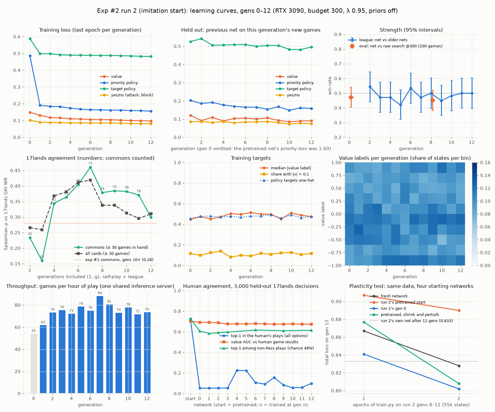
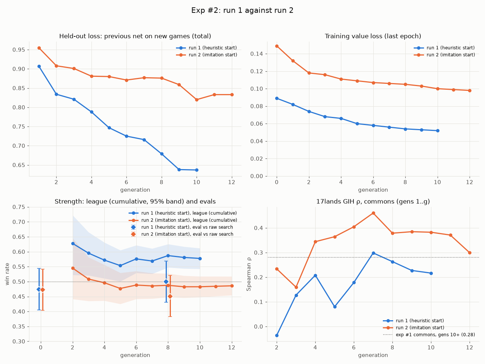

# Experiment #2: does an imitation start help? (run 1 against run 2)

Experiment #2 ran two self-play runs with identical settings except for the starting network:

- **Run 1** starts the usual way. Gen 0 plays heuristic search, and the first network is trained
  on those games.
- **Run 2** starts from a network pretrained on human decisions from 17lands.

This report covers the approach, the results, what we learned, and what to try next. Run 2 was
stopped early, on 2026-09-28 at 05:15 UTC, after 12 completed generations: it had stopped
learning, and the remaining budget is better spent on a redesigned attempt.

How the pretrained start was built, and the checks made before launch, are in
[docs/011](011-exp2-run2-imitation.md). The human-data study behind it is
[docs/008](008-gameplay-data.md).

## Summary

- **At equal spend, the imitation start did not help.**
  - Both starts scored 47% against raw search at gen 0.
  - At gen 8, run 1 scored 50% and run 2 45%. Neither change is significant.
  - League play is what separates them. Run 1's newer networks beat its older ones
    **58% (450/779)**; run 2's won **49% (466/959)**. Run 1 is learning; run 2 is not measurably.
- **Run 2's network stopped learning after about three generations.**
  - Its training losses went flat: target-policy loss moved 0.492 → 0.482 over gens 3–12, and
    value loss plateaued near 0.10, against run 1's 0.052.
  - A fresh network trained for two epochs on run 2's own games predicts the next generation as
    well as run 2's network did after twelve generations: held-out loss **0.828 against 0.833**.
  - The plasticity test in §2.3 compares four starting networks on identical data.
- **The pretrained network was a good model of humans, but the search barely uses that part.**
  - It chose a play the human made in **73.0%** of 16,081 held-out decisions, matching docs/008's
    best. Its value head predicted human game results with AUC 0.70.
  - With priors off, the search reads only the value head. That head had only seen positions
    at the start of a turn in human games, and it fit the search's own labels poorly: held-out
    value loss 0.144 on its first self-play games, against 0.087 for run 1's gen-0 network on
    run 1's.
  - Self-play rewrote the human policy in one epoch. Top-1 fell to 5%, because the network
    learned to rank Pass first everywhere. Among actual plays it kept about 61%, against 48% for
    chance.
- **17lands agreement: an early lead that faded.**
  - Run 2's rank correlation with 17lands GIH win rates on commons peaked at **0.46** (gens
    1–7), then fell back to **0.30** by gen 12. That is the same decline exp #1 showed.
  - At equal spend no difference between the runs is significant on GIH, GNS, IWD or GP.
  - Run 1 plays premium removal more like humans do: drawing Stab improves its win rate about as
    much as it does on 17lands (IWD +4.9 against +5.3). For run 2 drawing Stab lowers it (−5.3).
- **Recommended next:**
  - Keep run 1 going.
  - Fix the measurements, which are cheap.
  - If we try imitation again, deliver the human data through the search prior, or keep mixing
    it into training from a fresh network. Don't warm-start the whole network (§4).

## 1. Approach

### 1.1 The question and the design

**Question:** at equal cost, does starting self-play from a network pretrained on human decisions
do better than run 1's heuristic-search start? The three goals were win rate against raw search,
throughput, and rank correlation with 17lands on commons.

| | Run 1 | Run 2 |
|---|---|---|
| Starting network | trained on 108 games of heuristic search (gen 0) | pretrained on 115k human decisions |
| Gen 0 | heuristic search on both sides | network self-play with the pretrained net |
| "gen 0" league opponent | the net trained on the heuristic games | the pretrained net |
| Everything else | `configs/exp2.yml`: v0.2 engine, budget 300, λ 0.95, priors off, mix 20 / 70 / 10, 7 JVMs × 4 threads, 112 games per generation, training batch 64, opponent's hand hidden | same (`configs/exp2_run2.yml`) |
| Pod | Secure RTX 3090, 31.1 cores, $0.50/hr | same type |

With **every prior off**, the search starts each option with an equal prior and never reads the
policy heads. The network enters the search only through the value head, which scores each new
leaf. The design kept priors off on purpose, so that the starting network was the only difference
between the runs. It also meant the human *policy* could only matter indirectly.

### 1.2 Human data

These are docs/008's imitation tables, rebuilt on the v0.2 engine: the mzbridge compiled against
the v0.2 generalist bundle, with the opponent's hand hidden (`perfectInfo = false`, the same
setting the loop gives the JVM).

- **Source:** 17lands' public FDN Premier Draft replay data (CC BY 4.0), 1 game in 48 (16,483
  games). Games are split by 17lands event into train, val and test.
- **Turn-start decisions:** the player's first main-phase priority decision each turn, labelled
  with the *set* of plays the human made that turn. 17lands doesn't record order within a turn.
  There are 115,210 train, 6,958 val and 18,169 test decisions.
- **Attack decisions:** from replayed turns, "attack with X?" yes or no. 17,393 train, 1,017 val,
  2,691 test.
- **Value target:** the game result, +1 or −1.
- **Split caveat:** the mirrored-game pairs file was missing, so 11% of test decisions have their
  mirror half in train. Scoring only the clean rows changed top-1 by 0.1 point, and all headline
  numbers use the clean rows.

### 1.3 Pretraining

`python -m draftzero.gameplay.pretrain train` (docs/011 §2):

- **Model:** MageZero v0.2's own network (2-layer transformer, d = 512, 1,024-wide policy heads),
  trained from scratch.
- **Losses, trained together:**
  - *priority head:* set NLL, i.e. −log of the probability mass on the human's plays, softmax
    masked to legal options;
  - *yes/no head:* attack cross-entropy;
  - *value head:* MSE to the game result, weight 0.5 (raised from the study's 0.1 because with
    priors off the value head is the only part the search reads).
- **Feature vocab:** MageZero's own ignore rule, at 14,496 features.
- **Settings:** Adam, lr 3e-4, batch 64, token dropout 0.3.
- **Budget:** 40 minutes on the pod's RTX 3090: 32,714 steps and about 2.0M samples, or 17 passes
  over the data. The state with the best validation loss is kept.

**Pretraining curve** (validation split):

| Minutes | Samples | Set NLL (priority) | Value MSE | Attack accuracy | Selection loss |
|---|---|---|---|---|---|
| 0 | 0 | 1.036 | 1.010 | 52% | 1.541 |
| 4 | 196k | 0.574 | 0.886 | 67% | 1.017 |
| 8 | 392k | 0.562 | 0.871 | 70% | 0.997 |
| 12 | 588k | 0.548 | 0.884 | 69% | 0.989 |
| **24** | **1.19M** | 0.553 | **0.866** | 72% | **0.986 (kept)** |
| 40 | 1.98M | 0.550 | 0.883 | 70% | 0.992 |

**Almost everything was learned in the first 4 minutes (1.7 passes); the other 36 minutes added
nothing measurable.** That over-training matters for §2.3.

**Checks before launch**, on the clean held-out rows:

| | Pretrained start | docs/008 reference |
|---|---|---|
| Priority top-1 in the human's plays (n = 16,081) | **73.0%** | 73.1% |
| Top-1 with ≥ 4 legal options | 70.9% | 70.2% |
| Value AUC against game results | 0.702 | 0.685 |
| Attack accuracy / AUC (n = 2,411) | 71% / 0.795 | power/toughness rule 74%; human head 0.83 |

Games were checked too: 14 self-play games at run 2's settings, with 6.4 lands and 7.1 spells per
side, 0.14 missed land drops, and no passing with a play available.

### 1.4 Running it

| | |
|---|---|
| Pod | `xdslbqu0imovu0`, Secure RTX 3090, rented 2026-09-27 02:18 UTC |
| Launch | 03:42 UTC, `deploy/exp2.sh configs/exp2_run2.yml` |
| Stopped | 2026-09-28 05:15 UTC, during gen 13's play. Gens 0–12 complete: 1,415 self-play and league games, 394 eval games. |
| Cost | about $14 of the $28.20 cap: 1.4 h setup and pretraining, 25.5 h of run, 0.8 h of the post-stop test and uploads |
| Data | HF `danbrooks/draftzero-checkpoints` under `2026-09-27_03-42-21/`: every checkpoint (`gen0.pt.gz` is the pretrained start), `games.jsonl`, `metrics.jsonl`, `run.json`, and `logs.tar.gz` (all 497 logs) |

## 2. Results

Run 1 is still running under its own session. Its numbers here are read-only from its HF prefix
`2026-09-27_01-59-54/`, through gen 10 (its last complete generation when this was written).
**Equal spend** means run 1's gens 0–10 (26.2 h of run) against run 2's gens 0–12 (25.1 h), since
run 2 played games faster (§2.7).

### 2.1 Strength

| | Run 1 (heuristic start) | Run 2 (imitation start) |
|---|---|---|
| Eval against raw search, gen 0 (200 games) | 92/194 = **47.4%** (41–54%) | 94/199 = **47.2%** (40–54%) |
| Eval against raw search, gen 8 | 98/196 = **50.0%** (43–57%) | 88/195 = **45.1%** (38–52%) |
| League, all games (new net against an older one) | 450/779 = **57.8%** (54–61%) | 466/959 = **48.6%** (45–52%) |
| — against the "gen 0" net | 105/171 = 61% | 106/196 = 54% |
| — against other older nets | 345/608 = 57% | 360/763 = 47% |

- **Run 1's league is clearly above 50%:** each new network beats the ones before it. That hasn't
  yet shown up against the fixed raw-search opponent. The +2.6 points at gen 8 is within noise.
- **Run 2's league is at 50%, and its eval slipped 2 points.** It has not improved on its own
  start.
- 200-game evals are ±7 points, so evals alone could not have told the runs apart this early.

### 2.2 Training curves



*Run 2, gens 0–12, in run 1's layout (one axis per panel; the held-out panel shows losses rather
than accuracies). Bottom right: the plasticity test, §2.3.*



*Top: held-out and training losses. Losses from the two runs come from different data, so compare
their trends, not their levels. Bottom: league win rate (cumulative, with a 95% band), evals, and
17lands GIH correlation on commons.*

**Held-out loss** is the previous network scored on the new generation's games before training
on them. It measures whether the network is getting better at predicting its own search.

| Gen | 1 | 2 | 3 | 4 | 6 | 8 | 10 | 12 |
|---|---|---|---|---|---|---|---|---|
| Run 1, total | 0.907 | 0.834 | 0.821 | 0.788 | 0.725 | 0.679 | **0.637** | – |
| Run 2, total | 0.955 | 0.908 | 0.901 | 0.881 | 0.871 | 0.876 | 0.820 | **0.833** |
| Run 1, priority accuracy | 77.9% | 78.0% | 77.1% | 79.1% | 80.0% | 82.5% | 83.1% | – |
| Run 2, priority accuracy | 77.4% | 78.3% | 77.6% | 76.7% | 77.0% | 77.6% | 78.0% | 77.4% |
| Run 1, training value loss | 0.082 | 0.074 | 0.068 | 0.066 | 0.058 | 0.054 | 0.052 | – |
| Run 2, training value loss | 0.132 | 0.118 | 0.116 | 0.111 | 0.107 | 0.105 | 0.100 | 0.098 |

- **Run 1:** every curve moves every generation. Held-out loss fell 30%, and priority accuracy
  (agreement with the search's choice) rose from 78% to 83%.
- **Run 2:** after gen 3 its losses flatten and priority accuracy stays at 77%.
- Its *training* losses are flat too. Target-policy loss went 0.492 → 0.482 over nine
  generations, against run 1's 0.479 → 0.365 over the same stretch. So run 2's network wasn't
  even fitting the data it trained on.

### 2.3 Why run 2 stopped learning: a plasticity test

**The hypothesis is loss of plasticity.** A network trained hard on one task, then continued on
another, often trains worse than a fresh one. This is documented: warm-starting hurts later
training (Ash & Adams, 2020, *On Warm-Starting Neural Network Training*), and networks lose
plasticity when their targets shift (Lyle et al., 2023, *Understanding Plasticity in Neural
Networks*; Dohare et al., 2024). The pretrained network had 17 passes over human data, and its
value head was pushed toward ±1 targets through a tanh output.

**The test** ran on the pod's GPU after the run stopped, using MageZero's own `train.py` with the
run's batch and learning rate:

- training data: run 2's self-play from gens 8–11 (55,419 states);
- held-out data: gen 12 (13,578 states);
- four starting networks, 2 epochs each:
  - a fresh network;
  - run 2's pretrained start;
  - run 1's gen-0 network (trained on 108 heuristic games);
  - the pretrained start after *shrink and perturb*: weights × 0.4 plus small noise, Ash & Adams'
    remedy.

PLASTICITY_RESULTS

### 2.4 What happened to the human prior

All on the same 3,000 held-out decisions:

| Network | Top-1 in the human's plays | Top-1 among plays only (chance 48%) | Value AUC against human results |
|---|---|---|---|
| Pretrained start | 72.5% | 72.7% | 0.704 |
| After gen 0's training | 5.3% | 60.7% | 0.691 |
| Gen 3 | 5.4% | 59.7% | 0.675 |
| Gen 6 | 10.6% | 61.7% | 0.680 |
| Gen 12 | 9.9% | 61.5% | 0.673 |

- **One epoch of self-play training turned the priority head into a Pass detector.** The head
  trains on the search's visit counts at *every* priority stop: upkeep, draw step, the opponent's
  turn, and after everything is played. Pass is right at most of those.
- **It doesn't mean the AI passes where humans play.** From the game logs, the AI makes 84% of
  its land drops and 93% of its main-phase casts before combat.
- **The ranking of actual plays kept about 61%,** well above chance, and stayed flat from gen 1
  on. We have no run 1 number to compare yet; part of that 61% may be what any Magic-playing
  network learns, such as playing a land.
- **The value head drifted slowly from human results,** AUC 0.704 → 0.673.
- **The measure itself needs fixing.** Raw "human top-1" is dominated by Pass. The non-Pass
  version is the one worth logging (§4.2).

### 2.5 17lands correlations

**Method.**
- Per-card win rates from each run's self-play: both sides of a self-play game, and only the
  current network's side of a league game.
- Reference figures from all 791,159 17lands FDN Premier Draft games
  (`assets/reference/FDN_card_stats.json`).
- Rank correlation (Spearman) on commons with ≥ 30 games in hand (and ≥ 30 not seen, for GNS and
  IWD).
- Intervals are 95% bootstrap intervals for the gap between the runs, resampling games.

| Rank correlation with 17lands, commons | Run 1, gens 1–10 | Run 2, gens 1–10 | Gap, 95% interval | Run 2, gens 1–12 (equal spend) | Gap at equal spend |
|---|---|---|---|---|---|
| GIH WR (win rate when in hand) | 0.22 | 0.39 | −0.08 to +0.36 | 0.30 | −0.19 to +0.32 |
| GNS WR (in deck, not seen) | 0.45 | 0.48 | −0.34 to +0.23 | 0.41 | −0.36 to +0.24 |
| IWD (GIH − GNS) | 0.04 | 0.23 | −0.07 to +0.38 | 0.24 | −0.08 to +0.38 |
| GP WR (in deck) | 0.46 | 0.53 | −0.26 to +0.28 | 0.35 | −0.36 to +0.17 |

About 1,100–1,300 games per run and 75–80 commons each; exp #1's commons GIH figure was 0.28.

- **No difference between the runs is significant** at this size.
- **Run 2's lead came early and faded.** Its cumulative GIH ρ on commons rose to 0.46 by gen 7
  and fell to 0.30 by gen 12, as more of its self-play games were added (bottom right of the first
  figure). Exp #1 showed the same pattern: 0.43–0.45 early, 0.05 later.
- **Whatever card sense the human data gave, self-play appears to erode it.** Run 1's ρ has
  hovered at 0.22–0.30.
- **All cards:** run 2 0.31 (174 cards), run 1 0.17 (157 cards).

**Absolute win rates are not comparable between the runs.** Run 1's league games count the
network that wins 58%, and run 2's the one that wins 49%, so run 1's per-card win rates sit a few
points higher. Rank correlations are unaffected.

**Removal shows a real difference in how the cards are used.** IWD is how much a card's win rate
rises when it is drawn:

| Card (17lands GIH rank among 88 commons) | 17lands IWD | Run 1 IWD | Run 2 IWD |
|---|---|---|---|
| Bake into a Pie (1) | +5.8 | +13.2 | +1.8 |
| Stab (3) | +5.3 | **+4.9** | **−5.3** |
| Burst Lightning (2) | +4.4 | −0.9 | −5.6 |
| Refute (6) | +5.2 | −1.0 | +0.9 |

Drawing premium removal helps run 1 about as much as it helps humans. It makes no difference or
hurts in run 2. That fits a network whose value judgments are not improving.

**Top commons for each bot,** sorted by the lower bound of the 95% interval on its GIH win rate:

| Run 1 (gens 1–10) | GIH | 17lands rank | Run 2 (gens 1–12) | GIH | 17lands rank |
|---|---|---|---|---|---|
| Luminous Rebuke | 65.0% | 5 | Felidar Savior | 59.7% | 10 |
| Helpful Hunter | 62.0% | 8 | Blossoming Sands | 66.7% | 53 |
| Marauding Blight-Priest | 68.8% | 63 | Banishing Light | 58.2% | 9 |
| Dazzling Angel | 61.5% | 4 | Infestation Sage | 56.4% | 12 |
| Banishing Light | 61.7% | 9 | Beast-Kin Ranger | 58.9% | 31 |
| Vanguard Seraph | 64.2% | 39 | Wary Thespian | 57.4% | 28 |
| Squad Rallier | 63.4% | 24 | Uncharted Voyage | 54.3% | 15 |
| Bake into a Pie | 59.8% | 1 | Evolving Wilds | 53.6% | 38 |

**Colors,** as the in-hand-weighted gap to 17lands on mono-colored commons:
- Run 1 is within 3 points in every color: W +2.9, B +1.2, U −2.5, R −2.9, G −1.9.
- Run 2 has red far behind: R −11.2, B −6.1, U −5.7, W −4.5, G −2.6.

### 2.6 Training targets

- **Value labels were roughly flat in both runs,** the shape Will's λ rule asks for (bimodal
  means λ too high, one hump too low). Each of the 10 bins held 8–12% of states. Run 2's median
  |label| rose from 0.45 to 0.50; the share near zero was 8–14%.
- This settles the v0.2 pilot's concern that labels bunched near zero (median |v| 0.10–0.37
  there). λ = 0.95 looks right.
- Search policy targets were one-hot in 46–49% of states in both runs.

### 2.7 Operations

- **Throughput:** run 2 played 72–89 games/hr from gen 2, against run 1's 47–68. The cause isn't
  established: it could be the host, game length, or the smaller feature vocab.
- **Engine failures:** 48 games (2.6%) were dropped by an XMage assertion ("Error in unit tests").
  The v0.2 pilot had none.
- **Inference failures:** about 0.2% of network evaluations timed out: one server shared by 28
  game threads, with OkHttp's 10 s default timeout. On failure, `MCTSNode2` backs up 0 where a
  neutral result is 1, so **a failed evaluation counts as a loss.** That is a small bias against
  the searched move.
- **Disk:** the 40 GB container disk would have filled at about hour 31. Checkpoints carry
  optimizer state (about 175 MB each), the league needs every old one locally, and the watchdog
  mirrors everything a second time into `data/persist` on the same disk. Hard-linking identical
  mirror copies (`dedupe_persist.py`, run hourly) fixed it without deleting anything.
- **A rare search stall:** on one board with Koma, World-Eater, v0.2's search found no legal node
  and ran to its 300 s hard cap, re-counting the whole tree every simulation.

## 3. Lessons learned

1. **A good human model is not a good self-play start.** 73% agreement with humans and a value
   head with AUC 0.70 bought no extra strength against raw search. Run 1's gen-0 network, trained
   on 108 heuristic games, did as well and then kept improving.
2. **Warm-starting the whole network cost it the ability to learn.** Run 2's training losses went
   flat within three generations (§2.2). The plasticity test (§2.3) separates "the pretrained
   weights resist training" from "the data isn't informative".
3. **Pretraining ran about 10× past the point of diminishing returns.** 4 minutes got nearly all
   the validation gain; 40 minutes produced a network that was harder to move.
4. **With priors off, the human policy can't matter.** The search reads only the value head. The
   policy, the strongest part of the human data, was wasted by design, and self-play overwrote it
   in one epoch.
5. **The value head saw the wrong positions.** It was trained only on turn-start positions from
   the human's side. The search asks about mid-turn, combat and opponent-priority positions. On
   its first self-play games the head's held-out value loss was 0.144; run 1's crude gen-0 network
   scored 0.087 on its own first games. Those are different data, so this is indicative only.
6. **Human-data benefits fade under self-play.** The 17lands correlation rose early and then
   declined, as in exp #1. Without an anchor, self-play drifts to its own equilibrium.
7. **League win rate was the most sensitive learning signal; evals were the least.** At 200
   games per 8 generations, evals can't see gains under about ±7 points. League games (about 90
   per generation) and held-out loss told the story by gen 5.
8. **Measure human agreement without Pass.** Raw top-1 fell 73% → 5% because of Pass, while the
   ranking of plays only fell to 61%.
9. **Budget the disk as well as the dollars.** Optimizer-carrying checkpoints, a league that keeps
   them all, and a same-disk mirror add up to about 1 GB/hour.

## 4. Recommended next steps

Roughly in order of value per dollar. The account balance is about $30, of which run 1 still
needs about $14.

### 4.1 Let run 1 finish, and read it properly (no cost)

Run 1 is the only run showing learning. Let it reach its budget stop. Then:

- **Score its checkpoints on the non-Pass human measure** (`pretrain agreement` plus the
  non-Pass variant): does a network that never saw human data reach about 61% on its own?
- **Recompute §2.5 at its final generation.** Watch whether its 17lands ρ declines as exp #1's
  did, or holds.
- **Upload its JVM logs before its pod is removed.** Nothing else does, and they're the only
  per-decision record.

### 4.2 Fix the measurements first (cheap, benefits every later run)

1. **A fixed yardstick every 2–4 generations:** 100 paired games against raw search at budget 96,
   as ROADMAP asks, plus against the run's own gen 0. That shows gains of about ±10 points every
   few hours, instead of ±7 points every 13 hours.
2. **Head-to-head at equal spend** between the arms of any A/B: gen N of arm A against the
   matching-spend gen of arm B, on the fixed eval decks. This answers an A/B question directly.
3. **An Elo ladder from league games.** The league already plays about 90 games per generation
   against older networks; fitting ratings across them turns them into a strength curve.
4. **Per-generation logging** of the non-Pass human agreement, held-out value loss, and
   IWD / GIH ρ on commons (`tools/exp2_analysis.py` has the code). All three explained this run
   better than the evals did.

### 4.3 Imitation, done differently

These options are listed from most to least promising.

**(a) Human policy as the search prior (priority prior on).** This is docs/008 §7.5's protocol,
and where the human data is strongest.

- Pretrain as before but stop early (about 5 passes), and serve the network with the priority
  prior on at a moderate temperature (docs/008 used 1.5 with a small non-Pass bonus).
- The search then spends its 300 simulations on human-plausible moves first.
- The loss of plasticity matters less, because the prior acts through the search even if the
  weights move slowly.
- **Watch the Pass bias.** Once self-play trains the priority head, it drifts toward Pass (§2.4).
  Either keep the human prior frozen, served from a fixed copy of the pretrained network, or mix
  the two (next option).
- **Test:** the same A/B, arm B = run 1's settings plus the human prior; about $28 per arm.

**(b) Anchor to the human data from a fresh network.** Don't warm-start at all.

- Start from a fresh network, as run 1 does.
- In every generation's training, mix in human decisions: for example 20% of batches, with set
  NLL on the priority head and the result on the value head.
- Or add a KL penalty toward the frozen human policy that decays over generations.
- Precedents:
  - AlphaStar kept a KL term to its supervised policy during RL.
  - Meta's piKL regularised search toward a human policy and produced play that was both strong
    and human-like (Jacob et al., 2022, *Modeling Strong and Human-Like Gameplay with
    KL-Regularized Search*).
- This keeps the 17lands-like card sense from eroding (lesson 6) without freezing the network.
- **Cost:** a code change in `train.py` (a second dataset and a loss weight); the same run cost.

**(c) If we warm-start again, keep the network trainable.**

- Pretrain lightly: stop at the validation knee (4–8 minutes here), with weight decay.
- Before self-play, apply shrink and perturb (weights × 0.4 to 0.6, plus small noise), or
  re-initialise the value and target heads while keeping the trunk.
- Screen it offline first with the §2.3 test: the start must train at least as fast as a fresh
  network on the same self-play data. That check takes 10 minutes and about $0.10 of GPU.

**(d) Better human data for the value head.**

- *More of it:* we used 1 game in 48 of the 17lands file (16k of 791k games), and docs/008's
  learning curve wasn't saturated.
- *More position types:* the turn replay already produces mid-turn, combat and attack decisions
  (38k priority and 17k attack rows here). The value head should see those, since those are the
  positions the search asks about.
- *A better target:* the game result from a turn-1 snapshot is mostly noise. Gen 33's value head
  had AUC 0.54 on turns 1–2 in docs/008. Weighting later turns more, or discounting toward a TD-style target, would
  match the self-play labels better.

### 4.4 Engine and throughput fixes (help every run)

1. **Score failed evaluations as neutral, not as losses:** `backpropagate(1, 0)` instead of
   `backpropagate(0, 0)` in `MCTSNode2`'s failure path.
2. **Remove the timeouts behind those failures:** a second inference server, or a longer OkHttp
   timeout, for 28 game threads.
3. **Track down the XMage "Error in unit tests" failures,** which cost 2.6% of games. Log the
   game seed and deck pair, and replay them.
4. **Cap the no-legal-node search** well below 300 s, and stop re-counting the tree every
   simulation (`root.size()` in the loop).
5. **Disk:**
   - skip the same-disk `data/persist` mirror on pods without a network volume, or hard-link it
     as `dedupe_persist.py` does;
   - save optimizer state only in `model.pt.gz`, not in every `genN.pt.gz`;
   - request 60 GB for multi-day runs.

### 4.5 Alternatives worth considering

- **More games before more ideas.** Both runs played about 1,100–1,400 self-play games in 25
  hours. AlphaZero-style learning needs far more, and exp #1's decline suggests FDN's format-wide
  task is hard to learn at this scale. The JVM-layout and batching work (docs/006, docs/010) and
  CPU-heavy pods may buy more than any start trick.
- **A human-data evaluator instead of a starting point.** Use the pretrained value head as a
  fixed second opinion, for example in the eval or as a small auxiliary loss, rather than as the
  initial weights.
- **Spend on exp #3's hidden-information fix** (docs/009 §5.4) once run 1 finishes. The search
  still sees hidden cards, which affects every arm equally and caps how human-like play can
  become.

## Appendix: reproducing the numbers

```bash
# 17lands reference (all 791k games) -> assets/reference/FDN_card_stats.json
python tools/exp2_analysis.py reference
# rank correlations with bootstrap intervals, equal generations
python tools/exp2_analysis.py stats --run1 <run 1 dir> --run2 <run 2 dir> --gens 1-10
# the two figures in this report
python tools/exp2_analysis.py figures --run1 <run 1 dir> --run2 <run 2 dir> --out docs/img \
  --plasticity plasticity.json --human-nonpass human_nonpass.json
# human agreement of any checkpoint (docs/011)
python -m draftzero.gameplay.pretrain agreement --checkpoint <genN.pt.gz> --rows 3000
```

- A run directory is the HF prefix's `games.jsonl` and `metrics.jsonl`:
  - run 1: `danbrooks/draftzero-checkpoints/2026-09-27_01-59-54/`;
  - run 2: `2026-09-27_03-42-21/`.
- Run 2's per-game JVM logs are in its `logs.tar.gz`.
