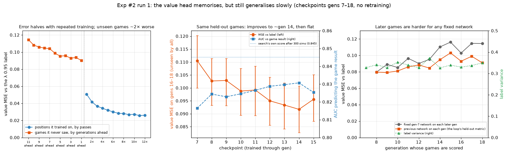

# Experiment #2, run 1: final report

Run 1 is experiment #2's baseline arm: MageZero v0.2 self-play on FDN from a heuristic-search start
(gen 0 plays raw search; the first network trains on those games). Run 2, the imitation-start arm,
and the comparison between the two through gen 10 are in [docs/013](013-exp2-imitation-report.md).
This report covers run 1 to the end: gens 0–18, stopped on 2026-09-28 at 21:36 UTC.

Experiment #2 had three goals:
1. a high win rate against the baseline (raw search at the same budget);
2. high throughput;
3. good agreement with 17lands on commons.

## Summary

- **Win rate against raw search: no gain.** Run 1 started at 47% and was flat from gen 8.

  | Network | Eval games won | Share | 95% CI |
  |---|---|---|---|
  | Gen 0 | 92 of 194 | 47.4% | 41–54% |
  | Gen 8 | 98 of 196 | 50.0% | 43–57% |
  | Gen 16 | 95 of 191 | 49.7% | 43–57% |

- **The league shows learning that stopped around gen 8.**
  - In gens 1–8, new networks beat older ones **58.7% (357/608)**.
  - In gens 9–18 that fell to **51.7% (449/869)**, and to 50.4% (262/520) in gens 13–18.
  - Later networks still beat the gen-0 network (61.5%, 67/109, gens 9–18), but not each other.
- **The policy heads kept learning to the end. The value head, the only part the search reads
  with priors off, memorised heavily and improved only slowly.** §2.8 has an offline diagnosis
  that scores every checkpoint on the same games.
  - Held-out loss (the previous network on each new generation's games) fell from 0.907 to 0.553.
    Almost all of that is policy, which never reaches play with priors off.
  - On positions it had trained on, value error halved with repeated training: 0.051 after one
    pass, 0.026 after eleven. On games it never saw, error was about 2× higher.
  - On one fixed set of held-out games, the value head kept improving until about gen 14 (error
    −0.019 from gen 7, 95% CI −0.025 to −0.013), then stopped.
  - The run's own held-out value loss rose (0.075–0.087 → 0.090–0.102). That was mostly each
    generation's games being harder to predict, not the value head getting worse.
  - None of this explains the league flattening at gen 9: the value head was still improving
    then.
- **Throughput: 65–74 games/hr in steady state,** 2,673 games in 43.6 hours. The single shared
  inference server was the bottleneck: the pod's CPU quota was only 59–72% used and the GPU
  16–41% busy.
- **17lands agreement on commons: GIH ρ +0.20** (84 commons, 1,964 network games). Experiment #1
  reached 0.28.
  - It declined as the run went on: +0.22 in gens 1–9, +0.06 in gens 10–18.
  - Deck-level stats agree much better (GNS +0.51, GP +0.48) than the card's own effect
    (IWD +0.04). The bot mostly agrees with humans on which *decks* are good, not on what a card
    adds when drawn.
- **Bad targets: 6.8% of permanent targets were real mistakes** (304/4,455).
  - The network made fewer than raw search: in the same eval games, 6.0% (25/420) against 9.0%
    (41/458).
  - The rate was flat across generations.
  - The raw audit reads 16.6%, but that includes a logging artifact and harmless targets (§2.4).
    The in-loop metric recorded almost nothing, so this is from a post-run audit of every JVM log.
- **Human agreement:** among non-Pass plays, the network's top choice matched a human's in
  **62.5%** of held-out decisions at gen 18 (chance 48%). That's the same level as run 2 (61.5%),
  which answers docs/013's open question: a network that never saw human data gets there on its
  own.
- **Cost: about $22.10** of the $29 cap (43.7 pod-hours at $0.506/hr). Stopping 13.5 hours early
  saved about $7 and lost nothing measurable: gen 16's eval was flat and the league was at 50%.

## 1. Setup and run

| | |
|---|---|
| Engine | MageZero v0.2 (`danieljbrooks/MageZero` branch `draftzero`), XMage `v0.2-generalist` bundle |
| Config | `configs/exp2.yml`: budget 300, λ 0.95, every prior off, opponent mix 20% self / 70% past / 10% gen 0, opponent's hand hidden |
| Layout | 7 JVMs × 4 game threads, 112 games per generation (jobs of 4), one shared inference server, training batch 64 |
| Evals | every 8 generations: 100 paired games (200) against raw search at budget 300 |
| Pod | `206haai9na81zy`, Secure RTX 3090, 31.1 cores, $0.506/hr, 40 GB container disk |
| Run | started 2026-09-27 01:59:54 UTC; stopped 2026-09-28 21:36 UTC by hand, during gen 19's self-play (15 games in). Gens 0–18 complete. |
| Games | 2,673: 109 heuristic (gen 0), 1,964 network self-play and league (gens 1–18), 581 eval, 19 from gen 19 |
| Cost | pod uptime 43.7 h ≈ $22.10; balance afterwards $21.99 |

**Why it stopped early.** The budget stop was due at about 11:00 UTC on Sep 29, after gen 24's eval.
By gen 18 the evals, the league and the 17lands trend were all flat or declining (§2), so another
six generations were unlikely to change any goal.

## 2. Results

### 2.1 Strength

| | Games | Win rate | 95% CI |
|---|---|---|---|
| Eval, gen 0 (heuristic-trained net) against raw search | 92/194 | 47.4% | 41–54% |
| Eval, gen 8 | 98/196 | 50.0% | 43–57% |
| Eval, gen 16 | 95/191 | 49.7% | 43–57% |
| League, gens 1–8 (new network against an older one) | 357/608 | **58.7%** | 55–63% |
| League, gens 9–18 | 449/869 | **51.7%** | 48–55% |
| League, gens 13–18 | 262/520 | 50.4% | 46–55% |
| League, against the gen-0 network, all gens | 159/258 | 61.6% | 56–67% |
| League, against the gen-0 network, gens 9–18 | 67/109 | 61.5% | 52–70% |

- **Evals never moved beyond noise.** A 200-game eval resolves about ±7 points, and the three
  evals span 2.6 points.
- **The league did see learning,** then stopped seeing it. Each network in gens 2–8 beat its
  predecessors about 59% of the time. From gen 9 on that fell to about 50%: new networks were no
  better than the ones they replaced.
- The gen-0 network stays beatable (about 62% throughout), so the later networks did keep what
  they'd learned; they just stopped adding to it.

### 2.2 Training curves

*Top row: training loss (last epoch of each generation); held-out loss and accuracy (the previous
network on each generation's new games, before training on them); strength. Bottom row: cumulative
17lands GIH ρ on commons (labels: commons counted); training targets; throughput and search
timeouts.*

| Gen | 1 | 2 | 4 | 8 | 10 | 12 | 14 | 16 | 18 |
|---|---|---|---|---|---|---|---|---|---|
| Held-out total loss | 0.907 | 0.834 | 0.788 | 0.679 | 0.637 | 0.598 | 0.588 | 0.550 | **0.553** |
| Held-out value loss | 0.087 | 0.078 | 0.094 | 0.079 | 0.083 | 0.086 | 0.095 | 0.093 | 0.090 |
| Training value loss | 0.082 | 0.074 | 0.066 | 0.054 | 0.052 | 0.051 | 0.050 | 0.049 | 0.049 |
| Priority accuracy (agrees with the search's choice) | 77.9% | 78.0% | 79.1% | 82.5% | 83.1% | 82.3% | 81.9% | 81.7% | 83.1% |
| Target accuracy | 26.5% | 26.6% | 29.6% | 34.0% | 30.8% | 36.2% | 38.4% | 40.8% | 38.1% |
| Yes/no accuracy (attack, block, kicker…) | 63.8% | 61.5% | 67.0% | 72.5% | 73.3% | 73.6% | 74.0% | 70.1% | 73.7% |

- **Policy heads:** the target head was still improving at the end (training loss 0.50 → 0.27;
  held-out accuracy 27% → 38–41%). The priority head plateaued at about 82–83% from gen 8.
- **Value head: the logs make it look worse than it was.** Held-out value loss was lowest at gen 5
  (0.075) and reached 0.090–0.102 in gens 14–18, while training value loss fell to 0.049. That
  reads as overfitting that grew worse. §2.8 separates the two effects:
  - the memorisation is real;
  - on fixed held-out games the value head kept improving slowly until about gen 14;
  - the rise in the logged number came mostly from later games being harder.
- **Why it matters here:** with every prior off, MageZero's search starts each option with equal
  prior and never reads the policy heads. The value head is the network's only influence on play,
  so better policy heads couldn't make better play.

### 2.3 17lands correlations

*Left: every common with at least 30 games in hand, each source's win rate relative to its own
mean. Middle: rank correlation with 17lands by stat and window (`tools/exp2_analysis.py stats`).
Right: the in-hand-weighted gap between bot and 17lands by color.*

**Method** (same as docs/013 §2.5):
- per-card win rates from both sides of self-play games and the current network's side of league
  games;
- 17lands figures from all 791,159 FDN Premier Draft games;
- Spearman ρ on commons with at least 30 games in hand (and 30 unseen, for GNS and IWD).

| ρ with 17lands, commons | Gens 1–9 (972 games) | Gens 10–18 (992 games) | Gens 1–18 (1,964 games) |
|---|---|---|---|
| GIH WR (in hand) | +0.22 (76) | +0.06 (76) | **+0.20** (84) |
| GNS WR (in deck, never seen) | +0.38 (72) | +0.45 (75) | +0.51 (84) |
| IWD (GIH − GNS) | +0.05 (72) | −0.05 (75) | +0.04 (84) |
| GP WR (in deck) | +0.43 (76) | +0.42 (76) | +0.48 (84) |

*Commons counted in brackets. Experiment #1's commons GIH figure was 0.28.*

- **GIH agreement fell in the second half,** +0.22 → +0.06 over the same number of commons. That's
  the same decline experiment #1 and run 2 showed.
- **What agreement there is comes from the decks.** GNS (the card was in the deck but never drawn)
  and GP track the whole deck's strength, and they correlate at 0.4–0.5 in both halves. IWD, the
  lift from actually drawing the card, is about zero. The bot has learned which of the 17lands
  decks win, but not which cards win games when drawn.
- **Colors show the same deck effect.** Relative to 17lands, the bot's blue commons run 3.8 points
  low and red 3.5 low, while white runs 2.3 high. Gain lands from particular two-color decks
  (Scoured Barrens +13.7 points above the bot's mean, Blossoming Sands +12.6) sit near the top for
  the same reason.
- **Absolute levels differ,** so compare relative to each source's mean: the bot's commons average
  53.0% in hand and 17lands' 54.2%. Rank correlations are unaffected.

**Where the bot agrees and disagrees** (points relative to each source's mean; full table in the
appendix):

| Card | 17lands rank of 91 commons | 17lands | Bot | Bot games in hand |
|---|---|---|---|---|
| Dazzling Angel | 4 | +3.6 | +8.9 | 315 |
| Luminous Rebuke | 5 | +3.5 | +9.3 | 263 |
| Helpful Hunter | 8 | +3.2 | +8.1 | 314 |
| Bake into a Pie | 1 | +3.8 | +4.5 | 372 |
| Burst Lightning | 2 | +3.7 | −0.3 | 294 |
| Refute | 6 | +3.3 | −4.7 | 323 |
| Gorehorn Raider | 14 | +2.4 | −8.4 | 175 |
| Fleeting Flight | 16 | +2.2 | −6.1 | 211 |
| Marauding Blight-Priest | 66 | −1.5 | +10.1 | 84 |

- Counterspells and combat tricks (Refute, Fleeting Flight) are where the bot is furthest below
  humans. Both pay off only when mana is held and a response is timed well. A plausible, untested
  reason is that the search handles instant-speed play poorly.

### 2.4 Bad targets

**What's counted.** A target is bad when a harmful effect hits the caster's own permanent, or a
beneficial one hits the opponent's (`tools/audit_targets.py`, as in docs/006 and docs/010).

**The in-loop metric didn't work.** `metrics.jsonl` classified 0 targets in 18 of 19 generations,
so these numbers come from auditing every JVM log after the run: 711 logs, 20,170 targeting prompts.

**Two corrections to the raw audit:**

1. **Player targets are mislabelled in v0.2's logs.** For example, PlayerB cast Burst Lightning
   with only the two players as targets and the log says `Targeting PlayerB`, yet PlayerA's life
   went 20 → 18. So "PlayerB burned its own face" is really an ordinary shot at the opponent.
   The raw audit counts 181 such false bad targets, 23% of its total. All player targets (330) are
   excluded below.
2. **Some "bad" targets are harmless:**
   - a tap ability giving an opponent's creature haste during your own turn (159);
   - Fleeting Distraction, a −1/−0 cantrip, on your own creature (83);
   - "target creature can't block" on your own creature during your attack (65).

   These 307 are counted separately below.

| Category (all agents, all generations) | Targets |
|---|---|
| Classified | 4,785 |
| of which player targets (label artifact, excluded) | 330 |
| Permanent targets | **4,455** |
| of which fine | 3,844 |
| harmless "bad" | 307 |
| **real mistakes** | **304 (6.8%, 95% CI 6–8%)** |
| Raw audit, for comparison: bad / classified | 792 / 4,785 = 16.6% |

(Of the 20,170 prompts, the rest weren't classifiable: 6,299 the card's own text restricts to one
side, 3,475 aren't targets at all, 4,607 effects the classifier can't read, and 1,004 targets with
unknown owners, mostly tokens.)

**Mistakes by who made them** (permanent targets):

| Agent | Mistakes | Rate | 95% CI |
|---|---|---|---|
| Raw search, gen-0 self-play | 20/179 | 11.2% | 7–17% |
| Raw search, in evals | 41/458 | 9.0% | 7–12% |
| Network, in evals | 25/420 | **6.0%** | 4–9% |
| Network, self-play and league | 130/2,113 | 6.2% | 5–7% |
| Older network (league opponent) | 88/1,285 | 6.8% | 6–8% |

| Eval | Network | Raw search |
|---|---|---|
| Gen 0 | 12/144 = 8.3% | 13/152 = 8.6% |
| Gen 8 | 7/131 = 5.3% | 16/158 = 10.1% |
| Gen 16 | 6/145 = 4.1% | 12/148 = 8.1% |

| Network's own choices | Gens 1–4 | 5–9 | 10–14 | 15–19 |
|---|---|---|---|---|
| Mistakes | 36/577 = 6.2% | 32/565 = 5.7% | 34/529 = 6.4% | 28/442 = 6.3% |

- **The network targets better than raw search.** In the same eval games it made about two thirds
  as many mistakes (6.0% against 9.0%, a two-sided p of about 0.09). In the gen-8 and gen-16
  evals, the gap was roughly 2 to 1. That suggests the value head learned something about
  targeting that raw search's built-in evaluation lacks.
- **There was no improvement across generations.** The network's rate was about 6% from gen 1 to
  the end.
- **The commonest mistakes:**
  - removal on its own creature: Stab 47, Witness Protection 41, Luminous Rebuke 20, Bake into a
    Pie 19, Goblin Negotiation 12;
  - help for the opponent's creature: Fake Your Own Death 31, Fleeting Flight 30, Sure Strike 24,
    Giant Growth 22.
- **Mistakes don't predict losing.** Half were made by the eventual winner (151 of 302 decided
  games). Many are low-stakes, for example when the only legal targets were the wrong side's.
  So this measures play quality, not game outcomes.

### 2.5 Human agreement

The measure is the network's top-ranked non-Pass play, and whether it's among the plays the human
made that turn. It uses the same 2,533 held-out 17lands decisions as docs/013 §2.4; chance is
48.1%.

| Network | Run 1 | Run 2 (docs/013) |
|---|---|---|
| Gen 0 | 59.3% | 60.7% (after gen 0's training) |
| Gen 1 | 58.7% | 58.4% |
| Gen 3 | 61.0% | 59.7% |
| Gen 8 | 62.7% | – |
| Gen 12 | 63.5% | 61.5% |
| Gen 18 | 62.5% | – |

- Self-play alone reached the level run 2 kept from its human pretraining. So docs/013's 61% is
  about what any network that plays Magic learns, not a lasting benefit of the human data.

### 2.6 Training targets and policy shape

- **Value labels were flat,** as Will's λ rule asks: median |v| 0.42–0.52 every generation, with
  9–15% of labels near zero (|v| < 0.1). λ 0.95 held up over the whole run.
- **Search policy targets were one-hot in 46–51% of states.**
- **The policy is Pass-heavy and over-confident.** This was measured on gens 1–4 only (from the
  training shards, 1,500 priority states per generation):
  - about 76% of the network's policy mass is on Pass;
  - the network puts 93–99% on its top action, against 83–85% in the search's own visit
    distribution.

  With priors off this doesn't affect play, but it matters for any future run that turns the
  priority prior on.

### 2.7 Operations

- **Throughput:** 39 games/hr in gen 1, rising to 65–74 from gen 11.
  - An ordinary generation took about 107 minutes: 112 games plus training.
  - An eval generation took about 250 minutes, of which the eval was 130–143.
- **The bottleneck was the inference server:**
  - one Python process at about 130% CPU served all 28 game threads;
  - the CPU quota averaged 59–72% used and the GPU 16–41% busy;
  - search timeouts stayed under 0.7% of evaluations.

  A replica-server fix (`jvm.servers`, commit c40714a) was built during the run but not applied
  to it.
- **Dropped games:** 52 of 2,016 scheduled self-play games (2.6%) and 19 of 600 eval games (3.2%).
  That matches run 2's XMage "Error in unit tests" failures: 242 such errors in self-play logs and
  95 in eval logs.
- **Disk:** at the initial rate the 40 GB disk would have filled around gen 14. A guard script
  (every 20 minutes) fixed it and held the disk at 28–30 GB:
  - capped server logs at 50 MB;
  - gzipped finished generations' JVM logs;
  - pruned the archived replay shards.
- **GPU memory** peaked at 23.5 of 24 GB in gen 14, at training batch 64. A batch-32 relaunch was
  staged but never needed; later generations peaked at 15–20 GB.
- **Alerts:** one, a harmless rsync "file vanished" on a scratch shard (gen 2). There were no
  crashes and no loop restarts.

### 2.8 The value head, diagnosed offline

§2.2's logs suggested the value head was overfitting and getting worse. To test that without
paying for a pod, I scored run 1's checkpoints (gens 7–18) on the replay shards saved at the end of
the run. No networks were retrained. Retraining on the M1 Pro runs at 5.6 states/s, so one pass over
the data takes about 5 hours; inference runs at 93 states/s.

**Method.**
- **Positions:** every game sequence in the final replay window (gens 7–18; 1,567 sequences,
  since a self-play game gives one per side). One position in 6 is scored, one in 3 for gens 16–18:
  31,278 positions in all.
- **Game boundaries and results:** recovered exactly from the label recursion (below), which the
  stored labels reproduce to 4 × 10⁻⁷.
- **How often each checkpoint trained on each position:** every generation trains one epoch over
  a 150,000-state window, so the gen-K checkpoint trained on gen j's positions K − j + 1 times.
- **Intervals:** 95%, resampling whole games. Checkpoint comparisons are paired: the same games,
  resampled together.

**How the labels are built.** MageZero labels each position backwards from the end of its game:
label = λ × (next position's label) + (1 − λ) × (the search's score here), starting from ±1 for
the result. At λ 0.95 a label is mostly a weighted average of the next ~20 positions' search
scores. The result dominates only near the end of a game:

| λ | Result's weight in a label, mean / median | Labels mostly the result | Correlation with the result | Label variance shared within a game | Effective independent samples in the window |
|---|---|---|---|---|---|
| **0.95 (run 1)** | 0.19 / 0.08 | 13.5% | 0.77 | **74%** | **~2,100** |
| 0.9 | 0.09 / 0.01 | 6% | 0.69 | 66% | ~2,400 |
| 0.8 | 0.04 / 0.00 | 3% | 0.64 | 62% | ~2,500 |
| 0.7 | 0.02 / 0.00 | 1% | 0.63 | 60% | ~2,600 |

*Other λs relabel the same games offline. Effective samples = positions / (1 + (positions per game − 1) × the shared share).*

- **The value head's real sample size is small.** The window's 150,351 positions are worth about
  2,100 independent samples, roughly one per game side.
- **λ is not the main cause.** The search's own scores persist through a game, so labels are
  strongly shared within a game at any λ. λ 0.7 would add only about 20% effective samples.

*Left: error on positions a checkpoint trained on, by number of passes (all checkpoint and
generation pairs pooled), and on games it never saw, by how many generations later they were
played. Middle: every checkpoint up to gen 15 on the same held-out games (gens 16–18). The bars are
per-checkpoint intervals; the paired differences below are much tighter. Right: the gen-7 network,
and each generation's predecessor, on each generation's games.*

**1. It memorises.** Error against the label (MSE):

| Positions it trained on, passes | 1 | 2 | 4 | 6 | 8 | 11 |
|---|---|---|---|---|---|---|
| MSE | 0.051 | 0.042 | 0.034 | 0.030 | 0.028 | 0.026 |

| Checkpoint | Trained on (its last 3 gens) | Unseen (the next 3 gens) | Ratio |
|---|---|---|---|
| Gen 10 | 0.045 [0.042–0.048] | 0.087 [0.080–0.096] | 1.9× |
| Gen 12 | 0.043 [0.040–0.046] | 0.098 [0.088–0.106] | 2.3× |
| Gen 15 | 0.043 [0.040–0.046] | 0.096 [0.087–0.105] | 2.3× |

The run's logged training loss (0.049 at gen 18) is measured with dropout on. With dropout off,
the network fits positions it has seen far more tightly, so the logs understated the gap
(1.8× logged, against about 2.2× here).

**2. But it didn't get worse; it improved slowly, then stopped.** Every checkpoint up to gen 15
scored on the same held-out games (gens 16–18, 12,300 positions from about 400 game sequences):

| Checkpoint | Gen 7 | Gen 9 | Gen 11 | Gen 13 | Gen 14 | Gen 15 |
|---|---|---|---|---|---|---|
| MSE vs label | 0.111 | 0.103 | 0.099 | 0.093 | **0.092** | 0.096 |
| AUC predicting the game result | 0.816 | 0.823 | 0.827 | 0.830 | **0.831** | 0.825 |

| Paired change | MSE (95% CI) | AUC (95% CI) |
|---|---|---|
| Gen 7 → 11 | −0.011 (−0.016 to −0.006) | +0.010 (+0.002 to +0.018) |
| Gen 11 → 14 | −0.008 (−0.013 to −0.002) | +0.004 (−0.004 to +0.013) |
| Gen 14 → 15 | +0.004 (+0.000 to +0.008) | −0.005 (−0.011 to +0.000) |

- For comparison, the search's own score after 300 simulations, stored with each position,
  predicts the same results with AUC 0.845 (0.818–0.870). The search adds a little on top of the
  raw value head.
- Far from the end of the game (30+ positions before it), every checkpoint's AUC is about 0.71–0.73.

**3. Later games are harder for any fixed network.** The gen-7 network's error rises from 0.080 on
gen 8's games to 0.114 on gens 17–18, 43% higher. Label variance stays flat at 0.33–0.37, so the
labels didn't get more extreme; the positions got harder to judge.
- Each generation's own predecessor keeps up only partly: 0.080 on gen 8, rising to 0.091–0.103
  on gens 14–18. That's the loop's logged held-out metric, and the rise is this moving target,
  not a worse network.
- Why later games are harder isn't established. Candidates are the networks' changing play and
  the league's changing opponents.

**What this changes.**
- **§2.2's "overfitting that got worse" was wrong.** The value head memorised heavily and its
  improvement on new games was slow (AUC +0.014 over seven generations), but it didn't degrade.
- **It doesn't explain the league flattening at gen 9.** The value head was still measurably
  improving between gens 11 and 14. Its slow progress fits the flat evals, but the plateau needs
  another explanation, or a more sensitive strength measure than the league.
- **The binding constraint looks like independent games.** About 2,100 effective samples, each
  reused about 11 times, is what the value head learns from.

**Caveats.**
- This is one run and one sample of positions, with no retraining.
- The label is itself produced by the evolving networks' search. The AUC against actual game
  results is the cleaner yardstick, and it tells the same story.
- Whether regularisation or fewer passes would improve error on unseen games (and not just shrink
  the memorisation) is untested (§4 item 1).

## 3. Lessons learned

1. **With priors off, only the value head matters, and its logged held-out loss is misleading on
   its own.** The policy heads improved to the end and none of it reached play.
   - Each generation's games were harder for any fixed network than the last, so the logged
     held-out loss rose while the value head was actually improving (§2.8).
   - Score every checkpoint on one fixed set of held-out games instead, as evals do for strength.
2. **The value head learns from about 2,000 effective samples at a time, and memorises them.**
   - Positions within a game share 74% of their label variance, so the replay window's 150,000
     positions are worth roughly one independent sample per game side.
   - Each position is trained on about 11 times. Training error halves while error on unseen games
     stays twice as high.
   - It needs more games, not more passes. Lowering λ barely helps: it adds about 20% effective
     samples.
3. **The league is the sensitive strength signal; 200-game evals every 8 generations are not.**
   The league showed learning by gen 3 and the plateau by gen 9. The evals couldn't separate any
   of the three networks. (docs/013 lesson 7, confirmed over the full run.)
4. **GIH agreement with 17lands is mostly deck agreement.** GNS and GP correlate at about 0.5 and
   IWD at about 0. A card metric that controls for the deck (IWD, or a per-deck baseline) is the
   honest measure of whether the bot values cards like humans do.
5. **Audit every metric against the raw logs at least once.**
   - The in-loop bad-target metric was dead all run.
   - The post-run audit's biggest "mistake" category (Burst Lightning to its own face) was a
     logging artifact, found only by reading life totals.
6. **The network makes fewer bad targets than raw search,** about 6% against 9%, even though it
   doesn't win more. That's evidence the value head learned something, and a cheap behavior
   metric worth logging every generation once fixed.
7. **Stop when the curves are flat.** Stopping at gen 18 saved about $7 (a third of the remaining
   budget) and lost nothing the report needed.

## 4. Recommended next steps

These add to docs/013 §4, which still applies: a fixed yardstick every 2–4 generations,
head-to-head at equal spend, an Elo ladder from league games, and the engine fixes.

1. **Give the value head more independent games, and measure it on a fixed yardstick.**
   - **Yardstick:** freeze a held-out set of about 200 games from one generation. Score every
     checkpoint on it: value MSE and AUC against game results. That's about 5 minutes per
     checkpoint on the laptop (§2.8's method).
   - **Fewer positions from more games:** keep more games in the replay window and subsample
     positions within each game, keeping training cost flat. This is AlphaGo's fix for correlated
     positions.
   - **Throughput** (item 2) is the other route to more games.
   - **Regularisation** (the optimizer has no weight decay) or fewer passes should shrink the
     memorisation. Whether that improves error on unseen games needs a retraining test on this
     run's shards (§5).
     - That test is GPU work. Training runs at 5.6 states/s on the M1 Pro, against about 180 on
       the pod's RTX 3090, so it's about $1–2 on a pod rather than days on the laptop.
2. **Apply the replica inference servers** (`jvm.servers`, c40714a). The CPU was 30–40% idle,
   waiting on one server. Measure games/hr with 2–3 replicas in a short smoke run before
   committing.
3. **Make the bad-target metric work in the loop:**
   - attribute each target to its own game's decks, as the audit does;
   - drop player targets until the log names them correctly;
   - tag the harmless categories;
   - fix the player-name logging in the MageZero fork, so face targets can be judged.
4. **Report IWD (or a deck-controlled GIH) as the 17lands headline,** alongside GIH, so deck
   strength doesn't masquerade as card judgement.
5. **Repo fixes from this run:**
   - skip the persist mirror on a same-disk pod;
   - quiet the server logs;
   - prune archived shards;
   - gzip finished JVM logs;
   - exclude `scratch/` from the rsync (the vanished-file alert);
   - stop uploading duplicate frozen checkpoints to HF (`models/FDN_exp2.genN/…`).

## 5. Data

| What | Where |
|---|---|
| Every checkpoint, gens 0–18 (`gen18.pt.gz` = `model.pt.gz` is the final network; SHA-256 `ac9b2d4f…bb59`) | HF `danbrooks/draftzero-checkpoints` under `2026-09-27_01-59-54/models/FDN_exp2/ver1/`; verified byte-for-byte against the pod before removal |
| Final network, local copy | `models/FDN_exp2/ver1/gen18.pt.gz` in the main checkout (gitignored) |
| `games.jsonl`, `metrics.jsonl`, `run.json`, `alerts.jsonl`, `deck_records.tsv` (through gen 18) | same HF prefix, top level |
| All logs: 711 JVM game logs, train and test logs, loop, watchdog, diskguard, the config; final `games.jsonl` and `metrics.jsonl` including gen 19's 19 games | HF `…/final/run1_logs.tar.gz` (104 MB) |
| Replay shards (`data/FDN_exp2/ver1`, training and testing) | HF `…/final/run1_training_data.tar` (5.4 GB) |
| Value-head diagnosis (§2.8): the sampled table, every checkpoint's predictions, results, label stats, scripts | `bench_local/exp2_run1/shards/` and `bench_local/exp2_run1/value_diag_*.py` in the main checkout; the replay shards themselves are re-downloadable from HF |
| Analysis scripts, the bad-target audit rows (`run1_targets_classified.jsonl`, every classified target), figures' sources | `bench_local/exp2_run1/` in the main checkout (laptop only) |

The pod was removed on Sep 28, within half an hour of the stop, after the uploads were verified.

## Appendix: run 1's commons against 17lands

Gens 1–18, 1,964 network games (487 self-play, 1,477 league), 86 commons with ≥ 30 games in hand,
sorted by the 95% Wilson lower bound on the bot's GIH win rate. The Δ columns are relative to each
source's mean over these commons (bot 53.0%, 17lands 54.2%). 17lands rank is among all 91 FDN
commons.

Full table (86 commons)

| # | Card | Color | Bot GIH | 95% CI | In hand | Bot Δ | 17lands GIH | 17lands Δ | 17lands rank |
|---|---|---|---|---|---|---|---|---|---|
| 1 | Scoured Barrens | C | 66.7% | 57%–75% | 105 | +13.7 | 54.9% | +0.6 | 36 |
| 2 | Dazzling Angel | W | 61.9% | 56%–67% | 315 | +8.9 | 57.8% | +3.6 | 4 |
| 3 | Luminous Rebuke | W | 62.4% | 56%–68% | 263 | +9.3 | 57.7% | +3.5 | 5 |
| 4 | Helpful Hunter | W | 61.1% | 56%–66% | 314 | +8.1 | 57.4% | +3.2 | 8 |
| 5 | Infestation Sage | B | 59.7% | 54%–65% | 318 | +6.7 | 56.7% | +2.5 | 13 |
| 6 | Blossoming Sands | C | 65.6% | 53%–76% | 61 | +12.6 | 53.7% | -0.5 | 55 |
| 7 | Bake into a Pie | B | 57.5% | 52%–62% | 372 | +4.5 | 58.0% | +3.8 | 1 |
| 8 | Marauding Blight-Priest | B | 63.1% | 52%–73% | 84 | +10.1 | 52.7% | -1.5 | 66 |
| 9 | Vanguard Seraph | W | 60.4% | 52%–68% | 144 | +7.4 | 54.5% | +0.3 | 41 |
| 10 | Felidar Savior | W | 57.5% | 52%–63% | 285 | +4.5 | 57.4% | +3.1 | 10 |
| 11 | Sanguine Syphoner | B | 60.9% | 52%–70% | 110 | +7.9 | 53.3% | -1.0 | 59 |
| 12 | Banishing Light | W | 57.3% | 51%–63% | 260 | +4.3 | 57.4% | +3.2 | 9 |
| 13 | Inspiring Paladin | W | 59.0% | 51%–66% | 156 | +6.0 | 53.9% | -0.3 | 50 |
| 14 | Burglar Rat | B | 56.1% | 51%–61% | 353 | +3.1 | 56.3% | +2.1 | 18 |
| 15 | Cackling Prowler | G | 60.9% | 51%–70% | 92 | +7.9 | 54.1% | -0.1 | 46 |
| 16 | Squad Rallier | W | 58.3% | 51%–66% | 163 | +5.3 | 55.6% | +1.4 | 26 |
| 17 | Llanowar Elves | G | 57.8% | 50%–65% | 180 | +4.8 | 57.1% | +2.8 | 12 |
| 18 | Prideful Parent | W | 56.9% | 50%–63% | 232 | +3.9 | 54.8% | +0.6 | 38 |
| 19 | Gnarlid Colony | G | 59.3% | 50%–68% | 118 | +6.3 | 53.0% | -1.2 | 61 |
| 20 | Healer's Hawk | W | 56.4% | 50%–62% | 250 | +3.4 | 57.5% | +3.3 | 7 |
| 21 | Stab | B | 54.6% | 50%–59% | 401 | +1.6 | 57.9% | +3.6 | 3 |
| 22 | Evolving Wilds | C | 54.4% | 49%–59% | 371 | +1.4 | 54.6% | +0.4 | 40 |
| 23 | Hungry Ghoul | B | 54.7% | 49%–60% | 311 | +1.7 | 55.6% | +1.4 | 25 |
| 24 | Wind-Scarred Crag | C | 59.8% | 49%–70% | 82 | +6.7 | 53.7% | -0.6 | 56 |
| 25 | Pilfer | B | 56.4% | 49%–64% | 163 | +3.4 | 55.7% | +1.4 | 23 |
| 26 | Courageous Goblin | R | 57.3% | 49%–65% | 131 | +4.2 | 53.8% | -0.4 | 51 |
| 27 | Bushwhack | G | 56.6% | 49%–64% | 152 | +3.6 | 53.8% | -0.5 | 54 |
| 28 | Sower of Chaos | R | 61.8% | 49%–73% | 55 | +8.8 | 54.2% | +0.0 | 43 |
| 29 | Bite Down | G | 55.5% | 48%–63% | 173 | +2.5 | 55.6% | +1.3 | 29 |
| 30 | Eaten Alive | B | 53.2% | 48%–58% | 333 | +0.1 | 56.1% | +1.9 | 20 |
| 31 | Think Twice | U | 53.1% | 48%–59% | 305 | +0.1 | 56.6% | +2.4 | 15 |
| 32 | Cathar Commando | W | 53.8% | 47%–60% | 225 | +0.8 | 55.6% | +1.4 | 27 |
| 33 | Burst Lightning | R | 52.7% | 47%–58% | 294 | -0.3 | 57.9% | +3.7 | 2 |
| 34 | Bigfin Bouncer | U | 51.8% | 47%–57% | 355 | -1.2 | 57.1% | +2.9 | 11 |
| 35 | Make Your Move | W | 54.3% | 47%–62% | 162 | +1.3 | 55.3% | +1.0 | 32 |
| 36 | Goldvein Pick | C | 52.7% | 46%–59% | 222 | -0.3 | 53.6% | -0.7 | 58 |
| 37 | Tolarian Terror | U | 53.6% | 46%–61% | 168 | +0.6 | 52.2% | -2.0 | 72 |
| 38 | Dismal Backwater | C | 53.5% | 46%–61% | 155 | +0.5 | 56.3% | +2.0 | 19 |
| 39 | Fleeting Distraction | U | 51.7% | 45%–58% | 234 | -1.3 | 54.8% | +0.6 | 37 |
| 40 | Macabre Waltz | B | 53.3% | 45%–61% | 137 | +0.3 | 51.9% | -2.4 | 74 |
| 41 | Axgard Cavalry | R | 54.1% | 45%–63% | 111 | +1.0 | 52.1% | -2.1 | 73 |
| 42 | Campus Guide | C | 54.5% | 45%–64% | 101 | +1.4 | 51.4% | -2.8 | 78 |
| 43 | Witness Protection | U | 53.6% | 44%–63% | 110 | +0.6 | 52.8% | -1.4 | 64 |
| 44 | Icewind Elemental | U | 51.9% | 44%–59% | 162 | -1.2 | 53.8% | -0.4 | 52 |
| 45 | Hare Apparent | W | 57.1% | 44%–69% | 56 | +4.1 | 50.7% | -3.5 | 81 |
| 46 | Fake Your Own Death | B | 50.7% | 44%–57% | 207 | -2.3 | 55.8% | +1.6 | 21 |
| 47 | Gutless Plunderer | B | 51.2% | 44%–59% | 168 | -1.8 | 53.9% | -0.3 | 49 |
| 48 | Uncharted Voyage | U | 49.3% | 44%–55% | 294 | -3.7 | 56.3% | +2.1 | 17 |
| 49 | Elementalist Adept | U | 51.8% | 44%–60% | 139 | -1.2 | 52.6% | -1.6 | 68 |
| 50 | Vampire Soulcaller | B | 50.9% | 44%–58% | 175 | -2.2 | 54.0% | -0.2 | 47 |
| 51 | Apothecary Stomper | G | 55.7% | 43%–67% | 61 | +2.7 | 51.6% | -2.6 | 75 |
| 52 | Grow from the Ashes | G | 56.1% | 43%–68% | 57 | +3.1 | 48.1% | -6.1 | 90 |
| 53 | Ambush Wolf | G | 52.2% | 43%–61% | 115 | -0.8 | 55.3% | +1.1 | 31 |
| 54 | Refute | U | 48.3% | 43%–54% | 323 | -4.7 | 57.6% | +3.3 | 6 |
| 55 | Firebrand Archer | R | 53.8% | 43%–64% | 78 | +0.8 | 49.7% | -4.5 | 86 |
| 56 | Wary Thespian | G | 50.7% | 43%–58% | 152 | -2.4 | 55.4% | +1.2 | 30 |
| 57 | Dwynen's Elite | G | 52.5% | 43%–62% | 99 | -0.5 | 53.1% | -1.1 | 60 |
| 58 | Gleaming Barrier | C | 60.0% | 42%–75% | 30 | +7.0 | 47.8% | -6.4 | 91 |
| 59 | Thornwood Falls | C | 53.5% | 42%–65% | 71 | +0.5 | 53.8% | -0.4 | 53 |
| 60 | Giant Growth | G | 52.2% | 42%–62% | 90 | -0.8 | 54.2% | -0.0 | 45 |
| 61 | Jungle Hollow | C | 53.6% | 42%–65% | 69 | +0.6 | 52.8% | -1.4 | 65 |
| 62 | Strix Lookout | U | 48.1% | 42%–54% | 233 | -4.9 | 55.0% | +0.7 | 35 |
| 63 | Soul-Shackled Zombie | B | 49.1% | 42%–57% | 169 | -3.9 | 55.1% | +0.8 | 34 |
| 64 | Beast-Kin Ranger | G | 49.3% | 41%–57% | 144 | -3.7 | 55.2% | +1.0 | 33 |
| 65 | Lightshell Duo | U | 48.0% | 41%–55% | 198 | -5.0 | 55.7% | +1.5 | 22 |
| 66 | Bloodfell Caves | C | 50.5% | 41%–60% | 93 | -2.5 | 54.4% | +0.2 | 42 |
| 67 | Fleeting Flight | W | 46.9% | 40%–54% | 211 | -6.1 | 56.4% | +2.2 | 16 |
| 68 | Tranquil Cove | C | 48.5% | 40%–57% | 132 | -4.5 | 55.6% | +1.4 | 24 |
| 69 | Thrill of Possibility | R | 50.0% | 40%–60% | 86 | -3.0 | 51.5% | -2.7 | 77 |
| 70 | Swiftwater Cliffs | C | 50.0% | 39%–61% | 80 | -3.0 | 54.2% | -0.0 | 44 |
| 71 | Elfsworn Giant | G | 49.3% | 38%–61% | 73 | -3.7 | 52.6% | -1.6 | 67 |
| 72 | Goblin Surprise | R | 45.8% | 38%–54% | 144 | -7.2 | 52.6% | -1.7 | 69 |
| 73 | Gorehorn Raider | R | 44.6% | 37%–52% | 175 | -8.4 | 56.7% | +2.4 | 14 |
| 74 | Goblin Boarders | R | 46.3% | 37%–56% | 108 | -6.7 | 53.6% | -0.6 | 57 |
| 75 | Fanatical Firebrand | R | 45.9% | 36%–56% | 98 | -7.1 | 53.0% | -1.2 | 62 |
| 76 | Treetop Snarespinner | G | 44.4% | 36%–53% | 133 | -8.6 | 54.6% | +0.4 | 39 |
| 77 | Incinerating Blast | R | 44.7% | 36%–54% | 114 | -8.3 | 52.4% | -1.8 | 71 |
| 78 | Involuntary Employment | R | 45.6% | 36%–56% | 90 | -7.5 | 55.6% | +1.3 | 28 |
| 79 | Run Away Together | U | 45.8% | 35%–56% | 83 | -7.2 | 51.5% | -2.7 | 76 |
| 80 | Rugged Highlands | C | 47.3% | 35%–60% | 55 | -5.7 | 53.9% | -0.3 | 48 |
| 81 | Erudite Wizard | U | 42.4% | 33%–53% | 92 | -10.6 | 51.1% | -3.2 | 79 |
| 82 | Aegis Turtle | U | 48.5% | 33%–65% | 33 | -4.5 | 49.9% | -4.3 | 85 |
| 83 | Sure Strike | R | 42.4% | 31%–54% | 66 | -10.6 | 52.4% | -1.8 | 70 |
| 84 | Quick-Draw Katana | C | 41.0% | 27%–57% | 39 | -12.0 | 50.9% | -3.3 | 80 |
| 85 | Armasaur Guide | W | 40.0% | 26%–55% | 40 | -13.0 | 50.5% | -3.7 | 82 |
| 86 | Mocking Sprite | U | 36.9% | 26%–49% | 65 | -16.1 | 50.0% | -4.2 | 84 |

