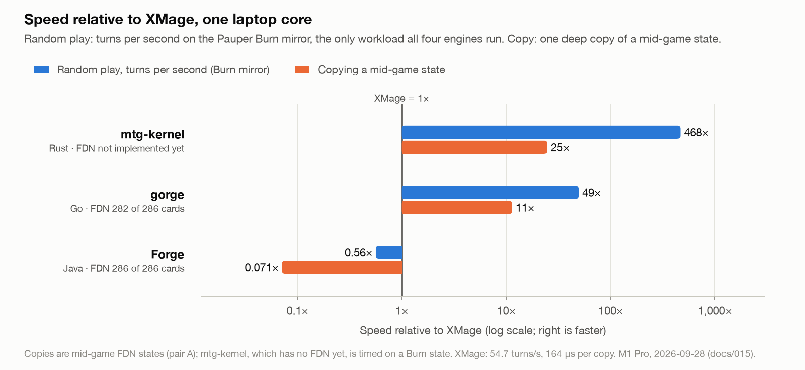

# Rules engines for a fast Limited agent: speed and MCTS support

Which rules engine should a high-level Limited agent train on? This compares four candidates on
speed, FDN cards, and support for MCTS-style learning:

- **XMage** as MageZero uses it: the MageZero v0.2.0 bundle, XMage 1.4.58, WillWroble/mage
  `cb7e9c6f`. It's our current engine.
- **[Forge](https://github.com/Card-Forge/forge)** at `ddb27fd4939` (2026-09-13).
- **[gorge](https://github.com/adams-shaun/gorge)** at `a4af596` (2026-09-27). It's a Go engine
  that compiles Forge's card scripts.
- **[mtg-kernel](https://github.com/jackmaiorino/mtg-kernel)** at `2c5e72f` (2026-09-27). It's a
  Rust engine with a Python training stack, and the engine behind Spellbench.

**Setup:**
- All four were built and timed on one laptop (M1 Pro, 16 GB) on 2026-09-28.
- They ran one engine at a time, one core each, with the same test (§6).
- The workloads were experiment #1's first two eval pairs and a Pauper Burn mirror, the one deck all
  four can play today.

## Summary

**gorge is the only one of the four that is both fast and has the FDN cards today.**
- **mtg-kernel is faster still and the best built for search.** It doesn't implement FDN yet (7 of
  286 cards), so using it means adding the set first. Asked about Limited support
  ([mtg-kernel#110](https://github.com/jackmaiorino/mtg-kernel/issues/110)), the maintainer has said
  FDN is likely possible to add.
- **Forge and XMage have every card but are much slower.** gorge plays random games 16–50× faster
  than XMage and 30–90× faster than Forge.
- **MageZero is the only one with a working AlphaZero training loop.**

<picture>
  <source media="(prefers-color-scheme: dark)" srcset="img/015-engine-speed-dark.png">
  
</picture>

- **gorge against XMage:** 16–50× faster per turn of random play, and copies are 11× faster.
- **mtg-kernel against XMage:** about 470× faster per turn on Burn, and copies are 25× faster.
- **Forge against XMage:** about half XMage's speed in play, and copies are 14× slower.
- **With a faster engine, the network becomes the bottleneck.** On gorge or mtg-kernel, inference
  would limit search, not the engine. MageZero's inference server tops out around 200 requests/s
  (docs/003), and it was already the bottleneck in experiment #2a (docs/014). A faster engine only
  pays off with batched GPU inference across many games.

**Two fast routes.** Each needs its own extra step before it can train a Limited agent.
- **gorge has the cards today.** We'd build the tree search, a batched network bridge, and a
  sampler for the opponent's unknown 40 cards.
  - Pin a commit, because it changes hundreds of times a day.
  - Audit its card behaviour. For example, Nine-Lives Familiar comes back with 1 counter instead
    of 7, and Kiora's Threshold condition is ignored.
- **mtg-kernel has the search and learning scaffolding today**, and about 10× gorge's raw speed.
  Its extra step is adding FDN (§3).

**The other two engines and Manafold:**
- **XMage stays the reference.** It has every card and the only working training loop. But its
  search sees hidden cards, and runs can't be reproduced from a seed.
- **Forge has the best card pipeline**, which gorge reuses, but it is the slowest engine to search
  on.
- **Manafold**, the other engine Spellbench lists, isn't playable yet: only Mountain and Plains.

## 1. Speed

One core each, medians. FDN cells show pair A / pair B.

| | XMage (MageZero v0.2) | Forge | gorge | mtg-kernel |
|---|---:|---:|---:|---:|
| Random play on FDN, turns/s | 45 / 45 | 23 / 20 | 731 / 1,444 | not yet (FDN not implemented) |
| Random play on Burn, turns/s | 55 | 31 | 2,703 | 25,560 |
| Built-in bot on FDN, games/s | 0.61 / 0.32 | 0.30 / 0.60 | 38 / 58 | no heuristic bot |
| Copying a mid-game state | 164 µs, 1.3 MB | 2.3 ms, ~1.9 MB | 14 µs, 100 KB | 6.6 µs, 45 KB |
| One search step | 1.2–2.4 ms | 5.5 ms | ~50 µs | ~17 µs |
| Built-in search, per thread | 424–806 sims/s | 30 sims/s | ~40 rollouts/s | 1,900–2,600 sims/s |

**What each row means:**
- **Random play:** uniform over each engine's legal options. The Burn mirror is the one workload
  all four run.
- **Built-in bot:** each engine's own cheapest real bot on both seats.
  - XMage: CP7 ("Computer - mad") at skill 2, the client's default.
  - Forge: its default AI.
  - gorge: its heuristic bot.
  - mtg-kernel's only built-in policy is uniform random. On Burn it plays 684 games/s through its
    learning interface.
- **Copy:** a deep copy of a mid-game state (turns 5–8, permanents on both sides).
  - XMage: `Game.copy()`.
  - Forge: `GameCopier.makeCopy()`.
  - gorge: `Engine.Clone()`.
  - mtg-kernel: a `GameState` clone.
  - mtg-kernel is timed on a Burn state; the others on FDN pair A.
- **One search step:** what one node expansion costs before any network.
  - XMage: a MageZero MCTS simulation (copy the parent state, run to the next decision, compute
    features, score), from 1.2 ms at turn 5 to 2.4 ms at turn 7.
  - Forge: copy, one random decision, advance: 5.5 ms.
  - gorge: `Engine.Clone` plus one `Submit`: 46 µs.
  - mtg-kernel: a clone plus one step through its learning interface: about 17 µs. This is derived,
    not timed: a 6.6 µs clone plus 10.6 µs per step (94k steps/s).
- **Built-in search:** each engine's own search, so the rows differ in what a simulation is (§2).

## 2. MCTS support

| | XMage / MageZero | Forge | gorge | mtg-kernel |
|---|---|---|---|---|
| Existing search | AlphaZero-style tree search with a network, tree reuse | Depth-3 search over its own plays; not MCTS | Sampled worlds, each played to the end by its bot; no tree | Information-set MCTS with a static evaluator. A network-guided version exists but runs only on x86 and isn't used in training |
| Learning stack | Full loop: inference server, trainer, self-play | None | Small CPU-only neural net written in Go | Python/Torch over JSON lines, native Rust forward pass, CUDA; policy-gradient self-play |
| Stepping a game from outside | No step API: the engine calls into player objects, and MageZero pauses it with scripted puppets | No step API: 109 controller callbacks to implement | Yes, in-process | Yes, in-process, with snapshot and restore |
| Reproducible from a seed | No, because card IDs are random: 5 of 6 same-seed games differed | Yes | Yes | Yes |
| Hidden information | Search sees the opponent's hand and library order | Same | Per-player redacted views. Its sampler assumes both decklists are known, so Limited needs a sampler over the opponent's pool | Re-deals unseen cards from what the searcher knows. For Limited it would deal from a guess at the opponent's pool instead of their real cards |
| Action identity | Hashed into 128 slots; targets by card name. Our fork adds a set-wide vocabulary | Ability text | Positional options | Stable hashed IDs |
| Parallelism | 4 search threads in one JVM matched 1 thread's total | One process per core: the RNG and ID counters are JVM-wide | Many games per process | Many threads |
| FDN cards | 286/286 | 286/286 | 282/286, plus 12 flagged as partly wrong | 7/286 today; FDN would be added first (§3) |
| New sets | Upstream takes weeks to months; MageZero's fork must rebase | Scripted about 2–3 weeks before release | Reuses Forge's card scripts; new mechanics need Go code | Each card coded in Rust, mostly by agents (670–3,100 lines per card, including tests) |
| Maturity | Since 2010; MIT | Since ~2007; 130 authors in the last year; GPL-3.0 | Created 2026-09-04; 6,844 commits by 2026-09-28 (515 on 2026-09-27), mostly by AI agents; README says "not ready for parity or production use"; Apache-2.0, with card scripts fetched from Forge | Created 2026-07 from work inside an XMage fork; most commits by an automated identity; MIT |

## 3. Adding FDN to mtg-kernel

This is an extra step, not a blocker: the maintainer has said FDN is likely possible to add. The
step covers five things:
- **The cards:** about 280 FDN cards.
- **Rules the Pauper decks didn't need:**
  - trample: the code notes "there being no trample in this pool";
  - damage assignment order;
  - mulligans;
  - planeswalkers.
- **Priority in more steps:** the engine already gives priority in upkeep, draw, combat and the end
  step, but its learning interface skips those windows. Flash tricks need them.
- **40-card decks:** sessions currently accept only the nine Pauper decks.
- **A dealer that guesses the opponent's pool**, instead of dealing their real unseen cards.

**Our rough estimate:** a few weeks of agent-assisted work for a first pass, plus time to validate
against XMage. The repo's history suggests this can move fast: the remaining Pauper decks landed in
five 2–4k-line agent commits on 2026-08-09.

**Each new set would be its own card step.** That matters for simulating a set soon after its
spoilers. Forge scripts arrive 2–3 weeks before release, and gorge inherits them.

## 4. mtg-kernel's speed claims

Our roadmap quoted mtg-kernel as "about 40× faster than XMage overall, and 1,000× for training".
- **"1,000×"** is a design target and was never measured. The XMage baseline behind it has been
  withdrawn.
- **"40×"** isn't in the repo. The nearest figure is 53×: 13.65 against 0.2588 games/s.
  - It compares network-against-network games with games against XMage's CP7 bot, which thinks for
    about 14 s per move.
  - So it measures bot cost, not engine speed.
- **Measured engine against engine on Burn:** about 470× XMage per turn of random play, and 25× on
  state copies.

## 5. Side findings for current runs

- **XMage's search threads don't add up.**
  - One search thread kept 1.6–2.2 cores busy.
  - XMage copies the whole game every time it lists legal moves: the in-place shortcut is switched
    off (`if(false && simulation)`, §7).
  - Four search threads in one JVM matched one thread's total: about 425 sims/s either way.
  - On the pods, one laptop thread's 424–806 sims/s on turn 5–7 boards compares with about 20 per
    game thread (docs/006). The two aren't directly comparable, but the gap is worth a profile.
- **Forge calls `System.gc()` after every game** (`Match.java:103`). That costs about 0.36 s here.
  Headless Forge sims can skip it with `-XX:+DisableExplicitGC`.

## 6. Method and caveats

**Workloads:**
- **FDN pair A:** `FDN_top_04956_UG` vs `FDN_top_20626_WG`.
- **FDN pair B:** `FDN_top_07961_WR` vs `FDN_top_02581_UR`. Both pairs are from `assets/sample/`.
  Seats swap every game.
- **Burn mirror:** mtg-kernel's Burn list, run in every engine.
- **FDN card list:** the 286 names in the 17lands FDN reference (`assets/reference/FDN_gih.json`).

**Timing:**
- Each engine ran alone, single-threaded.
- The two JVM engines warmed up for 10–67 s first.
- Game-playing measurements ran for 20–90 s each, and each copy method was timed 1,000–5,000 times.
- XMage and Forge ran on JDK 21, gorge on Go 1.27.1, mtg-kernel on Rust 1.94.1.

**Turns:** each game's own turn counter, which counts both players' turns.
- Compare turns per second, not decisions per second.
- The random players differ in what they count as a decision. XMage's pays mana automatically;
  gorge's taps lands one at a time.
- Random games also run to different lengths: 22–29 turns in XMage and Forge, 36–43 in gorge.

**Caveats:**
- MTG Arena was running during the timing, using about half a core.
- gorge's FDN behaviour rests on its own tests and over 12,000 games here, none of which crashed or
  stalled. It hasn't been independently audited. Of its 12 flagged cards, only Nine-Lives Familiar
  was confirmed wrong at runtime.
- mtg-kernel's speed was measured on Burn and Rally. FDN boards may cost somewhat more per step.
- The benchmark harnesses aren't in this repo yet.

## 7. Where the claims come from

**XMage** (WillWroble/mage `cb7e9c6f`):
- `Mage/src/main/java/mage/game/GameImpl.java:357`: the search starts from `this.copy()`, hidden
  cards included.
- `GameImpl.java:368`: `if(false && simulation)`, so listing legal moves copies the game.
- `Mage.Server.Plugins/Mage.Player.AIMCTS/src/mage/player/ai/ComputerPlayerMCTS.java:384`:
  `//dont shuffle here`.
- `Mage.Server.Plugins/Mage.Player.AI/src/main/java/mage/player/ai/encoder/ActionEncoder.java:23`
  and `:49`: Pass is slot 0, and every other action is hashed into slots 1–127.

**Forge** (`ddb27fd4939`):
- `forge-ai/src/main/java/forge/ai/simulation/GameCopier.java:37-45`: every zone is copied, hand
  and library included.
- `GameCopier.java:317`: rebuilding each card from its script "accounts for the vast majority of
  GameCopier execution time".
- `forge-game/src/main/java/forge/game/player/PlayerController.java`: 109 abstract callbacks.
- `forge-core/src/main/java/forge/util/MyRandom.java:34`: one static RNG for the JVM.
- `forge-game/src/main/java/forge/game/Match.java:103`: `System.gc()` after every game.

**gorge** (`a4af596`):
- `rules/clone.go:51` and `state/game.go:645`: `Engine.Clone` and `Game.Clone`.
- `view/visibility.go:14-35`: Seat, Public and Omniscient views.
- `internal/searchprobe/sample.go:24`: the sampler's `PublicGame` holds both decklists.
- `sample.go:358`: opponent actions are regenerated with the built-in bot.
- `effects/zone.go:2474`: `WithCountersAmount$ X` falls back to 1, which breaks Nine-Lives Familiar.
- `AGENTS.md:188`: the engine's known approximations.

**mtg-kernel** (`2c5e72f`):
- `mtg-kernel/src/engine.rs:10342`: "no-trample simplification".
- `mtg-kernel/src/surface.rs:303`: the priority windows its learning interface skips.
- `mtg-kernel/src/rl.rs:1383`: seven cards dealt, no mulligan.
- `mtg-kernel/src/kernel_native_search_opponent_v1.rs:1036`: re-dealing hidden zones for each
  simulation.
- `ROADMAP.md:46`: the withdrawn XMage figure.
- `docs/native_scaled_selfplay_population_program_v1.md:174-176`: 13.65 against 0.2588 games/s.
- `docs/research/regime_review_v1.md:13-16`: CP7's think time.

**Plot:** `tools/engine_bench/speed_plot.py`.

## Follow-up ideas

- **Commit the four benchmark harnesses**, so these numbers can be rerun.
- **Audit gorge's FDN behaviour against XMage**, starting with the 12 flagged cards. docs/008's turn
  replay could compare the two engines on recorded 17lands turns.
- **Profile XMage's per-thread search rate on a pod** (§5).
- **If we take the mtg-kernel route, agree the FDN scope with the maintainer** in
  [#110](https://github.com/jackmaiorino/mtg-kernel/issues/110): the cards, the Limited rules,
  40-card decks, and pool-based dealing.
