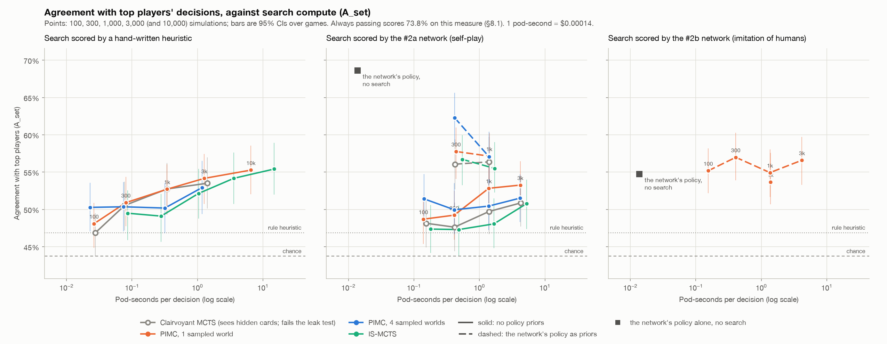
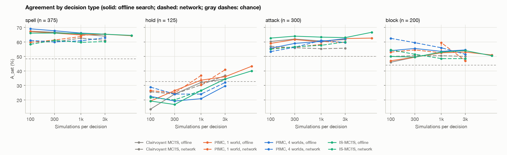
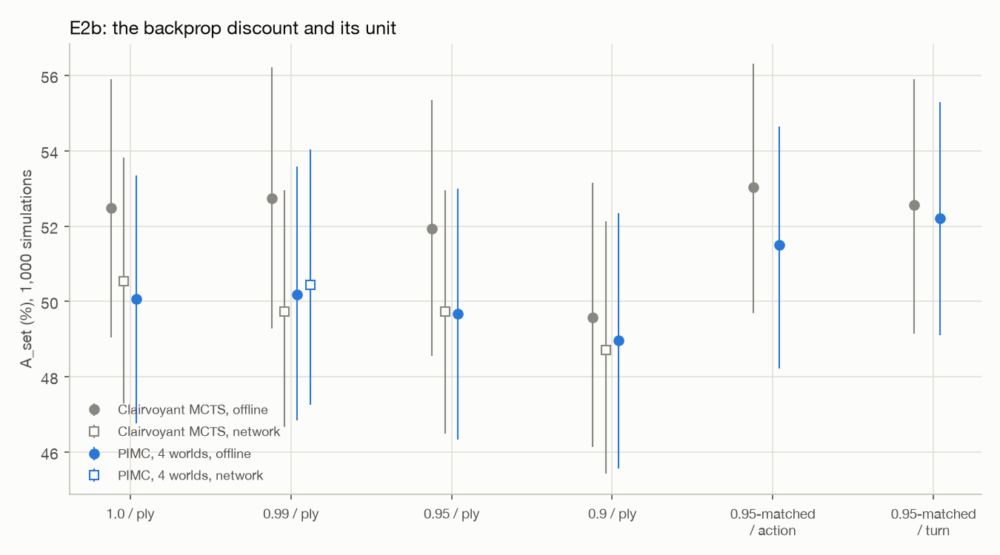

# Search benchmark: results of the first experiment

*September 2026. The full design of the experiment is in the proposal,
[docs/012](012-search-benchmark.md).*

## The question

Strong game-playing programs such as AlphaZero combine two parts: a neural network that judges
positions, and a **tree search** that uses it to look ahead before each move. For Magic, how much
search helps, and which kind of search works best, is an open question. Magic's rules engines are
slow, and much of the game is hidden: you can't see your opponent's hand or the order of either
library.

This experiment explores how effective different search techniques are at Magic limited.

- **What we measured.** Playing thousands of games for every setting would be slow and expensive.
  Instead we took **1,000 real positions from human games** of Foundations (FDN) limited, recorded
  by [17lands](https://www.17lands.com/). We rebuilt each one in the XMage rules engine, let each
  search choose a play, and measured **how often it chose what a top player chose.** The positions
  are casting a spell, holding back, attacking and blocking. Every setting sees the same positions,
  so small differences show up. This measures agreement with strong players, not playing strength
  directly (§6).
- **The search methods.** One of them, today's MageZero search, **peeks** at hidden cards: it
  searches the real game, including the opponent's hand. We call it *clairvoyant MCTS*. The others
  **hide** them, as a human player must.
  - *PIMC* guesses the hidden cards (a plausible opponent hand and deck, drawn from 17lands data)
    and searches the guessed game as if it were real. It uses 1 or 4 guesses.
  - *IS-MCTS* builds a single search tree over many guesses, drawing a fresh one at every step.
- **Leak probes.** To check that the hiding methods really hide, we built pairs of positions that
  look identical to the player and differ only in hidden cards: a counterspell in the opponent's
  hand or not; a good or a bad next draw. A fair search decides the same way in both.
- **Search budgets.** Each method searched with 100, 300, 1,000 and 3,000 **simulations** per
  decision, the number of positions it looks at, and the two best also with 10,000.
- **How positions are scored inside the search:** a hand-written heuristic (life, cards, board), or
  experiment #2a's network, trained by self-play.
- **A few additional experiments:**
  - how the search discounts distant outcomes (per decision, per action or per turn);
  - a network's *policy*, its instinct for which play is good, used to guide the search
    ("priors"). This includes experiment #2b's network, pretrained on human decisions;
  - the larger budgets.

Compute is measured in **pod-seconds per decision:** seconds of the rented machine (one RTX 3090 GPU
and 31 CPU cores) spent per decision. 1 pod-second costs about $0.00014.

## What we found

1. **Search doesn't need to see the opponent's cards.**
   - The methods that hide information (PIMC, IS-MCTS) agree with top players as well as the
     search that peeks.
   - They do it at the same or a better price: PIMC with one guess costs the same as the peeking
     search.
   - The leak probes confirm that they hide. The peeking search plays around a counterspell only
     when one is really there; the others decide the same either way (§3).
2. **More search consistently helped.**
   - With the heuristic scoring positions, agreement climbed steadily for every method from 100 to
     3,000 simulations, and again at 10,000.
   - The trees grew from about 6 to 14 decisions deep, yet even at 10,000 simulations the search
     sees less than one turn ahead (§8.5).
   - The slow rules engine is what limits the budget. A faster engine such as gorge or mtg-kernel,
     16–470× faster than XMage in [docs/015](015-rules-engine-comparison.md), would allow far more
     search for the same time and money. On this evidence, that should improve play.
   - With a much faster engine, the network's inference becomes the next bottleneck (docs/015).
3. **A little imitation learning goes a long way.**
   - Experiment #2b's network was pretrained on human decisions from under 2% of the available
     games. With no search at all, it matched top players as well as the best search here, for a
     thousandth of the compute (§7).
   - Using its policy to guide search kept that level.
   - Bootstrapping limited agents with imitation learning looks promising. The training procedure
     needs work: how the policy is used as a prior, and how to keep self-play from overwriting it
     (§9).
4. **Self-play hasn't yet beaten the hand-written heuristic.**
   - After 18 generations of self-play, experiment #2a's network scored positions no better than
     the heuristic: search with it agreed with top players no more often (§4.3).
   - Its policy alone was worse than search.
   - That points at the training recipe, and possibly at scale: 18 generations and about 2,700 games
     is very small next to AlphaZero's tens of millions (docs/014).
5. **Top players wait; the agents act.**
   - Expert players tend to hold a spell until the last viable moment. That keeps their options
     open and lets them learn more before committing.
   - The agents lean towards action: they attack, block and cast far more often than the players
     did (§8.2).
   - Future versions of this benchmark could focus on these last-chance timings: the second main
     phase, the opponent's end step, or holding up a combat trick.

## How agreement is scored, and why passing matters

Almost half of the top players' decisions were to **do nothing**:

| Decision | What the top player did |
|---|---|
| Hold: a spell was castable, but they cast nothing that turn | passed, every time (that's how these positions were chosen) |
| Block: "should this creature block?" | didn't block, 80% of the time |
| Attack: "attack with this creature?" | didn't attack, 54% |
| Spell: a turn in which they cast something | cast. But Pass also counts as a match in 61% of these, because 17lands doesn't record whether a turn's spells came before or after combat |

In all, **45% of the players' decisions were to wait.** So the plain agreement score planned in
docs/012 (*A_set*) rewards passivity. An agent that **always does nothing scores 73.8%**, more than
any search (47–55%).

**That is why #2a's network looks so strong on its own.** Its policy, with no search, scores 68.6%,
the highest raw number in this report, because it almost always passes:

| | Does nothing: passes, doesn't attack, doesn't block |
|---|---|
| Top players | 45% of decisions |
| #2a's policy, no search | **86%**: it passes priority on 98% of spell decisions and 88% of holds, and declines 80% of attacks and 70% of blocks |
| #2b's human-trained policy, no search | 33% |
| The searches | 25–32% |

Why #2a's policy passes so much wasn't measured. From reading MageZero's code, one likely
contributor: it records a training example at every combat step even when passing is the only legal
play, so many of the policy's training targets are "pass".

**The balanced score.** To stop passivity or aggression from winning, we also score three yes/no
questions: *cast or hold*, *attack or not*, *block or not*. Each is scored by balanced accuracy:
the average of how often the agent matched the player when the player acted, and when the player
waited. Always passing, always acting and choosing at random all score 0.50. The balanced score is
the mean over the three questions (§8.3). It is the measure to trust in this report.

## The results at a glance

<picture>
  <source media="(prefers-color-scheme: dark)" srcset="img/016-frontier-balanced-dark.png">
  
</picture>

*The balanced score (0.50 = any constant answer) against compute. Each line is one search method.
Its points are 100, 300, 1,000 and 3,000 simulations per decision (and 10,000 for two methods),
labelled on the orange PIMC line. Bars are 95% confidence intervals. The three panels differ in how
positions inside the search are scored. The gray square on the right, #2b's human-trained policy
with no search, is the best single point.*

<picture>
  <source media="(prefers-color-scheme: dark)" srcset="img/016-frontier-dark.png">
  
</picture>

*The same runs on the plain agreement score, A_set. It rewards passing: #2a's policy alone (gray
square, middle) looks best here only because it almost always passes.*

## Findings in detail

- **Every search agrees with top players about equally, and not much more than a simple
  heuristic,** by the planned headline. A_set, macro-averaged over four decision types, is 47–55%
  for every method, budget and evaluator. Chance is 43.7% and the rule heuristic 46.9%. The best
  priors-off searches are offline at 10,000 simulations: IS-MCTS (55.4%) and PIMC with 1 world
  (55.3%).
- **Why so low: the searches are far more active than top players, and A_set mostly measures
  passivity** (§8).
  - Top players attacked with the creature in 46% of attack decisions and blocked in 20% of
    block decisions. The searches attack 55–67% of the time, block about 50%, and on holds cast
    something 48–57% of the time.
  - "Always do nothing" scores **73.8%**, above every search and every policy.
  - The searches' disagreements are mostly near-ties in their own values. Even at 3,000
    simulations they look less than one turn ahead.
  - Methods that share an evaluator agree with each other 78–83% of the time. The limit is what
    scores the leaves, and the horizon, not the search method.
- **On a balanced score, where any constant answer gets 0.50** (§8.3), the picture is clearer:
  - offline search climbs steadily with budget, from 0.57 at 100 simulations to 0.63–0.64 at
    10,000;
  - #2a's network searches sit lower, 0.55–0.62;
  - #2b's human-pretrained policy alone scores 0.646, and search with it as priors 0.64–0.65, the
    best of anything;
  - #2a's policy alone scores 0.54 (its 68.6% A_set is passing).
- **Fairness costs nothing here, and the leak test separates the methods cleanly.**
  - No fair method is significantly behind today's clairvoyant search at any budget. On 17lands
    positions the clairvoyant search reads a *guessed* hand, so peeking buys nothing.
  - On the probes it peeks wherever it can. It fails five of six pairs offline and three of four
    with the network; on the counterspell pair it drops Serra Angel's value by 0.37 offline and
    0.58 with the network.
  - PIMC with 1 and 4 worlds and IS-MCTS pass every pair (§3).
- **More search helps slowly.**
  - From 100 to 3,000 simulations, clairvoyant MCTS and PIMC with 1 world gain 6–7 points offline.
    From 1,000 to 3,000 they gain 1–3.
  - At 10,000 they still gain about a point: IS-MCTS reaches 55.4% and PIMC with 1 world 55.3%,
    level with each other, at 14.8 and 6.5 pod-seconds per decision.
  - Most of the gain is on holds, where more search learns to wait (§4.2).
- **Of the methods:**
  - **PIMC with 1 world is the practical choice.** It costs the same as today's search, is fair,
    and is never significantly beaten at equal budget.
  - **Four worlds don't help:** each tree gets a quarter of the budget.
  - **IS-MCTS** ties PIMC offline at about 2–3× the cost, from 3,000 to 10,000 simulations, and
    trails it with the network at 1,000 (−4.8 points).
- **The networks:**
  - **#2a's value head** adds nothing over the offline heuristic: network and offline searches
    agree within ±3 points at every setting.
  - **#2a's policy as priors** raises A_set by 4–12 points, mostly by passing more, and the balanced
    score by only 0.00–0.04.
  - **#2b's human policy as priors** keeps the human policy's quality at every budget, but doesn't
    improve on it.
  - **#2b's human-outcome value head alone** is no better than #2a's (§7).
- **The backprop discount doesn't matter for agreement.** No arm beats the default 0.99 per ply,
  0.9 per ply costs 3.2 points (clairvoyant, offline), and the unit is within noise (§5).
- **Compute and cost:**
  - Offline search costs 0.02–3.6 pod-seconds per decision (14.8 for IS-MCTS at 10,000). Network
    search costs 0.14–5.3, GPU-bound at about 550–700 evaluations per second across the pod.
  - The whole study used **$14.35 of pods**: three RTX 3090 pods for about 28 pod-hours, calibration
    and follow-ups included.
- **Next** (§8.8, §9):
  - replace A_set with the balanced score;
  - the value at the leaves is the bottleneck, so improving it matters more than the search
    method;
  - start self-play from a lightly trained human network, with human priors in a fair PIMC search.

---

## 1. What ran, and how it differs from the plan

The first experiment compares four search methods at four budgets with two evaluators, on 1,000
held-out decisions by top 17lands players, and tests each method for hidden-information leaks.

| | Planned (docs/012 §2) | Ran |
|---|---|---|
| Methods | clairvoyant MCTS; PIMC with 1 and 4 worlds; IS-MCTS | the same |
| Budgets | 100, 300, 1,000, 3,000 simulations | the same |
| Evaluators | offline search; experiment #2's network | offline search; #2a's gen 18 network |
| Decisions | 1,000 test + 300 dev, six types | 1,000 test + 300 dev, **four types** (§1.1) |
| Leak test | about two dozen probe scenarios | six probe pairs, 16 seeds per world (§3) |
| Discount sweep (E2b) | 1.0, 0.95, 0.9 per ply; 0.95-matched per action and per turn | the same |
| Compute | pod-seconds per decision on the RTX 3090 pod | the same (§1.4) |

### 1.1 The decisions (sb-v1)

Built by `tools/search_bench/items.py` from 1,874 held-out games by top players
(`user_game_win_rate_bucket` ≥ 0.60 and at least 100 games), sampled every 36th row of the FDN
replay file. Held out means no row of any imitation table (docs/008 §7.3 and experiment #2b used
the same 16,483 games) and no mirrored partner of one. At most two decisions per game (a mirrored
pair counts as one game), turns 3–12, fidelity tiers T0 and T1.

| Type | What | Label | Test | Dev | Options (mean) | Chance |
|---|---|---|---|---|---|---|
| **Spell** | the first main-phase priority after the human's land drop, in a turn in which they cast a spell or activated an ability | that turn's casts and activations legal here, plus Pass when the human attacked | 375 | 110 | 3.99 | 48% |
| **Hold** | the same decision in a turn in which the human cast and activated nothing, with a spell castable | Pass | 125 | 40 | 3.40 | 33% |
| **Attack** | the first "attack with X?" question, in a turn in which the human cast nothing | exact | 300 | 90 | 2.00 | 50% |
| **Block** | the first "what does X block?" question in the opponent's next turn | exact, a unique pairing | 200 | 60 | 2.37 | 44% |

- **Two of docs/012's six types are left out:** mid-turn priority and spell targets. The
  pipeline can't yet rebuild a mid-turn state as a search root, and 17lands records no target
  labels that the current resolver can match. Their 225 test slots went to the other four types.
- **The land drop is played first.** A new bridge option (`preLand`) plays the human's land at the
  first main-phase priority, then the search decides. Without it, "play a land" would match the
  human's label almost every time.
- **Attack decisions come from turns in which the human cast nothing,** so the pre-combat state
  is the turn start plus the land. That selects quieter turns.
- **Holds are rare in top players' games:** 3,001 hold candidates failed because the human cast
  something. The 125 test holds came from the last games scanned.
- **Each decision carries its worlds** (docs/012 §2.4). `real` is the position with the opponent's
  hand and deck filled from the belief model, with the item's own seed: what clairvoyant MCTS
  searches. `worlds` are eight more belief samples with the search seed. PIMC with 1 world uses
  the first, PIMC with 4 the first four, IS-MCTS all eight. The belief model leaves out the game's
  own drafts and a mirrored partner's.

### 1.2 The search code

The four methods run through one new driver, `mage.player.ai.BenchSearch` in `java/mzbridge`,
reached by a new `bench` op. It uses MageZero's nodes only to step the engine and list options,
and keeps its own statistics. That's how the benchmark gets:

- **Fresh simulations only:** a fresh tree for every decision, and the budget counts simulations
  run, not root visits.
- **The discount's unit** (E2b): per ply, per logical action (only edges out of priority
  decisions), or per turn.
- **No whole-tree walks:** MageZero walks the tree twice per iteration for its node and depth
  limits, and searches for duplicate states even with pruning off (docs/012 §2.9).
- **Synchronous network evaluation:** no virtual loss, so its sign problem at opponent nodes
  (docs/012 §2.9) can't bias anything. A seeded offline search is deterministic.

Everything else follows ComputerPlayerMCTS2: PUCT with c = 1, unvisited options valued 0,
uniform priors (priors off, as in experiment #2), the single-option shortcut, offline leaves
scored by `GameStateEvaluator3` at priority decisions with micro decisions inheriting their
parent's score, and the final choice by visits.

- **Clairvoyant MCTS:** one tree on the real world.
- **PIMC:** one tree per belief world, the budget split evenly, root options merged by label, and
  the choice by visits summed over worlds.
- **IS-MCTS** (single-observer, Cowling, Powley and Whitehouse 2012):
  - one tree whose edges are world-independent keys (an ability's text and source name; a
    target's name, state, zone and controller);
  - every iteration picks one of the eight belief worlds, re-deals it (the opponent's hand redrawn
    from that world's unseen cards, both libraries shuffled, with the search's own random stream)
    and replays its path from the root in that world, following only options legal there;
  - selection uses availability counts; a node is scored once, in the world of the iteration that
    creates it; opponent nodes are shared across worlds, as published.

  So every iteration sees a fresh hand and fresh library orders, and deck compositions come from
  eight belief decks. It is the vanilla form docs/012 chose, with a finite pool of decks.

### 1.3 The network

Experiment #2a's final checkpoint (gen 18, `FDN_exp2`, SHA-256 `ac9b2d4f…`), with the opponent's
hand hidden from the encoder (`perfectInfo` false, as in training) and priors off, so the search
reads only the value head. It is served by `tools/search_bench/value_server.py`: MageZero v0.2's
model, forward pass and batching, returning only the value. MageZero's own server returns all four
1,024-wide policy heads as Python lists for every state. On 60 searches the two servers' values
agreed within 0.0005 (fp16), and the choices matched on 59. The policy references use MageZero's
own server.

### 1.4 Compute

- **Pods:** three Secure RTX 3090 pods, each with a 31.1-core quota and 116 GB, at $0.50/hr: the
  reference pod of docs/012 §2.6. Secure 3090s were scarce, and a 16-vCPU L40S offered in their
  place was released at once.
  - Pod 1 (10.6 h): the network runs of E2, E0's references and the human-prior follow-up.
  - Pod 2 (11.4 h): E1, the offline runs of E0, E2 and E2b, E2b's network runs, E1's network check
    and #2a's priors.
  - Pod 3 (5.7 h): the two 10,000-simulation runs.
- **Load:** 30 bridge workers (one JVM, one search each) for offline search. 32 workers and four
  value-server replicas sharing the GPU for network search. Every search is fresh, so the pod-seconds
  per decision are a batch's wall-clock at full load divided by its 1,000 decisions.
- **The network runs are GPU-bound.** At 32 workers the GPU is 96–99% busy, at about 550–700
  evaluations per second across the pod. A single server replica was worse: 35% GPU and 0.88
  against 0.57 pod-seconds per decision at budget 300, because Python's GIL throttles one process.
  About 13 ms of each network simulation is inference latency and 6 ms engine work, so many
  workers are needed to fill the GPU.
- **Offline search is CPU-bound** at about 2,600–3,000 simulations per second across the pod for
  the tree methods. That is about 5× docs/012's estimate of 550, which came from self-play with its
  whole-tree walks.
- **IS-MCTS pays for its replay:** 6.3 engine steps per simulation at 100 simulations, 9.8 at
  1,000 and 11.5 at 3,000, against 1.02 for the tree methods. Per decision, that is 2.8–3.3× the
  tree methods' cost offline, close to docs/012's guess of 3×.
- **Warm timing.** Each batch's first run includes JVM start-up, about 45 pod-seconds in all. That
  matters only for clairvoyant MCTS offline at 100 simulations, which was re-timed warm: 0.027
  pod-seconds per decision, against 0.074 cold.

## 2. E0: references and noise

All on the 1,000 test decisions. A_set is macro-averaged over the four decision types; "strict"
drops the lenient Pass on spell decisions (§1.1).

| Reference | A_set | 95% CI | Strict | Spell | Hold | Attack | Block |
|---|---|---|---|---|---|---|---|
| Chance (uniform over the distinct legal options) | 43.7% | | | 48.3% | 32.6% | 50.0% | 44.0% |
| Rule heuristic, no search | 46.9% | | | | | | |
| #2a's gen 18 network: its policy, no search | **68.6%** | 65.7–71.6 | 53.9% | 59% | **88%** | 63% | 64% |
| #2b's starting network, pretrained on human decisions: its policy, no search | 54.7% | 51.6–58.2 | 54.4% | 68% | 34% | 75% | 43% |

- **The rule heuristic barely beats chance.** It is "cast the biggest spell; attack when power is
  at least the best blocker's toughness; block when the blocker kills the attacker and survives".
- **#2a's policy scores highest of anything in this report, by passing.** It does nothing on 86% of
  decisions, against the top players' 45%. That wins almost every hold (88%), and on spell decisions
  Pass counts as a match whenever the human attacked (§ "How agreement is scored"). Its strict score, 53.9%,
  is about where the searches are. Its policy heads learned from self-play searches' visit counts
  (300 simulations with tree reuse), yet they prefer Pass far more than any search here does. Why
  isn't clear from this data. With priors off, the search never reads them.
- **#2b's human-pretrained start agrees best on spells (68%) and attacks (75%),** the two types its
  pretraining covered (turn-start plays and attacks, docs/011). It is near chance on holds and
  blocks. It is the floor under the ceiling docs/012 §2.3 asked for, but only for spells and
  attacks.
- **Test–retest noise is small.** PIMC with 4 worlds at 1,000 simulations, run again with a second
  seed, changed its A_set by +0.2 points offline (95% CI −0.9 to +1.1) and −0.5 with the network
  (−1.8 to +0.9). Paired differences between methods of about 2–3 points are detectable, as docs/012
  §2.3 estimated. The unpaired CIs in the tables (about ±3.3 points) are much wider than the paired
  ones, so methods are compared paired (§4).
- **Not run:** XMage's MAD AI. `MadProbe` evaluates a position without advancing it, and the
  benchmark's positions start at the end of the previous turn, so it needs an advance step first.
- **Plies per logical action and per turn,** measured on clairvoyant MCTS's 1,000-simulation trees,
  set E2b's matched discounts. Offline: 1.43 plies per action and 16.2 per turn, so 0.95 per ply
  matches 0.930 per action and 0.435 per turn. With the network: 1.43 and 15.8, so 0.930 and 0.446.

## 3. E1: the hidden-information test

**Clairvoyant MCTS fails. PIMC with 1 and 4 worlds and IS-MCTS pass, with every difference exactly
zero.** `tools/search_bench/leak.py`, offline search, 3,000 simulations, 16 seeds per world, seeds
paired across the two worlds of a pair.

Each pair is two positions that look the same to the deciding player and differ only in cards it
can't see. They are docs/009's two positions plus extreme versions, a decklist pair and a canary:

| Pair | World X / world Y | Clairvoyant MCTS: worst option's ΔQ (X − Y), 95% CI | Its choices, X / Y | Verdict |
|---|---|---|---|---|
| counterspell | the opponent holds Refute + Island / Island + Island | Cast Serra Angel −0.37 [−0.45, −0.29] | Pass 10 of 16 / Cast 16 of 16 | fails |
| counterspell, extreme | Refute ×3 / Island ×3 | −0.39 [−0.44, −0.34] | Pass 16 / Cast 16 | fails |
| cantrip | the searcher's own next draw is Llanowar Elves / a Plains | Cast Helpful Hunter +0.073 [+0.067, +0.079] | Cast 16 / Cast 15 | passes the rule |
| cantrip, extreme | its next five draws are Elves / Plains | +0.086 [+0.070, +0.102] | Cast 16 / Cast 14 | fails |
| decklist | the opponent's hidden hand is dealt from a list with four counterspells / none | −0.10 [−0.20, −0.00] | Pass 3 / Pass 2 | fails |
| canary | the opponent holds Counterspell ×2, a card outside FDN that no belief can deal / Island ×2 | −0.31 [−0.41, −0.21]; the canary reached all 16 of its searches | Pass 14 / Cast 16 | fails |

The rule (docs/012 §2.5): a pair passes when every option's paired ΔQ has a 95% CI inside ±0.1 and
the chosen actions don't differ (a permutation test, p > 0.01).

- **Clairvoyant MCTS fails five of the six pairs.** It fails as docs/009 found: it plays around a
  counterspell only when one is really there, and values a cantrip by the card it will draw. The
  realistic cantrip pair shows a real leak (+0.073, far from zero) that is inside the ±0.1 window,
  so it passes the rule. Its extreme version fails, which is what the extreme versions are for.
- **The fair methods give identical searches in both worlds of every pair,** ΔQ 0.000 and the same
  choice in all 16 seeds. That is by construction, and it is what the test checks: their worlds are
  drawn from a public view of the position (the opponent's hand as a count, its decklist unknown,
  the searcher's library top unknown), so the same seed gives the same worlds, and offline search is
  deterministic given its seed. No canary reached any of their worlds.
- **What it doesn't test.** There are no known-card controls. The public view drops *every*
  hidden card, including ones the player legitimately knows, such as a card it saw bounced to the
  opponent's hand or a card it scried to the top. So the fair methods also ignore information they
  are entitled to. That costs quality, not fairness. Nothing reuses trees, so docs/012's tree-reuse
  probe doesn't apply.
- **The network spot check agrees.** It ran #2a's network, 3,000 simulations and 16 seeds on four
  pairs.

  | Pair | Clairvoyant MCTS: ΔQ, 95% CI; choices X / Y | Verdict | PIMC with 4 worlds |
  |---|---|---|---|
  | counterspell | Cast Serra Angel −0.58 [−0.71, −0.44]; Pass 15 of 16 / Cast 15 of 16 | fails | passes (ΔQ ≤ 0.0002) |
  | counterspell, extreme | −0.47 [−0.57, −0.38]; Pass 16 / Cast 16 | fails | passes |
  | cantrip | +0.016 [+0.000, +0.031]; Cast 14 / Cast 7 (p = 0.02) | passes the rule | passes |
  | cantrip, extreme | −0.017 [−0.021, −0.014]; Cast 11 / Pass 15 (p = 0.001) | fails | passes |

  With the network the clairvoyant search leaks *more* on the counterspell pair (−0.58 against
  −0.37 offline). PIMC's differences are not exactly zero with the network, about 0.0001: the
  inference server's fp16 batches vary with what else is in them.

## 4. E2: method × budget

### 4.1 The grid

A_set, macro-averaged over the four types (95% CI about ±3.3 points; paired differences are much
tighter). Pod-seconds per decision in brackets.

| | 100 | 300 | 1,000 | 3,000 | 10,000 (§7) |
|---|---|---|---|---|---|
| **Offline search** | | | | | |
| Clairvoyant MCTS (fails E1) | 46.9% (0.027) | 50.5% (0.08) | 52.7% (0.34) | 53.5% (1.42) | |
| PIMC, 1 world | 48.1% (0.026) | 50.9% (0.08) | 52.7% (0.34) | **54.2%** (1.27) | 55.3% (6.53) |
| PIMC, 4 worlds | 50.3% (0.023) | 50.4% (0.07) | 50.2% (0.32) | 52.9% (1.18) | |
| IS-MCTS | 49.5% (0.09) | 49.1% (0.28) | 52.1% (1.04) | **54.2%** (3.59) | **55.4%** (14.75) |
| **Network (#2a gen 18, priors off)** | | | | | |
| Clairvoyant MCTS (fails E1) | 48.1% (0.15) | 47.6% (0.42) | 49.7% (1.40) | 50.9% (4.27) | |
| PIMC, 1 world | 48.7% (0.14) | 49.2% (0.41) | 52.8% (1.39) | **53.3%** (4.21) | |
| PIMC, 4 worlds | 51.4% (0.14) | 50.0% (0.41) | 50.4% (1.38) | 51.5% (4.16) | |
| IS-MCTS | 47.4% (0.18) | 47.3% (0.49) | 48.1% (1.66) | 50.7% (5.26) | |

Balanced score (§8.3), same runs:

| | 100 | 300 | 1,000 | 3,000 | 10,000 |
|---|---|---|---|---|---|
| **Offline search** | | | | | |
| Clairvoyant MCTS (fails E1) | 0.567 | 0.591 | 0.613 | 0.627 | |
| PIMC, 1 world | 0.578 | 0.589 | 0.597 | 0.620 | 0.631 |
| PIMC, 4 worlds | 0.576 | 0.602 | 0.603 | 0.622 | |
| IS-MCTS | 0.591 | 0.585 | 0.614 | 0.623 | **0.636** |
| **Network (#2a gen 18, priors off)** | | | | | |
| Clairvoyant MCTS (fails E1) | 0.568 | 0.550 | 0.559 | 0.575 | |
| PIMC, 1 world | 0.581 | 0.573 | 0.604 | 0.607 | |
| PIMC, 4 worlds | 0.587 | 0.592 | 0.588 | 0.590 | |
| IS-MCTS | 0.581 | 0.572 | 0.575 | 0.591 | |

On the balanced score, offline search improves steadily with budget for every method, and the
four methods at 3,000 lie within 0.007 of each other. The network's searches are flatter and lower,
and only PIMC with 1 world reaches 0.60. At 10,000 simulations, IS-MCTS (0.636) and PIMC with 1 world (0.631) gain a little more.

Paired differences (A − B, points, 95% CI over games):

| Comparison | Offline | Network |
|---|---|---|
| PIMC 1 − clairvoyant, 3,000 | +0.6 (−2.2, +3.5) | +2.4 (−0.5, +5.3) |
| IS-MCTS − clairvoyant, 3,000 | +0.7 (−2.0, +3.5) | −0.1 (−3.0, +3.2) |
| PIMC 4 − PIMC 1, 1,000 | −2.5 (−5.2, +0.5) | −2.4 (−5.2, +0.5) |
| PIMC 4 − PIMC 1, 3,000 | −1.2 (−4.0, +1.5) | −1.7 (−5.1, +1.3) |
| IS-MCTS − PIMC 1, 1,000 | −0.6 (−3.1, +2.0) | **−4.8 (−7.7, −1.7)** |
| IS-MCTS − PIMC 1, 3,000 | 0.0 (−3.0, +3.0) | −2.5 (−5.6, +0.6) |
| PIMC 1: 3,000 − 100 | **+6.1 (+2.3, +9.6)** | **+4.6 (+0.9, +8.2)** |
| PIMC 1: 3,000 − 1,000 | +1.4 (−1.1, +4.2) | +0.4 (−2.2, +3.2) |
| Clairvoyant: 3,000 − 100 | **+6.7 (+3.1, +10.6)** | +2.7 (−0.8, +6.4) |
| IS-MCTS: 3,000 − 1,000 | +2.0 (0.0, +4.1) | **+2.7 (+0.4, +5.2)** |
| IS-MCTS: 10,000 − 3,000 | +1.2 (−0.6, +3.2) | |
| PIMC 1: 10,000 − 3,000 | +1.1 (−1.2, +3.6) | |
| IS-MCTS − PIMC 1, 10,000 | +0.1 (−3.1, +2.9) | |

### 4.2 By decision type

<picture>
  <source media="(prefers-color-scheme: dark)" srcset="img/016-by-type-dark.png">
  
</picture>

- **Spells (375):** 58–69%, against chance at 48%. More budget doesn't help: offline methods sit at
  64–69% from 100 simulations on. The network searches are 3–6 points lower.
- **Holds (125): where budget matters.** At 100 simulations the searches pass on only 14–29% of the
  decisions where the human held, below chance (33%). They cast whatever they can. At 3,000,
  clairvoyant MCTS and PIMC with 1 world reach 34–41%. PIMC with 4 worlds holds least, 19–32% at
  every budget. Top players hold far more often than any search.
- **Attacks (300):** 53–64%, against chance at 50%, and flat in budget. Offline search is a few
  points better than the network here. Offline, a micro decision inherits its parent's score, so
  attacks resolve only once combat reaches a priority decision (docs/012 §2.1).
- **Blocks (200):** 46–62%, against chance at 44%. The network's PIMC with 4 worlds at 100
  simulations is the best cell (62%). Most other settings are 50–55%.

### 4.3 Offline against network

Network minus offline, same method and budget: between −4.1 and +1.3 points, and only one of 15
comparisons is significant (IS-MCTS at 1,000, −4.1). With priors off, #2a's value head makes the
search no better than the hand-written heuristic. That fits docs/014, where #2a never beat raw
search in play and its value head improved slowly.

## 5. E2b: the backprop discount

<picture>
  <source media="(prefers-color-scheme: dark)" srcset="img/016-discount-dark.png">
  
</picture>

Paired differences from the default 0.99 per ply, at 1,000 simulations (points, 95% CI):

| Arm | Clairvoyant, offline | PIMC 4, offline | Clairvoyant, network | PIMC 4, network |
|---|---|---|---|---|
| 1.0 per ply (no discount) | −0.3 (−1.5, +0.9) | −0.1 (−1.1, +0.7) | +0.8 (−0.6, +2.4) | 0.0 (−1.3, +1.2) |
| 0.95 per ply | −0.8 (−2.8, +1.3) | −0.5 (−2.3, +1.3) | 0.0 (−2.3, +2.3) | −0.8 (−2.7, +1.0) |
| 0.9 per ply | **−3.2 (−5.6, −0.5)** | −1.2 (−3.5, +0.8) | −1.0 (−3.9, +1.9) | −2.2 (−4.5, +0.1) |
| 0.930 per action (matches 0.95 per ply) | +0.3 (−2.0, +2.9) | +1.3 (−0.8, +3.3) | +0.2 (−2.4, +2.8) | −0.2 (−2.2, +2.0) |
| 0.44 per turn (matches 0.95 per ply) | −0.2 (−3.0, +2.6) | +2.0 (−0.4, +4.3) | +1.4 (−1.6, +4.4) | +0.6 (−1.8, +3.3) |

The per-turn discount is 0.435 offline and 0.446 with the network, each matched to its own trees
(§2).

- **No arm improves agreement, with either evaluator.** The only significant effect is a loss: 0.9
  per ply costs clairvoyant MCTS 3.2 points offline, mostly on attacks (61% → 53%). It is the lowest
  arm in all four columns.
- **The prediction isn't borne out in agreement.** docs/012 predicted that the discount would help
  clairvoyant MCTS more than PIMC, because the stalling it fixes needs knowledge of the top card.
  Agreement can't see that kind of stalling (§6).
- **The unit barely matters.** Per action and per turn are within noise of per ply at matched
  strength. The per-turn discount lifts PIMC with 4 worlds on attacks (60% → 70%) but not overall.
- **The free check:** does a stronger per-ply discount move search away from options that take
  sub-decisions (a spell's target, the next attacker's question)? Look at the decisions offering
  both kinds, and the visit share on the multi-step options:
  - **Offline, barely:** 0.394 at 1.0 per ply and 0.388 at 0.9 for clairvoyant MCTS; 0.399 to 0.386
    for PIMC with 4 worlds.
  - **With the network, clearly:** 0.392, 0.388, 0.380 and 0.356 at 1.0, 0.99, 0.95 and 0.9 per ply
    for clairvoyant MCTS.
  - **Per unit:** the per-action and per-turn arms sit between (0.372 and 0.377).

  So the per-ply unit does tax multi-step options, as the review comment suspected, by about 4
  points of visit share at 0.9. It doesn't show in agreement.

## 6. Discussion

- **Is agreement measuring anything here?** Partly.
  - On the balanced score, search beats a constant answer by 0.07–0.14 and the rule heuristic
    (0.557) by up to 0.08, and more budget helps where it should (holds).
  - The planned headline, A_set, mostly measures passivity (§8.1). It would have ranked #2a's
    policy first and picked the wrong prior (§7).
  - The spread between sensible methods, 1–5 points, is close to the benchmark's resolution. As in Allie's chess
  results (docs/012 §2.10), agreement may be separating broken from decent without separating
  decent from good. docs/012's first follow-up, validation by play (E9), is what would settle
  which of these differences matter.
- **What is worth carrying into self-play, on this evidence:**
  - PIMC with 1 world costs the same as today's clairvoyant search and agrees at least as well. It
    is the cheapest way to stop the search reading hidden cards.
  - PIMC with 4 worlds buys nothing at these budgets.
  - IS-MCTS isn't worth its 3× cost on agreement. Its value would have to show in play, for
    example in bluffs and in playing around tricks, which agreement doesn't test.
- **A human policy is the strongest single signal, and search keeps it but doesn't add to it.**
  - #2b's human-pretrained policy scores 0.646 balanced with no search. PIMC with 1 world and that
    policy as priors scores 0.617–0.645 at every budget from 100 to 3,000.
  - #2a's self-play policy as priors mostly adds passivity.
  - What search would add is limited by the value at the leaves (§8.4–8.6), which neither
    network's value head gets right. That, not the search method, is the next thing to fix (§9).
- **The benchmark's own limits:**
  - two of the six planned decision types are missing;
  - the hold type is small (125) and depends on the human's timing, which 17lands records only per
    turn;
  - the lenient Pass on spell decisions rewards passive play. The strict score is 0.5–2 points
    lower for the searches, but 15 points lower for the policy.

## 7. Follow-ups with the extra budget

About $7 of the extra $5–10, on four questions. Priors use MageZero's setPriors: a softmax at
temperature 1.5, plus 0.1 for anything but Pass. They are served by MageZero's own server, which
returns the policy heads.

- **IS-MCTS offline at 10,000 simulations,** on a third pod. It was the only method still gaining at
  3,000 (+2.0 points from 1,000).

  | IS-MCTS, offline | 1,000 | 3,000 | 10,000 |
  |---|---|---|---|
  | A_set | 52.1% | 54.2% | **55.4%** |
  | Balanced (§8.3) | 0.614 | 0.623 | **0.636** |
  | Cast or pass / attack / block, balanced | 0.61 / 0.65 / 0.58 | 0.64 / 0.65 / 0.58 | 0.65 / 0.68 / 0.58 |
  | Pod-seconds per decision | 1.04 | 3.59 | 14.75 |
  | Engine steps per simulation | 9.8 | 11.5 | 13.7 |

  - **Still climbing, slowly.** It gains +1.2 points over 3,000 (95% CI −0.6 to +3.2) and +3.3 over
    1,000 (+0.9 to +5.7). It is the best offline search on both measures, and its balanced score
    nears the human policy's 0.646.
  - **It costs a lot:** about $2.07 per 1,000 decisions, 4× the 3,000 run. 2 of the 1,000 searches hit
    the 3,000-second time cap.
- **#2b's human-pretrained network inside the search** (§9, step 0): its policy as priors and its
  human-outcome value head at the leaves, PIMC with 1 world.

  | PIMC with 1 world, network | A_set | Balanced (§8.3) | Cast or pass | Which spell | Attack or not (attack rate) | Block or not |
  |---|---|---|---|---|---|---|
  | #2b's policy alone, no search | 54.7% | **0.646** | **0.66** | 67.5% | **0.73** (32%) | 0.54 |
  | #2b, its policy as priors, 100 | 55.2% | 0.643 | 0.62 | 66.8% | 0.68 (37%) | **0.63** |
  | #2b, its policy as priors, 300 | **57.0%** | 0.645 | 0.65 | 67.9% | 0.71 (40%) | 0.58 |
  | #2b, its policy as priors, 1,000 | 54.9% | 0.617 | 0.63 | 68.1% | 0.67 (48%) | 0.54 |
  | #2b, its policy as priors, 3,000 | 56.6% | 0.644 | 0.63 | | 0.72 | 0.58 |
  | #2b, priors off (its value head only), 1,000 | 53.7% | 0.599 | 0.62 | | 0.61 | 0.58 |
  | #2a gen 18, priors off, 1,000 | 52.8% | 0.604 | 0.64 | 65.7% | 0.58 (50%) | 0.59 |

  - **The human policy carries the gain; the human value head doesn't.** With priors off, #2b's
    value head, trained on human game results, searches no better than #2a's self-play value head
    (0.599 against 0.604 balanced).
  - **Priors keep the human policy's quality, but search doesn't improve on it.** Search with the
    human prior is level with the policy alone at 100, 300 and 3,000 simulations (0.643–0.645
    balanced, against 0.646). The dip at 1,000 (0.617) is within the CIs. On A_set the 3,000 run is
    +1.9 points over the policy alone (95% CI −1.6 to +5.3).
  - **More search drifts back toward over-activity.** The attack rate rises from 37% at 100
    simulations to 48% at 1,000, and the block gain at 100 fades. The value head at the leaves has
    the same taste as the searches in §8.2. The prior helps most while the budget is small.
  - **The best balanced score of any search in the experiment is this one** (0.64–0.65), against
    0.62–0.63 for the best priors-off offline searches. Its A_set, 55–57%, is the best among searches
    that don't gain by passing (next point).
- **#2a's gen 18 policy as priors,** all four methods at 300 and 1,000 simulations:

  | #2a network | A_set at 300, priors off → on | at 1,000 | Balanced at 300, off → on | at 1,000 |
  |---|---|---|---|---|
  | PIMC, 1 world | 49.2% → 57.8% | 52.8% → 57.2% | 0.573 → 0.594 | 0.604 → 0.619 |
  | PIMC, 4 worlds | 50.0% → **62.3%** | 50.4% → 57.1% | 0.592 → 0.578 | 0.588 → 0.583 |
  | IS-MCTS | 47.3% → 56.7% | 48.1% → 55.5% | 0.572 → 0.577 | 0.575 → 0.592 |
  | Clairvoyant MCTS | 47.6% → 56.1% | 49.7% → 56.4% | 0.550 → 0.571 | 0.559 → 0.598 |

  - **#2a's prior raises A_set by 4–12 points and the balanced score by −0.01 to +0.04.** It makes
    the search pass more, the same habit that gives #2a's policy its 68.6% (§8.1). The *human*
    prior is the one that improves the balanced score: 0.645 against 0.573 for PIMC with 1 world at
    300. A_set alone would have picked the wrong prior.
- **PIMC with 1 world, offline, at 10,000 simulations,** the cheapest fair method at docs/012's
  optional top budget.
  - **55.3% A_set, 0.631 balanced:** level with IS-MCTS at 10,000 (+0.1 points the other way, 95%
    CI −3.1 to +2.9), and +1.1 over its own 3,000 run (−1.2 to +3.6).
  - **Cost:** 6.53 pod-seconds per decision, 44% of IS-MCTS's 14.75.
  - **The two 10,000-simulation runs agree:** past 3,000 the curves gain about a point per tripling,
    and one world searched deeply does as well as IS-MCTS.
  - **Memory:** a 10,000-simulation tree caches a game state at every priority node. Three of the
    1,000 searches ran out of memory in 4 GB heaps (each took down one more search in the same JVM)
    and were rerun with 16 GB. The pod-seconds include the failed attempts.

## 8. Why agreement is only about 50%

`tools/search_bench/diagnose.py`, on the 1,000 test decisions.

### 8.1 The labels reward doing nothing

| Decision | What the top players did |
|---|---|
| Attack | attacked with the creature in 46% |
| Block | didn't block with it in 80% |
| Hold | passed, by definition |
| Spell | Pass counts as a match in 61%, the turns in which the human attacked |

So the *passive* answer is right most of the time, and macro-averaging the four types amplifies
that:

| Fixed answer | A_set | Strict | Spell | Hold | Attack | Block |
|---|---|---|---|---|---|---|
| Always passive: pass, don't attack, don't block | **73.8%** | 58.6% | 61% | 100% | 54% | 80% |
| Always act: cast, attack, block | 27.8% | | 51% | 0% | 46% | 14% |

"Do nothing" beats every search in this report and the network's policy. The policy's 68.6%
(§2) is mostly this: it passes on 95% of spell and hold decisions.

### 8.2 The searches are much more active than top players

PIMC with 1 world, offline, 3,000 simulations. The other methods and the network are within a
few points of it.

| Decision | Top players | The search |
|---|---|---|
| Attack: attacks with the creature | 46% | 66% (55% with the network) |
| Block: blocks with it | 20% | about 50% |
| Hold: casts or activates something | 0% | 64% |
| Spell: casts one of the human's spells / another spell / passes | 100% cast | 60% / 30% / 9% |

When the human didn't attack, the search attacked 54% of the time. When the human didn't block,
it blocked 48% of the time.

This fits how experts play limited. They hold a spell until the last viable moment, keeping their
options open and waiting for information: what the opponent does, what they draw next, whether a
trick is coming. A search that looks less than a turn ahead (§8.5), with a scoring function that
likes immediate board changes (§8.4), can't see the value of waiting. Humans were no more likely to cast a cheaper spell than a dearer one
when they differed from the search: the wrong spell splits evenly across cheaper, dearer and
equal mana value (10% each).

### 8.3 A fairer scoreboard: act or not, then which

Split each decision into *whether* to act, scored by balanced accuracy (the mean of the two
recalls, so a constant answer scores 0.50), and *which*, given that both acted:

| Agent | Cast or pass (bal. acc.) | Which spell, both cast | Attack or not (bal. acc.) | Block or not (bal. acc.) | Which attacker, both block |
|---|---|---|---|---|---|
| Always passive | 0.50 | — | 0.50 | 0.50 | — |
| #2a gen 18 policy, no search | **0.45** | (8 decisions) | 0.61 | 0.58 | 71% |
| #2b human-pretrained policy, no search | **0.66** | **67.5%** | **0.73** | 0.54 | 74% |
| PIMC 1, offline, 100 | 0.57 | 67.6% | 0.60 | 0.56 | 81% |
| PIMC 1, offline, 3,000 | 0.63 | 66.4% | 0.64 | 0.59 | 81% |
| IS-MCTS, offline, 3,000 | 0.64 | 66.4% | 0.65 | 0.58 | 84% |
| Clairvoyant, offline, 3,000 | 0.64 | 64.3% | 0.63 | 0.61 | 78% |
| PIMC 1, network, 3,000 | 0.65 | 66.5% | 0.60 | 0.57 | 70% |

- **On these measures, search is roughly as good a model of top players as the network trained
  to imitate them.** It is about equal on whether and which spell, 0.09 behind on attacks and
  slightly ahead on blocks. The human-pretrained network's block head was never trained on
  blocks.
- **More budget helps mostly on whether to act,** 0.57 to 0.63 on cast or pass, not on which
  spell.
- **#2a's policy is worse than a constant on cast or pass.** Its 68.6% A_set is all passivity.
- The "which" columns are small samples: about 340 spell decisions, and 25 blocks.

### 8.4 The disagreements are mostly near-ties

When the search disagrees with the human, the human's best option is usually close behind in the
search's own values. For PIMC with 1 world at 3,000, offline: the median Q gap is 0.043, 32% of
gaps are under 0.02, 54% are under 0.05, and 19% are over 0.15. The human's options get about 20%
of the root's visits. The other methods and the network look the same.

The search usually can't tell the human's play from its own. Ties go to the more active option,
which suggests the evaluator (the heuristic's life, hand and board terms, or #2a's value head)
slightly favours immediate board changes.

### 8.5 The search looks less than a turn ahead

| Simulations | Mean leaf depth, in decisions | Mean turns crossed per simulation |
|---|---|---|
| 100 | 5.7 | 0.26 |
| 1,000 | 11.1 | 0.69 |
| 3,000 | 14.4 | 0.95 |

PIMC with 1 world, offline; the network's trees are the same shape. A Magic turn is about 16
decisions deep in these trees (§2). So even at 3,000 simulations the typical leaf is within the
current turn or early in the opponent's next one, and the static evaluator judges it there.
Holding a spell pays off in *later* turns: at instant speed, or by not over-extending into a
sweeper. That value lies past the horizon. This is the likeliest reason budget helps holds most.

### 8.6 It's the evaluator, not the method

| Pair of runs | Same choice |
|---|---|
| Same method and settings, second seed (PIMC 4, 1,000) | 97% offline, 94% network |
| PIMC 1 against clairvoyant, or against IS-MCTS, offline, 3,000 | 78% |
| PIMC 1 at 1,000 against 3,000, offline | 83% |
| PIMC 1 offline against PIMC 1 network, 3,000 | **64%** |
| PIMC 1 offline, 3,000, against the human-pretrained policy | 50% |
| #2a's policy against the human-pretrained policy | 37% |

Search methods sharing an evaluator agree with each other 78–83% of the time. Changing the
evaluator changes a third of the choices, yet agreement with humans stays about the same. The
method matters little; what scores the leaves matters a lot, and neither evaluator scores like a
top player.

### 8.7 What the ceiling might be

Nothing here measures it directly. The best predictor of these players available is #2b's
network, trained on their decisions: it reaches 73% top-1 on its own held-out turn-start set
(docs/013) and the balanced scores above. docs/008 found no skill signal among humans, so their
choices are partly style. A fair guess for the ceiling on these four types is 0.70–0.80 balanced
accuracy on whether to act and 70–80% on which.

### 8.8 What this means for the benchmark

- **Change the headline.** Macro A_set over these four types mostly measures passivity. Replace it
  with the act/which split of §8.3, or with per-type balanced accuracy, before using the benchmark
  for decisions.
- **Holds need a fairer label.** "Pass" is the label only because the human cast nothing all
  turn; some of those turns may have held for instant-speed plays that 17lands doesn't time.
- **Test the waiting directly.** A future version could focus on last-chance timings: the second
  main phase after combat, the opponent's end step, or holding up mana for a trick in combat. Does
  the agent cast its spell then, or waste the chance? These need mid-turn positions, which the
  pipeline can't yet rebuild (§1.1). Arena logs, which record the order of a turn's plays, are one
  way to get them (docs/008).

## 9. A potential plan for bootstrapping limited agents with imitation learning

**Training is hard.** So far we have tried imitation learning only at a small scale: experiment #2b
pretrained on 132,603 decisions from 1.7% of the available games (§9.1). The results are
promising. That network's policy, with no search at all, agreed with top players as well as the
best search in this benchmark. There's room to scale it up at least 7×, and the training recipe is
the part to work on: #2b's network stopped learning once self-play began (docs/013). The plan below
is one way to proceed.

**Principle.** Human play is a better starting point than the search's own evaluator. The best
human model agrees with top players at least as well as any search here, and knows *when to do
nothing*. docs/013 found two failure modes to design around:
- with priors off, the search never reads the human policy;
- heavy pretraining destroyed the network's plasticity, and self-play overwrote the human policy
  within one epoch.

So deliver human knowledge **through the search's prior and value**, pretrain **lightly**, and
**keep it anchored** during self-play.

### 9.1 The imitation network's data, its leak into this benchmark, and scaling it

**What #2b's network was trained on** (docs/011 §1–2):

| | Train | Val | Test |
|---|---|---|---|
| Turn-start decisions: the first main-phase priority, labelled with the turn's set of plays | **115,210** | 6,958 | 18,169 |
| Replayed attack decisions: "attack with X?" | **17,393** | 1,017 | 2,691 |
| Replayed mid-turn priority decisions | 37,991 (built, not used) | 2,147 | 6,123 |
| Value target: the game result | on every decision | | |

- **132,603 training decisions** in all, from 13,533 training games. Players of every skill level,
  since the tables have no win-rate filter.
- **Trained on:** the priority head (turn-start), the binary head (attacks) and the value head.
  The target head, used for blocks, was never trained on human data. That is why its blocks are
  at chance here.
- **Training:** 17 epochs, 40 minutes on the RTX 3090 pod. The best validation came at 24
  minutes.

**What share of the available data that is.** The tables sampled 1 game in 48 of the FDN Premier
Draft replay file: 16,483 of its 791,159 games (2.1%), of which 13,533 (**1.7% of all games**) were
in training. At about 8.5 turn-start decisions and 1.3 replayed attacks per game, the file holds
roughly:

| Pool | Games | Turn-start decisions | Attack decisions | Multiple of #2b's training set |
|---|---|---|---|---|
| #2b's training set | 13,533 | 115k | 17k | 1× |
| Top players only (win rate ≥ 0.60, ≥ 100 games) | 90,719 | ~770k | ~120k | ~7× |
| Every game | 791,159 | ~6.7M | ~1.0M | ~58× |

**The leak into this evaluation is small, and doesn't show in the scores.**

- **Checked, and none:**
  - no benchmark game is an imitation game;
  - no benchmark game's mirrored partner is one;
  - #2a's network saw no human data at all.
- **Draft level: 8 of the 1,000 test decisions (0.8%)** come from a draft (the same player and the
  same deck) with another game in #2b's training set. In another 19, the mirrored *opponent's*
  draft was in training. The benchmark's sampling happened to protect it: its rows (every 36th
  from row 17) and the imitation rows (every 48th from row 5) are never within 12 rows of each
  other, and a draft's 5.8 games sit together in the file.
- **No inflation to see:** on the 27 affected decisions the imitation policy scores about what the
  search does, which saw no human data.
- **Player level: unmeasurable.** 17lands' public data has no user id, so a player's *other*
  drafts may be in training. That leaks style, not decisions. It could flatter the imitation
  policy slightly on players with many drafts.
- **A mismatch, not a leak:** #2b's priority head was trained at the turn's first decision,
  *before* the land drop. The benchmark asks after it (§1.1).

**Scaling up is feasible and cheap; the limits are labels and plasticity, not compute.**

- **Building the tables:** docs/011 built 16,483 games at about 290 decisions a second on the
  laptop with 3 workers, 7.8 minutes for the turn-start tables. The top-player games (~7×) would
  take about 45 minutes on the laptop or 10–20 minutes on a pod. Every game (~58×) would take
  about 6 hours on the laptop or about an hour on a pod.
- **Storage:** about 2.2 KB per decision in h5. That is 1.7 GB for the top players and about
  15 GB for every game.
- **Training:** #2b's run saw about 830 samples a second on the 3090. One epoch over the top
  players' decisions is about 20 minutes, five epochs about $1. One epoch over every game is about
  2.5 hours.
- **What doesn't scale for free:**
  - *Block labels:* a new table from `state_after_user_turn`. Only unique pairings are usable,
    about 88% of blocks (docs/008 §3.3).
  - *Targets and modes:* no label resolver yet.
  - *Mid-turn priority:* the table exists but was never used. Its orders are imputed.
  - *Fidelity:* about a quarter of turn states (26% in docs/011's build) fall outside tiers T0 and T1
    and are dropped.
- **Holding out the benchmark at scale.** A 1-in-1 build would include sb-v1's games' drafts. Hold
  out every draft of sb-v1's 1,874 games and their mirrored partners (about 11k rows) at the draft
  level, not the row level.
- **Which players to learn from.** docs/008 found no skill signal: top players' decisions weren't
  predicted better than others'. Start with the top players, which is 7× the data and matches this
  benchmark. Add everyone if the model is data-limited, weighting top players up.
- **Plasticity is the real risk** (docs/013): more data means more pretraining. Keep it short, apply
  shrink and perturb, and screen with docs/013 §2.3's test.

**Step 0 — test the idea with what exists (done, about $2).**
- Put #2b's starting network inside PIMC with 1 world: its human policy as PUCT priors
  (MageZero's setPriors), and its value head, trained on human game results, at the leaves. Budgets
  100, 300 and 1,000, plus the same network with priors off.
- The same with #2a's gen 18 policy as priors (§7) says whether any policy prior helps, or only a
  human one.
- **Go on if** the human-prior search beats both the human policy alone and the priors-off search on
  the balanced measures of §8.3.
- **Result so far** (§7): it beats the priors-off search (+0.02 to +0.05 balanced) but only matches
  the human policy alone, and falls behind it by 1,000 simulations. The human knowledge sits in the
  policy. What the search adds is limited by the value at the leaves, which neither #2a's nor #2b's
  value head gets right. Two consequences for the plan:
  - Step 1 should put as much effort into a better value target as into the policy. Options: value
    from human game results over more data; value trained on the human policy's own play-outs; or
    blending the human policy's Q with the search's.
  - Step 2's sweep should include a larger c_puct and a lower prior temperature, which keep the
    search closer to the prior.

**Step 1 — a human network for all four decision types (2–3 days, ~$3).**
- **Rebuild the imitation tables from the top players' games** (90,719, about 7× #2b's data;
  §9.1). Add block decisions (`state_after_user_turn` with block labels) and mid-turn priority.
  Hold out sb-v1 at the draft level, with every mirrored partner's draft; the pairs file exists
  this time.
- **Train lightly:** policy heads for priority, attack, block and target, and the value head on
  game results. Stop early, well before the 73%-top-1 point of docs/011, then shrink and perturb
  (docs/013 §2.3).
- **Screen offline before any run:**
  - sb-v1's balanced scores, policy only;
  - the plasticity test of docs/013 §2.3, which must match a fresh network's held-out loss
    (≤ 0.83).

**Step 2 — tune the human-prior search (1 day, ~$3).**
- On sb-v1's dev split: prior temperature 1, 1.5 and 3; c_puct 0.5, 1 and 2; the value from the
  human-outcome head, from #2a gen 18, or offline. PIMC with 1 world at 300 and 1,000.
- **Then a small play test,** docs/012's E9 at reduced size: 200 games of the best setting against
  PIMC with 1 world offline at 300. Agreement alone can't say whether the search improves on the
  human policy or just copies it (piKL, docs/012 §2.10).

**Step 3 — self-play from the human start (1–2 weeks, about $25–30, like #2a).**
- **Start:** step 1's network, shrunk and perturbed.
- **Search:** PIMC with 1 world. It costs the same as today's search and passes the leak test
  (§3), so self-play stops training on the opponent's real hand. Priors on, at step 2's
  temperature.
- **Keep the human anchor:**
  - add a KL penalty from the frozen human policy to the policy loss, piKL-style, at weight λ,
    annealed from 1 toward 0.1 over the run;
  - mix 10–20% human decisions into every training batch;
  - blend each value target with the human-outcome head's prediction for the first few
    generations.
- **Guardrails each generation:**
  - sb-v1's balanced scores;
  - win rate against gen 0 and against raw search;
  - 17lands GIH ρ;
  - the plasticity test every five generations.
- **Stop** if balanced agreement falls below the human policy's for two generations while win
  rate is flat. That is the #2b failure mode.

**Step 4 — decide.** Compare with #2a at equal spend, in play: win rate against raw search, and
the league.

**Not in this plan, but next.** The search looks less than a turn ahead (§8.5). A faster engine
(docs/015) or an end-of-turn evaluator would let it see the turns where holding a card pays off.

## Appendix: reproducing

The code is on `main`:

- `java/mzbridge/src/mage/player/ai/BenchSearch.java`: the search driver.
- `java/mzbridge/src/org/draftzero/mzbridge/Bench.java`: the `bench` op.
- `tools/search_bench/`: the decision builder, runner, leak test, value server, analysis and pod
  plans.

```bash
bash deploy/search_bench_setup.sh                       # on a pod, with HF_TOKEN
python tools/search_bench/items.py build --every 36     # sb-v1, about 12 minutes on a pod
bash tools/search_bench/plan_offline.sh                 # E1, E2 offline, E0, E2b offline
bash tools/search_bench/start_servers.sh models/FDN_exp2/ver1/gen18.pt.gz 4
bash tools/search_bench/plan_net_a.sh                   # E2 network 100-1,000, E0
python tools/search_bench/analyze.py --runs runs/search_bench/e2_* ... --plot docs/img/016-frontier
```

The decision set and the per-decision outputs are git-ignored: they hold mirrored-pair rows.
