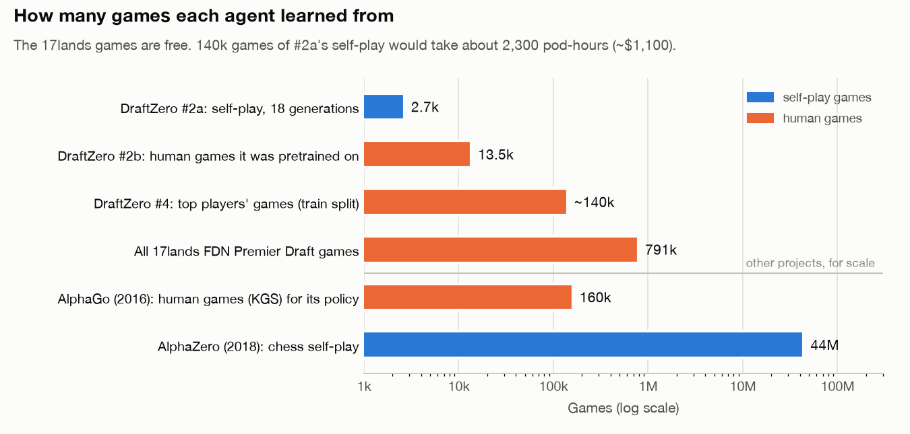

# Experiment #4: Scaling up imitation learning

*September–October 2026. The plan, and the results as the stages run (§8). It follows experiment
#3 ([docs/016](016-search-benchmark-results.md)) and builds on its §9, "A potential plan for
bootstrapping limited agents with imitation learning".*

## The question

Experiment #3 found that a network trained to imitate human decisions agreed with top players as
well as the best search we can afford, with no search at all and for about a thousandth of the
compute. That network learned from 1.7% of the 17lands games we have, and from only some kinds of
decision.

This experiment asks how far supervised learning from top players' games goes:

- **the policy by imitation learning**, on as many of the top players' decisions as we can
  rebuild, including timing: the second main phase, the end of turn, and answers to a spell on the
  stack;
- **the value by behaviour cloning**, learned from the same games' results, benchmarked against
  the hand-written heuristic it would replace (§4);
- **every evaluation mixes the two halves:** the imitation policy or the default policy as the
  search's prior, and the cloned value or the heuristic at its leaves;
- the deciding test is play: the imitation-plus-cloned-value bot against the heuristic bot, at a
  search budget of 3,000;
- then two ways to keep training from that start without losing the human policy.

Every search uses IS-MCTS. It runs on RunPod over a few days. The initial budget was $30–40, and
it can grow as needed (§6).

## Short answers

| Question | Answer | Details |
|---|---|---|
| Which data? | **Top players only:** the 60%-and-up win-rate bucket, 21% of the file, about 166k games. 90% of them, about 140k games, train; that's 10× #2b's. The rest of the file is a reserve, most useful for the value head. | §2.1 |
| All decisions? | **Most of them:** the plays at turn start and later in the turn, attacks, blocks, spell targets where the outcome settles them, and the timing decisions: second main phase, end of turn, and answers to the stack. About 7M decisions, 50× #2b's. 17lands pins timing to the turn, not the step, so timing labels come in two grades. | §2.2 |
| Can a fair search (IS-MCTS or PIMC) use an imitated policy *and* value? | **The policy, yes.** **The value, only indirectly.** Humans don't report values, only results. We can learn *the value of human play* from game results. | §3 |
| Can behaviour cloning bootstrap a value head better than the heuristic? | **Better at predicting results, not yet better in search.** In a laptop pilot on 16,067 held-out human positions, #2b's head predicts who wins with AUC 0.701, against 0.661 for the heuristic (paired +0.041, 95% CI +0.028 to +0.055). Inside the search, and in play, it was no better. | §4 |
| Are multiple epochs viable? | **Yes.** Plan for several, with checkpoints, and stop when validation plateaus. Stop the value head separately, because it overfits first. | §5 |
| Which GPU? | **Measure first.** Experiment #3's network searches kept the RTX 3090 96–99% busy, but at only about a tenth of its peak arithmetic. A faster inference server may matter as much as the card. The L40S is the main alternative. | §6.7 |

## 1. Why imitation, at our compute budget

<picture>
  <source media="(prefers-color-scheme: dark)" srcset="img/017-games-dark.png">
  
</picture>

*How many games each agent learned from. Self-play games cost us compute; the 17lands games are
free.*

- **Self-play needs far more games than we can play.**
  - Experiment #2a played 2,673 games over 18 generations in 43.6 pod-hours
    ([docs/014](014-exp2-run1-report.md)). Its network then scored positions no better than the
    hand-written heuristic ([docs/016](016-search-benchmark-results.md) §4.3).
  - AlphaZero's chess run played 44 million games.
  - At #2a's rate, the ~140k top players' games we'll train on would take about 2,300 pod-hours of
    self-play, or ~$1,100. And those games would be played by a far weaker agent than the people
    in the 17lands file.
- **Search is expensive and short-sighted.**
  - The best fair searches in experiment #3 reach 0.636 on the balanced score (IS-MCTS, 10,000
    simulations, 14.8 pod-seconds per decision) and 0.631 (PIMC with 1 world, 6.5 pod-seconds).
  - Even at 3,000 simulations they look less than one turn ahead. They act far more often than top
    players, because they can't see the value of waiting (docs/016 §8).
- **A little imitation already matches the best search.**
  - Experiment #2b's network was trained for 40 minutes on one RTX 3090 (~$0.33), on 13,533 games.
  - Its policy alone scores **0.646**, for 0.014 pod-seconds per decision. That's about a
    thousandth of IS-MCTS's compute, and a five-hundredth of PIMC's (docs/016 §7).
  - It has the habit the searches lack: knowing when to do nothing.
- **The data is there, and it maps onto the engine.** The 17lands mapping exercise
  ([docs/008](008-gameplay-data.md)) found:
  - 791,159 FDN Premier Draft games, licensed CC BY 4.0;
  - every card, ability, cast and land play maps to XMage and MageZero;
  - every visible card is pinned down in 88.7% of turn-start states;
  - 88% of whole turns replay in XMage to the same next state.
- **How the human knowledge reaches the agent matters** ([docs/013](013-exp2-imitation-report.md),
  docs/016 §7).
  - #2b warm-started self-play with the policy priors off, so the search never read the human
    policy.
  - Heavy pretraining (17 passes over the data) cost the network its ability to keep learning.
    Self-play then overwrote the human policy in one epoch.
  - Experiment #3 tried the human policy as the search's prior. The search kept the policy's
    quality at every budget, but didn't improve on it. What search can add is limited by the value
    at the leaves, and #2b's value head, trained on human results, was no better than #2a's.
- **The closest precedent is AlphaGo, not AlphaZero.** AlphaGo learned its policy from 160k human
  games before any self-play. At our budget we're in that regime.

So experiment #4 scales up the two things #2b had too little of: data, and the parts of the
network that the search reads.

## 2. The data: top players' games, as many decisions as we can rebuild

### 2.1 Which games

- **Top players:** `user_game_win_rate_bucket` of 0.60 or more. In a 1-in-20 sample of the file
  (39,558 games), that's 21.0%, which scales to about 166k games and 1.43M turn-start decisions.
- **More, in a pinch:** the other 79% of the file (players under 60%). Their play may be weaker, so
  they'd feed the value head before the policy, since a result means the same whoever played.
- **Selection on the result:** the bucket is computed over games that include the game itself
  (docs/008 §3.5). So it favours wins, most for players with few games.

  | Players in the top bucket | Share of its games | Their win rate in those games |
  |---|---|---|
  | 100+ games in the file | 55% | 63.9% |
  | 50–99 games | 25% | 62.6% |
  | fewer than 50 games | 20% | 68.2% |
  | *whole file, for reference* | | *54.7%* |

  The policy doesn't care much. The value head learns from these results, so it gets checked by
  group (its calibration on each row). If the under-50 group skews the head, drop that group from
  the value loss.
- **The split:** 90 / 5 / 5 by a salted hash of the draft, as #2b's tables did. Drafts linked by a
  mirrored game (13.7% of rows are one game recorded by both players) share a split.
  - About 140k training games, 10× #2b's 13,533.
  - Validation and test have about 7.7k games each, about 65k turn-start decisions each.
- **Held out from everything:** every draft of experiment #3's benchmark games (sb-v1) and of
  their mirrored partners: 842 drafts, 6,139 rows (docs/016 §9.1). Holding out whole components
  instead would drop 76k rows, because mirrored games chain drafts into components of up to ~10k
  rows. The new benchmark (§6.5) comes from the new test split.
- **Measured** (`tools/imitation_scale/build.py splits`): 709,859 train, 39,841 validation and
  35,320 test rows in the whole file. The top-player filter applies at build time.

### 2.2 Which decisions

| Decision | Network head | Label | Per game | Training set | Status |
|---|---|---|---|---|---|
| First main-phase priority of the player's turn | player priority | the set of the turn's plays (17lands has no order) | 8.6 | 1.2M | built; #2b trained on 115k |
| Later priority decisions in the player's main phases (turn replay) | player priority | each play, in an imputed order; the Pass once the plays are done is exact | 19 | 2.7M | built for 1.25 turns a game; never trained on |
| **Timing, in the player's own turn:** the second main phase, combat and the end step, with an instant or ability available | player priority | Pass or a play. Holding to the next turn is exact; main phase 1 against 2 is imputed unless the outcome settles it | to measure | to measure | **new:** the replay records these stops only when it plays something there |
| **Timing, in the opponent's turn:** instants, flash and abilities, including answers to a spell on the stack | player priority | the turn of each play is exact; the step is imputed, except a counterspell (it must answer a spell) and a trick (combat deaths show it) | to measure | to measure | **new:** needs the opponent's turn replayed |
| "Attack with X?" (turn replay) | binary | exact | 8.8 | 1.2M | built for 1.25 turns a game; #2b trained on 17k |
| "Which attacker does X block?" | target | the recorded pairing, unique in about 88% | up to 8 | up to 1M | **new:** the same opponent's-turn replay |
| Spell targets (turn replay) | target | exact when what died settles it, about half | 3 | ~0.2M exact | built; never trained on |
| The opponent's plays, from the player's seat | opponent priority | the set of the opponent's recorded plays | 8.6 | 1.2M | **not in the first run:** the search uses the baseline prior at the opponent's nodes (§3.2) |
| Modes, X values | – | rarely recoverable | | | left out |
| Mulligans | – | exact | ~1 | | left out: mulligans are off in MageZero's games |
| Value | value | the game's result (§4) | every row | ~140k independent results | built for turn starts |

- **Where the rates come from.**
  - Turn starts and replay yields are from #2b's build: 8.56 turn starts a game; 87.8% of 20,596
    replayed turns reproduced, yielding 2.56 priority and 1.17 attack decisions each.
  - Blocks are from a 1-in-40 sample of the file (19,779 games). "Up to 8" counts the player's
    creatures in play when the opponent attacked. Humans blocked with 1.6 of them a game, which
    fits the 20% block rate in docs/016.
  - The top players' games have 8.6 turn starts a game too (1-in-20 sample).
- **#2b replayed only 1.25 turns a game.** That is why docs/016 §9.1 counted about 1.3 attacks a
  game. Replaying every turn gives about 7× more.
- **Timing is where good players differ.** Top players hold a spell to the last useful moment
  (docs/016 §8.2), and the searches don't. So timing gets its own rows in training and its own
  items in the benchmark (§6.5). Two grades of label:
  - **Exact:** whether a play happened this turn or a later one. 17lands records each play's turn,
    so "held it through my end step and cast it in the opponent's turn" is exact. So is "cast
    nothing all turn".
  - **Imputed:** which step within the turn. The replay tries main phase 1 or 2, and an instant's
    window is read off the card: a counterspell in response, a trick after blocks, removal after
    attackers, the rest at the end step. When more than one window reproduces the turn, the first
    one tried wins.
  - Train on both, with imputed rows at lower weight, and build the timing items of the benchmark
    from exact labels only.
  - **Keep both sides of each timing question.** In the opponent's turn, a Pass is exact only when
    the player cast nothing that turn; when they did cast something, the stop is imputed. Training
    on the exact passes alone would teach the policy never to act in the opponent's turn. So these
    rows come from replaying the opponent's turn, which labels the casts too, not from the passes
    alone.
- **The replay needs two changes for timing.**
  - Today it records the player's priority decisions in its main phases, and at other stops only
    when it plays something there. It should record every stop with a real choice. A Pass there is
    exact when nothing of the player's is left for the turn.
  - It should also replay the opponent's turns: the opponent's recorded plays, the player's
    recorded instants in their windows, and the player's blocks. That's the same code with the
    seats swapped.
- **The later priority decisions teach when to stop.** Only 5% of turn-start labels are Pass, so a
  model trained on them alone learns to always act. docs/008 found that mixing in replayed rows
  raised accuracy on the exact "stop acting" decisions from 48% to 77%. That's experiment #3's
  hold problem: #2b's policy matched only 34% of holds.
- **In all:** about 6.5M decisions before the new timing rows, 50× #2b's 132,603.
- **Measured on a 20-game smoke build** (stage 0; a small sample):
  - **per game:** 9.1 turn starts, 38 later priority decisions, 10.6 attacks, 1 exact spell target
    and 3 blocks;
  - **in all:** about 62 table rows a game, so about 9M for the training split;
  - **reproduced turns:** 85%;
  - **timing:** about 270 exact Pass decisions at combat stops, the second main phase and the end
    step, including instants and flash creatures held through the player's own turn. About 150
    decisions had a spell or ability on the stack;
  - **blocks:** the first block question of each attack only (73% get an exact label). Later
    blockers of the same combat need a multi-decision capture.
- **Not in the first build:** the player's plays in the opponent's turn (instants, flash, answers to
  the opponent's spells). They need the opponent's turn replayed, the stage 0 item still open.

## 3. What a fair search can take from human games

### 3.1 What the search reads

The search code (`BenchSearch`) encodes every position it evaluates from the **searching player's
seat, with the opponent's hand hidden.** That holds for PIMC and IS-MCTS alike. The hidden cards
the search samples shape its tree, but never enter the network. A 17lands row records exactly that
view: the player's own hand, and the opponent's as a count.

| Head | Read by the search at | Human labels | Trained in #2b? |
|---|---|---|---|
| player priority | the searcher's priority decisions | the player's plays | yes, turn starts only |
| opponent priority | the opponent's priority decisions | the opponent's recorded plays | **no.** In experiment #3's human-prior search, the opponent's priors came from an untrained head. The first run uses uniform priors there |
| binary | yes/no questions, mostly attacks, for both players | attacks, exact | yes, 17k attacks |
| target | blocks and spell targets, for both players | blocks; targets that what died settles | **no.** That's why #2b's blocks were at chance in experiment #3 |
| value | every new leaf | game results | yes, turn starts only |

### 3.2 The policy: yes, for both players

- **The player's heads** are behaviour cloning, as in #2b, extended to every row of §2.2.
- **The opponent's head** would predict what the opponent will do, given what the searcher can see.
  A fair search needs exactly that at the opponent's nodes, and 17lands records the opponent's
  plays from the player's seat. **It isn't in the first run.** The search uses the baseline,
  uniform priors, at the opponent's nodes, instead of the untrained head experiment #3's human-prior
  search read there.
  - The opponent's hand is hidden, so their legal options aren't known. Train the head over the
    whole action vocabulary ("which card will they play?"). The search already renormalises the
    prior over the options legal in each sampled world.
  - It suits IS-MCTS: the opponent's nodes are shared across sampled worlds, and the head's input
    doesn't depend on the world.

### 3.3 The value: learned from results, not imitated

Humans don't output values; the data gives one result per game. Fitting results to positions
learns **the value of human play:** the chance of winning from what the player can see, if both
sides then play like the people in the file.

- For a search whose prior is the human policy, that's a sensible value to want.
- It's a hidden-information value by construction. It averages over the opponent hands that
  actually occurred, so it can't leak the opponent's real hand.

§4 covers how to train it, and how to tell whether it beats the hand-written heuristic.

### 3.4 IS-MCTS for every search

- **Decided: every search in experiment #4 uses IS-MCTS,** in the benchmark and in games. Both
  IS-MCTS and PIMC read the network the same way, so one network serves either.
- **What it costs:** in experiment #3, IS-MCTS cost 1.2–1.25× PIMC with 1 world with the network,
  and 2.8–3.3× offline, because it replays its path in a freshly dealt world every simulation
  (docs/016 §1.4). At 3,000 simulations that's 5.3 pod-seconds a decision with the network and 3.6
  offline.
- **What it bought there:** with the network it agreed with top players no better than PIMC with 1
  world (−4.8 points at 1,000 simulations, −2.5 at 3,000). Offline it tied PIMC, and it was the
  best search at 10,000 simulations. Agreement can't test its main advantage: one tree across
  sampled worlds, with no strategy fusion, so it can value bluffs and playing around tricks.
- **Where its worlds come from:**
  - in the benchmark, the item's 8 belief worlds, as in experiment #3;
  - in games, every simulation re-deals the opponent's hand and both libraries from the cards the
    searcher hasn't seen. Experiment #3's IS-MCTS already does that. A live game has no belief
    sample, so the unseen cards come from the opponent's real decklist. That leaks the list (not
    the hand or the order) to both bots equally; a belief-model deck per game would close it
    (§7).

## 4. Bootstrapping the value head by behaviour cloning

Behaviour cloning gives a policy directly. For the value head, the nearest equivalent is learning
from the human games' results which positions win. The question is whether such a head can replace
the hand-written heuristic as the search's evaluator, and how to tell.

**The heuristic** is offline MageZero's `GameStateEvaluator3`: a hand-tuned score of life, cards
and board, from the player's seat. Experiment #3's offline searches used it at every leaf.

### 4.1 What we already know: a better predictor, not a better evaluator

<picture>
  <source media="(prefers-color-scheme: dark)" srcset="img/017-value-pilot-dark.png">
  
</picture>

*Left: a laptop pilot for this doc. Each of #2b's 16,067 clean held-out turn starts (1,882 games)
was rebuilt in XMage and scored by the heuristic. 99.7% of the rebuilt positions encode exactly as
in #2b's table, so all three evaluators see the same states. Right: experiment #3's search
(docs/016 §7).*

Three evaluators, measured three ways:

| | Heuristic | #2a gen 18 (self-play) | #2b (behaviour cloning) |
|---|---|---|---|
| **Offline:** AUC predicting held-out human results | 0.661 (0.644–0.677) | 0.654 (0.636–0.673) | **0.701** (0.687–0.714) |
| Log-loss, each calibrated by a logistic fit | 0.649 | 0.654 | **0.621** |
| AUC at turns 1–2, mostly the deck and who's on the play | 0.562 | 0.542 | 0.562 |
| AUC at turns 7–9 | 0.726 | 0.727 | **0.796** |
| AUC of the change since turns 1–2, at turns 5+ (the deck and the play order cancel) | 0.713 | 0.712 | **0.764** |
| **In search:** experiment #3's balanced score, PIMC with 1 world, 1,000 simulations, priors off | 0.597 | 0.604 | 0.599 |
| **In play:** against raw search with the heuristic, budget 300, about 200 games | (the baseline) | 49.7% at gen 16 (docs/014) | 47.2% at gen 0 (docs/013) |

- **Offline, the behaviour-cloned head is clearly better.** It beats the heuristic by +0.041 AUC
  (paired over games, 95% CI +0.028 to +0.055). The self-play head is level with the heuristic
  (−0.007, CI −0.018 to +0.006).
- **Its edge isn't knowing which decks win.** At turns 1–2, where a position is mostly the deck,
  all three are at 0.54–0.56. The edge grows with the turn. It also holds for the change in value
  since the first turns, where the deck cancels.
- **It isn't confined to the positions it trained on.** On 5,443 replayed mid-turn positions it
  never saw in training, it still beats the self-play head (AUC 0.742 against 0.712). The heuristic
  wasn't scored there.
- **Yet inside the search, and in play, it's no better than the heuristic.** Predicting who wins is
  necessary for a leaf evaluator, but not enough.
- **Others found the same.**
  - In Diplomacy, Diplodocus found that search over a human-imitation policy and value gained
    nothing over plain search; the gain came only once RL had improved the value (Bakhtin et al.,
    2023, appendix H.2).
  - AlphaGo Zero's value net trained on human games predicted professional results worse than its
    self-play value net (MSE 0.207 against 0.177; Silver et al., 2017).

### 4.2 Why a better predictor needn't search better

- **Search compares siblings; AUC compares games.** The search ranks positions one action apart in
  the same game. AUC ranks positions from different games, where one side may be three cards and
  eight life ahead. Experiment #3's disagreements with humans were mostly near-ties, a median gap of
  0.043 in the search's own values (docs/016 §8.4). A head can order games well and still barely
  separate "attack" from "hold back".
- **Results teach that local difference only weakly.** Two siblings share their game's result. The
  network can learn their difference only from similar positions in other games that went
  differently. More games, and targets carrying more than one bit a game, address this directly.
- **Leaves fall where #2b's head never looked.** The search's leaves are mid-turn, in combat and in
  the opponent's turn. #2b's head never saw the opponent's turn. The heuristic and the self-play
  head have seen it.
- **Search noise.** At 1,000 simulations the methods in experiment #3 differed by 1–5 points, close
  to the benchmark's resolution. A modestly better evaluator could hide in that.

So the benchmark has to judge a value head inside the search and in play, not only by AUC (§4.4).
The training has to aim at local discrimination: more results, all position types, and denser
targets (§4.3).

### 4.3 Techniques

What the literature and the pilot suggest, and what goes into the experiment. A literature survey
for this doc checked each source against the paper itself.

| Technique | What it changes | Evidence | In the experiment |
|---|---|---|---|
| **Many more results** | 700k independent results, not 13.5k | AlphaGo's value net, trained on human games, memorised them: MSE 0.19 on training games, 0.37 on test. ALLIE's value, trained only on the results of 91M human chess games, lifted MCTS from a 2136 to a 2318–2528 rating | all arms; the learning curve measures it |
| **A few positions per game in each epoch** | stops the head memorising each game's result | AlphaGo kept one position per game; Maia sampled 1 in 32; AlphaGo Zero weighted the value loss 0.01 instead | all arms |
| **Every position type, both seats' turns** | trains on the positions the search asks about | docs/013, lesson 5. In Hearthstone, a winner predictor trained on random bots' games fell from 0.79 to 0.75 AUC on MCTS bots' games (Janusz et al., 2017) | all arms |
| **Cross-entropy on P(win), not MSE through tanh** | calibrated, without tanh's vanishing gradients. (1 + tanh x)/2 is a sigmoid, so the head itself is unchanged | for chess values, classification beat L2 regression, 61.8% against 58.9% move accuracy (Ruoss et al., 2024) | all arms |
| **Condition on skill** | separates the position from the players; set to the top rank when used in search | Maia-2, ALLIE and AlphaStar Unplugged condition on rating. 17lands' win-rate bucket includes the game's own result (docs/008 §3.5); the player's Arena rank (98.7% filled) doesn't | optional: the pool is top players already |
| **TD(λ) along each game** | lower-variance targets from the following snapshots | self-play's λ = 0.95. But Monte Carlo targets matched TD in Amiranashvili et al. (2018), and a TD value diverged in AlphaStar Unplugged | a sweep option (§6.3) |
| **Auxiliary targets:** final life difference, turns to the end, card advantage | more than one bit a game into the shared trunk | KataGo: dropping its score and ownership targets cost 1.65× the training (Wu, 2019) | a sweep option (§6.3) |
| **Rollout distillation** | fresh, independent results: roll the cloned policy forward from human positions | the best-documented route. piKL (appendix J) and Cicero's pre-RL value roll the human policy forward a few turns and train on the value after; AlphaGo's 30M-game set kept one position per game | later; stage 6's frozen-policy value training (§6.6) is the same idea on games the bot plays |
| **Mix with the heuristic at the leaf** | a second opinion, at no training cost | AlphaGo: value net alone 2177 Elo, rollouts alone 2416, the 50/50 mix 2890 | an extra leaf setting in the cheap evaluation, if the budget allows |
| **Expectile value (IQL)** | values the better-than-average continuation | IQL (Kostrikov et al., 2022); untested in games | no. With result-only targets it only rescales P(win); worth a try later with TD |
| **A privileged teacher from mirrored games** | in the 13.7% of games recorded from both seats, a value that sees both hands teaches the fair one | AlphaStar gave its value function the opponent's observations during training: 22% → 82% in its ablation | later |

Two card-game results bear on the choice. In Hearthstone, a winner predictor trained on bot games
replaced random rollouts inside MCTS. It lifted the weaker deck from 26.5% to 50.2% against plain
MCTS (Świechowski et al., 2018). In Legends of Code and Magic, a value cloned from bot games, with
one turn of search, lifted a bot from 26.8% to 51.4% against the champion (a 2026 preprint). Both
learned from bots, not people. We found no published work that trains a Magic value on human
games.

### 4.4 How the value head is judged

Every comparison pairs a cloned head with the heuristic, on the same positions or the same deals.

1. **Offline, on the test split** (free on the training pod). The pilot's measures: AUC,
   calibrated log-loss, AUC by turn, and the AUC of the change since turns 1–2. Run them on every
   kind of position, including the opponent's turn. The build records the heuristic's score for
   every decision (the bridge's `encode` has a `heuristic` option now), so it's in every
   comparison at no extra cost.
2. **Through the search, on 1,000 held-out decisions** (§6.5). After 300 and after 3,000
   simulations, how well the search's root value predicts who won the game, with each leaf
   evaluator and each prior. The search's agreement with the human's choice comes from the same
   runs.
3. **In play:** the imitation-plus-cloned-value bot against the heuristic bot at 3,000 simulations,
   200 games (§6.5).

## 5. Multiple epochs

- **Yes.** #2b made 17 passes over its 132,603 decisions (docs/013 §1.3):
  - the policy's validation loss (set NLL) was 0.574 after 1.7 passes, best at 0.548 after about
    4, and flat after that;
  - the value head was best after about 9 passes, then drifted worse.
- **Several epochs are affordable.** One epoch over about 7M decisions is 3.5× all the samples #2b
  saw (2.0M), about 2.3 hours on an RTX 3090 at #2b's speed. Plan for several, save checkpoints as
  it goes, and stop once validation has been flat for about an epoch.
- **Repetition is nearly free up to a point.** In language-model studies, up to about 4 epochs of
  repeated data are almost as good as new data, and returns fade after that (Muennighoff et al.,
  2023, *Scaling Data-Constrained Language Models*).
- **The value head overfits first.** Positions from one game share its result and most of its
  cards, and a draft's ~5.8 games share a deck. So the network can learn to recognise a game and
  recall its result. To guard against it:
  - keep the best value head separately from the best policy heads;
  - keep the value weight low (docs/008 §7.4);
  - use only a few positions per game for the value loss in each epoch.
- **Plasticity** ([docs/013](013-exp2-imitation-report.md) §2.3): long training made #2b's network
  hard to train further. That doesn't matter for using the network in search as it is. If it seeds
  self-play later, apply shrink and perturb and screen it with docs/013's test first.

## 6. The plan: about $45–55 on RunPod

### 6.1 Stages

| Stage | What | Where | Pod-hours | Cost |
|---|---|---|---|---|
| 0. Engineering | the pieces in §6.2, each tested on the laptop | laptop | – | – |
| 1. Build | the tables of §2.2 from the top players' games, with the heuristic's score recorded | CPU-heavy pod | 3 | $1.50 |
| 2. Hyperparameter sweep | about 13 short runs on a 10% subset; a plot and a report (§6.3) | GPU pod | 6 | $3–6 |
| 3. Large training | the chosen settings, all training games, several epochs, checkpoints throughout (§6.4) | GPU pod | 12 | $6–8 |
| 4. Cheap evaluation | 1,000 held-out decisions, IS-MCTS at 300 and 3,000 simulations, the four prior and leaf mixes (§6.5) | GPU pod | 6 | $3–6 |
| 5. Play | the heuristic bot against the imitation-plus-cloned-value bot, IS-MCTS at 3,000 simulations, 200 games (§6.5) | GPU pod, 24+ vCPU | 34 | $17 |
| 6. Two follow-up checkpoints | about 400 self-play games, IS-MCTS at 300 simulations, then two training settings (§6.6) | GPU pod | 9 | $4.50 |
| 7. Evaluate them | 40 games each at 3,000 against the heuristic bot, and the 1,000 decisions at 300 and 3,000 | GPU pod | 17 | $8.50 |
| **Total** | | | **~87** | **~$45–55** |

- **The low end assumes RTX 3090 rates ($0.50/hr);** the high end, an L40S for the training stages
  (§6.7).
- **IS-MCTS raised the estimate** from ~$32–40 with PIMC. Most of the increase is play, where the
  heuristic bot's IS-MCTS costs 2.8× PIMC's (§3.4).
- **The game stages are estimates.** A game is assumed to have about 140 searched decisions (from
  #2a's 61 games an hour at 300 simulations). At 3,000 simulations IS-MCTS costs 5.3 pod-seconds a
  decision with the network and 3.6 for the heuristic seat (docs/016 §4.1). That gives about 6
  games a pod-hour. Stage 0 measures it.
- **If a stage runs 50% over its estimate, stop and report** before going on.

### 6.2 Engineering before the first pod (stage 0)

1. **The table builder:**
   - top players' games only, and every turn replayed;
   - every stop where the player has a real choice;
   - the opponent's turns replayed, for blocks and the player's instants;
   - labels graded exact or imputed;
   - the heuristic's score recorded (done: `encode` takes a `heuristic` option).
2. **The trainer:**
   - the player priority, binary and target heads, and the value with cross-entropy;
   - the best policy and the best value kept separately;
   - checkpoints throughout, and resumable;
   - options for the sweep: layers, width, transformer or MLP, learning rate, value targets.
3. **The search (`BenchSearch`):**
   - the four mixes (the imitation policy or uniform priors, the cloned value or the heuristic at
     the leaves);
   - uniform priors at the opponent's nodes;
   - the root value in its output.
4. **The 1,000 held-out decisions (sb-v2),** from the new test split, with timing items built
   from end-of-turn snapshots (§6.5). Timing in the middle of a turn (the second main phase, the
   stack) would need a mid-turn search root, which experiment #3's pipeline couldn't build
   (docs/016 §1.1). It needs a converter from the engine's state back to a spec, a later addition.
5. **A game player:**
   - full games with the same search (IS-MCTS) at every decision, re-dealing hidden cards every
     simulation (§3.4);
   - deck pairs from the eval pool, seats swapped;
   - it also writes the self-play training data for stage 6.
6. **A GPU check:** evaluations a second and training samples a second, per GPU type, and a quick
   attempt at a faster inference server (§6.7).

### 6.3 Hyperparameter sweep (stage 2)

- **What varies,** one setting at a time around the current default (2 layers, width 512, learning
  rate 3e-4):
  - layers 1 or 4;
  - width 256 or 768;
  - transformer against MLP (MageZero's own `Net`);
  - learning rate 1e-4 or 1e-3;
  - the value target: the result alone, or with TD(λ) and auxiliary targets (§4.3).

  That's about 11 runs, plus the default with a second seed to measure the noise.
- **Each run** uses the same 10% of the training games, the same time budget (about 25 minutes)
  and the same validation rows.
- **Measures:**
  - the policy's non-Pass top-1 and set NLL, by decision type, timing included;
  - the value's log-loss and AUC;
  - inference speed, since the search pays for every evaluation.
- **Report:** a plot of each measure by setting, with the two default seeds as the noise band.
- **The rule: keep the default** unless a setting beats it by more than twice the seed-to-seed
  difference, is no worse on the other head, and slows inference by less than 25%.

### 6.4 Large training (stage 3)

- The chosen settings, all training games, several epochs.
- Every ~30 minutes: a checkpoint, and the validation measures. Keep the best policy and the best
  value states.
- Stop once validation has been flat for about an epoch.
- **Report:** learning curves, and the test-split measures of §4.4, tier 1.

### 6.5 Evaluation (stages 4 and 5)

**Always a mix of approaches:**

| | Heuristic at the leaves | Cloned value at the leaves |
|---|---|---|
| **Default (uniform) prior** | the heuristic bot: experiment #3's offline search | the value alone |
| **Imitation prior** | the policy alone, guiding the search | **the imitation-plus-cloned-value bot** |

The policy alone and the value head alone, with no search, are references.

**Cheap: 1,000 held-out decisions (sb-v2).**
- From the top players' test games, as experiment #3's sb-v1: 300 spells, 125 holds, 225 attacks
  and 150 blocks.
- Plus 200 timing items, with exact labels only:
  - 100 `endstep`: the player's own end step, holding an instant, flash card or ability;
  - 100 `oppwindow`: the player's first window in the opponent's turn, in a turn in which they cast
    nothing.

  Both are labelled Pass, and both feed the cast-or-pass question of the balanced score.
- The second main phase and answers to the stack are scored on the policy alone, on the replayed
  test-split rows, until mid-turn search roots exist (§6.2).
- IS-MCTS at 300 and 3,000 simulations, with each item's 8 belief worlds, for each of the four
  mixes. Two scores from each run:
  - **does the policy predict human moves:** the balanced score and agreement by type, timing
    included;
  - **does the value predict results:** the AUC of the search's root value against the game's
    result.

**Sizable: play.**
- The heuristic bot against the imitation-plus-cloned-value bot, IS-MCTS at 3,000
  simulations, both seats.
- 200 games: 100 deck pairs from the eval pool, each played with seats swapped. That gives a 95% CI
  of about ±7 points.

### 6.6 Two follow-up checkpoints (stages 6 and 7)

**Assumed, to confirm:** both continue training from stage 3's network, on games the
imitation-plus-cloned-value bot plays against itself. This is the first step of self-play.

1. **The policy frozen, the value learned** from those games' results. AlphaGo took its value from
   games its own policy played (§4.3), and freezing the policy can't lose the human policy.
2. **The policy and the value both trained, with a KL penalty** toward stage 3's policy (piKL,
   AlphaStar). This guards against #2b's failure, where self-play overwrote the human policy in one
   epoch (docs/013).

- **Data:** about 400 games at 300 simulations, shared by both. At 3,000 they would cost about ten
  times as much.
- **Evaluation:**
  - 40 games each at 3,000 simulations against the heuristic bot. That's ±15 points, so it catches
    only large changes;
  - sb-v2 at 300 and 3,000, the finer signal.

### 6.7 Compute: GPU and storage

- **What's GPU-bound:** training, network search and network games.
- **What's CPU-bound:** the build, the heuristic bot, and the engine side of every game.
- **Experiment #3's network searches kept the RTX 3090 96–99% busy** at 550–700 evaluations a
  second (docs/016 §1.4). At about 9 GFLOP an evaluation (2 layers, width 512, about 760 tokens),
  that's roughly a tenth of its fp16 peak. So the limit is how the server batches, as much as the
  card. Stage 0 measures before choosing:
  - evaluations a second and training samples a second on an RTX 3090 and an L40S, 15 minutes each;
  - a batched fp16 inference server.
- **Quotes on 2026-09-30,** one GPU, stock low everywhere:

  | Pod | $/hr | vCPU | RAM |
  |---|---|---|---|
  | L40S, Secure | 1.09 | 32 | 125 GB |
  | L40S, Community | 0.79 | 24 | 251 GB |
  | RTX 5090, Community | 0.69 | 32 | 107 GB |
  | RTX A6000, Secure | 0.53 | 16 | 62 GB |
  | RTX 3090, Secure | not in stock (it was $0.50 with 32 vCPU in experiments #2–3) | | |

  Community pods may have no public IP for SSH (docs/005).
- **Choose by dollars per evaluation, from the check.** The L40S pays only if it's at least 2.2×
  the 3090's throughput. Take 24+ vCPUs for the game stages, and the cheapest high-vCPU pod for
  the build.
- **Storage:**
  - tables of about 15 GB (2.1 KB a decision × ~7M);
  - build intermediates up to ~40 GB;
  - checkpoints of about 175 MB each with optimizer state, so keep weights only for most of them;
  - a few GB of self-play data.

  Request about 150 GB. A network volume (Secure Cloud only) keeps the data between pods;
  otherwise, a container disk of 100 GB or more. The default 40 GB filled up in docs/013. Load the
  tables into RAM for training: the pods have 100+ GB.

### 6.8 Running it

- Each stage writes its results into §8 as it finishes: numbers, plots, pod-hours and dollars, and
  each pod's quote and what it actually got.
- Every pod gets a self-destruct when created (docs/005). Spend is tracked against the $40 cap.

## 7. Decisions from review, and what's still open

**Decided:**
1. **Data:** top players only. Players under 60% are a reserve, first for the value head.
2. **The deciding test:** 200 games at 3,000 simulations against the heuristic bot, then 40-game
   screens for the follow-up checkpoints.
3. **No opponent head in the first run:** uniform priors at the opponent's nodes.
4. **Rollout distillation waits.** Stage 6's frozen-policy value training is the same idea, on games
   the bot plays.
5. **IS-MCTS for every search** (§3.4); the budget can grow to cover it (§6.1).
6. **The game player** is new, built on experiment #3's IS-MCTS. MageZero's own evaluator has no
   IS-MCTS: its search sees the hidden cards, and it walks its whole tree every simulation, which
   is slow at 3,000.

**Open:**
1. **Stage 6's training data.** Assumed: self-play games of the imitation-plus-cloned-value
   bot, at 300 simulations (§6.6).
2. **The opponent's decklist in games.** IS-MCTS re-deals hidden cards from the opponent's real
   decklist, so both bots know the list, though not the hand or the order (§3.4). The fix is a
   belief-model deck per game. Is the leak acceptable for the first games?
3. **The 40-game screens resolve only ±15 points.** One alternative is 80 games for whichever
   checkpoint does better on sb-v2.

## 8. Results

*Filled in as the stages run. Spend so far: $0 (initial budget $30–40, which can grow, §6.1).*

| Stage | Status | Pod-hours | Cost | Result |
|---|---|---|---|---|
| 0. Engineering | in progress (§8.1) | – | – | |
| 1. Build | not started | | | |
| 2. Hyperparameter sweep | not started | | | |
| 3. Large training | not started | | | |
| 4. Cheap evaluation | not started | | | |
| 5. Play | not started | | | |
| 6. Follow-up checkpoints | not started | | | |
| 7. Their evaluation | not started | | | |

### 8.1 Stage 0: engineering

*The stage 0 code is on the `exp4-imitation` branch until stage 0 is done. On `main` so far: this
doc, its figures, the value pilot (`tools/imitation_scale/value_pilot.py`) and the bridge options
it uses.*

- **The table builder** (`tools/imitation_scale/build.py`; `splits`, `build`, `tables`) works on a
  20-game smoke build. It covers top players only, every turn replayed, every stop with a real
  choice, blocks, and spell targets settled by the outcome.
  - Rows come with exact or imputed labels: a training weight of 1 for exact, 0.5 for imputed.
  - Every row carries the heuristic's score.
  - Shards are gzipped: about 20 GB for the full build, plus about 24 GB of tables.
  - Speed: about 1.1 worker-seconds a game, so about 1.6 hours on a 28-worker pod.
- **Bridge changes:**
  - the replay records every stop with a real choice (`allStops`);
  - replay and `encode` decisions carry the heuristic's score (`heuristic`);
  - `encode` can return the built state's dump (`dump`), which labels blocks.

  The replay, bridge and imitation tests pass (83). The bridge now builds only against the v0.2
  engine; that dates from experiment #3's search code, not this change.
- **Under way:** the search's prior and leaf mixes; the trainer.
- **The new benchmark set (sb-v2)** is under way: `tools/search_bench/items.py build --version
  sb-v2`, from experiment #4's test split.
  - It has two timing types: the player's own end step holding an instant, flash card or ability
    (`endstep`), and the opponent's first window in a turn in which the player cast nothing
    (`oppwindow`). Both have exact Pass labels and are built from end-of-turn snapshots.
  - In 40 test games they gave 63 and 15 candidate items, each with its 8 belief worlds for
    IS-MCTS.
  - The second main phase and stack decisions are scored on the policy alone at first. A search
    root in the middle of a turn needs a converter from the engine's state back to a spec.
- **Next:**
  - the opponent's-turn replay;
  - the game player, on IS-MCTS (§3.4).

## Later ideas (not in this experiment)

- **The opponent head** (§3.2), in place of uniform priors at the opponent's nodes.
- **Rollout distillation** (§4.3), if stage 6's value training helps.
- **A one-move-deep test** of each value head on the benchmark decisions: score the position after
  every option and pick the best (Ruoss et al., 2024). It isolates the sibling comparison that
  search depends on (§4.2).
- **Everyone's games for the value head,** if its learning curve is still rising at 140k games.
- **Self-play from this start,** with the human anchors of docs/016 §9 step 3: a KL penalty toward
  the frozen human policy, and human decisions mixed into every batch.
- **A larger network.** 700k games may support one, but it would slow every search evaluation.
- **Relabelling human positions with search** (Reanalyse), once the value is good enough to trust.
  AlphaStar Unplugged found that training on search targets offline collapsed its policy; it
  searched only at inference.
- **Short rollouts at the leaf:** play the cloned policy to the end of the turn, then apply the
  value head, as SearchBot did in Diplomacy and the Hearthstone bot did. It costs more per
  simulation.
- **An expectile (IQL) value with TD targets,** and **a privileged teacher** from the mirrored
  games (§4.3).
- **Other sets:** 17lands publishes replay data for 27 more sets (docs/008).

## References

- Amiranashvili et al. (2018), *TD or not TD: Analyzing the Role of Temporal Differencing in Deep
  Reinforcement Learning*, [arXiv 1806.01175](https://arxiv.org/abs/1806.01175).
- Bakhtin et al. (2023), *Mastering the Game of No-Press Diplomacy via Human-Regularized
  Reinforcement Learning and Planning* (Diplodocus), [arXiv 2210.05492](https://arxiv.org/abs/2210.05492).
- Gray et al. (2021), *Human-Level Performance in No-Press Diplomacy via Equilibrium Search*
  (SearchBot), [arXiv 2010.02923](https://arxiv.org/abs/2010.02923).
- Jacob et al. (2022), *Modeling Strong and Human-Like Gameplay with KL-Regularized Search* (piKL),
  [arXiv 2112.07544](https://arxiv.org/abs/2112.07544).
- Janusz, Tajmajer and Świechowski (2017), *Helping AI to Play Hearthstone: AAIA'17 Data Mining
  Challenge*, [arXiv 1708.00730](https://arxiv.org/abs/1708.00730).
- Kostrikov, Nair and Levine (2022), *Offline Reinforcement Learning with Implicit Q-Learning*,
  [arXiv 2110.06169](https://arxiv.org/abs/2110.06169).
- Mathieu et al. (2023), *AlphaStar Unplugged: Large-Scale Offline Reinforcement Learning*,
  [arXiv 2308.03526](https://arxiv.org/abs/2308.03526).
- McIlroy-Young et al. (2020), *Aligning Superhuman AI with Human Behavior: Chess as a Model System*
  (Maia), [arXiv 2006.01855](https://arxiv.org/abs/2006.01855).
- Meta FAIR Diplomacy Team (2022), *Human-level play in the game of Diplomacy by combining language
  models with strategic reasoning* (Cicero), *Science* 378:1067.
- Muennighoff et al. (2023), *Scaling Data-Constrained Language Models*,
  [arXiv 2305.16264](https://arxiv.org/abs/2305.16264).
- Rubin (2026), *Unsound Search with Policy and Value Networks in Legends of Code and Magic*,
  preprint, [arXiv 2609.06816](https://arxiv.org/abs/2609.06816).
- Ruoss et al. (2024), *Grandmaster-Level Chess Without Search*,
  [arXiv 2402.04494](https://arxiv.org/abs/2402.04494).
- Silver et al. (2016), *Mastering the game of Go with deep neural networks and tree search*
  (AlphaGo), *Nature* 529:484.
- Silver et al. (2017), *Mastering the game of Go without human knowledge* (AlphaGo Zero), *Nature*
  550:354.
- Świechowski, Tajmajer and Janusz (2018), *Improving Hearthstone AI by Combining MCTS and
  Supervised Learning Algorithms*, [arXiv 1808.04794](https://arxiv.org/abs/1808.04794).
- Tang et al. (2024), *Maia-2: A Unified Model for Human-AI Alignment in Chess*,
  [arXiv 2409.20553](https://arxiv.org/abs/2409.20553).
- Vinyals et al. (2019), *Grandmaster level in StarCraft II using multi-agent reinforcement
  learning* (AlphaStar), *Nature* 575:350.
- Wu (2019), *Accelerating Self-Play Learning in Go* (KataGo),
  [arXiv 1902.10565](https://arxiv.org/abs/1902.10565).
- Zhang et al. (2025), *Human-Aligned Chess With a Bit of Search* (ALLIE),
  [arXiv 2410.03893](https://arxiv.org/abs/2410.03893).

## Appendix: reproducing

- **The games figure:** `python tools/imitation_scale/fig_games.py`.
- **The per-game rates of §2.2** come from #2b's `build_stats.json` and tables (docs/011 §1). They
  also come from a 1-in-40 pass over the replay file with
  `draftzero.gameplay.replay.iter_games(every=40, start=3)`, counting each opponent turn with
  attackers and the player's creatures in play before it.
- **The value pilot (§4.1),** on the laptop with #2b's tables (`data/gameplay/imitation` in the
  `exp2-run2` worktree) and the v0.2 XMage bundle:

  ```bash
  export MZ_XMAGE_DIR=<v0.2 bundle>/xmage MZ_ACTION_VOCAB=$PWD/assets/vocab/FDN_SPG.tsv
  python tools/imitation_scale/value_pilot.py heuristic --tables <run2>/data/gameplay/imitation
  python tools/imitation_scale/value_pilot.py score --tables <run2>/data/gameplay/imitation \
    --net 2b=<HF 2026-09-27_03-42-21/models/FDN_exp2_imit/ver1/gen0.pt.gz> \
    --net 2a=<HF 2026-09-27_01-59-54/models/FDN_exp2/ver1/gen18.pt.gz>
  python tools/imitation_scale/value_pilot.py figure
  ```

  The heuristic stage takes under a minute with 3 workers. `score` also runs the mid-turn check:
  both networks on `replay_priority_test.h5`, restricted to the clean games.
