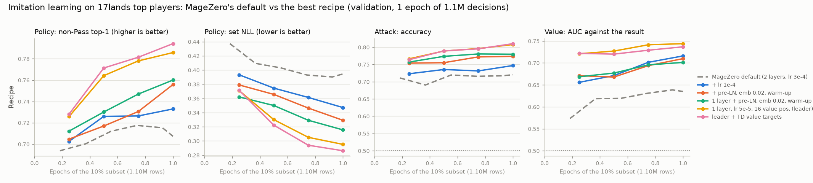

# Experiment #4: results

*October 2026. **Draft, in progress:** the results of experiment #4's stages 1–7, written as they
run; this snapshot is from 08:30 UTC on 2 October, during stage 2. The plan, its reasoning and the
decisions from review are in [docs/017](017-experiment4-scaling-up-imitation-learning.md); its §6.1
has the stage estimates this doc tracks against.*

## Preliminary results

<picture>
  <source media="(prefers-color-scheme: dark)" srcset="img/018-recipe-dark.png">
  
</picture>

*MageZero's default network against the steps to the best recipe so far, on the validation split (stage 2).*

- **The data is built.** 161,206 top players' games became 12.1M decisions (10.9M for training),
  about 80× #2b's 132,603. Every turn was replayed, including the opponent's turns, timing stops and
  blocks (Stage 1).
- **The sweep's first round: MageZero's default network trains unstably at its learning rate.**
  - **The symptoms:** at lr 3e-4, bigger networks (4 layers, width 768) learn no attack or value
    head in an epoch, while smaller ones (1 layer, width 256, an MLP) beat the default by 3–4×
    the noise bar.
  - **What fixes it:** lr 1e-4 helps every head; a smaller embedding init fixes the attack and
    value heads; pre-LN helps the policy.
  - **Round 2 combines the fixes,** and round 3 checks the best on 30% of the data before
    stage 3 (Stage 2).
- **Every network so far almost never acts in the opponent's turn.** Pass is its top choice 97.5–
  100% of the time, against 93.4% for the humans, though it ranks the right play first among the
  non-Pass options ~70% of the time when the human did act. It knows what to cast there but not
  when. **The fix works:** tripling the policy loss of the opponent's-turn rows where the human
  acted brings Pass-on-top down to 93.8% and improves the policy overall (set NLL −0.007, beyond
  the noise). It is the new leader (Stage 2).
- **The heuristic bot on the new benchmark (sb-v2):** IS-MCTS at 300 simulations scores 0.648
  balanced, and its root value predicts the game's result with AUC 0.724 (Stage 4).
- **Compute: the network search is CPU-bound, not GPU-bound,** at about 3.2 pod-seconds a decision
  on a 3090 against the plan's 1.7. A faster inference server didn't help; the host's CPU does.
  Community 3090s at $0.22/hr (Secure: $0.50) should keep the game stages near their planned
  dollars despite the extra pod-hours (GPU check).

## Status

*Spend so far: $17.70 of the ~$36–44 planned (RunPod balance $82.58 → $64.88 at 20:50 UTC on 2 October, with no pod running). Storage and rounding account for the ~$0.80 the rows below don't. Ask before total spend passes $65. The second machine costs the project nothing.*

| Stage | Status | Pod-hours | Cost | Notes |
|---|---|---|---|---|
| 0. Engineering | done on the laptop (docs/017 §8.1), plus fixes below | – | – | 384 tests pass; 3 added since |
| GPU check | done: the RTX 3090 | 1.5 (3 pods) | $1.30 | the L40 is no cheaper per evaluation; network search is CPU-bound |
| 1. Build | done: 161,206 games, 12.1M rows (10.9M train) | 3.6 | $1.82 | estimate 5 pod-hours, $2.50 |
| 2. Hyperparameter sweep | rounds 1 and 2 done on the RunPod 3090 (40 runs); round 2x and the 30% check continue on the second machine | 25.1 | $12.55 | ~24 pod-hours expected against 6: over by design. The second machine adds none |
| 3. Large training | next, on the second machine, after the 30% check | | | |
| 4. Cheap evaluation | heuristic bot at 300 done; at 3,000, half done | 4.6 | $1.01 | the pod's host rebooted; the rest runs with the network mixes |
| 5. Play | not started | | | |
| 6. Follow-up checkpoints | not started | | | |
| 7. Their evaluation | not started | | | |
| 8. Policy-only evaluation | built and tested on the laptop (the last step: Dan, 2026-10-02) | | | no search: the 17lands games-in-hand comparison, likely on RunPod pods |
| Failed pods | three Community pods that never started work | 1.0 | $0.22 | |

## Before the first pod

- **Laptop suite:** 384 passed, 1 skipped (2 min 39 s, `MZ_XMAGE_DIR` set to the v0.2 bundle).
- **A fix to the build (c7e94dc).** The `tables` step loaded the whole build into memory:
  measured on the 120-game smoke build, about 1.3 MB a game, so roughly 200 GB for the ~158k top
  players' games. And the build couldn't resume: a stopped pod would lose the whole 3–4 hours.
  - The build now writes shard parts of 5,000 games, each marked once it's closed. A re-run
    skips the games of finished parts.
  - `tables` converts one part at a time and merges each table's parts, shifting the CSR
    pointers. It resumes too.
  - **Checked:** on the smoke build, the new `tables` gives the same tables as the old one, from
    the old single shard and from the same games split into four parts. Two new unit tests.
- **Two more changes while stage 1 ran:**
  - `play.py --shard i/n` (7169ab1) splits a stage's games across pods by deck pair. The game
    stages are CPU-bound, so several $0.22 pods beat one bigger one. Each game also needs a long
    `--game-timeout`: at full load a network decision takes 70–165 s in its worker, so a game of
    ~140 decisions takes about 3 hours. The 2-hour default would kill games.
  - `analyze.py` (ce543ab) counts sb-v2's timing items (`endstep`, `oppwindow`) in the
    cast-or-pass part of the balanced score, as docs/017 §6.5 planned, and reports the AUC of the
    root value against the game's result. sb-v1's output is unchanged.

## GPU check (docs/017 §6.7)

**The pick: the RTX 3090.** Per dollar, the L40 matches it on the model and on training, and
the game stages are CPU-bound anyway.

| | RTX 3090, Secure, $0.50/hr | L40, Secure, $0.82/hr |
|---|---|---|
| Model forward, fp16, batch 1 / 8 / 32 / 128 (evals/s) | 362 / 1,007 / 1,260 / 1,273 | 360 / 1,788 / 1,836 / 1,799 |
| $ per million evaluations, batch 32 | **$0.11** | $0.12 |
| Training samples/s (#2b's network, smoke tables) | 808 | 1,305 |
| $ per million training samples | **$0.17** | $0.17 |
| cgroup cores / RAM | 31.1 / 116 GB | 27.2 / 250 GB |

- **The model:** #2b's network (2 layers, width 512), with state lengths sampled from the smoke
  build's turn-start table. Batches pad to their longest state, about 1,450–1,600 tokens.
- **Secure L40S was sold out at the time,** or offered with 16 vCPU. The L40 is the same Ada chip
  with lower tensor throughput.
- **Training is short and early:** 169 steps on the smoke tables, so the sweep's first runs will
  give better numbers.

**The network search is CPU-bound, not GPU-bound.** IS-MCTS at 1,000 simulations on 96 sb-v2
decisions, with the imitation prior and the network at the leaves (stage 4's and 5's network
bot), 32 workers and 4 replicas of MageZero's server, on the 3090:

| Measure | Value |
|---|---|
| Evaluations a second | 298 |
| Pod-seconds a decision | 3.19 (docs/017 §6.1 assumed 1.7) |
| GPU busy | 49% |
| Per simulation, in one worker | 55 ms engine, 40 ms waiting on the network |

- MageZero's server packs 4,096 doubles for every state and logs every request. Each replica
  kept one core at 100% and ran batches of one state, and 32 search JVMs took the rest of the
  CPU.
- At this rate the game stages (5–7) would cost about 1.9× their estimates.

**A faster server doesn't help; a faster CPU does.** `value_server.py --policy` (d6c289c)
returns MageZero's server's fields from the same forward pass, as float32 and without per-request
logging, with an optional linger to batch across requests. On the laptop its outputs equal
MageZero's server's exactly. The same search (160 sb-v2 decisions, IS-MCTS 1,000, imitation
prior, network leaf) on an L40S pod with each server setup:

| Servers | Workers | Evals/s | Pod-s a decision | Engine / network wait, ms a simulation | GPU busy | Cores busy (of 27.2) |
|---|---|---|---|---|---|---|
| MageZero's, 4 replicas | 32 | 464 | 2.03 | 29.5 / 26.5 | 52% | 24.1 |
| `--policy`, 4 replicas | 32 | 464 | 2.03 | 30.0 / 26.1 | 56% | 24.7 |
| `--policy`, 8 replicas | 32 | 457 | 2.06 | 31.6 / 25.4 | 60% | 25.0 |
| `--policy`, 2 replicas, 2 ms linger | 32 | 434 | 2.17 | 27.5 / 33.0 | 25% | 22.8 |
| `--policy`, 1 replica, 2 ms linger | 32 | 329 | 2.87 | 28.2 / 55.7 | 10% | 18.4 |
| `--policy`, 4 replicas | 48 | 423 | 2.23 | 47.2 / 44.5 | 42% | 25.4 |

- **The CPU is the limit.** With 4 replicas and 32 workers, the pod's cores are nearly all busy.
  More workers only slow the engine (48 workers: 47 ms a simulation, against 30).
- **One replica can't keep up:** about 330 requests a second (~3 ms of Python per request), with
  the GPU 10% busy. Several replicas share the GPU at batch sizes of about one. That's where the
  ~26 ms wait comes from. But with the CPU nearly full, a shorter wait would buy at most ~10%.
- **The host's CPU matters most.** The L40S pod's host is an AMD EPYC 9554 (Zen 4, up to
  3.76 GHz); the 3090 pod's is an EPYC 7H12 (Zen 2, up to 2.6 GHz). The engine takes 30 ms a
  simulation on the first and 55 ms on the second.
- **Per dollar, the 3090 still wins:** 3.19 pod-s a decision at $0.50/hr is $0.44 per thousand
  decisions, against $0.61 for the L40S (2.03 at $1.09). A 3090 on a faster host would be better
  still, so each game pod's CPU gets checked (`lscpu`) as soon as it's created.
- MageZero's own server stays: it's as fast, and it's what experiment #3 used.

## Stage 1: the build

**161,206 top players' games became 12.1M table rows: 10.9M for training, 0.60M for
validation and 0.53M for test.** That's 75 rows a game in the six tables the configs train on,
against about 84 in the smoke build (which counted both block tables).

| Table | Train | Validation | Test |
|---|---|---|---|
| `turnstart` (the turn's first main-phase priority) | 1,239,106 | 69,660 | 60,391 |
| `replay_priority` (the player's later stops in its own turn) | 5,573,723 | 307,237 | 269,685 |
| `opp_priority` (the player's stops in the opponent's turn) | 2,218,297 | 118,706 | 106,215 |
| `replay_attack` ("attack with X?") | 1,391,893 | 77,708 | 68,980 |
| `replay_target` (spell targets the outcome settles) | 209,905 | 11,625 | 10,319 |
| `opp_block` (every block question) | 314,690 | 17,619 | 15,816 |
| `block` (first block of each attack; overlaps `opp_block`, not trained on) | 351,265 | 19,636 | 17,106 |

- **The build:** 2.54 hours, 28 workers, 17.6 games a second, no errors. The first-hour
  estimate of 3.7 hours was for about 158k games at the smoke build's speed.
- **The tables:** 1.0 hour (33 parts at ~47 s each, then the merge), 18 GB of HDF5. The shards
  are 16 GB.
- **Against the smoke build's rates (docs/017 §2.2):** 8.5 turn starts a game (smoke: 9.1); 51
  replayed decisions in the player's own turns (smoke: 38 priority plus 10.6 attacks); 18
  decisions in the opponent's turns (smoke: 19); 2.4 first-block questions (smoke: 3).
  - Turns reproduced: 86.8% of the player's (1,194,268 of 1,375,521) and 83.5% of the
    opponent's (1,084,253 of 1,297,734). Smoke: 85% and 85%.
  - Turn starts: 99.5% usable. First-block questions: 64% labelled; the rest were mostly a
    different decision at the replayed stop (138k) or had no exact pairing (74k).
- **Held out:** 6,139 rows of sb-v1's drafts and their mirrored partners, as planned.

## Stage 2: the hyperparameter sweep

*Round 1 done (18 runs, 20:15 on 1 October to 09:50 on 2 October); round 2 running (below).*

**Every run trains one epoch of the same 10% subset** (1.10M rows; the same feature vocab and
validation rows) and is scored on the validation split: about 20,000 rows per table, whole games.
Round 1 changes one setting at a time around MageZero's default network (2 post-LN layers, width
512, embedding rows drawn N(0, 1), learning rate 3e-4, 300 warm-up steps).

<picture>
  <source media="(prefers-color-scheme: dark)" srcset="img/018-sweep-r1-dark.png">
  
</picture>

*Round 1's learning curves. The first runs were evaluated every 5 or 10 minutes, the later ones at
every quarter epoch, so the points don't all line up.*

**Round 1's leaderboard** (final, all 18 runs), sorted by the policy's set NLL (lower is better):

| # | Run | Setup | Non-Pass top-1 | Set NLL | Attack acc. | Block top-1 | Target top-1 | Value AUC | Value log-loss | Opp. turn: Pass on top | Inference evals/s (batch 32) |
|---|---|---|---|---|---|---|---|---|---|---|---|
| 1 | `layers-1` | transformer, 1 layer, width 512, post-LN, lr 0.0003, emb N(0,1), warm-up 300 | 0.760 | 0.323 | 0.764 | 0.691 | 0.546 | 0.717 | 0.635 | 97.5% | 2,194 |
| 2 | `width-256` | transformer, 2 layers, width 256, post-LN, lr 0.0003, emb N(0,1), warm-up 300 | 0.744 | 0.324 | 0.766 | 0.690 | 0.547 | 0.722 | 0.622 | 97.9% | 2,972 |
| 3 | `modern` | transformer, 2 layers, width 512, pre-LN, lr 0.0003, emb std 0.02, warm-up 3000 | 0.756 | 0.329 | 0.773 | 0.690 | 0.553 | 0.710 | 0.623 | 99.2% | 1,135 |
| 4 | `lr-1e-4` | transformer, 2 layers, width 512, post-LN, lr 0.0001, emb N(0,1), warm-up 300 | 0.733 | 0.347 | 0.747 | 0.684 | 0.534 | 0.716 | 0.620 | 99.9% | 1,391 |
| 5 | `layers-4-modern` | transformer, 4 layers, width 512, pre-LN, lr 0.0003, emb std 0.02, warm-up 3000 | 0.727 | 0.357 | 0.756 | 0.686 | 0.541 | 0.679 | 0.671 | 99.9% | 581 |
| 6 | `pre-ln` | transformer, 2 layers, width 512, pre-LN, lr 0.0003, emb N(0,1), warm-up 300 | 0.722 | 0.360 | 0.723 | 0.687 | 0.535 | 0.670 | 0.633 | 99.9% | 1,135 |
| 7 | `mlp` | MLP, 2 blocks, width 512, lr 0.0003, emb N(0,1), warm-up 300 | 0.742 | 0.365 | 0.759 | 0.686 | 0.540 | 0.724 | 0.654 | 99.9% | 32,986 |
| 8 | `value-weight-0.1` | transformer, 2 layers, width 512, post-LN, lr 0.0003, emb N(0,1), warm-up 300, value weight 0.1 | 0.726 | 0.375 | 0.726 | 0.686 | 0.524 | 0.565 | 0.665 | 99.9% | 1,386 |
| 9 | `value-td-aux` | transformer, 2 layers, width 512, post-LN, lr 0.0003, emb N(0,1), warm-up 300, TD value, +turns_left | 0.724 | 0.377 | 0.722 | 0.686 | 0.522 | 0.605 | 0.659 | 99.9% | 1,374 |
| 10 | `value-td` | transformer, 2 layers, width 512, post-LN, lr 0.0003, emb N(0,1), warm-up 300, TD value | 0.714 | 0.382 | 0.716 | 0.687 | 0.539 | 0.656 | 0.642 | 99.8% | 1,382 |
| 11 | `default` | transformer, 2 layers, width 512, post-LN, lr 0.0003, emb N(0,1), warm-up 300 | 0.707 | 0.395 | 0.720 | 0.684 | 0.530 | 0.635 | 0.691 | 99.9% | 1,379 |
| 12 | `value-aux` | transformer, 2 layers, width 512, post-LN, lr 0.0003, emb N(0,1), warm-up 300, +turns_left | 0.715 | 0.395 | 0.711 | 0.685 | 0.526 | 0.635 | 0.676 | 99.9% | 1,374 |
| 13 | `warmup-3k` | transformer, 2 layers, width 512, post-LN, lr 0.0003, emb N(0,1), warm-up 3000 | 0.706 | 0.401 | 0.702 | 0.684 | 0.530 | 0.657 | 0.638 | 99.9% | 1,389 |
| 14 | `emb-std-0.02` | transformer, 2 layers, width 512, post-LN, lr 0.0003, emb std 0.02, warm-up 300 | 0.697 | 0.402 | 0.741 | 0.676 | 0.539 | 0.699 | 0.655 | 100.0% | 1,390 |
| 15 | `default-seed1` | transformer, 2 layers, width 512, post-LN, lr 0.0003, emb N(0,1), warm-up 300, seed 1 | 0.699 | 0.404 | 0.710 | 0.680 | 0.542 | 0.660 | 0.649 | 99.7% | 1,385 |
| 16 | `width-768` | transformer, 2 layers, width 768, post-LN, lr 0.0003, emb N(0,1), warm-up 300 | 0.698 | 0.420 | 0.624 | 0.684 | 0.525 | 0.521 | 0.678 | 99.9% | 574 |
| 17 | `lr-1e-3` | transformer, 2 layers, width 512, post-LN, lr 0.001, emb N(0,1), warm-up 300 | 0.694 | 0.454 | 0.613 | 0.685 | 0.516 | 0.527 | 0.668 | 100.0% | 1,390 |
| 18 | `layers-4` | transformer, 4 layers, width 512, post-LN, lr 0.0003, emb N(0,1), warm-up 300 | 0.667 | 0.499 | 0.505 | 0.685 | 0.518 | 0.502 | 0.676 | 100.0% | 584 |

- **The noise band** (twice the seed-to-seed difference, docs/017 §6.3's bar): about 0.016 in
  non-Pass top-1, 0.018 in set NLL, 0.05 in value AUC and 0.08 in value log-loss.
- **MageZero's default trains unstably at lr 3e-4.** Each step up in learning rate (1e-4, 3e-4,
  1e-3) is worse on every head. Bigger networks fail outright: 4 layers and width 768 learn no
  attack or value head in an epoch. Smaller ones (1 layer, width 256, the MLP) beat the default
  by 3–4× the bar.
- **What fixes it, one setting at a time:**
  - **lr 1e-4:** better on every head, and it keeps MageZero's shape.
  - **The 0.02 embedding init:** fixes the attack and value heads (+0.026 and +0.05), not the
    policy.
  - **Pre-LN:** helps the policy (+0.019 top-1, −0.040 NLL). Inference is 18% slower, within
    §6.3's 25%.
  - **All three together** (`modern`) beat the default's whole epoch at a quarter epoch, and
    make 2 layers as good as 1 (0.756 / 0.329). With them, 4 layers trains too (attack 0.756,
    value AUC 0.679, against chance without), but it's no better per sample than 2 and takes
    twice as long.
  - **A longer warm-up alone does nothing.**
- **The value targets don't help on their own** (TD(0.95), a turns-left head, both; the turns-left runs turned out invalid: their aux head got no targets, a sweep bug fixed in 63a5c8b). Value weight
  0.1 trades value for policy: +0.023 top-1, but −0.08 value AUC. So the shared trunk trades one
  head against the other, which round 2's value tower tests.
- **The networks almost never act in the opponent's turn:** Pass is their top choice 97.5–100% of
  the time, against 93.4% for the humans. They rank the right play first among the non-Pass
  options ~70% of the time when the human did act. So they know what to cast there but not when.
- **The MLP's inference is ~24× the transformer's** (33k against 1.4k evaluations a second at batch
  32). The network search is CPU-bound, so that matters less than it seems, but it's free speed.

**What's next:** round 2 (below), a hill climb around 1 layer with the fixes, run as a loop that
adds runs as results come in, for as long as Dan wants it to.

**The budget changed to an equal number of samples** (f9157fa). docs/017 §6.3 gave every run the
same 25 minutes. A faster network then sees more data: the 1-layer run would have trained 46% more
samples than the default, and the 4-layer one about half as many. The two default seeds were
resumed from 0.92 to 1.0 epoch (an exact resume: the learning rate is constant after warm-up). The
first 1-layer run, stopped at 1.08 epochs, was restarted.

**New trainer options for the search** (all tested):
- `arch.norm_first` (pre-LN) and `emb_init_std` (26c0f63);
- `TransformerNetX`: a SwiGLU feed-forward, attention pooling, and a value tower (032038b);
- `value_server.py` serves any network the trainer saves (8c9afb9), so a network outside
  MageZero's shape can still play in stages 4–7.

### Round 2: a hill climb around 1 layer (live log)

*Running from ~10:00 UTC on 2 October, for 10+ hours at Dan's request. The run queue is
`configs/exp4_sweep_r2.yml`, run with `sweep --follow`, which re-reads it before every run.*

**How the loop works:**
- **The base is `c0`, round 1's leaders combined:** 1 layer, width 512, pre-LN, embedding std 0.02,
  3k warm-up, lr 3e-4. Every run trains one epoch of the 10% subset, as in round 1.
- **A check-in every 20–30 minutes,** or when a run finishes: read the leaderboard, form a
  hypothesis from the best run, and put the run that tests it at the **top** of the queue. The
  sweep always takes the first unfinished run, so the newest promising ideas go first, and the
  earlier plan stays below as a backstop.
- **What's kept:**
  - every change to the queue is pushed to main;
  - each check-in sends the new runs' configs, curves, summaries and best weights to the
    project's private HF repo (`exp4/sweep_r2/`);
  - the metrics also go to the laptop;
  - this log records each run's hypothesis and verdict.

| Run | Hypothesis | Result against `c0` | Verdict |
|---|---|---|---|
| `c0` | the round-1 fixes (pre-LN, embedding std 0.02, 3k warm-up) stack on 1 layer | non-Pass 0.760 (=), NLL 0.316 (−0.007), attack 0.780 (+0.016), value AUC 0.701 (−0.016) against round 1's 1 layer | about neutral on 1 layer, which was already stable; it should take a higher learning rate |
| `c0-lr-1e-4` | the lower learning rate that helped 2 layers helps 1 | non-Pass 0.753 (−0.007), NLL 0.315 (=), attack 0.795 (+0.016), block 0.700 (+0.012), value AUC 0.734 (+0.033), log-loss 0.636 (−0.019) | **the new leader:** the policy is flat, the attack, block and value heads gain (value AUC the best yet); the rest of the climb re-bases on lr 1e-4 |
| `c0-lr-6e-4` | a stable 1-layer network takes a higher learning rate | NLL 0.335 (+0.020), attack 0.763 (−0.032), block 0.684 (−0.017), value AUC 0.701 (−0.033) against the leader | rejected: lower keeps winning, not higher |
| `c0-cosine-3e-4` | the policy is flat across learning rates and the other heads want a low one, so a cosine decay from 3e-4 gets both | non-Pass 0.766 (+0.013, best yet), NLL 0.319 (+0.003), attack 0.792 (−0.003), value AUC 0.712 (−0.022), log-loss 0.654 (+0.018) against the leader | half right: the policy gains a little, the value prefers a constant low rate |
| `c0-lr-5e-5` | the trend continues below 1e-4 (lr 6e-4 < 3e-4 < 1e-4 on attack and value) | non-Pass 0.776 (+0.023), NLL 0.305 (−0.011), attack 0.803 (+0.007), block 0.693 (−0.007), value AUC 0.737 (+0.002) against lr 1e-4 | **the new leader:** the best policy and attack of any run, the value as good as 1e-4's |
| `l1e4-vpg16` | the value head is starved of data (4 positions a game an epoch), not of a low rate: 16 positions a game helps it | non-Pass 0.784 (+0.031), NLL 0.295 (−0.020), attack 0.805 (+0.010), target 0.574 (+0.024), value AUC 0.735 (+0.001), log-loss 0.617 (−0.019) against lr 1e-4 alone | **the new leader**, and a surprise: more value positions help the **policy** most. Once training is stable the result is a useful signal for the shared trunk (reversing round 1's value weight 0.1, at the unstable 3e-4) |
| `c0-lr-2e-5` | lower still: the trend 6e-4 < 3e-4 < 1e-4 < 5e-5 continues | non-Pass 0.763, NLL 0.333 (+0.028 against lr 5e-5), target 0.498 (−0.036), value AUC 0.731 | rejected: too low for one epoch; the best rate at this budget is 5e-5 to 1e-4 |
| `l5e5-vpg16` | the two winners combine: lr 5e-5 and 16 value positions a game | non-Pass 0.786 (+0.002), NLL 0.295 (=), attack 0.808 (+0.003), target 0.547 (−0.027), value AUC 0.744 (+0.009), log-loss 0.603 (−0.014) against l1e4-vpg16 | **the leader** (a tie on the policy, the best value head yet); 5e-5 and 1e-4 are interchangeable for the policy |
| `l5e5-vpg-all` | more value positions help further: the value loss on every position | non-Pass 0.792 (+0.006), NLL 0.288 (−0.007), block 0.707 (+0.010); value AUC 0.698 (−0.046), log-loss 0.846 (+0.243) against l5e5-vpg16. The value log-loss was 0.606 at a quarter epoch, then rose as its training loss fell (0.547 to 0.365) | the policy's best yet, but the value head memorises games (one result per game). Keep 16; try the middle |
| `l5e5-w256` | width 256 is enough at the best learning rate (underfitting probe; 4 value positions) | non-Pass 0.771 (−0.004), NLL 0.320 (+0.015), attack 0.791 (−0.012), value log-loss 0.671 (+0.026) against width 512 at the same settings; inference 2.5x faster | slightly worse everywhere: the underfitting knee for 1 layer is near width 256 at this budget |
| `l5e5-vpg32` | 32 value positions a game keeps most of every-position's policy gain without the value head overfitting | non-Pass 0.790 (+0.004), NLL 0.291 (−0.004), block 0.704 (+0.007); value AUC 0.732 (−0.012), log-loss 0.648 (+0.045) against l5e5-vpg16. The value log-loss was 0.591 at half an epoch, then rose | rejected: the policy gain is within noise and the value starts to overfit; 16 is the value head's sweet spot |
| `l5e5-vpg16-aux` | a turns-left head (a target that varies within a game, so it can't be memorised per game) helps the shared trunk too | **invalid:** the aux head trained with no targets, so no loss (a sweep bug, fixed in 63a5c8b) | re-run as v16-aux-turns-fixed |
| `v16-cosine-1e-4, v16-cosine-2e-4` | warm-up + cosine at the right scale (Dan's experience elsewhere): a peak of 1e-4 or 2e-4 decaying below 5e-5 combines fast early learning with low-rate finishing, and beats constant 5e-5 | from 1e-4: non-Pass 0.787 (+0.001), NLL 0.297 (+0.001), value AUC 0.749 (+0.005), log-loss 0.592 (−0.011; both the best yet). From 2e-4: non-Pass 0.775 (−0.011), NLL 0.301, attack 0.814 (+0.006), target 0.566 (+0.020), value AUC 0.746 (+0.002). Both against the leader | cosine from 1e-4 is the better-balanced schedule: the leader's policy and the best value head (within noise); from 2e-4 trades policy for attack and targets |
| `l5e5-vpg16-auxres` | decouple: a throwaway result head on every position (aux weight 0.5) gives the trunk every-position's policy gain while the value head keeps 16 positions and stays calibrated (needs a trainer change and a sweep restart, 7016b66) | **invalid:** the aux head trained with no targets, so no loss (a sweep bug, fixed in 63a5c8b) | re-run as v16-auxres-fixed |
| `v16-w1024` | 1 layer has headroom above width 512 at the leader's recipe | every measure within ±0.006 of l5e5-vpg16 (non-Pass 0.791, NLL 0.296, value AUC 0.740); inference 2.7x slower | a tie: width doesn't pay on 10% of the data; the 30% check retests it |
| `v16-td` | TD(0.95) targets (fractions bootstrapped from the network's own values: lower variance than the ±1 result) help the value head once training is stable (round 1 tested them only at the unstable 3e-4) | non-Pass 0.794 (+0.008), NLL 0.286 (−0.009), block 0.706 (+0.009), target 0.557 (+0.010); value AUC 0.737 (−0.007), log-loss 0.617 (+0.014), its calibration swinging with each TD refresh (ECE 0.05–0.10) | the best policy yet, but within noise; the value scores slightly worse against results. The leader's second seed moves up to measure the noise |
| `v16-td-cosine-1e-4` | the two small gains combine: TD for the policy, cosine from 1e-4 for the value | non-Pass 0.792 (+0.006), NLL 0.287 (−0.008), attack 0.813 (+0.005), block 0.704 (+0.007), value AUC 0.739 (−0.005), log-loss 0.599 (−0.004) against l5e5-vpg16 | **the new leader:** TD's policy gain (at or past the noise bar) with the value as good as before (cosine stops TD's log-loss slip, 0.617 to 0.599). The 30% check switches to this recipe |
| `v16-auxres-fixed` | the result head, now actually trained: the trunk gets the outcome signal on every position while the value head keeps 16 | non-Pass 0.785 (−0.001), NLL 0.302 (+0.007), value AUC 0.718 (−0.026), log-loss 0.677 (+0.074) against l5e5-vpg16 (the same recipe without it); its aux loss fell 0.36 to 0.27 (memorising) while the value log-loss rose from 0.613 | rejected: no policy gain, and the value overfits through the trunk (the trunk learns to recognise games) |
| `v16-aux-turns-fixed` | a turns-left head, now actually trained, helps the shared trunk | every measure within ±0.005 of l5e5-vpg16 (non-Pass 0.788, NLL 0.294, value AUC 0.744); its aux loss trained (0.033) | neutral, now a valid test: a turns-left head adds nothing |
| `v16-l2` | capacity: 2 layers help on the right recipe (round 1's 2 layers trained unstably) | against l5e5-vpg16 (1 layer): non-Pass 0.779 (−0.007), NLL 0.303 (+0.008), attack 0.805 (−0.003), value AUC 0.743 (−0.001); inference at 1,139 evaluations a second against 2,125 | rejected on 10%: a second layer doesn't pay here, and halves the inference speed; the 30% check (`s30-l2`) decides |
| `v16-l4` | capacity: 4 layers help on the right recipe | *moved to the second machine as `x-l4`, on the current leader's recipe* |  |
| `v16-mlp-lr-1e-4, v16-mlp-w1024-b4` | the MLP on the recipe, and a big MLP (fast enough to afford) | *moved to the second machine as `x-mlp`, `x-mlp-w1024-b4`, on the current leader's recipe* |  |
| `v16-seed1` | the noise band for the leader | seed 1 against seed 0: non-Pass +0.003, NLL −0.003, attack −0.009, block +0.007, value AUC +0.001, log-loss +0.007 | the noise band on this recipe: ~0.006 on the policy (twice the difference), ~0.014 on value log-loss; TD's policy gain is probably real, cosine's value gain borderline |
| `hw-ref (second machine)` | the leader rerun on the second machine: does other hardware reproduce round 2? | every measure within 0.001 of `v16-td-cosine-1e-4`, except targets (0.554 against 0.547); 3.4× the training speed | passed: results from the two machines mix |
| `act-opp-3` | the passivity fix: ×3 on the policy loss of the opponent's-turn rows where the human acted | Pass on top in the opponent's turn 0.938 (humans 0.934, leader 0.971); non-Pass 0.796 (+0.004), NLL 0.281 (−0.007), other heads unchanged | **the new leader:** human-like passing and a better policy; tested at 30% next (`s30-l1-act3`) |
| `td-0.90, td-0.975, td-0.99` | TD(λ) around the leader's 0.95 (Dan, 20:45): lower bootstraps more, higher is closer to the plain result | value AUC / log-loss / set NLL / non-Pass by λ: 0.90: 0.732 / 0.610 / **0.285** / 0.793; 0.95 (leader): 0.739 / 0.599 / 0.287 / 0.792; 0.975: 0.745 / 0.587 / 0.289 / 0.792; 0.99: **0.749** / **0.583** / 0.292 / 0.786; 1 (the plain result, `v16-cosine-1e-4`): 0.749 / 0.592 / 0.297 / 0.787 | a clean, monotone trade: lower λ helps the policy, higher the value; the plain result has the worst policy. 0.975 and 0.99 are within noise of each other; the candidate recipe takes 0.99 (Dan: a game has ~75 decisions, and 0.95 bootstraps from ~20 ahead) |
| `ep3` | the leader for three epochs of the 10% subset (the 30% run's step count): data or steps? | three epochs of 10% against one of 30% (the same steps): non-Pass 0.807 / 0.808, NLL 0.269 / 0.262, targets 0.619 / 0.618, value AUC 0.747 / 0.758, log-loss 0.597 / 0.569 | the policy wants steps (repeats recover most of its gain), the value head wants new games (repeats give it nothing): stage 3 can run 2–3 epochs, taking the value checkpoint early |
| `act3-td99, act3-td975` | do the passivity fix and TD(0.99) stack? (0.975 alongside; 0.99 also at 30% as `s30-l1-act3-td99`, the candidate stage-3 recipe) | act3-td99 against the passivity fix alone / TD 0.99 alone: non-Pass 0.791 / 0.796 / 0.786, NLL 0.285 / 0.281 / 0.292, value AUC **0.749** / 0.740 / 0.749, log-loss **0.582** / 0.597 / 0.583, Pass on top (opp. turn) 0.937 / 0.938 / 0.973; act3-td975: non-Pass 0.794, NLL 0.283, value AUC 0.746, log-loss 0.587 (the same trade as without the fix, within noise) | **the new leader:** they stack. TD 0.99's value, the fix's passing, and most of the fix's policy gain (NLL 0.292 → 0.285) |
| `act-opp-10, act-all-3` | the passivity fix stronger (×10), and on all three priority tables (×3) (re-based at 21:52 on act3-td99) | against act3-td99: ×10 on the opponent's turn: NLL 0.301 (+0.015), Pass on top 0.894 (humans 0.934); ×3 on all three priority tables: non-Pass **0.802** (+0.011), NLL **0.280** (−0.006), targets 0.545 (−0.007), value unchanged (AUC 0.748, log-loss 0.583), Pass on top 0.938 | ×10 overshoots. ×3 on all three tables is **the new leader** at 10% (non-Pass ~2× the noise band); checked at 30% next (`s30-l1-actall3-td99`) |
| `x-value-tower` | the network split into a policy tower and a value tower (TransformerNetX: each with its own embeddings, layer and pooling), on act3-td99: no value gradient in the policy's features | non-Pass 0.798 (+0.007), NLL **0.274** (−0.012), targets **0.578** (+0.026), attack +0.003, block +0.005; value unchanged (AUC 0.748, log-loss 0.581); inference 2,585 a second against 5,154 | **the best policy at 10%**, at half the inference speed: the gain is the separation (two shared layers lost). Checked at 30% (`s30-vt-act3-td99`) and with ×3 on all tables (`x-vt-actall3`) |
| `x-swiglu-attnpool, x-vt-actall3` | SwiGLU + attention pooling; the value tower with ×3 on all three tables | SwiGLU + attention pooling: NLL 0.279 (−0.007), value log-loss 0.576 (−0.006), non-Pass −0.001, inference 4,117 a second (−20%). Value tower + all tables: non-Pass **0.804** (+0.013), NLL **0.273** (−0.012), targets 0.573 (+0.021), value unchanged | SwiGLU + attention pooling: small gains on both heads, borderline. The value tower and ×3 on all tables stack on non-Pass (the best 10% run) |
| `x-vdetach, x-vt-mlp, x-vweight-0.2` | Gemini (23:05): keep the value tower's policy gain at one tower's cost | x-vdetach: NLL 0.274 (−0.011), non-Pass 0.799 (+0.008), 5,131 evaluations a second, but value AUC 0.618 (−0.131); x-vt-mlp and x-vweight-0.2 queued | the stop-gradient keeps the policy gain but the policy's features can't carry the value: the value needs its own features |

**Overfitting checks** (Dan asked, 15:10): every curve and leaderboard number is on the validation split
(held out by draft; never trained on); the test split is untouched until stage 3's network is scored.
Training and validation losses are compared at every quarter epoch. The policy and attack heads don't
overfit in one epoch: validation falls with training throughout (each row is seen once). The value head
is where it shows, since every position of a game shares one result: on every position, its training
loss fell from 0.547 to 0.365 while its validation log-loss rose from 0.606 to 0.846; with 32 positions
a game it bottomed at half an epoch; with 16 it stayed flat (~0.60). Settings are chosen on validation,
so the winner's validation numbers are slightly optimistic.

<!-- r2-board -->

**Round 2's leaderboard** (sorted by set NLL):

| # | Run | Setup | Non-Pass top-1 | Set NLL | Attack acc. | Block top-1 | Target top-1 | Value AUC | Value log-loss | Opp. turn: Pass on top | Inference evals/s (batch 32) |
|---|---|---|---|---|---|---|---|---|---|---|---|
| 1 | `v16-td` | transformer, 1 layer, width 512, pre-LN, lr 5e-05, emb std 0.02, warm-up 3000, TD value | 0.794 | 0.286 | 0.810 | 0.706 | 0.557 | 0.737 | 0.617 | 96.9% | 2,134 |
| 2 | `v16-td-cosine-1e-4` | transformer, 1 layer, width 512, pre-LN, lr 0.0001 cosine, emb std 0.02, warm-up 3000, TD value | 0.792 | 0.287 | 0.813 | 0.704 | 0.547 | 0.739 | 0.599 | 97.3% | 2,156 |
| 3 | `l5e5-vpg-all` | transformer, 1 layer, width 512, pre-LN, lr 5e-05, emb std 0.02, warm-up 3000 | 0.792 | 0.288 | 0.801 | 0.707 | 0.548 | 0.698 | 0.846 | 97.2% | 2,150 |
| 4 | `l5e5-vpg32` | transformer, 1 layer, width 512, pre-LN, lr 5e-05, emb std 0.02, warm-up 3000 | 0.790 | 0.291 | 0.805 | 0.704 | 0.547 | 0.732 | 0.648 | 97.1% | 2,153 |
| 5 | `v16-seed1` | transformer, 1 layer, width 512, pre-LN, lr 5e-05, emb std 0.02, warm-up 3000, seed 1 | 0.789 | 0.293 | 0.798 | 0.704 | 0.549 | 0.745 | 0.610 | 97.6% | 2,153 |
| 6 | `v16-aux-turns-fixed` | transformer, 1 layer, width 512, pre-LN, lr 5e-05, emb std 0.02, warm-up 3000, +turns_left | 0.788 | 0.294 | 0.809 | 0.699 | 0.541 | 0.744 | 0.603 | 97.2% | 2,148 |
| 7 | `l5e5-vpg16-aux` | transformer, 1 layer, width 512, pre-LN, lr 5e-05, emb std 0.02, warm-up 3000, +turns_left | 0.786 | 0.295 | 0.809 | 0.698 | 0.543 | 0.743 | 0.606 | 97.3% | 2,146 |
| 8 | `l1e4-vpg16` | transformer, 1 layer, width 512, pre-LN, lr 0.0001, emb std 0.02, warm-up 3000 | 0.784 | 0.295 | 0.805 | 0.697 | 0.574 | 0.735 | 0.617 | 97.1% | 2,149 |
| 9 | `l5e5-vpg16` | transformer, 1 layer, width 512, pre-LN, lr 5e-05, emb std 0.02, warm-up 3000 | 0.786 | 0.295 | 0.808 | 0.697 | 0.547 | 0.744 | 0.603 | 97.4% | 2,125 |
| 10 | `l5e5-vpg16-auxres` | transformer, 1 layer, width 512, pre-LN, lr 5e-05, emb std 0.02, warm-up 3000, +result | 0.786 | 0.295 | 0.809 | 0.698 | 0.549 | 0.744 | 0.603 | 97.4% | 2,153 |
| 11 | `v16-w1024` | transformer, 1 layer, width 1024, pre-LN, lr 5e-05, emb std 0.02, warm-up 3000 | 0.791 | 0.296 | 0.809 | 0.696 | 0.551 | 0.740 | 0.608 | 97.6% | 774 |
| 12 | `v16-cosine-1e-4` | transformer, 1 layer, width 512, pre-LN, lr 0.0001 cosine, emb std 0.02, warm-up 3000 | 0.787 | 0.297 | 0.806 | 0.698 | 0.542 | 0.749 | 0.592 | 98.2% | 2,158 |
| 13 | `v16-cosine-2e-4` | transformer, 1 layer, width 512, pre-LN, lr 0.0002 cosine, emb std 0.02, warm-up 3000 | 0.775 | 0.301 | 0.814 | 0.703 | 0.566 | 0.746 | 0.601 | 97.8% | 2,158 |
| 14 | `v16-auxres-fixed` | transformer, 1 layer, width 512, pre-LN, lr 5e-05, emb std 0.02, warm-up 3000, +result | 0.785 | 0.302 | 0.803 | 0.699 | 0.543 | 0.718 | 0.677 | 97.9% | 2,153 |
| 15 | `v16-l2` | transformer, 2 layers, width 512, pre-LN, lr 5e-05, emb std 0.02, warm-up 3000 | 0.779 | 0.303 | 0.805 | 0.696 | 0.542 | 0.743 | 0.603 | 97.6% | 1,139 |
| 16 | `c0-lr-5e-5` | transformer, 1 layer, width 512, pre-LN, lr 5e-05, emb std 0.02, warm-up 3000 | 0.776 | 0.305 | 0.803 | 0.693 | 0.534 | 0.737 | 0.645 | 97.8% | 2,156 |
| 17 | `c0-lr-1e-4` | transformer, 1 layer, width 512, pre-LN, lr 0.0001, emb std 0.02, warm-up 3000 | 0.753 | 0.315 | 0.795 | 0.700 | 0.550 | 0.734 | 0.636 | 98.3% | 2,157 |
| 18 | `c0` | transformer, 1 layer, width 512, pre-LN, lr 0.0003, emb std 0.02, warm-up 3000 | 0.760 | 0.316 | 0.780 | 0.688 | 0.554 | 0.701 | 0.655 | 97.8% | 2,144 |
| 19 | `c0-cosine-3e-4` | transformer, 1 layer, width 512, pre-LN, lr 0.0003 cosine, emb std 0.02, warm-up 3000 | 0.766 | 0.319 | 0.792 | 0.691 | 0.551 | 0.712 | 0.654 | 99.8% | 2,151 |
| 20 | `l5e5-w256` | transformer, 1 layer, width 256, pre-LN, lr 5e-05, emb std 0.02, warm-up 3000 | 0.771 | 0.320 | 0.791 | 0.694 | 0.542 | 0.731 | 0.671 | 99.5% | 5,374 |
| 21 | `c0-lr-2e-5` | transformer, 1 layer, width 512, pre-LN, lr 2e-05, emb std 0.02, warm-up 3000 | 0.763 | 0.333 | 0.791 | 0.689 | 0.498 | 0.731 | 0.671 | 99.8% | 2,141 |
| 22 | `c0-lr-6e-4` | transformer, 1 layer, width 512, pre-LN, lr 0.0006, emb std 0.02, warm-up 3000 | 0.757 | 0.335 | 0.763 | 0.684 | 0.556 | 0.701 | 0.634 | 99.5% | 2,167 |

<picture>
  <source media="(prefers-color-scheme: dark)" srcset="img/018-sweep-r2-dark.png">
  
</picture>

<!-- /r2-board -->

### The scale check: 30% of the training games (running)

*Dan, 16:00: the goal is a recipe that works at full scale, and whether capacity helps with the right recipe.
Most runs are still learning smoothly at the end of their one epoch.*

`configs/exp4_sweep_s30.yml` runs round 2's best recipe (pre-LN, embedding std 0.02, warm-up + cosine from
1e-4, TD(0.95) value targets, 16 value positions a game) on 30% of the training games: 3.3M rows, one epoch
each, with the same validation rows as rounds 1 and 2. Runs: 1 layer, 2 layers, 1 layer at width 1024, an
MLP, and 4 layers.

**Where it runs (from 20:15 UTC on 2 October):** on a second machine lent to the project (two RTX PRO 6000
Blackwell GPUs, a 24-core quota, a 40 GiB RAM limit), the 30% check on one GPU and
`configs/exp4_sweep_r2x.yml` on the other:
- **A hardware reference:** round 2's leader rerun, to check the new hardware reproduces it within the seed
  noise (±0.006 on the policy).
- **The passivity fix** (0f814a9): every network so far tops Pass in the opponent's turn 97–99% of the time,
  against the humans' 93%. `act_weights` multiplies the policy loss of the rows where the human acted (×3 and
  ×10 on the opponent's-turn table, and ×3 on all three priority tables).

**The hardware check passed (20:30).** Round 2's leader rerun on the second machine's 300 W GPU: non-Pass
0.792, NLL 0.287, attack 0.813, block 0.703, value AUC 0.739, log-loss 0.599, against 0.792, 0.287, 0.813,
0.704, 0.739 and 0.599 on the RunPod 3090. Spell targets, the smallest and noisiest table, differ by 0.007
(0.554 against 0.547). Training took 7.4 minutes against ~27 (3,370 samples a second against ~1,000), and
inference ran at 5,203 evaluations a second against 2,156. Results from the two machines mix.

So the RunPod 3090 stops after its running run (`v16-l2`, 2 layers on the earlier lr-5e-5 recipe) and is
removed; round 2's remaining capacity runs move to the faster machine, on the current leader's recipe
(`x-l2`, `x-l4`, `x-mlp`, `x-mlp-w1024-b4`). Training stays on
the GPUs; the game stages (4–7) go to RunPod Community pods, since the second machine's RAM can't hold many
game JVMs. The lr-3e-4 backstop is dropped and the remaining tricks are deferred.

**The passivity fix works, and it is the new leader (20:42).** `act-opp-3` triples the policy loss of the
opponent's-turn rows where the human acted (`act_weights: {opp_priority: 3.0}`), on the leader's recipe:

| | Pass on top, opponent's turn | Opp. turn, non-Pass top-1 | Opp. turn, set NLL | Non-Pass top-1 (all) | Set NLL (all) | Attack | Block | Targets | Value AUC | Value log-loss |
|---|---|---|---|---|---|---|---|---|---|---|
| Humans | 0.934 | | | | | | | | | |
| `hw-ref` (the leader) | 0.971 | 0.822 | 0.123 | 0.792 | 0.287 | 0.813 | 0.703 | 0.554 | 0.739 | 0.599 |
| `act-opp-3` | **0.938** | **0.871** | **0.108** | **0.796** | **0.281** | 0.812 | 0.703 | 0.553 | 0.740 | 0.597 |

- **The network now passes about as often as the humans** (93.8% against 93.4%), and it ranks the human's
  play first more often when the human did act (0.871 against 0.822).
- **It costs the policy nothing; it helps.** The opponent's-turn set NLL falls 0.015 and the overall NLL 0.007,
  beyond the ~0.006 noise band; the other heads are unchanged. In the opponent's turn, top-1 on the rows with
  exact labels (a Pass once nothing was left to play) slips from 0.994 to 0.977, the price of a less lopsided
  prior, and on the rows with plays (imputed order) it rises from 0.918 to 0.947.
- **Next:** ×10 on the same table (`act-opp-10`) and ×3 on all three priority tables (`act-all-3`) are queued
  after the TD(λ) runs, and the 30% check gets the fix too, with TD(0.99) (`s30-l1-act3-td99`, next after
  `s30-l2`). If it holds at 30%, stage 3 trains with it.

**TD(λ): a clean trade between the heads (21:13).** On the leader's recipe at 10%, with Dan's three values and
the two already run (λ = 1 is the plain result):

| λ | Value AUC | Value log-loss | Set NLL | Non-Pass top-1 |
|---|---|---|---|---|
| 0.90 | 0.732 | 0.610 | **0.285** | **0.793** |
| 0.95 (the leader) | 0.739 | 0.599 | 0.287 | 0.792 |
| 0.975 | 0.745 | 0.587 | 0.289 | 0.792 |
| 0.99 | **0.749** | **0.583** | 0.292 | 0.786 |
| 1 (`v16-cosine-1e-4`) | **0.749** | 0.592 | 0.297 | 0.787 |

- **Lower λ helps the policy, higher λ the value,** monotonically. The plain result is the worst of the five for
  the policy (NLL +0.010 against 0.95, beyond the noise).
- **0.975 and 0.99 are within the noise of each other** (set NLL 0.289 against 0.292, value log-loss 0.587
  against 0.583). The candidate recipe takes 0.99 (Dan, 21:20): λ applies per decision, a game has ~75 of them
  (about 9 a round), so 0.95 bootstraps from about 20 decisions ahead, two rounds, while 0.99 keeps the targets
  close to the result and leans little on the network's own estimate. That estimate is weak in these runs: the
  targets are computed once, from the network at a quarter epoch (value AUC ~0.72).
- **They stack (21:52).** `act3-td99`, the passivity fix with TD(0.99), against each alone:

  | | Non-Pass top-1 | Set NLL | Value AUC | Value log-loss | Pass on top, opp. turn |
  |---|---|---|---|---|---|
  | `hw-ref` (TD 0.95, no fix) | 0.792 | 0.287 | 0.739 | 0.599 | 0.971 |
  | `act-opp-3` (the fix, TD 0.95) | **0.796** | **0.281** | 0.740 | 0.597 | 0.938 |
  | `td-0.99` (TD 0.99, no fix) | 0.786 | 0.292 | **0.749** | 0.583 | 0.973 |
  | `act3-td99` (both) | 0.791 | 0.285 | **0.749** | **0.582** | **0.937** |

  The combination keeps TD 0.99's value head, the fix's human-like passing (humans: 0.934) and most of the fix's
  policy gain. It is the new leader; the queued runs at 10% and the capacity runs at 30% are re-based on it.
  With TD 0.975 instead (`act3-td975`) the trade is the same as without the fix, within the noise (NLL 0.283,
  value log-loss 0.587).
- **It holds at 30% (22:01):** `s30-l1-act3-td99` against `s30-l1` (the old leader's recipe): non-Pass 0.812
  (+0.004), set NLL 0.260 (−0.002), attack 0.828, block 0.718, targets 0.615, value AUC **0.768** (+0.010),
  log-loss **0.557** (−0.012), Pass on top in the opponent's turn 0.933 (humans 0.934). The best run so far on
  every value measure and on the policy, and the candidate recipe for stage 3.

**The MLP at 30% (22:09):** `s30-mlp` (2 blocks, the candidate recipe) against `s30-l1-act3-td99`: non-Pass 0.803
(−0.009), set NLL 0.281 (+0.021), attack 0.807 (−0.021), block 0.705 (−0.013), targets 0.591 (−0.025), value AUC
0.759 (−0.009), log-loss 0.565 (+0.008), Pass on top in the opponent's turn 0.958 (the fix works less on it). It
evaluates 78,066 positions a second against 5,371 (14.5×) and trains in a third of the time, but its policy at 30%
of the data is about the transformer's at 10%. The search is CPU-bound on the engine, so the transformer stays.

**The fix's strength and reach (22:24),** on `act3-td99` at 10%:
- **×10 on the opponent's turn overshoots:** Pass on top falls to 0.894, below the humans' 0.934, and the set NLL
  rises 0.015. ×3 is the right strength.
- **×3 on all three priority tables** (`act-all-3`: the turn start and the player's own later stops too) gives the
  best policy at 10%: non-Pass 0.802 (+0.011, about twice the noise band), set NLL 0.280 (−0.006), with the value
  unchanged and targets −0.007. In the player's own later stops, Pass on top falls from 0.691 to 0.660, against
  the humans' 0.666: the networks were a little passive there too. At the turn start it overshoots a little
  (Pass on top 0.017 against the humans' 0.051), where the networks were already about right (0.047). It runs at 30% next
  (`s30-l1-actall3-td99`, in place of 4 layers) before stage 3 takes it.

**A value tower gives the best policy at 10% (22:43).** `x-value-tower` (`TransformerNetX`, built for round 2 but
never run) splits the network in two: a policy tower and a value tower, each with its own embedding table, its
own transformer layer and its own pooling, reading the same tokens side by side. The policy heads read only the
policy tower and the value head only the value tower, so no value gradient reaches the policy's features. Each
tower is the size of the leader's whole network. On `act3-td99`: non-Pass 0.798 (+0.007), set NLL **0.274**
(−0.012, twice the noise band), targets **0.578** (+0.026), attack and block +0.003 and +0.005, with the value
unchanged (AUC 0.748, log-loss 0.581). Two shared layers lost at 10% and 30%, so the gain is the separation:
the policy's features no longer serve the value loss. That sits oddly with round 2, where 16 value positions a
game helped the policy more than 4 in a shared network; the 30% run checks it. It halves the inference speed (2,585 evaluations a second against 5,154).
It runs at 30% next (`s30-vt-act3-td99`) and with ×3 on all three tables at 10% (`x-vt-actall3`).

**Stage 3 trains two models (Dan, 22:55):** the transformer for quality, and an MLP for fast search on CPUs. On
one CPU core of the second machine the MLP takes 0.39 ms an evaluation (8,300 a second at batch 32), the 1-layer
transformer ~80 ms. An MLP tuning scan runs at 10% (`m-*` in `configs/exp4_sweep_r2x.yml`): learning rates
3e-4 and 1e-3, widths 1024 and 2048, 4 blocks, no dropout, and ×3 on all three tables.

**The MLP gets its own sweep (23:15, `configs/exp4_sweep_mlp.yml`).** 24 runs on the 10% subset, one setting at a
time around `m0` (the transformer's recipe on MageZero's bag-of-tokens MLP: 2 residual blocks, width 512,
LayerNorm, ReLU, dropout 0.1, token dropout 0.3, lr 1e-4): learning rates up to 3e-3; the style of Dan's
statistical-drafting MLP (GELU, BatchNorm, dropout 0.6, a high rate); BatchNorm or no norm; GELU or SwiGLU; dropout
0–0.5 and token dropout 0 or 0.5; sum or max pooling (the mean loses absolute counts); widths 1024 and 2048 and 4
blocks; weight decay; and ×3 on all three tables. An MLP run takes about 4 minutes at 10% (training at ~15,900
samples a second, 4.8× the transformer). The trainer gained the options (ad19262).

**Gemini's suggestions for the value tower's cost (23:05)** run at 10% on the transformer's sweep: a value head
on the shared features with the gradient stopped (`x-vdetach`, `arch.value_detach`), a cheap MLP value tower
beside the transformer policy tower (`x-vt-mlp`, `arch.value_tower_type: mlp`), and a smaller value weight (0.2
against 0.5, `x-vweight-0.2`). Round 1's value weight 0.1, on the unstable recipe, gave the policy −0.020 NLL and
cost the value 0.070 AUC.

**Results at 23:15:**
- **The value tower and ×3 on all three tables stack at 10%** (`x-vt-actall3`): non-Pass **0.804** (+0.013 against
  `act3-td99`), set NLL 0.273 (−0.012), targets 0.573 (+0.021), the value unchanged. The best 10% run.
- **SwiGLU + attention pooling** (`x-swiglu-attnpool`): set NLL 0.279 (−0.007) and value log-loss 0.576 (−0.006),
  non-Pass unchanged, at 20% less inference speed. Small gains on both heads, at the edge of the noise.
- **×3 on all three tables at 30%** (`s30-l1-actall3-td99` against `s30-l1-act3-td99`): non-Pass 0.815 (+0.003),
  set NLL 0.258 (−0.002), targets 0.621 (+0.006), value AUC 0.766 (−0.002): within the noise overall. By table, the
  player's own later stops gain (set NLL 0.236 against 0.245; Pass on top 0.658 against the humans' 0.666, from
  0.691) while the turn start overshoots (Pass on top 0.021 against the humans' 0.051, set NLL +0.003). So the
  candidate drops the turn start: ×3 on the opponent's turn and the later stops (`x-vt-actor3` at 10%,
  `s30-vt-actor3-td99` at 30%, with the value tower).
- **The MLP's base** (`m0`, 10%): non-Pass 0.762, set NLL 0.327, value AUC 0.746, Pass on top in the opponent's
  turn 0.980: the passivity fix barely moves it.

**Results at 23:37:**
- **A stop-gradient value head gives the value tower's policy gain at full speed, but the value collapses**
  (`x-vdetach`: set NLL 0.274, −0.011; non-Pass 0.799, +0.008; 5,131 evaluations a second; value AUC
  **0.618**, −0.131, log-loss 0.651). The policy's features don't carry what the value needs. It confirms the
  value tower's mechanism: the value loss was costing the policy ~0.011 NLL in the shared network. The cheap
  MLP value tower beside the transformer (`x-vt-mlp`) runs next.
- **The MLP's learning rate:** 3e-4, 1e-3 and 3e-3 against `m0`'s 1e-4: set NLL 0.326, 0.329 and 0.335
  against 0.327, non-Pass −0.009, −0.016 and −0.020, targets +0.008, +0.020 and +0.016. A higher rate
  doesn't help the MLP's policy. The first BatchNorm run stopped on a one-row batch (fixed in 265c4d3); the
  MLP sweep resumed at 23:40.

**Results at 23:52:**
- **The value tower with ×3 on the opponent's turn and the player's later stops** (`x-vt-actor3`, no weight at
  the turn start): non-Pass 0.805, set NLL 0.272, targets 0.573, value AUC 0.747: the best 10% run, level with
  ×3 on all three tables (`x-vt-actall3`: 0.804, 0.273) within the noise.
- **Dan's statistical-drafting style on the MLP** (`m-sd-1e-3`: GELU, BatchNorm, dropout 0.6, lr 1e-3): non-Pass
  0.723 (−0.038 against `m0`), set NLL 0.363 (+0.036), attack −0.035, value AUC −0.017. Heavy dropout suits a
  pick model with a few hundred inputs; this MLP pools ~800 tokens and already drops 30% of them.

**The first 30% run: three times the games beat every recipe change (20:49).** `s30-l1`, the leader's recipe on
30% of the training games for one epoch (62.8k steps, 22.7 minutes), against the same recipe on 10% (`hw-ref`):

| | Non-Pass top-1 | Set NLL | Attack | Block | Targets | Value AUC | Value log-loss |
|---|---|---|---|---|---|---|---|
| 10%, one epoch (`hw-ref`) | 0.792 | 0.287 | 0.813 | 0.703 | 0.554 | 0.739 | 0.599 |
| 30%, one epoch (`s30-l1`) | **0.808** | **0.262** | **0.830** | **0.716** | **0.618** | **0.758** | **0.569** |
| Change | +0.016 | −0.025 | +0.017 | +0.013 | +0.064 | +0.019 | −0.030 |

- **Every head gains, by 3–10× the noise band.** Round 2's whole hill climb moved the set NLL by 0.029 (c0's 0.316
  to 0.287); tripling the data moves it another 0.025. Spell targets, the smallest table, gain the most.
- **The value head overfits less.** Its log-loss falls 0.030 with three times the games to memorise.
- **Data or steps?** The 30% run also took three times the steps. A quarter of the way in (as many steps as
  the 10% run's three quarters) it was behind (NLL 0.322 against 0.294), because the cosine rate was still high.
  So the leader runs for three epochs of the 10% subset next (`ep3`, the same step count): if it gets close
  to 0.262, repeating data is nearly as good as new data and stage 3 can train several epochs; if not, the
  gain is the data, and stage 3 should see all of it with few repeats.

**Two layers don't pay at 30% either (21:33).** `s30-l2` against `s30-l1`: non-Pass 0.798 (−0.010), set NLL
0.268 (+0.006), attack 0.829, block 0.712 (−0.004), targets 0.619, value AUC 0.756 (−0.002), log-loss 0.572
(+0.003). It led at a quarter epoch (NLL 0.313 against 0.322) and fell behind by half. It also costs half the
inference speed (2,825 evaluations a second against 5,482) and twice the training time. Width 1024, the MLP and
4 layers follow at 30%.

**Data or steps: the policy wants steps, the value head wants games (21:40).** `ep3` ran the leader for three
epochs of the 10% subset, the same 62k steps as `s30-l1`'s one epoch of 30%:

| | Non-Pass top-1 | Set NLL | Attack | Block | Targets | Value AUC | Value log-loss |
|---|---|---|---|---|---|---|---|
| 10%, one epoch (`hw-ref`) | 0.792 | 0.287 | 0.813 | 0.703 | 0.554 | 0.739 | 0.599 |
| 10%, three epochs (`ep3`) | 0.807 | 0.269 | 0.822 | 0.713 | **0.619** | 0.747 | 0.597 |
| 30%, one epoch (`s30-l1`) | **0.808** | **0.262** | **0.830** | **0.716** | 0.618 | **0.758** | **0.569** |

- **Repeating the games recovers most of the policy's gain:** all of the non-Pass and targets gain, and 0.018 of
  the 0.025 in set NLL. The policy is limited by training steps more than by data at this scale.
- **The value head gets nothing from repeats:** its log-loss stays at 0.597 against 0.569 with new games, and its
  training loss (0.44) sits far below validation, the memorisation round 2 saw with every-position value training.
- **For stage 3 (all 10.9M rows, 10× this subset):** a second or third epoch should still help the policy, while
  the value head should peak in about the first. The trainer already keeps the best checkpoint per measure, so
  stage 3 can run 2–3 epochs (about 75 minutes each on the second machine) and take the policy and value
  checkpoints where each peaks, or lower the value positions per game after the first epoch.

## Policy-only evaluation (the last step, planned)

*Dan, 2026-10-02: plan on policy-only evaluation, likely on RunPod pods, as the last action item.*

The game bots so far all search: about 1,000 simulations a decision, ~8 games an hour on a 3090 pod. A
policy-only bot plays the network's own policy at every decision with a policy head (priority, target,
binary): one network call on the live game, no simulations, no belief worlds. It answers whether the
imitation policy plays like the 17lands humans it learned from, and it's cheap enough to play the tens of
thousands of games the 17lands comparison needs.

**Built (this commit):**
- **The bridge** (`BenchPlayer`, `policyOnly` and `policyTemp` in a seat's options): the softmax of the
  head's logits over MageZero's options, sampled (temperature 1) or the most likely (temperature 0);
  options sharing an action index split its probability. Decisions without a head, or with an option that
  has no action index, are searched as configured. MageZero's own root score, which policy-only play never
  reads, comes from the heuristic, saving a network call a decision. Every seat now reports `inHand`, the
  cards seen in its hand at its decisions (the opening hand and the draws: 17lands' "in hand").
- **`play.py`:** bots `policy` (sampled) and `policy_greedy`, with `--policy-fallback-budget` (default 100)
  for the headless decisions.
- **`tools/imitation_scale/gih.py`:** each card's games-in-hand win rate from games.jsonl files, and the
  Spearman correlation with 17lands' (`assets/reference/FDN_gih.json`), basic lands out. Judge it against
  the noise ceiling at the same number of player-games: ~0.49 at 2,880, ~0.75 at 10,000, ~0.94 at 50,000.
- **Tests:** the play op with a fake network (policy decisions only, seeded sampling replays the game,
  `inHand` filled), the bots' seat options, and the win-rate counts and rank correlation.

**Laptop smoke test** (round 1's 1-layer checkpoint, served on the laptop's CPU, `policy` against
`policy_greedy`, open decklists, 8 games): every decision but 1–2 a game came from the policy. A game took
50–450 s, nearly all of it the laptop CPU's transformer inference (~0.1–0.26 s a decision); the engine's
share was about 4 s for ~480 decisions (~8 ms a decision). On a GPU pod the network costs a few
milliseconds a call (mostly the server's Python), so a game should take seconds and a 32-vCPU pod should
play hundreds to a few thousand an hour; measure it first. Two of the first six games reached the
40-turn cap with no winner, and the games ran 13–40 turns (mean 27) against the humans' ~17: that early
network plays passively. Watch the no-winner share with stage 3's networks.

**Plan:** with stage 3's two networks, policy (sampled) against policy on the eval pool's deck pairs,
then `gih.py` on the games; the transformer against the MLP, and each against the heuristic bot. Quote
the pods before starting.

## Stage 4: cheap evaluation (sb-v2)

*In progress. The heuristic bot needs no network, so it runs while stages 1–3 do.*

| Mix | Simulations | Balanced score [95% CI] | Cast or pass / attack / block | Root value's AUC against the result [95% CI] | Pod-s a decision |
|---|---|---|---|---|---|
| Heuristic bot (uniform prior, heuristic leaves) | 300 | 0.648 [0.623, 0.672] | 0.728 / 0.602 / 0.615 | 0.724 [0.686, 0.759] | 0.67 |

- **References on sb-v2's test items:** always passing scores 80.3% on agreement with the label
  set (A_set); the rule heuristic 0.569 balanced.
- **The value score:** the search's backed-up root value (`rootQ`) against whether the player won.
  The heuristic's static score at the root alone gives 0.653.
- **Agreement by type (A_set):** spell 0.64, hold 0.23, attack 0.60, block 0.48, `endstep` 0.50,
  `oppwindow` 0.78.
- **4 of the 1,000 decisions failed:** the JVM crashed (SIGBUS in JIT-compiled engine code,
  `ContinuousEffects.copy`) in two workers on this Community host. `run.py` retries failed rows
  on a re-run.
- **The host then rebooted (about 18:51 UTC),** killing the 3,000-simulation run at 500 of 1,000
  decisions and the pod's self-destruct with it. The wait loop watching it missed this for three
  hours: its `pgrep -f` pattern matched its own SSH command line (docs/005's pitfall), so the pod
  sat idle.
  Watchers now use a bracketed pattern (`pgrep -f "[s]upervised sweep"`). The rest of the run, and
  a check of a sample of this host's decisions on another host, go with stage 4's network runs.

## Pods

Every pod's quote, what it actually had, and what it delivered (docs/005).

| Pod | Stage | GPU, cloud | Quote | vCPU / RAM (cgroup) | Hours | Cost | Outcome |
|---|---|---|---|---|---|---|---|
| `qbptx0wvxlhstv` | – | CPU pod | $0.06/hr | – | ~0.03 | <$0.01 | tested that a pod's own API key can terminate it (GraphQL `podTerminate`): it can. The image's `runpodctl` 1.14 can't authenticate with that key, so docs/005's self-destruct line would fail silently. |
| `cbrrtovvu7a1cc` | GPU check, 1, 2 | RTX 3090, Secure, CZ | $0.50/hr, 32 vCPU, 125 GB | 31.1 cores / 116 GB, EPYC 7H12 | 29.1 | $14.54 | the 3090 of the GPU check, the build (stage 1) and rounds 1 and 2 of the sweep (40 runs). Removed at 20:50 UTC on 2 October, once round 2's results and weights were on Hugging Face (`exp4/sweep_r2`). `/workspace` is a network filesystem (MooseFS): writes ~570 MB/s, and `tar` must skip `chown` (`--no-same-owner`) |
| `5bdvhik7ea0kaz` | GPU check | L40, Secure, US | $0.82/hr, 32 vCPU, 250 GB | 27.2 cores / 250 GB | 0.37 | $0.30 | model and training speed only (no bridge); removed |
| `2yod0kvnr108f7` | server test | L40S, Secure, US | $1.09/hr, 32 vCPU, 125 GB | 27.2 cores / 125 GB, EPYC 9554 | 0.72 | $0.78 | the inference-server comparison (no Secure 3090 or L40 left); removed |
| `rizee0c3sfip6l` | 4 (heuristic bot) | RTX 3090, Community with public IP, CA | $0.22/hr, 32 vCPU, 62 GB | 27.2 cores / 62 GB, EPYC 7702 | 4.6 | $1.01 | setup took 6 minutes. 4 JVM crashes (SIGBUS); the host rebooted at ~18:51 and the pod sat idle until 22:02 (~$0.70 lost); removed |
| `ubn5t7kjbu12l4` | 2–3 (meant) | RTX 3090, Community with public IP, CA | $0.22/hr, 16 vCPU, 62 GB | – | 0.35 | $0.08 | still pulling the image after 20 minutes; removed |
| `4gm8oz4v2pa7qv` | 2–3 (meant) | RTX 3090, Community with public IP, FR | $0.22/hr, 8 vCPU, 30 GB | – | ~0 | ~$0 | too little RAM for stage 3; removed at once |
| `47ojn7gvz1wub8` | 2–3 (meant) | RTX 3090, Community with public IP, CA | $0.22/hr, 16 vCPU, 62 GB | – | 0.63 | $0.14 | created with GraphQL `podFindAndDeployOnDemand` (`minMemoryInGb: 60`); still pulling the image after 38 minutes; removed. The sweep ran on the Secure pod instead |

**Community 3090s with a public IP were $0.22/hr** on 2026-10-01, with 8–32 vCPU and 30–62
GB, less than half the Secure price (docs/005 found no Community host with a public IP on
2026-09-25). The network search is CPU-bound, so these are the cheapest pods per decision even on a
slow host. But two of four sat for 20–40 minutes pulling the 10 GB image. `runpodctl pod create`
has no RAM or vCPU floor; GraphQL `podFindAndDeployOnDemand` takes `minVcpuCount` and
`minMemoryInGb` (with a `Bearer` key).

Uploads from the laptop to a US pod ran at about 110 KB/s; pod to pod (`ssh -A`, then `scp`)
moved 75 MB in 10 s.

**Self-destruct:** `arm.sh <seconds>` sleeps, then calls GraphQL `podTerminate` with the pod's
own key from PID 1's environment (an SSH session doesn't inherit it).
