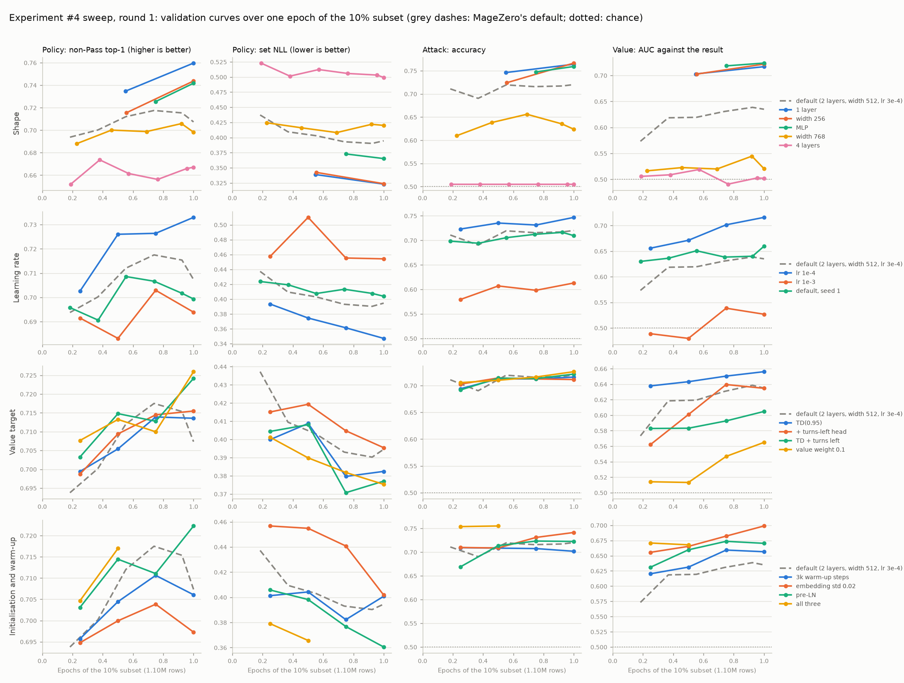
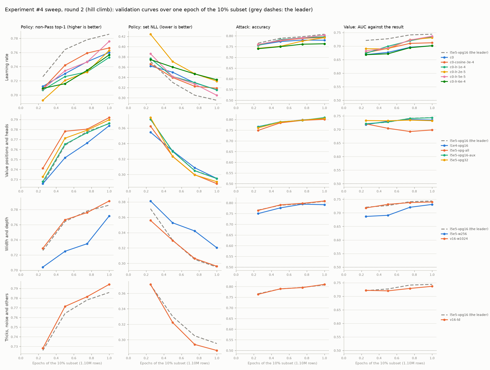

# Experiment #4: results

*October 2026. **Draft, in progress:** the results of experiment #4's stages 1–7, written as they
run; this snapshot is from 08:30 UTC on 2 October, during stage 2. The plan, its reasoning and the
decisions from review are in [docs/017](017-experiment4-scaling-up-imitation-learning.md); its §6.1
has the stage estimates this doc tracks against.*

## Preliminary results

- **The data is built.** 161,206 top players' games became 12.1M decisions (10.9M for training),
  about 80× #2b's 132,603. Every turn was replayed, including the opponent's turns, timing stops and
  blocks (Stage 1).
- **The sweep's first round: MageZero's default network trains unstably at its learning rate.**
  - **The symptoms:** at lr 3e-4, bigger networks (4 layers, width 768) learn no attack or value
    head in an epoch, while smaller ones (1 layer, width 256, an MLP) beat the default by 3–4×
    the noise bar.
  - **What fixes it:** lr 1e-4 helps every head; a smaller embedding init fixes the attack and
    value heads; pre-LN helps the policy.
  - **Round 2 combines the fixes,** and round 3 checks the best on 30% of the data before
    stage 3 (Stage 2).
- **Every network so far almost never acts in the opponent's turn.** Pass is its top choice 97.5–
  100% of the time, against 93.4% for the humans, though it ranks the right play first among the
  non-Pass options ~70% of the time when the human did act. It knows what to cast there but not
  when. A candidate fix for stage 3: upweight the opponent's-turn rows where the human acted.
- **The heuristic bot on the new benchmark (sb-v2):** IS-MCTS at 300 simulations scores 0.648
  balanced, and its root value predicts the game's result with AUC 0.724 (Stage 4).
- **Compute: the network search is CPU-bound, not GPU-bound,** at about 3.2 pod-seconds a decision
  on a 3090 against the plan's 1.7. A faster inference server didn't help; the host's CPU does.
  Community 3090s at $0.22/hr (Secure: $0.50) should keep the game stages near their planned
  dollars despite the extra pod-hours (GPU check).

## Status

*Spend so far: $11.21 of the ~$36–44 planned (RunPod balance $82.58 → $71.37). Ask before total spend passes $65.*

| Stage | Status | Pod-hours | Cost | Notes |
|---|---|---|---|---|
| 0. Engineering | done on the laptop (docs/017 §8.1), plus fixes below | – | – | 384 tests pass; 3 added since |
| GPU check | done: the RTX 3090 | 1.5 (3 pods) | $1.30 | the L40 is no cheaper per evaluation; network search is CPU-bound |
| 1. Build | done: 161,206 games, 12.1M rows (10.9M train) | 3.6 | $1.82 | estimate 5 pod-hours, $2.50 |
| 2. Hyperparameter sweep | round 1: 16 of 18 done; rounds 2–3 queued (an extended search, at Dan's go-ahead) | 12.2 so far | $6.10 so far | ~24 pod-hours expected against 6: over by design |
| 3. Large training | not started | | | |
| 4. Cheap evaluation | heuristic bot at 300 done; at 3,000, half done | 4.6 | $1.01 | the pod's host rebooted; the rest runs with the network mixes |
| 5. Play | not started | | | |
| 6. Follow-up checkpoints | not started | | | |
| 7. Their evaluation | not started | | | |
| Failed pods | three Community pods that never started work | 1.0 | $0.22 | |

## Before the first pod

- **Laptop suite:** 384 passed, 1 skipped (2 min 39 s, `MZ_XMAGE_DIR` set to the v0.2 bundle).
- **A fix to the build (c7e94dc).** The `tables` step loaded the whole build into memory:
  measured on the 120-game smoke build, about 1.3 MB a game, so roughly 200 GB for the ~158k top
  players' games. And the build couldn't resume: a stopped pod would lose the whole 3–4 hours.
  - The build now writes shard parts of 5,000 games, each marked once it's closed. A re-run
    skips the games of finished parts.
  - `tables` converts one part at a time and merges each table's parts, shifting the CSR
    pointers. It resumes too.
  - **Checked:** on the smoke build, the new `tables` gives the same tables as the old one, from
    the old single shard and from the same games split into four parts. Two new unit tests.
- **Two more changes while stage 1 ran:**
  - `play.py --shard i/n` (7169ab1) splits a stage's games across pods by deck pair. The game
    stages are CPU-bound, so several $0.22 pods beat one bigger one. Each game also needs a long
    `--game-timeout`: at full load a network decision takes 70–165 s in its worker, so a game of
    ~140 decisions takes about 3 hours. The 2-hour default would kill games.
  - `analyze.py` (ce543ab) counts sb-v2's timing items (`endstep`, `oppwindow`) in the
    cast-or-pass part of the balanced score, as docs/017 §6.5 planned, and reports the AUC of the
    root value against the game's result. sb-v1's output is unchanged.

## GPU check (docs/017 §6.7)

**The pick: the RTX 3090.** Per dollar, the L40 matches it on the model and on training, and
the game stages are CPU-bound anyway.

| | RTX 3090, Secure, $0.50/hr | L40, Secure, $0.82/hr |
|---|---|---|
| Model forward, fp16, batch 1 / 8 / 32 / 128 (evals/s) | 362 / 1,007 / 1,260 / 1,273 | 360 / 1,788 / 1,836 / 1,799 |
| $ per million evaluations, batch 32 | **$0.11** | $0.12 |
| Training samples/s (#2b's network, smoke tables) | 808 | 1,305 |
| $ per million training samples | **$0.17** | $0.17 |
| cgroup cores / RAM | 31.1 / 116 GB | 27.2 / 250 GB |

- **The model:** #2b's network (2 layers, width 512), with state lengths sampled from the smoke
  build's turn-start table. Batches pad to their longest state, about 1,450–1,600 tokens.
- **Secure L40S was sold out at the time,** or offered with 16 vCPU. The L40 is the same Ada chip
  with lower tensor throughput.
- **Training is short and early:** 169 steps on the smoke tables, so the sweep's first runs will
  give better numbers.

**The network search is CPU-bound, not GPU-bound.** IS-MCTS at 1,000 simulations on 96 sb-v2
decisions, with the imitation prior and the network at the leaves (stage 4's and 5's network
bot), 32 workers and 4 replicas of MageZero's server, on the 3090:

| Measure | Value |
|---|---|
| Evaluations a second | 298 |
| Pod-seconds a decision | 3.19 (docs/017 §6.1 assumed 1.7) |
| GPU busy | 49% |
| Per simulation, in one worker | 55 ms engine, 40 ms waiting on the network |

- MageZero's server packs 4,096 doubles for every state and logs every request. Each replica
  kept one core at 100% and ran batches of one state, and 32 search JVMs took the rest of the
  CPU.
- At this rate the game stages (5–7) would cost about 1.9× their estimates.

**A faster server doesn't help; a faster CPU does.** `value_server.py --policy` (d6c289c)
returns MageZero's server's fields from the same forward pass, as float32 and without per-request
logging, with an optional linger to batch across requests. On the laptop its outputs equal
MageZero's server's exactly. The same search (160 sb-v2 decisions, IS-MCTS 1,000, imitation
prior, network leaf) on an L40S pod with each server setup:

| Servers | Workers | Evals/s | Pod-s a decision | Engine / network wait, ms a simulation | GPU busy | Cores busy (of 27.2) |
|---|---|---|---|---|---|---|
| MageZero's, 4 replicas | 32 | 464 | 2.03 | 29.5 / 26.5 | 52% | 24.1 |
| `--policy`, 4 replicas | 32 | 464 | 2.03 | 30.0 / 26.1 | 56% | 24.7 |
| `--policy`, 8 replicas | 32 | 457 | 2.06 | 31.6 / 25.4 | 60% | 25.0 |
| `--policy`, 2 replicas, 2 ms linger | 32 | 434 | 2.17 | 27.5 / 33.0 | 25% | 22.8 |
| `--policy`, 1 replica, 2 ms linger | 32 | 329 | 2.87 | 28.2 / 55.7 | 10% | 18.4 |
| `--policy`, 4 replicas | 48 | 423 | 2.23 | 47.2 / 44.5 | 42% | 25.4 |

- **The CPU is the limit.** With 4 replicas and 32 workers, the pod's cores are nearly all busy.
  More workers only slow the engine (48 workers: 47 ms a simulation, against 30).
- **One replica can't keep up:** about 330 requests a second (~3 ms of Python per request), with
  the GPU 10% busy. Several replicas share the GPU at batch sizes of about one. That's where the
  ~26 ms wait comes from. But with the CPU nearly full, a shorter wait would buy at most ~10%.
- **The host's CPU matters most.** The L40S pod's host is an AMD EPYC 9554 (Zen 4, up to
  3.76 GHz); the 3090 pod's is an EPYC 7H12 (Zen 2, up to 2.6 GHz). The engine takes 30 ms a
  simulation on the first and 55 ms on the second.
- **Per dollar, the 3090 still wins:** 3.19 pod-s a decision at $0.50/hr is $0.44 per thousand
  decisions, against $0.61 for the L40S (2.03 at $1.09). A 3090 on a faster host would be better
  still, so each game pod's CPU gets checked (`lscpu`) as soon as it's created.
- MageZero's own server stays: it's as fast, and it's what experiment #3 used.

## Stage 1: the build

**161,206 top players' games became 12.1M table rows: 10.9M for training, 0.60M for
validation and 0.53M for test.** That's 75 rows a game in the six tables the configs train on,
against about 84 in the smoke build (which counted both block tables).

| Table | Train | Validation | Test |
|---|---|---|---|
| `turnstart` (the turn's first main-phase priority) | 1,239,106 | 69,660 | 60,391 |
| `replay_priority` (the player's later stops in its own turn) | 5,573,723 | 307,237 | 269,685 |
| `opp_priority` (the player's stops in the opponent's turn) | 2,218,297 | 118,706 | 106,215 |
| `replay_attack` ("attack with X?") | 1,391,893 | 77,708 | 68,980 |
| `replay_target` (spell targets the outcome settles) | 209,905 | 11,625 | 10,319 |
| `opp_block` (every block question) | 314,690 | 17,619 | 15,816 |
| `block` (first block of each attack; overlaps `opp_block`, not trained on) | 351,265 | 19,636 | 17,106 |

- **The build:** 2.54 hours, 28 workers, 17.6 games a second, no errors. The first-hour
  estimate of 3.7 hours was for about 158k games at the smoke build's speed.
- **The tables:** 1.0 hour (33 parts at ~47 s each, then the merge), 18 GB of HDF5. The shards
  are 16 GB.
- **Against the smoke build's rates (docs/017 §2.2):** 8.5 turn starts a game (smoke: 9.1); 51
  replayed decisions in the player's own turns (smoke: 38 priority plus 10.6 attacks); 18
  decisions in the opponent's turns (smoke: 19); 2.4 first-block questions (smoke: 3).
  - Turns reproduced: 86.8% of the player's (1,194,268 of 1,375,521) and 83.5% of the
    opponent's (1,084,253 of 1,297,734). Smoke: 85% and 85%.
  - Turn starts: 99.5% usable. First-block questions: 64% labelled; the rest were mostly a
    different decision at the replayed stop (138k) or had no exact pairing (74k).
- **Held out:** 6,139 rows of sb-v1's drafts and their mirrored partners, as planned.

## Stage 2: the hyperparameter sweep

*Round 1 done (18 runs, 20:15 on 1 October to 09:50 on 2 October); round 2 running (below).*

**Every run trains one epoch of the same 10% subset** (1.10M rows; the same feature vocab and
validation rows) and is scored on the validation split: about 20,000 rows per table, whole games.
Round 1 changes one setting at a time around MageZero's default network (2 post-LN layers, width
512, embedding rows drawn N(0, 1), learning rate 3e-4, 300 warm-up steps).

<picture>
  <source media="(prefers-color-scheme: dark)" srcset="img/018-sweep-r1-dark.png">
  
</picture>

*Round 1's learning curves. The first runs were evaluated every 5 or 10 minutes, the later ones at
every quarter epoch, so the points don't all line up.*

**Round 1's leaderboard** (final, all 18 runs), sorted by the policy's set NLL (lower is better):

| # | Run | Setup | Non-Pass top-1 | Set NLL | Attack acc. | Block top-1 | Target top-1 | Value AUC | Value log-loss | Opp. turn: Pass on top | Inference evals/s (batch 32) |
|---|---|---|---|---|---|---|---|---|---|---|---|
| 1 | `layers-1` | transformer, 1 layer, width 512, post-LN, lr 0.0003, emb N(0,1), warm-up 300 | 0.760 | 0.323 | 0.764 | 0.691 | 0.546 | 0.717 | 0.635 | 97.5% | 2,194 |
| 2 | `width-256` | transformer, 2 layers, width 256, post-LN, lr 0.0003, emb N(0,1), warm-up 300 | 0.744 | 0.324 | 0.766 | 0.690 | 0.547 | 0.722 | 0.622 | 97.9% | 2,972 |
| 3 | `modern` | transformer, 2 layers, width 512, pre-LN, lr 0.0003, emb std 0.02, warm-up 3000 | 0.756 | 0.329 | 0.773 | 0.690 | 0.553 | 0.710 | 0.623 | 99.2% | 1,135 |
| 4 | `lr-1e-4` | transformer, 2 layers, width 512, post-LN, lr 0.0001, emb N(0,1), warm-up 300 | 0.733 | 0.347 | 0.747 | 0.684 | 0.534 | 0.716 | 0.620 | 99.9% | 1,391 |
| 5 | `layers-4-modern` | transformer, 4 layers, width 512, pre-LN, lr 0.0003, emb std 0.02, warm-up 3000 | 0.727 | 0.357 | 0.756 | 0.686 | 0.541 | 0.679 | 0.671 | 99.9% | 581 |
| 6 | `pre-ln` | transformer, 2 layers, width 512, pre-LN, lr 0.0003, emb N(0,1), warm-up 300 | 0.722 | 0.360 | 0.723 | 0.687 | 0.535 | 0.670 | 0.633 | 99.9% | 1,135 |
| 7 | `mlp` | MLP, 2 blocks, width 512, lr 0.0003, emb N(0,1), warm-up 300 | 0.742 | 0.365 | 0.759 | 0.686 | 0.540 | 0.724 | 0.654 | 99.9% | 32,986 |
| 8 | `value-weight-0.1` | transformer, 2 layers, width 512, post-LN, lr 0.0003, emb N(0,1), warm-up 300, value weight 0.1 | 0.726 | 0.375 | 0.726 | 0.686 | 0.524 | 0.565 | 0.665 | 99.9% | 1,386 |
| 9 | `value-td-aux` | transformer, 2 layers, width 512, post-LN, lr 0.0003, emb N(0,1), warm-up 300, TD value, +turns_left | 0.724 | 0.377 | 0.722 | 0.686 | 0.522 | 0.605 | 0.659 | 99.9% | 1,374 |
| 10 | `value-td` | transformer, 2 layers, width 512, post-LN, lr 0.0003, emb N(0,1), warm-up 300, TD value | 0.714 | 0.382 | 0.716 | 0.687 | 0.539 | 0.656 | 0.642 | 99.8% | 1,382 |
| 11 | `default` | transformer, 2 layers, width 512, post-LN, lr 0.0003, emb N(0,1), warm-up 300 | 0.707 | 0.395 | 0.720 | 0.684 | 0.530 | 0.635 | 0.691 | 99.9% | 1,379 |
| 12 | `value-aux` | transformer, 2 layers, width 512, post-LN, lr 0.0003, emb N(0,1), warm-up 300, +turns_left | 0.715 | 0.395 | 0.711 | 0.685 | 0.526 | 0.635 | 0.676 | 99.9% | 1,374 |
| 13 | `warmup-3k` | transformer, 2 layers, width 512, post-LN, lr 0.0003, emb N(0,1), warm-up 3000 | 0.706 | 0.401 | 0.702 | 0.684 | 0.530 | 0.657 | 0.638 | 99.9% | 1,389 |
| 14 | `emb-std-0.02` | transformer, 2 layers, width 512, post-LN, lr 0.0003, emb std 0.02, warm-up 300 | 0.697 | 0.402 | 0.741 | 0.676 | 0.539 | 0.699 | 0.655 | 100.0% | 1,390 |
| 15 | `default-seed1` | transformer, 2 layers, width 512, post-LN, lr 0.0003, emb N(0,1), warm-up 300, seed 1 | 0.699 | 0.404 | 0.710 | 0.680 | 0.542 | 0.660 | 0.649 | 99.7% | 1,385 |
| 16 | `width-768` | transformer, 2 layers, width 768, post-LN, lr 0.0003, emb N(0,1), warm-up 300 | 0.698 | 0.420 | 0.624 | 0.684 | 0.525 | 0.521 | 0.678 | 99.9% | 574 |
| 17 | `lr-1e-3` | transformer, 2 layers, width 512, post-LN, lr 0.001, emb N(0,1), warm-up 300 | 0.694 | 0.454 | 0.613 | 0.685 | 0.516 | 0.527 | 0.668 | 100.0% | 1,390 |
| 18 | `layers-4` | transformer, 4 layers, width 512, post-LN, lr 0.0003, emb N(0,1), warm-up 300 | 0.667 | 0.499 | 0.505 | 0.685 | 0.518 | 0.502 | 0.676 | 100.0% | 584 |

- **The noise band** (twice the seed-to-seed difference, docs/017 §6.3's bar): about 0.016 in
  non-Pass top-1, 0.018 in set NLL, 0.05 in value AUC and 0.08 in value log-loss.
- **MageZero's default trains unstably at lr 3e-4.** Each step up in learning rate (1e-4, 3e-4,
  1e-3) is worse on every head. Bigger networks fail outright: 4 layers and width 768 learn no
  attack or value head in an epoch. Smaller ones (1 layer, width 256, the MLP) beat the default
  by 3–4× the bar.
- **What fixes it, one setting at a time:**
  - **lr 1e-4:** better on every head, and it keeps MageZero's shape.
  - **The 0.02 embedding init:** fixes the attack and value heads (+0.026 and +0.05), not the
    policy.
  - **Pre-LN:** helps the policy (+0.019 top-1, −0.040 NLL). Inference is 18% slower, within
    §6.3's 25%.
  - **All three together** (`modern`) beat the default's whole epoch at a quarter epoch, and
    make 2 layers as good as 1 (0.756 / 0.329). With them, 4 layers trains too (attack 0.756,
    value AUC 0.679, against chance without), but it's no better per sample than 2 and takes
    twice as long.
  - **A longer warm-up alone does nothing.**
- **The value targets don't help on their own** (TD(0.95), a turns-left head, both). Value weight
  0.1 trades value for policy: +0.023 top-1, but −0.08 value AUC. So the shared trunk trades one
  head against the other, which round 2's value tower tests.
- **The networks almost never act in the opponent's turn:** Pass is their top choice 97.5–100% of
  the time, against 93.4% for the humans. They rank the right play first among the non-Pass
  options ~70% of the time when the human did act. So they know what to cast there but not when.
- **The MLP's inference is ~24× the transformer's** (33k against 1.4k evaluations a second at batch
  32). The network search is CPU-bound, so that matters less than it seems, but it's free speed.

**What's next:** round 2 (below), a hill climb around 1 layer with the fixes, run as a loop that
adds runs as results come in, for as long as Dan wants it to.

**The budget changed to an equal number of samples** (f9157fa). docs/017 §6.3 gave every run the
same 25 minutes. A faster network then sees more data: the 1-layer run would have trained 46% more
samples than the default, and the 4-layer one about half as many. The two default seeds were
resumed from 0.92 to 1.0 epoch (an exact resume: the learning rate is constant after warm-up). The
first 1-layer run, stopped at 1.08 epochs, was restarted.

**New trainer options for the search** (all tested):
- `arch.norm_first` (pre-LN) and `emb_init_std` (26c0f63);
- `TransformerNetX`: a SwiGLU feed-forward, attention pooling, and a value tower (032038b);
- `value_server.py` serves any network the trainer saves (8c9afb9), so a network outside
  MageZero's shape can still play in stages 4–7.

### Round 2: a hill climb around 1 layer (live log)

*Running from ~10:00 UTC on 2 October, for 10+ hours at Dan's request. The run queue is
`configs/exp4_sweep_r2.yml`, run with `sweep --follow`, which re-reads it before every run.*

**How the loop works:**
- **The base is `c0`, round 1's leaders combined:** 1 layer, width 512, pre-LN, embedding std 0.02,
  3k warm-up, lr 3e-4. Every run trains one epoch of the 10% subset, as in round 1.
- **A check-in every 20–30 minutes,** or when a run finishes: read the leaderboard, form a
  hypothesis from the best run, and put the run that tests it at the **top** of the queue. The
  sweep always takes the first unfinished run, so the newest promising ideas go first, and the
  earlier plan stays below as a backstop.
- **What's kept:**
  - every change to the queue is pushed to main;
  - each check-in sends the new runs' configs, curves, summaries and best weights to the
    project's private HF repo (`exp4/sweep_r2/`);
  - the metrics also go to the laptop;
  - this log records each run's hypothesis and verdict.

| Run | Hypothesis | Result against `c0` | Verdict |
|---|---|---|---|
| `c0` | the round-1 fixes (pre-LN, embedding std 0.02, 3k warm-up) stack on 1 layer | non-Pass 0.760 (=), NLL 0.316 (−0.007), attack 0.780 (+0.016), value AUC 0.701 (−0.016) against round 1's 1 layer | about neutral on 1 layer, which was already stable; it should take a higher learning rate |
| `c0-lr-1e-4` | the lower learning rate that helped 2 layers helps 1 | non-Pass 0.753 (−0.007), NLL 0.315 (=), attack 0.795 (+0.016), block 0.700 (+0.012), value AUC 0.734 (+0.033), log-loss 0.636 (−0.019) | **the new leader:** the policy is flat, the attack, block and value heads gain (value AUC the best yet); the rest of the climb re-bases on lr 1e-4 |
| `c0-lr-6e-4` | a stable 1-layer network takes a higher learning rate | NLL 0.335 (+0.020), attack 0.763 (−0.032), block 0.684 (−0.017), value AUC 0.701 (−0.033) against the leader | rejected: lower keeps winning, not higher |
| `c0-cosine-3e-4` | the policy is flat across learning rates and the other heads want a low one, so a cosine decay from 3e-4 gets both | non-Pass 0.766 (+0.013, best yet), NLL 0.319 (+0.003), attack 0.792 (−0.003), value AUC 0.712 (−0.022), log-loss 0.654 (+0.018) against the leader | half right: the policy gains a little, the value prefers a constant low rate |
| `c0-lr-5e-5` | the trend continues below 1e-4 (lr 6e-4 < 3e-4 < 1e-4 on attack and value) | non-Pass 0.776 (+0.023), NLL 0.305 (−0.011), attack 0.803 (+0.007), block 0.693 (−0.007), value AUC 0.737 (+0.002) against lr 1e-4 | **the new leader:** the best policy and attack of any run, the value as good as 1e-4's |
| `l1e4-vpg16` | the value head is starved of data (4 positions a game an epoch), not of a low rate: 16 positions a game helps it | non-Pass 0.784 (+0.031), NLL 0.295 (−0.020), attack 0.805 (+0.010), target 0.574 (+0.024), value AUC 0.735 (+0.001), log-loss 0.617 (−0.019) against lr 1e-4 alone | **the new leader**, and a surprise: more value positions help the **policy** most. Once training is stable the result is a useful signal for the shared trunk (reversing round 1's value weight 0.1, at the unstable 3e-4) |
| `c0-lr-2e-5` | lower still: the trend 6e-4 < 3e-4 < 1e-4 < 5e-5 continues | non-Pass 0.763, NLL 0.333 (+0.028 against lr 5e-5), target 0.498 (−0.036), value AUC 0.731 | rejected: too low for one epoch; the best rate at this budget is 5e-5 to 1e-4 |
| `l5e5-vpg16` | the two winners combine: lr 5e-5 and 16 value positions a game | non-Pass 0.786 (+0.002), NLL 0.295 (=), attack 0.808 (+0.003), target 0.547 (−0.027), value AUC 0.744 (+0.009), log-loss 0.603 (−0.014) against l1e4-vpg16 | **the leader** (a tie on the policy, the best value head yet); 5e-5 and 1e-4 are interchangeable for the policy |
| `l5e5-vpg-all` | more value positions help further: the value loss on every position | non-Pass 0.792 (+0.006), NLL 0.288 (−0.007), block 0.707 (+0.010); value AUC 0.698 (−0.046), log-loss 0.846 (+0.243) against l5e5-vpg16. The value log-loss was 0.606 at a quarter epoch, then rose as its training loss fell (0.547 to 0.365) | the policy's best yet, but the value head memorises games (one result per game). Keep 16; try the middle |
| `l5e5-w256` | width 256 is enough at the best learning rate (underfitting probe; 4 value positions) | non-Pass 0.771 (−0.004), NLL 0.320 (+0.015), attack 0.791 (−0.012), value log-loss 0.671 (+0.026) against width 512 at the same settings; inference 2.5x faster | slightly worse everywhere: the underfitting knee for 1 layer is near width 256 at this budget |
| `l5e5-vpg32` | 32 value positions a game keeps most of every-position's policy gain without the value head overfitting | non-Pass 0.790 (+0.004), NLL 0.291 (−0.004), block 0.704 (+0.007); value AUC 0.732 (−0.012), log-loss 0.648 (+0.045) against l5e5-vpg16. The value log-loss was 0.591 at half an epoch, then rose | rejected: the policy gain is within noise and the value starts to overfit; 16 is the value head's sweet spot |
| `l5e5-vpg16-aux` | a turns-left head (a target that varies within a game, so it can't be memorised per game) helps the shared trunk too | every measure within ±0.004 of l5e5-vpg16 (non-Pass 0.786, NLL 0.295, value AUC 0.743) | neutral: a within-game target adds nothing at this budget |
| `v16-cosine-1e-4, v16-cosine-2e-4` | warm-up + cosine at the right scale (Dan's experience elsewhere): a peak of 1e-4 or 2e-4 decaying below 5e-5 combines fast early learning with low-rate finishing, and beats constant 5e-5 | *running (1e-4), then 2e-4* |  |
| `l5e5-vpg16-auxres` | decouple: a throwaway result head on every position (aux weight 0.5) gives the trunk every-position's policy gain while the value head keeps 16 positions and stays calibrated (needs a trainer change and a sweep restart, 7016b66) | *queued (approved 16:00; runs after the sweep restarts on the new trainer code)* |  |
| `v16-w1024` | 1 layer has headroom above width 512 at the leader's recipe | every measure within ±0.006 of l5e5-vpg16 (non-Pass 0.791, NLL 0.296, value AUC 0.740); inference 2.7x slower | a tie: width doesn't pay on 10% of the data; the 30% check retests it |
| `v16-td` | TD(0.95) targets (fractions bootstrapped from the network's own values: lower variance than the ±1 result) help the value head once training is stable (round 1 tested them only at the unstable 3e-4) | non-Pass 0.794 (+0.008), NLL 0.286 (−0.009), block 0.706 (+0.009), target 0.557 (+0.010); value AUC 0.737 (−0.007), log-loss 0.617 (+0.014), its calibration swinging with each TD refresh (ECE 0.05–0.10) | the best policy yet, but within noise; the value scores slightly worse against results. The leader's second seed moves up to measure the noise |
| `v16-l2` | capacity: 2 layers help on the right recipe (round 1's 2 layers trained unstably) | *queued* |  |
| `v16-l4` | capacity: 4 layers help on the right recipe | *queued* |  |
| `v16-mlp-lr-1e-4, v16-mlp-w1024-b4` | the MLP on the recipe, and a big MLP (fast enough to afford) | *queued* |  |
| `v16-seed1` | the noise band for the leader | *queued (moved up: after the cosine runs)* |  |

**Overfitting checks** (Dan asked, 15:10): every curve and leaderboard number is on the validation split
(held out by draft; never trained on); the test split is untouched until stage 3's network is scored.
Training and validation losses are compared at every quarter epoch. The policy and attack heads don't
overfit in one epoch: validation falls with training throughout (each row is seen once). The value head
is where it shows, since every position of a game shares one result: on every position, its training
loss fell from 0.547 to 0.365 while its validation log-loss rose from 0.606 to 0.846; with 32 positions
a game it bottomed at half an epoch; with 16 it stayed flat (~0.60). Settings are chosen on validation,
so the winner's validation numbers are slightly optimistic.

<!-- r2-board -->

**Round 2's leaderboard** (sorted by set NLL):

| # | Run | Setup | Non-Pass top-1 | Set NLL | Attack acc. | Block top-1 | Target top-1 | Value AUC | Value log-loss | Opp. turn: Pass on top | Inference evals/s (batch 32) |
|---|---|---|---|---|---|---|---|---|---|---|---|
| 1 | `v16-td` | transformer, 1 layer, width 512, pre-LN, lr 5e-05, emb std 0.02, warm-up 3000, TD value | 0.794 | 0.286 | 0.810 | 0.706 | 0.557 | 0.737 | 0.617 | 96.9% | 2,134 |
| 2 | `l5e5-vpg-all` | transformer, 1 layer, width 512, pre-LN, lr 5e-05, emb std 0.02, warm-up 3000 | 0.792 | 0.288 | 0.801 | 0.707 | 0.548 | 0.698 | 0.846 | 97.2% | 2,150 |
| 3 | `l5e5-vpg32` | transformer, 1 layer, width 512, pre-LN, lr 5e-05, emb std 0.02, warm-up 3000 | 0.790 | 0.291 | 0.805 | 0.704 | 0.547 | 0.732 | 0.648 | 97.1% | 2,153 |
| 4 | `l5e5-vpg16-aux` | transformer, 1 layer, width 512, pre-LN, lr 5e-05, emb std 0.02, warm-up 3000, +turns_left | 0.786 | 0.295 | 0.809 | 0.698 | 0.543 | 0.743 | 0.606 | 97.3% | 2,146 |
| 5 | `l1e4-vpg16` | transformer, 1 layer, width 512, pre-LN, lr 0.0001, emb std 0.02, warm-up 3000 | 0.784 | 0.295 | 0.805 | 0.697 | 0.574 | 0.735 | 0.617 | 97.1% | 2,149 |
| 6 | `l5e5-vpg16` | transformer, 1 layer, width 512, pre-LN, lr 5e-05, emb std 0.02, warm-up 3000 | 0.786 | 0.295 | 0.808 | 0.697 | 0.547 | 0.744 | 0.603 | 97.4% | 2,125 |
| 7 | `v16-w1024` | transformer, 1 layer, width 1024, pre-LN, lr 5e-05, emb std 0.02, warm-up 3000 | 0.791 | 0.296 | 0.809 | 0.696 | 0.551 | 0.740 | 0.608 | 97.6% | 774 |
| 8 | `c0-lr-5e-5` | transformer, 1 layer, width 512, pre-LN, lr 5e-05, emb std 0.02, warm-up 3000 | 0.776 | 0.305 | 0.803 | 0.693 | 0.534 | 0.737 | 0.645 | 97.8% | 2,156 |
| 9 | `c0-lr-1e-4` | transformer, 1 layer, width 512, pre-LN, lr 0.0001, emb std 0.02, warm-up 3000 | 0.753 | 0.315 | 0.795 | 0.700 | 0.550 | 0.734 | 0.636 | 98.3% | 2,157 |
| 10 | `c0` | transformer, 1 layer, width 512, pre-LN, lr 0.0003, emb std 0.02, warm-up 3000 | 0.760 | 0.316 | 0.780 | 0.688 | 0.554 | 0.701 | 0.655 | 97.8% | 2,144 |
| 11 | `c0-cosine-3e-4` | transformer, 1 layer, width 512, pre-LN, lr 0.0003 cosine, emb std 0.02, warm-up 3000 | 0.766 | 0.319 | 0.792 | 0.691 | 0.551 | 0.712 | 0.654 | 99.8% | 2,151 |
| 12 | `l5e5-w256` | transformer, 1 layer, width 256, pre-LN, lr 5e-05, emb std 0.02, warm-up 3000 | 0.771 | 0.320 | 0.791 | 0.694 | 0.542 | 0.731 | 0.671 | 99.5% | 5,374 |
| 13 | `c0-lr-2e-5` | transformer, 1 layer, width 512, pre-LN, lr 2e-05, emb std 0.02, warm-up 3000 | 0.763 | 0.333 | 0.791 | 0.689 | 0.498 | 0.731 | 0.671 | 99.8% | 2,141 |
| 14 | `c0-lr-6e-4` | transformer, 1 layer, width 512, pre-LN, lr 0.0006, emb std 0.02, warm-up 3000 | 0.757 | 0.335 | 0.763 | 0.684 | 0.556 | 0.701 | 0.634 | 99.5% | 2,167 |

<picture>
  <source media="(prefers-color-scheme: dark)" srcset="img/018-sweep-r2-dark.png">
  
</picture>

<!-- /r2-board -->

### The scale check: 30% of the training games (queued)

*Dan, 16:00: the goal is a recipe that works at full scale, and whether capacity helps with the right recipe.
Most runs are still learning smoothly at the end of their one epoch.*

`configs/exp4_sweep_s30.yml` runs round 2's recipe (pre-LN, embedding std 0.02, 3k warm-up, lr 5e-5, 16 value
positions a game) on 30% of the training games: 3.3M rows, one epoch each, with the same validation rows as
rounds 1 and 2. Runs: 1 layer, 2 layers, 1 layer at width 1024, an MLP, and 4 layers. It starts when round 2's
queue empties (about 19:30 UTC); each run takes about 1–3 hours. The lr-3e-4 backstop is dropped and the
remaining tricks are deferred.

## Stage 4: cheap evaluation (sb-v2)

*In progress. The heuristic bot needs no network, so it runs while stages 1–3 do.*

| Mix | Simulations | Balanced score [95% CI] | Cast or pass / attack / block | Root value's AUC against the result [95% CI] | Pod-s a decision |
|---|---|---|---|---|---|
| Heuristic bot (uniform prior, heuristic leaves) | 300 | 0.648 [0.623, 0.672] | 0.728 / 0.602 / 0.615 | 0.724 [0.686, 0.759] | 0.67 |

- **References on sb-v2's test items:** always passing scores 80.3% on agreement with the label
  set (A_set); the rule heuristic 0.569 balanced.
- **The value score:** the search's backed-up root value (`rootQ`) against whether the player won.
  The heuristic's static score at the root alone gives 0.653.
- **Agreement by type (A_set):** spell 0.64, hold 0.23, attack 0.60, block 0.48, `endstep` 0.50,
  `oppwindow` 0.78.
- **4 of the 1,000 decisions failed:** the JVM crashed (SIGBUS in JIT-compiled engine code,
  `ContinuousEffects.copy`) in two workers on this Community host. `run.py` retries failed rows
  on a re-run.
- **The host then rebooted (about 18:51 UTC),** killing the 3,000-simulation run at 500 of 1,000
  decisions and the pod's self-destruct with it. The wait loop watching it missed this for three
  hours: its `pgrep -f` pattern matched its own SSH command line (docs/005's pitfall), so the pod
  sat idle.
  Watchers now use a bracketed pattern (`pgrep -f "[s]upervised sweep"`). The rest of the run, and
  a check of a sample of this host's decisions on another host, go with stage 4's network runs.

## Pods

Every pod's quote, what it actually had, and what it delivered (docs/005).

| Pod | Stage | GPU, cloud | Quote | vCPU / RAM (cgroup) | Hours | Cost | Outcome |
|---|---|---|---|---|---|---|---|
| `qbptx0wvxlhstv` | – | CPU pod | $0.06/hr | – | ~0.03 | <$0.01 | tested that a pod's own API key can terminate it (GraphQL `podTerminate`): it can. The image's `runpodctl` 1.14 can't authenticate with that key, so docs/005's self-destruct line would fail silently. |
| `cbrrtovvu7a1cc` | GPU check, 1, 2 | RTX 3090, Secure, CZ | $0.50/hr, 32 vCPU, 125 GB | 31.1 cores / 116 GB, EPYC 7H12 | 16.8 so far | $8.38 so far | running. `/workspace` is a network filesystem (MooseFS): writes ~570 MB/s, and `tar` must skip `chown` (`--no-same-owner`) |
| `5bdvhik7ea0kaz` | GPU check | L40, Secure, US | $0.82/hr, 32 vCPU, 250 GB | 27.2 cores / 250 GB | 0.37 | $0.30 | model and training speed only (no bridge); removed |
| `2yod0kvnr108f7` | server test | L40S, Secure, US | $1.09/hr, 32 vCPU, 125 GB | 27.2 cores / 125 GB, EPYC 9554 | 0.72 | $0.78 | the inference-server comparison (no Secure 3090 or L40 left); removed |
| `rizee0c3sfip6l` | 4 (heuristic bot) | RTX 3090, Community with public IP, CA | $0.22/hr, 32 vCPU, 62 GB | 27.2 cores / 62 GB, EPYC 7702 | 4.6 | $1.01 | setup took 6 minutes. 4 JVM crashes (SIGBUS); the host rebooted at ~18:51 and the pod sat idle until 22:02 (~$0.70 lost); removed |
| `ubn5t7kjbu12l4` | 2–3 (meant) | RTX 3090, Community with public IP, CA | $0.22/hr, 16 vCPU, 62 GB | – | 0.35 | $0.08 | still pulling the image after 20 minutes; removed |
| `4gm8oz4v2pa7qv` | 2–3 (meant) | RTX 3090, Community with public IP, FR | $0.22/hr, 8 vCPU, 30 GB | – | ~0 | ~$0 | too little RAM for stage 3; removed at once |
| `47ojn7gvz1wub8` | 2–3 (meant) | RTX 3090, Community with public IP, CA | $0.22/hr, 16 vCPU, 62 GB | – | 0.63 | $0.14 | created with GraphQL `podFindAndDeployOnDemand` (`minMemoryInGb: 60`); still pulling the image after 38 minutes; removed. The sweep ran on the Secure pod instead |

**Community 3090s with a public IP were $0.22/hr** on 2026-10-01, with 8–32 vCPU and 30–62
GB, less than half the Secure price (docs/005 found no Community host with a public IP on
2026-09-25). The network search is CPU-bound, so these are the cheapest pods per decision even on a
slow host. But two of four sat for 20–40 minutes pulling the 10 GB image. `runpodctl pod create`
has no RAM or vCPU floor; GraphQL `podFindAndDeployOnDemand` takes `minVcpuCount` and
`minMemoryInGb` (with a `Bearer` key).

Uploads from the laptop to a US pod ran at about 110 KB/s; pod to pod (`ssh -A`, then `scp`)
moved 75 MB in 10 s.

**Self-destruct:** `arm.sh <seconds>` sleeps, then calls GraphQL `podTerminate` with the pod's
own key from PID 1's environment (an SSH session doesn't inherit it).
