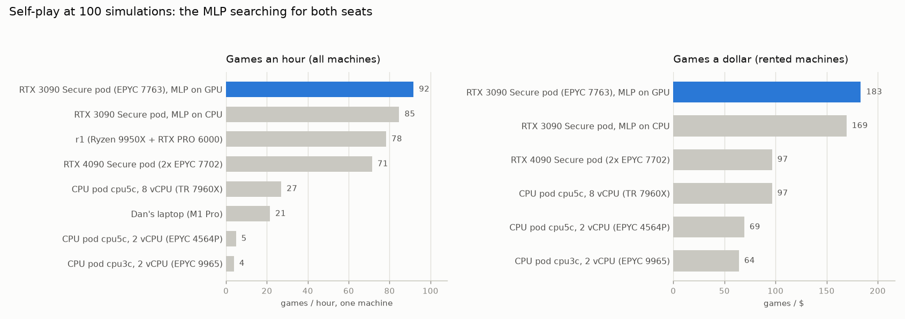
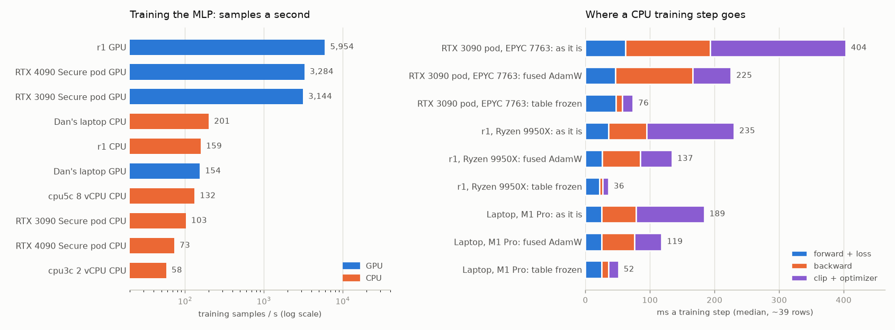

# CPU benchmarks: where the MLP's compute should go

*October 2026 (the evening of 3 October, Pacific time). Written for Dan after experiment #4's MLP (docs/018) made a
network cheap enough to run on a CPU. The question: which compute gives the most per dollar for training the MLP,
for self-play games with search, and for the two together? The candidates are RunPod's CPU pods, its GPU pods, the
free RTX PRO 6000 box (r1) and Dan's laptop. Everything was measured with the current code on the leading MLP
(`deploy/compute_bench.sh`, `tools/compute_bench/`). RunPod spend: $3.73.*

## Read this first

### The answer in three tables

**Self-play:** the MLP searching for both seats (IS-MCTS, its policy as the prior, its value at the leaves, closed
decklists). A game is ~169 searched decisions. At 100 simulations a game takes one worker 13-35 minutes, depending
on the machine.

| Compute | $/hr | Task | Simulations | Games / hour | Games / $ |
|---|---|---|---|---|---|
| **RunPod GPU pod: RTX 3090, Secure** (EPYC 7763, 32 vCPU, 27 workers), MLP on the GPU | 0.50 | self-play | 100 | 92 | **183** |
| the same | 0.50 | self-play | 1,000 | 9.0 | **18** |
| the same | 0.50 | self-play | 10,000 | 0.89 | 1.8 |
| the same pod, the MLP served on its CPU instead | 0.50 | self-play | 100 | 85 | 169 |
| RunPod GPU pod: RTX 4090, Secure (2 × EPYC 7702, 64 vCPU; 39 workers, all its RAM allows) | 0.74 | self-play | 100 / 1,000 | 71 / 5.3 | 97 / 7.1 |
| **RunPod CPU pod `cpu5c`, 8 vCPU** (Threadripper 7960X; 5 workers) | 0.28 | self-play | 100 / 1,000 | 27 / 2.4 | 97 / 8.6 |
| RunPod CPU pod `cpu5c`, 2 vCPU (EPYC 4564P; 1 worker) | 0.07 | self-play | 100 / 1,000 | 4.9 / 0.76 | 69 / 11 |
| RunPod CPU pod `cpu3c`, 2 vCPU (EPYC 9965; 1 worker) | 0.06 | self-play | 100 / 1,000 | 3.9 / 0.75 | 64 / 12 |
| **r1** (Ryzen 9 9950X, 24-core quota, 19 workers; MLP on an RTX PRO 6000) | free | self-play | 100 / 1,000 | 78 / 8.0 | free |
| Dan's laptop (M1 Pro, 5 workers, MLP on its CPU) | free | self-play | 100 / 1,000 | 21 / 4.0 | free |

*The 2-vCPU CPU pods ran a single worker whose core's second thread sat nearly idle, so their numbers (the
1,000-simulation ones most) flatter a full CPU pod; the 8-vCPU pod is the better guide (§3).*

**Training the MLP** (the trainer itself, the full-data run's recipe, on 17lands tables):

| Compute | $/hr | Device | Samples / s | One epoch (10.95M decisions) | $ an epoch |
|---|---|---|---|---|---|
| **r1: RTX PRO 6000 Blackwell** | free | GPU | 5,954 (5,999 in experiment #4's 30% run) | 0.51 h | free |
| RunPod RTX 3090 / RTX 4090, Secure | 0.50 / 0.74 | GPU | 3,145 / 3,284 | 0.97 h / 0.93 h | **0.48** / 0.69 |
| RunPod CPU pod `cpu5c`, 8 vCPU (Threadripper 7960X) | 0.28 | CPU | 132 | 23 h | 6.4 |
| RunPod 3090 pod's CPU (EPYC 7763, 31 threads) | 0.50 | CPU | 103 | 30 h | 15 |
| RunPod 4090 pod's CPU (2 × EPYC 7702, 54 threads) | 0.74 | CPU | 73 | 42 h | 31 |
| RunPod CPU pod `cpu3c`, 2 vCPU (EPYC 9965) | 0.06 | CPU | 58 | 53 h | 3.2 |
| r1's CPU (9950X, 24 threads) | free | CPU | 159 | 19 h | free |
| Dan's laptop (M1 Pro) | free | CPU / Apple GPU | 201 / 154 | 15 h / 20 h | free |

**Self-play and training together** (stage 6's loop: every game's searched decisions trained on 8 times):

| Compute | Simulations | Training on a GPU (r1, or the pod's own) | Training on the self-play machine's own CPU |
|---|---|---|---|
| RTX 3090 Secure pod | 100 | 92 games/h, 183 games/$ (training: 0.4 s a game on its 3090) | 69 games/h, 137 games/$ (training takes 25% of the pod) |
| RTX 3090 Secure pod | 1,000 | 9.0 games/h, 18 games/$ | 8.7 games/h, 17 games/$ (3%) |
| RTX 3090 Secure pod | 10,000 | 0.89 games/h, 1.8 games/$ | the same (0.3%) |
| `cpu5c`, 8 vCPU | 100 / 1,000 | (no GPU: ship the records to r1) | 25 games/h, 90 games/$ (7%) / 2.4, 8.5 (0.7%) |

### What we found

- **Self-play is CPU work, on every machine.** The game engine takes nearly all of it, the GPU sits 18-48% busy,
  and serving the MLP on the CPU instead costs ~8% (68.0 against 62.8 worker-ms a simulation, the same pod). The
  MLP needs no GPU to play; the transformer did (~80 ms an evaluation on a CPU core).
- **A game costs about $0.0055 at 100 simulations, $0.055 at 1,000 and $0.56 at 10,000**, on the best RunPod
  machine measured. Per simulation the cost is flat from 1,000 to 10,000 (64.0 and 64.4 worker-ms), and 10,000
  needs no big heaps: the live heap peaked at 454 MB a worker (experiment #4's C4x ran 8 workers with 16 GB heaps).
- **The host's CPU decides a pod's throughput, not its GPU.** The same seeded games run 1.6x slower per worker on
  a 4090 pod's EPYC 7702 than on a 3090 pod's EPYC 7763 (2.1x on search decisions at 1,000 simulations). RunPod's
  GPU pods sit on anything from Zen 2 to Zen 4.
- **RunPod's CPU pods have the fastest cores, but a vCPU is half a core and costs twice as much.** A `cpu5c`
  worker (Zen 4, 5.4-5.9 GHz) is ~2x a 3090 pod's worker on identical games. But a CPU pod pins its "2 vCPUs" to
  the two hardware threads of one core and charges $0.035 a vCPU against the 3090's $0.016. Net, the Secure 3090
  plays ~1.6-1.9x more games a dollar. CPU pods are also hard to get (§7).
- **Training the MLP on a CPU is slow, not fast:** 31-132 samples a second on the CPUs we rented, against 3,100-3,300
  on a RunPod GPU and ~6,000 on r1's. A full epoch is a day or two on a CPU, an hour on a GPU. The reason is the
  64M-parameter feature table: the trainer computes and applies a dense gradient for all 62,231 rows when a batch
  touches ~4,700. Fused AdamW (one flag) gives 1.6-2.0x on a CPU and 1.1-1.4x on a GPU. A frozen table, the ceiling
  for a sparse update, gives 3.5-7x on a CPU and 2.4-3.5x on a GPU. The free machines train on their CPUs faster
  than anything rented (Dan's M1 Pro 201, r1's 9950X 159), still ~30x behind r1's GPU.

### What to do

1. **Train on r1's GPUs** (free, ~6,000 samples a second). If r1 is busy, use a RunPod 3090 pod's GPU: $0.48 an
   epoch.
2. **For self-play, rent the cheapest good vCPUs, which are GPU pods.** A Secure RTX 3090 on an EPYC 7763 played
   183 games a dollar at 100 simulations. Check `lscpu` on each new pod and drop Zen 2 hosts (EPYC 7702, 7542).
   Serve the MLP on the pod's GPU (8% more games than on its CPU), and keep training off the self-play CPUs below
   1,000 simulations.
3. **Use r1's spare cores for self-play while its GPUs train,** memory permitting: its 19 workers played 78 games
   an hour at 100 simulations, 0.85x a Secure 3090 pod, free (§3). Training and self-play share its 40 GiB.
4. **CPU pods only if GPU pods run out.** Rent them through the availability API (§7); budget ~1.8x a 3090 pod per
   game.
5. **Two trainer changes move the training numbers** (§2): `AdamW(fused=True)` (1.6-2x on a CPU, 1.36x on r1's
   GPU; experiment #4's session turned it on for CUDA after these numbers, 2a4e34b), then a sparse feature-table
   update (ceiling 3.5-7x on a CPU, 3.5x on r1's GPU; that session's wave I is testing a lazy AdamW of this kind).

<picture>
  <source media="(prefers-color-scheme: dark)" srcset="img/020-selfplay-dark.png">
  
</picture>

*Self-play at 100 simulations. The Secure RTX 3090 pod (EPYC 7763) plays the most games a dollar by ~1.9x.*

<picture>
  <source media="(prefers-color-scheme: dark)" srcset="img/020-training-dark.png">
  
</picture>

*Training. Left: the NVIDIA GPUs train 15-100x faster than any CPU (the laptop's Apple GPU, 154, is slower than its
CPU). Right: on a CPU most of a step is the dense feature-table gradient (backward) and its AdamW update
(optimizer); freezing the table, the ceiling for a sparse update, removes both.*

## 1. What was measured

**The network** is the leading MLP of docs/018 (`d1-s30-combined`: 2 blocks, width 1,024, max + mean pooling,
SwiGLU, heads 1,024; 80.5M parameters, 64M of them the 62,231-feature table), its weights rounded to fp16 for the
benchmark (HF `exp4/bench/mlp-d1-s30-combined/`). The full-data run queued in docs/018 has the same shape.

**One battery a machine** (`deploy/compute_bench.sh`, after `deploy/exp4_games_setup.sh` with that network; RunPod
pods through `tools/compute_bench/run_pod.sh`, which also removes them). Every step uses the machine's real limits
(the cgroup's cores and memory, or a CPU pod's pinned cpuset, not `nproc`), samples its load every 10 seconds, and
`tools/compute_bench/summarize.py` and `headline.py` read the results:

| Step | What runs | What it gives |
|---|---|---|
| `cpuprobe` | `tools/compute_bench/cpuprobe.py`: a fixed single-threaded workload alone, two at once, all cores at once | what a vCPU is (§6) |
| `infer` | `supervised bench-speed` on the MLP: the CPU at one thread (one inference server's share), the GPU if any | evaluations a second |
| `games` | `play.py` self-play, `il_bc@100` both seats, closed decklists, records on; workers to the cores and the memory (a JVM settles at ~1.3 GB), 4 inference servers (1-2 on the small CPU pods); 22-40 minutes, then every game started in that window is let finish | worker-ms a simulation in real games; searched decisions a game |
| `sb` | `run.py` on sb-v2's held-out decisions: the same 200 on every machine at 1,000 simulations (100 too on some; 10,000 on the 3090) | worker-seconds a decision at each budget |
| `tables`, `train` | the games' records into stage 6's soft tables; the trainer from the MLP on those (stage 6's recipe) and on two 17lands tables (the imitation recipe of the full-data run): 60-400 steps on the CPU, 3,000 on the GPU | training samples a second |
| `tstep` | `tools/compute_bench/train_step_bench.py`: the trainer's step on real batches split into forward, backward and optimizer: as it is, with fused AdamW, with the feature table frozen | where training time goes (§2) |

**Games an hour** at B simulations = workers x 3,600 / (D x B x t_B):

- **D = 169 searched decisions a game:** the mean of the 3090 pod's 36 finished games. Seeded games replay
  identically on every machine (same decks, shuffles, network and search), so the same D applies everywhere. It is
  the mean of the games that finished, which leaves out the longest; games an hour come out a few percent high
  everywhere alike.
- **t_100:** each machine's own worker-seconds a simulation in its 100-simulation games (search time over
  simulations, at full load).
- **t_1000:** the 3090's mean on sb-v2's 200 decisions (64.0 ms a simulation), times each machine's time on the same
  decisions over the 3090's.
- **t_10000:** t_1000 times the 3090's measured ratio, 64.4/64.0.

Where two machines finished the same game, the game times give the same ratios (§3).

## 2. Training the MLP

| Machine | Threads / device | Imitation recipe (samples / s) | Stage 6 recipe (samples / s) |
|---|---|---|---|
| r1 | RTX PRO 6000 (GPU 0) | 5,954 | 6,257 |
| RunPod RTX 3090 pod | RTX 3090 | 3,145 | 3,624 |
| RunPod RTX 4090 pod | RTX 4090 | 3,284 | 2,374 |
| r1 | 9950X, 24 / 12 threads | 159 / 158 | 162 / 174 |
| `cpu5c`, 8 vCPU | Threadripper 7960X, 8 threads | 132 | 122 |
| RunPod RTX 3090 pod | EPYC 7763, 31 / 15 threads | 103 / 95 | 109 / 101 |
| RunPod RTX 4090 pod | 2 × EPYC 7702, 54 / 27 threads | 73 / 68 | 65 / 56 |
| `cpu3c`, 2 vCPU | EPYC 9965, 2 threads | 58 | 42 |
| `cpu5c`, 2 vCPU | EPYC 4564P, 2 threads | – (killed for memory, 4 GB, saving its checkpoint) | 31 |
| Dan's laptop | M1 Pro, 8 threads / Apple GPU (MPS) | 201 / 154 | 197 / – |

*The GPU runs are 3,000 short steps from the MLP on small tables. On r1 they agree with experiment #4's own 30% run
of the same network (5,999 samples a second over 3.3M decisions of the real tables).*

**Where a step goes** (`tstep`: the trainer's step on real 17lands batches of ~39 rows, ~4,700 distinct features a
batch; median ms a step):

| Machine | Variant | Forward | Backward | Clip + optimizer | Step | Samples / s |
|---|---|---|---|---|---|---|
| RTX 3090 pod, EPYC 7763, 31 threads | as the trainer is | 62 | 131 | 210 | 404 | 97 |
| | fused AdamW | 46 | 120 | 59 | 225 | 166 (1.7x) |
| | feature table frozen | 47 | 10 | 17 | 76 | 486 (5.0x) |
| r1, 9950X, 24 threads | as the trainer is | 35 | 60 | 135 | 235 | 137 |
| | fused AdamW | 26 | 60 | 49 | 137 | 275 (2.0x) |
| | feature table frozen | 22 | 4.4 | 9.2 | 36 | 994 (7.3x) |
| `cpu5c`, Threadripper 7960X, 8 threads | as the trainer is | 24 | 90 | 152 | 267 | 144 |
| | fused AdamW | 24 | 92 | 35 | 149 | 251 (1.7x) |
| | feature table frozen | 24 | 7 | 14 | 46 | 791 (5.5x) |
| Dan's laptop, M1 Pro, 8 threads | as the trainer is | 25 | 54 | 105 | 189 | 204 |
| | fused AdamW | 25 | 50 | 43 | 119 | 317 (1.6x) |
| | feature table frozen | 25 | 11 | 15 | 52 | 711 (3.5x) |
| RTX 3090 (GPU) | as the trainer is | 2.0 | 4.7 | 8.0 | 14.6 | 2,423 |
| | fused AdamW | 2.0 | 4.5 | 6.8 | 13.3 | 2,635 (1.09x) |
| | feature table frozen | 2.0 | 2.5 | 1.7 | 6.1 | 5,723 (2.4x) |
| r1, RTX PRO 6000 (GPU) | as the trainer is | 1.0 | 1.8 | 4.1 | 6.9 | 5,051 |
| | fused AdamW | 0.9 | 1.8 | 2.4 | 5.1 | 6,864 (1.36x) |
| | feature table frozen | 0.9 | 0.6 | 0.4 | 2.0 | 17,489 (3.5x) |

- **The feature table is the cost.** The backward pass writes a dense gradient the size of the whole table
  (62,231 x 1,024), and AdamW then updates every row. A batch touches ~4,700 of them. On a CPU that is memory
  traffic, three quarters of the step.
- **Threads don't help:** 31 threads against 15 gained 7% on the EPYC 7763, 54 against 27 gained 7% on the 7702,
  24 against 12 nothing on r1's 9950X, and the laptop is faster at 4 threads than at 8. The step is bound by memory,
  not arithmetic, which is why the M1 Pro (unified memory) out-trains every rented CPU.
- **Cheap fixes, in order:** fused AdamW (`fused=True`, CPU and GPU) gives 1.6-2.0x on a CPU, 9% on the 3090 and
  36% on r1's RTX PRO 6000. A sparse table update (only the rows a batch touches; lazy Adam moments) is bounded by
  the frozen-table line, 3.5-7x on a CPU and 2.4-3.5x on a GPU. A first try with a gather-and-`segment_reduce` max
  pool was slower than the fused EmbeddingBag on the CPU, so the real version should keep EmbeddingBag's forward and
  make only the update sparse.
- **Even the frozen-table speed leaves a CPU far behind:** 500-1,000 samples a second against 5,700-17,500 for a
  GPU running the same step. CPU training only makes sense for small fine-tunes, such as stage 6's 1,350 samples a
  game.

## 3. Self-play

**Games** (100 simulations; t_100 is worker-ms a simulation in that machine's own games):

| Machine | Workers | MLP served on | Games finished | t_100 (ms) | Busy cores | GPU busy | JVM RSS |
|---|---|---|---|---|---|---|---|
| RTX 3090 Secure pod (EPYC 7763, 31 cores) | 27 | its GPU (4 servers) | 36 | 62.8 | 29.9 | 41% | 1.3 GB |
| the same pod | 27 | its CPU (4 servers) | 36 | 68.0 | 28.1 | 0% | 1.3 GB |
| RTX 4090 Secure pod (2 × EPYC 7702, 54 cores) | 39 (memory) | its GPU | 6 | 116.5 | 53.2 | 27% | 1.1 GB (900 MB heaps) |
| `cpu5c` 8 vCPU (Threadripper 7960X, 4 cores) | 5 | its CPU (1 server) | 20 | 39.5 | 4.4 of 8 | – | 1.1 GB |
| `cpu5c` 2 vCPU (EPYC 4564P, 1 core) | 1 | its CPU | 2 | 44.0 | 0.8 of 2 | – | 1.2 GB |
| `cpu3c` 2 vCPU (EPYC 9965, 1 core) | 1 | its CPU | 2 | 55.5 | 0.9 of 2 | – | 1.1 GB |
| r1 (9950X, 16 cores, 24-core quota) | 19 | its GPU 0 (4 servers) | 26 | 51.8 | 19.3 | 27% | 1.1 GB |
| Dan's laptop (M1 Pro, 6 + 2 cores) | 5 | its CPU (2 servers) | 10 | 49.7 | – | – | 0.7 GB |

**The same games on two machines** (seeded games replay move for move; the 3090's run as the reference):

| Pair of runs | Shared games with identical decisions | Game time, this run over the reference |
|---|---|---|
| RTX 4090 pod (EPYC 7702) / RTX 3090 pod (EPYC 7763), both GPU-served | 5 of 6 shared | 1.31-2.45x (median 1.58x) |
| `cpu5c` 8 vCPU (7960X) / 3090 pod CPU-served (EPYC 7763) | 6 | 0.34-0.61x (median 0.47x: 2.1x faster) |
| 3090 pod CPU-served / 3090 pod GPU-served (fp32 on the CPU, fp16 on the GPU, yet the same moves) | 14 of 33 shared | 0.92-1.39x (median 1.05x) |
| r1 (9950X, 19 workers) / RTX 3090 pod, both GPU-served | 14 of 26 shared | 0.73-0.86x (median 0.80x: 1.25x faster) |

**Search decisions at 1,000 and 10,000** (sb-v2, worker-seconds a decision; the same decisions on every machine):

| Machine | Workers | Decisions | Worker-s a decision | Against the 3090, same decisions |
|---|---|---|---|---|
| RTX 3090 Secure pod | 27 | 200 | 64.0 | 1 |
| RTX 4090 Secure pod | 39 | 112 | 164 | 2.48x |
| `cpu5c` 8 vCPU | 4 | 200 | 35.5 | 0.55x |
| `cpu5c` 2 vCPU | 1 | 45 | 39.4 | 0.44x |
| `cpu3c` 2 vCPU | 1 | 43 | 41.0 | 0.45x |
| r1 | 16 | 200 | 42.6 | 0.67x |
| Dan's laptop | 5 | 122 | 28.5 | 0.42x |
| *Experiment #4's C4 (L40 pod, the transformer, 28 workers)* | | *200 shared* | *44.4* | *0.73x* |
| RTX 3090 Secure pod, 10,000 simulations | 27 | 27 | 644 (64.4 ms a simulation) | – |

- **The MLP's search costs what the transformer's did on a GPU:** the engine is the bottleneck. The C4 pod's host
  (likely Zen 4) was 1.37x the 3090's EPYC 7763, worker for worker.
- **One worker alone runs faster than a full machine:** the 2-vCPU CPU pods' single workers (t_1000 ~0.45x the
  3090's) had their core's second thread nearly idle. On a full pod their workers share cores, so the 8-vCPU pod
  (0.55x) is the better guide to a 32-vCPU CPU pod.
- **10,000 simulations:** 27 decisions, no errors or timeouts at 3 GB heaps. The GC logs put the peak live heap at
  167-454 MB a worker, so RAM a worker is ~1.4 GB at any budget. At 10,000 a game is ~30 hours of one worker.
- **Small CPU pods need a second inference server:** with one server, the 8-vCPU pod kept only 4.4 of its 8 vCPUs
  busy. Its workers waited on the server.

## 4. Self-play with training

Stage 6's loop trains on every searched decision of the bot's games (8 passes over the self-play rows, plus 15%
human rows). That is ~1,350 training samples a game.

| Machine | Training where | Seconds a game | Share of the machine at 100 / 1,000 / 10,000 simulations |
|---|---|---|---|
| RTX 3090 pod | its 3090 | 0.37-0.43 | 0.9% / 0.1% / 0.01% |
| RTX 3090 pod | its CPU (31 threads) | 13.2 | **25%** / 3.2% / 0.3% |
| RTX 4090 pod | its CPU (54 threads) | 18.4 | 27% / 2.6% / 0.3% |
| `cpu5c` 8 vCPU | its CPU | 10.2 | 7% / 0.8% / 0.08% |
| r1 | its GPU 0 | 0.23 | 0.5% / 0.05% / 0.005% |

- **Below 1,000 simulations, train on a GPU.** On a GPU pod that means its own GPU; from CPU pods, ship the games'
  records to r1. With fused AdamW the CPU share at 100 simulations falls from 25% to ~16%; with a sparse table to
  ~6%.
- **At 1,000 and up, training is noise.** The machine choice is the self-play choice.

## 5. CPU instances versus GPU instances, task by task

**Training the MLP (imitation, at scale)**

| | CPU instance | GPU instance |
|---|---|---|
| Speed | 31-132 samples/s (rented CPUs; 159-201 on r1 and the laptop); a 10.95M-decision epoch takes 15-53 h | 3,100-3,300 (RunPod 3090/4090), ~6,000 (r1); under an hour an epoch |
| Cost an epoch | $3-31, and days of wall time | **$0.48** (3090), free on r1 |
| Why | dense update of the 64M-parameter feature table: memory-bound, threads don't help | the same work is cheap on GPU memory |
| Pros | runs anywhere; no driver or CUDA issues | 30-60x faster; the only sane choice at full scale |
| Cons | 30-60x slower; even a sparse-table rewrite (≤3.5-7x) leaves it far behind | r1 is shared with other experiments; RunPod GPUs cost $0.50+/hr |

**Self-play games (inference) at 100-1,000 simulations**

| | CPU instance (RunPod CPU pod) | GPU instance (RunPod GPU pod) |
|---|---|---|
| vCPU | half a core, pinned (2 vCPUs = one core's two threads: ~1.2 threads of work) | a ~85% time share of the whole host; behaved like a full core on the hosts we saw |
| Cores | new and fast: Zen 4 / Zen 5 (EPYC 4564P, Threadripper 7960X, EPYC 9965) | whatever the host has: Zen 2 to Zen 4 EPYC, Ice Lake Xeon; check `lscpu` |
| Worker speed (same games) | ~2x a 3090 pod's EPYC 7763 worker | EPYC 7763 1x; EPYC 7702 0.5-0.6x |
| Price | $0.030-0.035 a vCPU-hour | $0.0075-0.016 a vCPU-hour for the cheap cards (bundled) |
| Games / $ (100 sims) | 64-97 | **183** (3090, EPYC 7763); 97 (4090, EPYC 7702) |
| The network | must run on the CPU: ~8% of the throughput | its GPU serves it, 18-48% busy |
| Memory | 2 GB a vCPU (`c` flavors): enough (1.3-1.4 GB a worker at any budget) | 1-4 GB a vCPU; 1 GB a vCPU (the 64-vCPU 4090) capped it at 39 workers |
| Availability | poor: no stock visible except through the v2 API, mostly 2-vCPU sizes, data center must be pinned | Secure stock usually there; Community pods often stall on start or have broken networks |
| Pros | fastest cores, no GPU to pay for, clean per-vCPU pricing, sizes from 2 vCPUs | cheapest work per dollar by far; GPU for serving and training |
| Cons | ~1.8x the cost per game; hard to rent; max 32 vCPUs | host CPU is a lottery (2x spread); the GPU idles; Community unreliable |

**Self-play with training**

| | CPU instance | GPU instance |
|---|---|---|
| Self-play | as above | as above |
| Training | on the CPU: 7-27% of the machine at 100 simulations, ~1-3% at 1,000, so send the rows to r1 | on its own GPU: <1% at any budget |
| 10,000 simulations | fine (memory isn't the limit), ~0.9-1.2 games/$ | ~1.8 games/$ (3090) |
| Verdict | only with training elsewhere, and only if GPU pods are unavailable | the default |

**Dan's laptop and r1** are free and need no comparison on price. r1 is the training machine (two RTX PRO 6000s)
with 16 fast cores (a 24-core quota) beside them: 19 workers gave 78 games an hour at 100 simulations, 0.85x a
Secure 3090 pod, while a GPU served the MLP. The catch is memory: the games took 32 GB of the box's 40 GiB, and
experiment #4's full-data training needs ~33 GB, so the two can't run at full size together. The laptop (M1 Pro)
plays 21 games an hour with 5 workers, enough for smoke tests, and trains on its CPU at 200 samples a second.

## 6. What a RunPod vCPU is (Dan: "what is the quality of the vCPUs?")

Every offer below was rented for a few minutes from RunPod's small base image. The census read its host (`lscpu`,
the cgroup) and ran a fixed single-threaded workload in one process, two at once, and as many at once as the
container may use (`tools/compute_bench/census.py`, `cpuprobe.py`). The workload is pure-Python integer and
dictionary work, cache-resident; the score is millions of loop iterations a second, the same code everywhere.

**GPU pods and CPU pods hand out vCPUs in two different ways:**

- **A GPU pod sees its host's every thread** (`cpuset` 0-127 or 0-255) **and gets a time quota** of about 85% of the
  vCPUs it was sold (`cpu.max` 2720000/100000 = 27.2 cores for "32 vCPU"). The quota is time, not places: its
  threads run wherever the host's scheduler puts them. With as many processes as the quota busy, each ran at
  0.92-1.04 of a lone process: on these hosts a quota core behaved like a whole core, because the hosts had idle
  cores. A busier host would put the pod's threads on the SMT siblings of other tenants' threads.
- **A CPU pod is pinned to SMT siblings:** `cpu5c-2` got `cpuset` 15,31, `cpu3c-2` got 59,251 and `cpu5c-8` got
  3,5-7,27,29-31: whole physical cores, both of their hardware threads. Two processes on one core ran at 0.60-0.62
  each: 2 vCPUs = 1.2 lone threads. The cores, though, are new and fast.

| Offer | Host CPU (generation, boost clock) | $/hr | vCPUs sold | Usable cores | 1 thread alone | Each, all usable busy | Per vCPU sold, all busy | $ an hour per unit |
|---|---|---|---|---|---|---|---|---|
| RTX 3070, Community | EPYC 7663 (Zen 3, 3.5 GHz) | 0.13 | 22 | 18.7 (quota) | 3.80 | 0.92 | 2.96 | 0.0020 |
| RTX 3090 Ti, Community | EPYC 7663 (Zen 3, 3.5 GHz) | 0.27 | 28 | 23.8 | 3.79 | 0.99 | 3.17 | 0.0030 |
| **RTX 3090, Secure** | **EPYC 7763 (Zen 3, 3.5 GHz)** | 0.50 | 32 | 31.1 | (3.45, the same chip below) | (0.98) | (3.29) | **0.0047** |
| RTX PRO 4000, Secure | EPYC 7763 (Zen 3) | 0.57 | 32 | 27.2 | 3.52 | 0.98 | 2.94 | 0.0061 |
| RTX 4090, Secure, 32 vCPU | EPYC 7763 (Zen 3, 3.5 GHz) | 0.74 | 32 | 31.1 | 3.45 | 0.98 | 3.29 | 0.0070 |
| RTX PRO 4500, Secure | EPYC 7713 (Zen 3, 3.7 GHz) | 0.72 | 32 | 27.2 | 3.46 | 1.03 | 3.03 | 0.0074 |
| RTX 5090, Secure | EPYC 9554 (Zen 4, 3.75 GHz) | 0.99 | 32 | 27.2 | 4.75 | 1.04 | 4.19 | 0.0074 |
| L40S, Secure | EPYC 9554 (Zen 4, 3.75 GHz) | 1.09 | 32 | 27.2 | 4.62 | 0.95 | 3.71 | 0.0092 |
| L4, Secure | EPYC 7542 (Zen 2, 3.4 GHz) | 0.49 | 16 | 13.6 | 2.97 | 0.98 | 2.47 | 0.0124 |
| RTX A5000, Secure | Xeon Gold 6342 (Ice Lake, 3.5 GHz) | 0.27 | 9 | 7.65 | 3.03 | 0.92 | 2.37 | 0.0127 |
| A40, Secure | Xeon Gold 6342 (Ice Lake) | 0.49 | 9 | 7.65 | 2.84 | 0.93 | 2.25 | 0.0242 |
| RTX 4090, Secure, 64 vCPU (benchmarked) | 2 × EPYC 7702 (Zen 2, 3.35 GHz) | 0.74 | 64 | 54.4 | – | – | – | – |
| RTX 5090, Community (failed to set up) | EPYC 7C13 (Zen 3, 3.7 GHz) | 0.69 | 32 | 27.2 | – | – | – | – |
| **`cpu5c`, 2 vCPU** (CPU pod) | **EPYC 4564P (Zen 4, 5.9 GHz)** | 0.07 | 2 | 1 core | **6.31-6.48** | 0.60-0.62 | 3.85 | 0.0091 |
| **`cpu5c`, 8 vCPU** (CPU pod) | **Threadripper 7960X (Zen 4, 5.4 GHz)** | 0.28 | 8 | 4 cores | 6.15 | 0.61 | 3.72 | 0.0094 |
| **`cpu3c`, 2 vCPU** (CPU pod) | **EPYC 9965 (Zen 5c, 3.7 GHz)** | 0.06 | 2 | 1 core | 4.80 | 0.60 | 2.90 | 0.0103 |
| r1 (free) | Ryzen 9 9950X (Zen 5, 5.7 GHz) | – | 32 threads | 24 (quota) | 5.39-7.53 | 0.62 (24 at once) | – | – |
| Dan's laptop (free) | Apple M1 Pro (6 + 2 cores) | – | 8 | 8 | 5.93 | 0.78 | – | – |

*Per vCPU sold, all busy = usable cores x each x 1-thread score / vCPUs sold. The 3090's row reuses the 4090's
measurement on the same chip (no Secure 3090 was free for the census). The probe on the Community 3090 Ti, the
Community 3070 and the Secure pods needed no installs, which is why they started where benchmarks didn't.*

- **On this score the vCPUs are all within a factor of two;** the price of a unit spans 12x, and the cheapest units
  are on Community pods and the Secure 3090. A CPU pod's vCPU (half of a 5-6 GHz core) is worth about a GPU pod's
  vCPU (a whole 3.5 GHz core at 85%), at twice the price or more.
- **The game engine is not this loop.** It copies large object graphs and spills out of cache, so it rewards cache
  and memory bandwidth as well as clock. Its own numbers (§3) decide: there a Zen 4 core at 5.4 GHz is ~2x a Zen 3
  core at 3.5 GHz, more than this score's 1.8x.

## 7. What RunPod offers, and how to rent a CPU pod

**CPU pods** (Secure Cloud only) are priced per vCPU, the same at every size from 2 to 32 vCPUs, with RAM fixed per
vCPU by the flavor (`GET https://api.runpod.io/v2/catalog/cpus`):

| Flavor | What RunPod calls it | Hardware we got | $ / vCPU-hr | RAM / vCPU | 32 vCPUs |
|---|---|---|---|---|---|
| `cpu3c` | 3rd generation, compute-optimized | EPYC 9965 (Zen 5c) | 0.030 | 2 GB | $0.96/hr, 64 GB |
| `cpu5c` | 5th generation, compute-optimized ("up to 3.75 GHz, DDR5") | EPYC 4564P, Threadripper 7960X (Zen 4) | 0.035 | 2 GB | $1.12/hr, 64 GB |
| `cpu3g` | 3rd generation, general purpose | – | 0.040 | 4 GB | $1.28/hr, 128 GB |
| `cpu5g` | 5th generation, general purpose | – | 0.046 | 4 GB | $1.47/hr, 128 GB |
| `cpu3m` | 3rd generation, memory-optimized | – | 0.055 | 8 GB | $1.76/hr, 256 GB |
| `cpu5m` | 5th generation, memory-optimized | – | 0.065 | 8 GB | $2.08/hr, 256 GB |

**How to actually rent one.** A create without a data center fails ("There are no longer any instances
available"): every size from 2 to 32 vCPUs, `cpu3c`, `cpu5c`, `cpu3g` and `cpu5g`, through the REST API and
`runpodctl --compute-type cpu`, for an hour. What works:

1. Ask the v2 catalog where the flavor is in stock at a size: `GET
   https://api.runpod.io/v2/catalog/cpus/cpu5c?include=AVAILABILITY&product=POD&vcpuCount=8`. It lists data centers
   with their stock.
2. Create pinned there: REST `POST /v1/pods` with `computeType: CPU`, `cpuFlavorIds: ["cpu5c"]`, `vcpuCount`,
   `dataCenterIds: ["EU-RO-1"]`, `dataCenterPriority: custom`, and container disk ≤ 10-15 GB a vCPU.

`tools/compute_bench/cpu_grab.sh` does both and retries. Pinned creates got `cpu5c-2` (EUR-IS-1), `cpu5c-8`
(EU-RO-1) and `cpu3c-2` (EUR-IS-1) that evening. Larger sizes listed as "Low" stock in EUR-IS-1 still refused. Two `cpu3c`
pods in EU-SE-1 started but their SSH ports never answered from Dan's network; they were removed.

**GPU pods bundle their vCPUs at a quarter to a half of a CPU pod's price.** The best quote per GPU type (each type
swept over the vCPU floor, `minVcpuCount` 8 to 64, since a quote shows the worst host meeting the floor; stock "Low"
nearly everywhere; 3 October, ~4 PM PT):

| Offer | Cloud | $/hr | vCPU | RAM (GB) | $ / vCPU-hr | GB / vCPU |
|---|---|---|---|---|---|---|
| RTX 3070 | Community | 0.13 | 18 | 18 | 0.0072 | 1.0 |
| RTX 3090 Ti | Community | 0.27 | 28 | 62 | 0.0096 | 2.2 |
| RTX 3080 Ti | Community | 0.18 | 16 | 30 | 0.0112 | 1.9 |
| RTX 4090 | Secure | 0.74 | 64 | 62 | 0.0116 | 1.0 |
| RTX 5090 | Community | 0.69 | 54 | 107 | 0.0128 | 2.0 |
| RTX A4000 | Community | 0.17 | 12 | 31 | 0.0142 | 2.6 |
| **RTX 3090** | **Secure** | **0.50** | **32** | **125** | **0.0156** | **3.9** |
| RTX PRO 4000 | Secure | 0.57 | 32 | 31 | 0.0178 | 1.0 |
| RTX PRO 4500 | Secure | 0.72 | 32 | 62 | 0.0225 | 1.9 |
| L4 | Secure | 0.49 | 16 | 62 | 0.0306 | 3.9 |
| *`cpu3c` (CPU pod)* | *Secure* | *0.96* | *32* | *64* | *0.0300* | *2.0* |
| *`cpu5c` (CPU pod)* | *Secure* | *1.12* | *32* | *64* | *0.0350* | *2.0* |

Earlier in the evening a Secure RTX 2000 Ada was quoted at $0.24 with 32 vCPUs (31 GB): $0.0075 a vCPU-hour. The
quotes move by the minute; `tools/compute_bench/pods.py offers` lists them again.

**Community pods** would be the cheapest work of all (the 3090 Ti's and 3070's EPYC 7663 hosts: $0.002-0.003 a unit,
§6), but none of four benchmark tries ran. Two 3090 Tis never got past pulling an image (16 minutes each; one of
them RunPod's 0.73 GB base image rather than the 10.7 GB PyTorch one). Two 5090s on one host started from the small
image, but its network was broken (PyPI 0 B/s, GitHub 48 KB/s) and they couldn't install their dependencies. The
census's Community pods, which install nothing, started fine.

## 8. Hypotheses tested

| # | Hypothesis (after the first results) | Test | Verdict |
|---|---|---|---|
| 1 | The GPU is mostly idle in MLP self-play, so the MLP can be served on the CPU | the same 3090 pod, 27 workers, MLP on the GPU then on the CPU | **True:** GPU 18-48% busy; CPU serving costs 8% a simulation |
| 2 | A GPU pod's game throughput is set by its host CPU, not its GPU | identical seeded games on a 4090 pod (EPYC 7702) and a 3090 pod (EPYC 7763) | **True:** 1.6x per worker on games, 2.1x on search decisions, against the "bigger" GPU |
| 3 | CPU pods' newer cores beat GPU pods per dollar | games and sb-v2 on three CPU pods against the 3090 pod | **False:** 2x faster workers, but half-core vCPUs at 2.2x the price: 1.6-1.9x fewer games a dollar |
| 4 | At 10,000 simulations memory limits the workers (C4x used 16 GB heaps) | 27 workers at 3 GB heaps, GC logs | **False:** peak live heap 454 MB; the cost a simulation is flat from 1,000 |
| 5 | CPU training is slow because of the dense feature-table update | the trainer's step split into parts; fused AdamW; table frozen | **True:** frozen table 3.5-7x on a CPU, 2.4-3.5x on a GPU; fused AdamW 1.6-2x on a CPU |
| 6 | More threads speed up CPU training | 31 against 15 threads (EPYC 7763), 54 against 27 (7702), 24 against 12 (9950X), 8 against 4 (M1 Pro) | **False:** +7%, +7%, 0%, -9%; memory-bound |
| 7 | Community pods stall on the image pull because the image is big | the 0.73 GB base image instead of the 10.7 GB PyTorch one | **Partly:** one host still stalled on the small image; another started but its network was broken; census pods (no installs) started on 2 of 4 |
| 8 | RunPod has no CPU pods to rent | the v2 catalog's availability per data center; creates pinned to it | **False:** pinned creates work, mostly at 2 vCPUs (one 8-vCPU) |
| 9 | One inference server is enough on a small CPU pod | the 8-vCPU pod's load | **False:** 4.4 of 8 vCPUs busy with 1 server for 5 workers; use 2 |
| 10 | The training cost in the self-play loop doesn't matter | stage 6's loop costed on each machine | **Only at 1,000+ simulations:** 25% of a 3090 pod's CPU at 100 |

## 9. Machines, pods and spend

| Machine | What | Hours | Cost | Outcome |
|---|---|---|---|---|
| RTX 4090 Secure, 64 vCPU (EUR-IS-1) | 2 × EPYC 7702, 54.4-core quota, 57.7 GB | 1.1 | $0.81 | full battery (games, sb 100/1,000, train, CPU and GPU) |
| RTX 3090 Secure, 32 vCPU | EPYC 7763, 31.1-core quota, 116 GB | 2.5 | $1.27 | full battery plus CPU-served games, 10,000 simulations, training step breakdown |
| `cpu5c-2` (EUR-IS-1) | EPYC 4564P, 1 core | 1.5 | $0.10 | battery (first try failed on the slim image's python symlink; fixed in place) |
| `cpu5c-8` (EU-RO-1) | Threadripper 7960X, 4 cores | 1.6 | $0.45 | battery |
| `cpu3c-2` (EUR-IS-1) | EPYC 9965, 1 core | 1.8 | $0.11 | battery |
| Community 3090 Ti × 2 (CA), Community 5090 × 2 | – | 1.3 | ~$0.65 | never ran: image pull stalled (2), broken network (2) |
| `cpu3c` 8 and 4 vCPU (EU-SE-1) | – | 0.9 | ~$0.15 | SSH port unreachable; removed |
| 15 census pods | – | ~1 | ~$0.40 | host CPU and probe (§6) |
| r1 | 9950X, 24-core quota, 2 × RTX PRO 6000 | ~1.2 | free | battery on GPU 0 (experiment #4's work paused for it) |
| Dan's laptop | M1 Pro, 16 GB | ~1 | free | battery (CPU and Apple GPU) |
| **Total RunPod** | | | **$3.73** | the balance, $23.13 → $19.40 (the rows, uptime x price, add to ~$3.9) |

Results are on HF (`exp4/bench/runs/<tag>/`) and in `runs/compute_bench/` (fetched with
`tools/compute_bench/fetch.py`).

## Appendix: reproducing

```bash
# a RunPod pod: rents, sets up, runs the battery, uploads to HF exp4/bench/runs/<tag>/, removes itself
bash tools/compute_bench/run_pod.sh 3090-secure 0.50 "RTX 3090, Secure" --gpu "NVIDIA GeForce RTX 3090" --min-vcpu 32 \
  -- GAMES_MIN=24 GAMES_DRAIN_MAX=20 SB_LIMIT=200 \
  "PHASES='sysinfo cpuprobe infer games games_cpuserve sb sb10k tables train tstep upload'"
# a CPU pod in whichever data center has stock (RunPod's v2 availability API), largest size first
bash tools/compute_bench/cpu_grab.sh cpu5c cpu5c "16 8 4 2" -- GAMES_MIN=40 SB_BUDGETS=1000 SB_MAX_MIN=30
# the vCPU census: rent, probe, remove (a few cents an offer)
python tools/compute_bench/census.py --out runs/compute_bench/census "3090-secure|NVIDIA GeForce RTX 3090||32" \
  "cpu3c-2|cpu3c|EUR-IS-1|2"
# results, the tables, the figures
python tools/compute_bench/fetch.py
python tools/compute_bench/headline.py runs/compute_bench/{3090-secure,4090-secure-64,cpu5c-8,...} --ref 3090-secure \
  --json runs/compute_bench/headline.json
python tools/compute_bench/fig_bench.py --rows runs/compute_bench/headline.json --out docs/img/020
```
