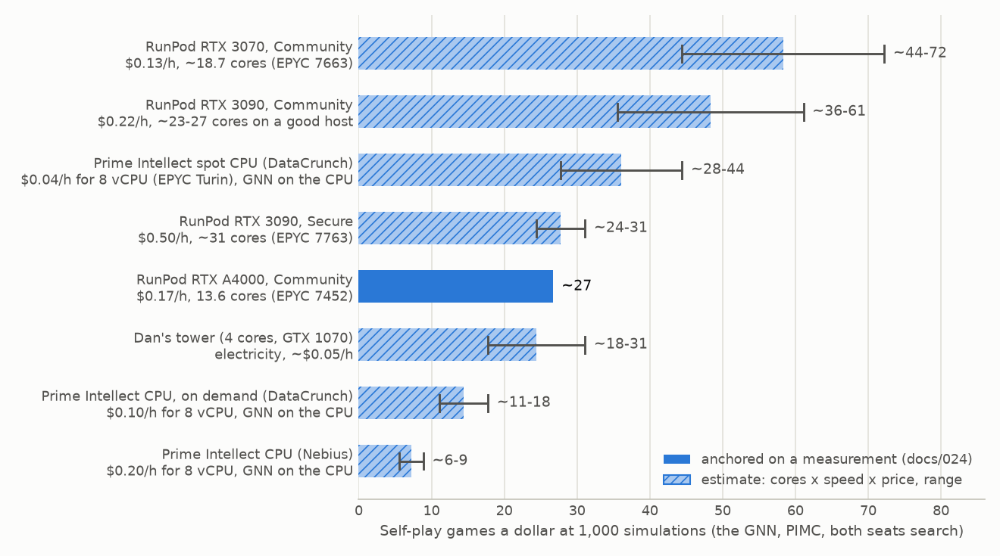

# Self-play from the imitation start: architecture and plan

*Revised 5 October 2026 (Pacific time). How we improve our best imitation-learned network by playing against itself:
the architecture, the method, and a loose plan of small experiments. Budgets and training sizes are left out; the
experiments will set them. The loop's code is built and passed a smoke test on the laptop (§3.4).*

## The architecture in one picture

```
 WORKERS: many, on any machine with CPUs (r1's spare cores, laptop, tower, RunPod pods, Prime Intellect spot CPUs)
   play self-play games with PIMC search at 1,000-3,000 simulations a decision, using the current weights
   (the GNN runs on the machine's own GPU, or on its CPU)
        │ upload finished games (a batch every ~30 min)          ▲ download new weights (every few hours)
        ▼                                                        │
 HUGGING FACE: the public dataset danbrooks/draftzero-selfplay-games, and a private repo for the weights
   weights/       the current network, plus every 10th version (private for the first version)
   games/         every finished game: positions, the search's answers, results
   control.json   which version to play, the search settings, evaluation assignments
        │ read new games                                         ▲ publish new weights
        ▼                                                        │
 TRAINER: exactly one, running continuously (r1's GPU; any GPU can take over)
   trains on the new games (plus 15% human rows, and a KL penalty toward the imitation network)
```

- **Workers never compute gradients.** They turn compute into training examples: a position, the search's answer
  there, and who won. All training happens on the trainer, which holds the only master copy of the weights and the
  optimizer. This is the actor-learner pattern of AlphaZero, KataGo and Ape-X (docs/007).
- **No machine connects to another;** each only talks to Hugging Face. The laptop, the tower, r1, rented pods and
  Prime Intellect nodes all run the same worker program.
- **Games are the cost.** Training takes minutes of one GPU per thousand games; a self-play game at 1,000
  simulations takes a worker hours (§4).

## The components

| Component | What it does | Where it runs | Code |
|---|---|---|---|
| **Network** | the GNN (MageZero's graph network: width 256, FFN 1,024, ~13M parameters), starting from the full run's best checkpoint: a policy over the legal options and a value (the chance of winning) | served to the search by `graph_server.py`: on the machine's GPU, or its CPU | exists (`graph_net.py`, `graph_server.py`) |
| **Search** | PIMC with one world: deal the hidden cards once, in a way that fits everything seen, then run MageZero's tree search on that deal, with the network's policy as priors and its value at the leaves | inside each Java game worker | exists (`play.py --method pimc`, `BenchSearch.searchTree`) |
| **Belief service** | guesses the opponent's deck and hand from real 17lands decks that fit the cards seen so far | one per worker machine | exists (`belief_server.py`) |
| **Game worker** | XMage plus a MageZero bot: plays a whole game with both seats searching, and records every searched decision | Java processes, about one per core | built (`play.py`, `BenchPlayer`, with graph records and exploration) |
| **Worker supervisor** | reads the control file, fetches new weights, runs chunks of games, uploads them in batches with a heartbeat | one per machine | built (`selfplay/worker.py`) |
| **Store** | the public dataset (games, control file) and a private repo (weights, the trainer's state) | Hugging Face, or a local folder on one machine | built (`selfplay/store.py`); the dataset exists, the private repo to create |
| **Trainer** | turns new games into training rows and fine-tunes the GNN continuously: toward the search's choices and the games' results, anchored to the imitation network; publishes new weights | one GPU (r1's) | built (`selfplay/trainer.py`, `selfplay/gnn_train.py`) |
| **Controller** | the settings for each version, evaluation assignments and their tests, stall alerts, a status page | beside the trainer | built (`selfplay/controller.py`) |
| **Evaluator** | head-to-head games between versions, and the ladder against the heuristic bot | any worker, on assigned shards | built (`selfplay/evals.py`; `play.py --bot2-graph-ports`) |
| **Provisioner** | rents machines, each with a hard time cap, and removes them | the laptop | exists for RunPod (`run_pod.sh`, `cpu_grab.sh`, `runpod_arm.sh`); `prime pods create` for Prime Intellect |

## Decisions

- **Network:** the GNN (docs/022-024), starting from the full run's best checkpoint. The MLP stays as a reference
  opponent.
- **Search:** PIMC with one world, for self-play and evaluation, at a large budget the experiments will set.
- **Training:** one continuous trainer, with a KL penalty toward the starting network and human rows in every batch.
- **One machine or many:** the same programs run either way. On one machine, every role runs on one box with a local
  folder in place of Hugging Face; on many, workers anywhere share the Hugging Face store. The trainer is the same in
  both.
- **Storage:** games and the control file in the public dataset; the weights and the trainer's state in a private
  repo for the first version.

## 1. How the network learns from its own games

### 1.1 Where we start

The GNN reads a position as a graph (~224 nodes and ~454 edges: cards, their statuses and how they relate). It
imitates top players better than our flat networks (test set NLL 0.214 against the MLP's 0.229; the full run is
lower still) and, so far, plays better. Against the heuristic bot at 100 simulations, both searching with PIMC and
guessing the opponent's deck (docs/024; the MLP on the same deck pairs, docs/019 §4.6):

| The network's simulations | GNN | MLP |
|---|---|---|
| 0: the policy alone | **won 43% of 103 paired games** | 40% of 100 |
| 100 | **64% of 103** | 57% of 100 |
| 300 | **68% of 103** | 60% of 103 |

Each deck pair is played twice with the seats swapped, which removes most of the luck of the decks.

### 1.2 The loop

**Expert iteration** (AlphaZero's training):

```
 network v ──► self-play with PIMC (its policy as priors, its value at the leaves)
     ▲                                  │
     │                                  ▼
 network v+1 ◄── fine-tune from v: policy toward the search's choices, value toward the results,
                 a KL penalty toward the starting network, human rows in every batch
```

The search is the teacher: with 100 simulations it turns a 43% policy into a 64% player. Training the network to
match the search raises its prior, and a better prior makes the next search stronger. The value learns from the
results of games played by that stronger player, on the positions the search actually reaches.

### 1.3 Targets and the anchor

- **Policy target:** the search's visits over the legal options. Recording each option's value too lets us switch to
  Gumbel AlphaZero's sharper "completed-Q" target offline.
- **Value target:** the game's result blended backwards with the search's root values (TD(λ), λ ≈ 0.99), from a
  capped number of positions a game, since every position of a game shares one result.
- **KL penalty toward the starting network,** β·KL(π_start ‖ π), β starting high and annealed down (AlphaStar,
  piKL, Diplodocus). With search targets it amounts to training on the mixture (π_search + β·π_start)/(1 + β).
- **Human rows in every batch (~15%),** which anchor the value too and cover positions self-play never reaches.
- **The aim is to stop forgetting, not drift:** the policy should move away from the humans where search finds
  better moves. So every change is judged on strength and on the human validation rows together.

### 1.4 Exploration

PIMC as built plays the most-visited option and adds no noise, so nothing makes the search try a move the prior
underrates. For self-play only: **root Dirichlet noise**, and **moves sampled in proportion to visits** for each
seat's first few turns. Evaluations stay greedy.

### 1.5 The search budget

- **Large, because good games make good targets.** PIMC kept gaining up to 1,000 simulations (the MLP: 63% → 67% →
  76% at 100 → 300 → 1,000, with the real decklist), where IS-MCTS stalled at 300. It was also 1.65-1.9× faster per
  decision than IS-MCTS at the same agreement with top players (measured on an RTX 3090).
- **The cost grows with the budget almost one for one** (§4). Ways to afford it, to test:
  - **Playout cap randomization** (KataGo): a full search on a share of decisions, which alone become policy
    targets, and a fast one on the rest.
  - **Skip searches that can't matter:** at 100 simulations, 21% of decisions put ≥95% of the visits on one option.
  - **Cheaper serving:** with PIMC, waiting on the network is most of a simulation.

### 1.6 Value data, reuse and versions

- **Cheap value data:** games of the policy alone against itself run ~530 an hour on a $0.17/h pod, hundreds of times
  cheaper than searched games (AlphaGo's value network learned from its policy's self-play). Their results estimate
  the policy's chances rather than the search's; an experiment compares the two sources.
- **Sample reuse ~4:** each position is trained on about 4 times over its life (KataGo's cap); training is cheap,
  so the cap is what stops over-training a few games.
- **A window of the newest few thousand games,** growing with the run, plus the human rows.
- **A new version every few hours,** once enough new games have arrived. A game is played by one version from start
  to end, and records it.

## 2. The plan: making sure we improve a good policy

Stages and small experiments, each answering one question as cheaply as it can. The next step depends on what the
last one shows.

**Principles:**
- **The starting network never changes.** Every version is judged against it on the same deals, and against the
  heuristic bot as an outside reference.
- **One change at a time** from a known-good start.
- **Cheap signals often, expensive ones at milestones:**

| Check | What it shows | When |
|---|---|---|
| Offline: the human validation rows (set NLL, top-1, how often it passes); held-out self-play games (value calibration, KL to the start) | forgetting, collapse, value quality | every version |
| The policies alone, head-to-head with the start (greedy, a few thousand games) | whether the prior improved | often (cheap) |
| Head-to-head at 100-300 simulations, paired deals, a sequential test that stops once the answer is clear | strength, cheaply | every few versions |
| Head-to-head at the training budget; the ladder against the heuristic; 17lands card statistics | strength where it counts; an outside reference; whether card values move toward the humans' | milestones |

**Step 0: build** (done 5 October, §3.4, except where noted):
1. **Graph records:** each searched decision's graph, each option's visits, value and prior, and the option played;
   each game's seed and the version that played it. *Done.* Whether that is enough to replay a game for a future
   encoder is unverified.
2. **Graph self-play tables** (`selfplay/tables.py`). *Done.*
3. **The GNN's self-play training:** soft targets, the KL toward the starting network, starting from a checkpoint,
   human rows (`selfplay/gnn_train.py`, on `graph_supervised.py`'s pieces). *Done; the human rows are untested,
   because the laptop has no human graph tables.*
4. **Exploration** in PIMC (root Dirichlet noise, sampled early moves). *Done.* **Playout cap randomization:** not
   built.
5. **Separate servers per bot** in `play.py`, so one version can play another. *Done.*
6. **The loop's programs:** worker, trainer, controller, the store, the sequential test, single-machine mode. *Done.*

**Step A: baseline the start.** Its ladder against the heuristic and its 17lands card statistics (docs/024); its
value head on its own games (calibration, AUC); and the GNN's speed on one CPU-only machine.

**Step B: is there signal?** The starting network plays a batch of self-play games. They need no new weights, so any
machines can play them. A handful of training arms (anchored; no anchor; value only; a stronger anchor) train on the
same games, and each is played against the start. Done when an arm clearly wins without forgetting, or we know why
none does.

**Step C: does it compound?** The full loop on one machine: the trainer and workers on r1. Done when several
versions in a row each beat the last milestone, or the gains stall and we know why.

**Step D: more machines.** The same loop with workers on rented pods, Prime Intellect spot CPUs and home machines,
through Hugging Face. Done when the games an hour scale and the curves look like Step C's.

**Small experiments,** run as the questions come up: the search budget and playout cap randomization; the anchor's
strength and the share of human rows; where the value's data comes from; exploration on or off; how many passes over
each position; whether a gain at 100-300 simulations holds at the training budget.

**When something looks wrong:**

| What we see | Likely cause | What to try |
|---|---|---|
| Nothing changes at all | a pipeline bug | identity checks (a learning rate of 0 gives back the start; a huge β leaves the policy unchanged); probe positions printed for every version |
| The human-row NLL climbs while strength stays flat | forgetting | a larger β or more human rows; a lower learning rate |
| The policy gets very sharp, or passes far more or less than before | over-training on few games | more games per version, less reuse |
| The value's calibration on held-out games worsens | memorising results | fewer value positions a game, cheaper value data, a value-only arm |
| Better at 100 simulations, not at the training budget | the policy improved, the value didn't | work on the value |
| Better against the start, not against the heuristic | a strategy that beats only itself | more games against past versions and the heuristic |
| Engine errors or failed actions rise for a version | the bot exploiting engine quirks | inspect those games and the cards involved |

## 3. Architecture details

### 3.1 How the pieces work

- **Workers** run the network beside the games, since every simulation waits on it: on the machine's GPU (2-3
  server processes), or on its CPU. They play chunks of games with fixed weights, upload a batch of finished games
  about every 30 minutes with a heartbeat in the same commit, and keep Java logs locally unless a game hit an engine
  error.
- **Weights** are pulled, not pushed. Every few minutes a worker asks Hugging Face for the latest commit and reads
  `control.json` at that commit (reading by path can return a stale cached copy). When it names a newer version,
  the worker downloads it (~27 MB in fp16), starts new servers beside the old ones, and switches at its next game.
- **One trainer.** Each new game becomes ~800 training samples (~169 positions, ~4 passes, plus human rows); r1
  trains ~6,500 a second, so a thousand games' worth takes ~2 minutes (~8 on an RTX 3090). More trainers would only
  re-train the same games. It keeps no state between versions that isn't in the store, so any GPU machine can take
  over; a lease file stops two from running at once.
- **Evaluations** are small shards (20 games) that the controller assigns to workers in `control.json` and reassigns
  when results are late. Both networks of a game run on the same machine, so its speed can't bias who wins.
  Evaluation games use the test split's decks and never become training data.
- **Failures:** a lost worker loses only games it hadn't uploaded (at large budgets it can upload decisions as it
  goes); a lost trainer is replaced from the store; a bad version is stopped by offline checks before workers see it;
  every rented machine has its own hard time cap.

### 3.2 Storage layout

```
public dataset (danbrooks/draftzero-selfplay-games)
  control.json                                    what every worker should be doing (below)
  games/v0007/<machine>/<machine>-<time>-<chunk>.jsonl.gz
                                                  a batch of finished games, one line per seat per game
  evals/<job>/<shard>.jsonl.gz, summary.json      evaluation games; the result once the job closes
  heartbeats/<machine>.json                       written in the same commit as each batch
  learner/lease.json, ingested.json, status.json  the current trainer; which batches it has read; its last update
  status.json, status.md                          the controller's summary page
  stop.request                                    written by `dz selfplay stop`

private repo (the weights, for the first version)
  weights/v0007.pt.gz, weights/latest.json        each version's weights, and which one is newest
                                                  (kept: v0, the newest few, every 10th, any an evaluation needs)
  learner/full.pt.gz                              weights and optimizer state, so any trainer can resume
```

```
control.json: {"version": 7, "weights": "weights/v0007.pt.gz", "sha256": "...", "start_weights": "weights/v0000.pt.gz",
               "play": {"method": "pimc", "simulations": 1000, "root_noise": 0.25, "sample_turns": 3,
                        "pool": "data/pools/train.txt", "past_share": 0.2, ...},
               "evals": [{"job": "v0006-vs-v0000", "a": 6, "b": 0, "simulations": 100, "pairs": 500,
                          "shards": [{"id": 0, "min_pair": 0, "max_pair": 9, "machine": "r1", "done": false}, ...]}],
               "stop": false}
```

- **Commits:** Hugging Face allows 128 an hour per repo on a free account. A batch per worker per ~30 minutes, a lease
  renewal every 10 minutes and a version every few hours fit up to ~50 machines.
- **History:** replaced weights stay in a repo's history; a periodic `super_squash_history` keeps it to its current
  files.
- **Tokens:** workers' fine-grained token (`HF_SELFPLAY_TOKEN`) writes the dataset; it also needs read access to the
  private weights repo. The trainer's token writes both. The laptop's full-access login never goes on a rented
  machine.
- **On one machine,** the same layout lives in a local folder, and nothing is uploaded.

### 3.3 What carries over from docs/007

Workers only make outbound calls; every game carries the version that played it; sample reuse is capped; there is no
gating; workers are disposable and every rented one has a hard time cap; no Ray or Kubernetes. What's new: the
network runs on cheap CPUs as well as GPUs, the unit of work is a batch file of games, and training is so cheap that
one trainer always suffices.

### 3.4 The code (built 5 October)

The loop is the package `src/draftzero/selfplay/`, one command per role, and one YAML file every role reads
(`configs/selfplay_gnn.yml`; `configs/selfplay_smoke.yml` for the smoke test).

| Module | What it does |
|---|---|
| `config.py` | the run's settings: network, starting checkpoint, search and exploration, worker, trainer, evaluation; unknown keys are errors |
| `store.py` | the shared store: `LocalStore` (a folder: one machine) or `HFStore` (the public dataset, plus an optional private repo for the weights and the trainer's state); several files go up as one commit |
| `control.py` | `control.json`'s schema, and where things live in the store |
| `records.py` | packs a chunk of `play.py` games into one batch file: a line per seat per game, tagged with the version that played it and whether its decisions are training data |
| `tables.py` | batches to training rows: the GNN's graph rows (visit shares as targets, TD(λ) values, held-out games), kept per batch as `.npz`; the flat MLP's soft tables |
| `gnn_train.py` | the GNN's update, built on `graph_supervised.py`'s checkpoints, batches and option logits: policy toward the search, value with a cap per game, KL toward the start, human rows; checks on held-out games |
| `worker.py` | one per machine: sizes itself from its cores and memory, runs the network servers for the versions it needs, plays a self-play chunk or an assigned evaluation shard with `play.py`, uploads the batch and its heartbeat together |
| `trainer.py` | exactly one, under a lease: publishes the starting network as version 0, ingests batches, trains once enough new positions are in, publishes versions, prunes old weights, saves its full state |
| `controller.py` | the only writer of `control.json`: moves it to new versions, opens evaluations, assigns their shards, scores them with the sequential test, writes `status.md` |
| `evals.py` | evaluation jobs and shards, scoring, and the sequential test |
| `local.py` | single-machine mode: the three roles as processes on one box, with a hard time cap |
| `cli.py` | `dz selfplay worker / trainer / controller / local / status / stop` |

```
one machine:     dz selfplay local --config configs/selfplay_gnn.yml --store runs/selfplay/gnn-1 --max-hours 24
many machines:   dz selfplay trainer    --config configs/selfplay_gnn.yml --store "hf://danbrooks/draftzero-selfplay-games?weights=<private repo>"
                 dz selfplay controller --config configs/selfplay_gnn.yml --store <the same>
                 dz selfplay worker     --config configs/selfplay_gnn.yml --store <the same>      (every game machine)
any time:        dz selfplay status --store <store>          dz selfplay stop --store <store>
```

**In the engine and `play.py`:**
- `BenchPlayer` records a graph network's decisions (`graphRecord`): the root's state graph as the search encodes
  it, each option's graph node, and per option its visits, backed-up value and prior, plus the option played. Flat
  records gained the same per-option fields.
- Self-play exploration: root Dirichlet noise in the tree search (`rootNoise`), and moves drawn by visit counts for
  each seat's first turns (`sampleTurns`). Both are off unless asked for, and evaluation games never ask.
- `play.py --bot2-graph-ports` (and `--bot2-ports`): each bot reads its own servers, so one version plays another,
  with the two games of a deck pair sharing their seed.

**The toy test (5 October, the laptop):**
- `tests/test_selfplay.py` (11 tests: the store, settings, batches, graph rows, a GNN update that learns on toy
  graphs and round-trips its checkpoint, the controller, the trainer's lease and pruning). The full suite passes
  (448 tests).
- `dz selfplay local` with `configs/selfplay_smoke.yml`: the full run's GNN at 8 simulations, 2 game workers, CPU
  only. In ~9 minutes the run:
  - played 12 self-play games, one chunk of them against the starting network;
  - published versions 1 and 2 (38 and 51 training steps, 15-21 seconds each on the laptop's CPU);
  - switched the worker's servers to each new version;
  - played and closed both evaluations (4 games each, undecided, as expected at that size);
  - stopped by itself.

  Policy loss fell from 0.94 to 0.86 between the two updates while the KL to the start rose from 0.019 to 0.036.
- **Graph records came to 0.15-0.33 MB a game** gzipped, with games capped at 20 turns. Every searched decision of
  the GNN's games carried its graph and options.
- The smoke test checks the plumbing, not strength or timings at real budgets.

**Not done yet:**
- **The GNN's human rows** are built on `graph_supervised.py`'s loader but untested: the laptop has no human graph
  tables.
- **The flat MLP's path** (`supervised.py` with the soft table, the KL and the starting checkpoint) is built but
  hasn't run end to end.
- **The Hugging Face store** is built but hasn't run against the real dataset; the private weights repo doesn't
  exist yet.
- **Playout cap randomization** and the confident-prior shortcut are not built.

## 4. Hardware: games an hour, games a dollar

A self-play game is ~169 searched decisions, both seats searching with PIMC. Everything is CPU work except serving
the network. **The anchor:** on a Community RTX A4000 pod ($0.17/h, 13.6 cores, the GNN on its GPU), the GNN at 100
simulations against the heuristic played ~79 games an hour, almost all of it the GNN's side (docs/024). So
**self-play runs ~40 games an hour, ~3 an hour per core.** The other rows scale that by usable cores, core speed
(newer cores ~1.3-1.6× faster, docs/020) and price.

**Scaling with simulations:** from 100 to 300 a game took 2.6× as long, and the cost per simulation is flat beyond
that. So divide the games a dollar at 100 by ~9 at 1,000 and ~28 at 3,000. At 1,000 a game holds a worker ~2-3 hours.

| Machine | $/h | Usable cores | Games/h at 100 sims | Games/$ at 100 | at 1,000 | at 3,000 | Basis |
|---|---|---|---|---|---|---|---|
| RunPod RTX A4000, Community | 0.17 | 13.6 | ~40 | ~240 | ~27 | ~9 | measured (docs/024), halved for two searching seats |
| RunPod RTX 3070, Community | 0.13 | ~18.7 | ~55-85 | ~400-650 | ~45-70 | ~15-25 | estimate; hosts are hit and miss |
| RunPod RTX 3090, Community | 0.22 | ~23-27 on a good host | ~70-120 | ~320-550 | ~35-60 | ~11-20 | estimate; host quality varies |
| RunPod RTX 3090, Secure | 0.50 | ~31 | ~110-140 | ~220-280 | ~25-30 | ~8-10 | estimate; dependable |
| **Prime Intellect spot CPU** (DataCrunch, 8 vCPU) | 0.04 | 4 cores | ~10-16 | **~250-400** | ~28-45 | ~9-14 | estimate; the GNN on the CPU, unmeasured; preemptible |
| Prime Intellect CPU, on demand (DataCrunch, 8 vCPU) | 0.10 | 4 cores | ~10-16 | ~100-160 | ~11-18 | ~4-6 | estimate |
| r1 (Dama's box) | free | ~14 workers beside the trainer | ~45-65 | – | – | – | estimate |
| Dan's laptop (the GNN on its CPU) | free | 8 | ~10-15 | – | – | – | estimate |
| Dan's tower (4 cores, GTX 1070) | ~$0.05/h of electricity | 4 | ~8-14 | ~160-280 | ~18-30 | ~6-10 | estimate |
| *Policy alone, both seats (value data)* | *0.17* | *13.6* | *~530* | *~3,000* | – | – | *measured (docs/024)* |



*Figure 1. Games a dollar at 1,000 simulations (`tools/selfplay/fig_doc021.py`).*

- **The cheapest games are on Community GPU pods and Prime Intellect's spot CPUs,** when good hosts are available. A
  Secure 3090 costs about twice as much per game but starts reliably.
- **Pick machines by cores per dollar, not GPU:** a cheap card serves the network as well as an expensive one.
- **The GNN on CPU-only machines is the big unknown.** It takes ~10 ms an evaluation on one CPU thread, against
  ~45-60 ms of engine work a simulation, so serving it should cost a quarter to a third of the machine's throughput.
  Step A measures it before CPU-only machines join.

## 5. The feature vocabulary

- **The GNN's vocabulary** is ~1,932 kinds of leaf (cards, statuses, zones) and 22 edge labels, from the human games.
  Self-play uses the same cards, so new leaves should be rare; count them on the first self-play graphs.
- **For the flat MLP it was measured:** self-play states hit its vocabulary as often as unseen human states (62% of
  feature occurrences against 60%); at most ~2% were new.

## 6. Risks

- **Strength measured only against ourselves:** the heuristic ladder runs at every milestone, and past versions stay
  in the opponent mix.
- **The loop finds engine bugs:** watch per-card win rates, failed actions and engine errors by version.
- **Value overfitting:** cap the value positions a game, and judge the value on held-out games.
- **Long games on spot machines:** at large budgets a preempted worker can lose hours; upload decisions as they go.
- **r1 is shared:** its 40 GiB holds the trainer and ~14 workers, other workstreams use its GPUs, and its container
  is evicted if its scratch disk passes ~40 GB.

## 7. Later ideas

- **Cheaper network serving:** batch each worker's requests, or evaluate the network inside the Java process.
- **A student network for CPU workers,** distilled from the GNN, if the GNN is too slow on CPUs.
- **Gumbel root search,** for policy improvement with far fewer simulations.
- **Reanalyse** (MuZero): re-search stored positions with the newest network, rebuilt from the replay logs.
- **An opponent head** for the search's opponent decisions, trained on 17lands' records of opponents' plays.
- **A faster engine:** mtg-kernel's Foundations support (docs/015) would change every number in §4.

## References

- Anthony, Tian and Barber (2017). *Thinking Fast and Slow with Deep Learning and Tree Search.* [arXiv 1705.08439](https://arxiv.org/abs/1705.08439).
- Bakhtin et al. (2023). *Mastering No-Press Diplomacy via Human-Regularized RL and Planning* (Diplodocus). [arXiv 2210.05492](https://arxiv.org/abs/2210.05492).
- Danihelka et al. (2022). *Policy improvement by planning with Gumbel.* ICLR.
- Jacob et al. (2022). *Modeling Strong and Human-Like Gameplay with KL-Regularized Search* (piKL). [arXiv 2112.07544](https://arxiv.org/abs/2112.07544).
- Schrittwieser et al. (2021). *Online and Offline Reinforcement Learning by Planning with a Learned Model* (Reanalyse). [arXiv 2104.06294](https://arxiv.org/abs/2104.06294).
- Silver et al. (2016, 2017, 2018): AlphaGo, AlphaGo Zero, AlphaZero.
- Vinyals et al. (2019). *Grandmaster level in StarCraft II using multi-agent reinforcement learning* (AlphaStar). Nature 575:350.
- Wu (2019). *Accelerating Self-Play Learning in Go* (KataGo). [arXiv 1902.10565](https://arxiv.org/abs/1902.10565).
