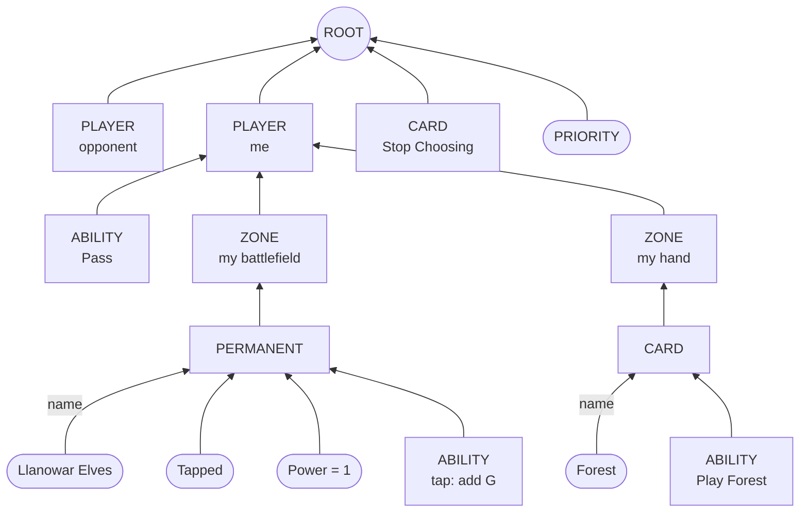

# Testing MageZero's graph network for imitation learning

*A proposal, 4 October 2026 (evening, Pacific time). Will Wroble (inkling_6 on Discord) wrote a graph neural
network (GNN) for MageZero on 3–4 October: branch `graph-encoder` of [WillWroble/mage](https://github.com/WillWroble/mage/tree/graph-encoder)
(the state encoder) and of [WillWroble/MageZero](https://github.com/WillWroble/MageZero/tree/graph-encoder) (the
network, trainer and server). This plan runs it through experiment #4's gauntlet, the one the transformer and the MLP
went through ([docs/017](017-experiment4-scaling-up-imitation-learning.md), [docs/018](018-experiment4-run-log.md),
[docs/019](019-imitation-learning-report.md)): get it working, tune it, train it at scale, evaluate it. The
engineering it needs (stage 0) is done, and a planning pod measured its speed and checked that it learns (§2). RunPod
spend so far: $0.27.*

## Read this first

**The question.** Will expects the GNN to generalize better than the flat networks: to unseen decks, opponents and
cards. He also expects it to be less sample-efficient ("much more data hungry than the flat bag"). Experiment #4
has 12.1M labelled decisions from 146k top players' games, plus 624k more games in the rest of the 17lands file.
So: **trained by imitation on the same decisions, does the GNN beat the MLP and the transformer?** That means on
held-out decisions, on rare and unseen cards, and in games.

**The approach: the same gauntlet on the same rows.** A second encoder runs during the same replays, so every
decision gets a graph *and* its flat features. The GNN trains on exactly the rows, labels, splits, losses and
validation sets that the MLP and the transformer used. Its measures are computed by the same code. Every comparison
is paired, row for row and game for game.

| Stage | What | Where | Time | Cost |
|---|---|---|---|---|
| **0. Engineering** | graph encodings in the build, graph tables, the GNN's trainer, graph search, a server, tests | laptop | **done** | – |
| **1. Build** | all 161k games again, with graphs; check that the flat tables match experiment #4's row for row | one 28-vCPU pod | ~4–5 h | ~$1–2 |
| **2. Get it working, then a sweep** | 14 runs on the same 10% of the games, quarter-epoch learning curves | r1 (free) or a 3090 | ~5 h on a 3090 | $0–1 |
| **3. Scale check, then the large training** | the best 2–3 recipes on 30%; then all the games, 1–3 epochs | r1 or a 3090 | ~6 h + ~3.5 h per epoch on a 3090 | $0–4 |
| **4. Offline evaluation** | the test split ([docs/019 §4.1](019-imitation-learning-report.md)'s table, plus a GNN column); rare decisions; a **held-out-cards test** of the generalization claim | r1 / laptop | hours | $0–1 |
| **5. Games** | the policy alone, `gnn@100` and `gnn@300` against `heuristic@100`; **`gnn@100` against `mlp@100`** on the same deals | 3090 pods | ~6 pod-hours (+5 for GIH) | ~$2–5 |
| **Total** | | | ~3 days | **~$5–12** |

**What we found while planning** (§2):

- **The GNN reads far fewer tokens.** A decision state is ~224 graph nodes (~82 objects, ~142 leaves) and ~454
  edges, against ~1,400 flat features.
  - Its vocabulary on 4,000 games is 1,753 leaf strings, against the MLP's 25,563 features on the same games. The
    thresholds differ (seen in more than 10 states for the GNN, more than 3 for the MLP).
  - Compressed, a graph row takes ~1.0 KB on disk, against ~1.4 KB flat.
- **Every legal option maps to graph nodes:** 0 misses in 266,626 training rows.
- **It learns, but on 4,000 games it trails the MLP clearly** (Figure 1, §2.3). Both trained one epoch on the same
  2.4% of the training games:
  - set NLL: 0.343 for the GNN against 0.267 for the MLP;
  - top-1 when the human acted: 0.721 against 0.789;
  - attacks: 0.711 against 0.803.

  Three epochs close part of the gap (0.320, 0.742, 0.739). The GNN doesn't block yet: it answers "no block", the
  base rate. It passes too often in the opponent's turn (98% against the humans' 93%). Two quick learning-rate and
  dropout variants didn't help. Will predicted exactly this ("less sample efficient"), so the real test is at 10%
  and 30% of the games (stages 2–3).
- **It is cheap on a GPU and dear on a CPU.** On an RTX 3090 it evaluates 3,465 states a second at batch 32. That
  is faster than experiment #4's transformer on the same card (~1,270). On one CPU thread it takes 30 ms a state,
  like the transformer and ~10× the MLP. Games need a GPU server, as the transformer's did. One server process feeds
  ~650 states a second to 28 concurrent searches, so a pod needs two or three.
- **It trains at 1,233 states a second on a 3090** (batch 64; 1,596 at batch 256). That is about half the
  transformer's rate in experiment #4: an epoch of all 10.9M training rows takes ~2.5 hours on a 3090.

**Decisions for review** (§3 has the reasoning):

1. **Same engine, Will's encoder.** The graph encoder is copied into the bridge at a pinned commit
   (`java/mzbridge/graph_sync.sh`), and the engine stays experiment #4's v0.2 build. Will's branch also changes the
   engine. Taking those changes would confound "a better network" with "a different engine and search".
2. **Imitation losses as in experiment #4.** The softmax runs over the legal options only, and the labels are set
   labels; Will's trainer instead softmaxes over every node of a head's type, legal or not. We keep the value head
   but train it with experiment #4's cross-entropy on TD(0.99) targets, where Will's uses MSE.
3. **Attacks and blocks as on Will's branch.** "Attack with X?" becomes a target choice: Stop Choosing (no) or the
   defending player (yes), with X marked by a `DecisionSource` edge. In games, a small subclass of MageZero's
   simulation player records the attacker, the blocker and a target's source, so search and training see the same
   graphs.
4. **The deciding comparisons are paired.** `gnn@100` and `mlp@100` play the same deck pairs and deals, against
   `heuristic@100` and against each other. Offline, all three networks are scored on the same rows.
5. **One GNN-specific test: held-out cards** (§4.4). Train the GNN and the MLP on the same 30% of the games, with
   every game whose player's deck holds one of ~8 chosen cards removed. Then score both on test decisions involving
   those cards. This is the most direct test of Will's generalization claim we can afford.

**Questions for Will** are in §6. Follow-ups that aren't in this plan are in §7.

<picture>
  <source media="(prefers-color-scheme: dark)" srcset="img/022-curves-dark.png">
  
</picture>

*Figure 1. The GNN against experiment #4's MLP recipe on 2.4% of the training games (4,000 games built on the laptop:
266,626 training rows; validation on 10,980 rows of the same games' validation split), by training rows seen. Small
data: this checks that the GNN learns, not how well it does at scale. Experiment #4's numbers at 10% and 100% are in
§4.*

## 1. The GNN, briefly

The flat networks read a state as a *bag* of ~1,400 hashed features. Each feature is a path such as "my battlefield /
creature / Llanowar Elves / tapped", and a policy head scores 1,024 action slots. The GNN reads a *graph* of the
same state:



*Part of a state graph: object nodes (rectangles) and leaves (rounded), edges from child to parent. A real state
has ~82 object nodes and ~142 leaves.*

- **Nodes.** Every game object is a typed node: a player, a zone, a card, a permanent, a stack object or an
  ability. Its attributes are *leaf* nodes, one per distinct string in the state, shared by every object that has
  that attribute: a card name, a type, a keyword, an ability's text, "Tapped", "Power = 1". Edges run from child to
  parent and carry labels such as `name`, `attachment`, `TARGET@0` or `DecisionSource`.
- **The network** (Will's `NetGraph`, ~35M parameters, almost all of them in its layers rather than its
  embeddings):
  - each node gets a type embedding, or for a leaf, the embedding of its string plus a bucket of its value;
  - two bottom-up passes run a small transformer layer per node type (ability, then card, permanent, stack
    object, zone, player, root), each node attending over its children;
  - two global transformer layers run over the state's object nodes and a CLS token;
  - per-node priority and target scores, and a yes/no head and the value head on CLS.
- **Actions are nodes.** A play is its ability's node, a target is its object's node, and Pass and Stop Choosing
  are nodes of their own. There is no deck- or set-specific action vocabulary, and a card the network has never
  seen still gets a node, built from leaves it knows: its types, its keywords and its rules text. That is the
  basis of Will's generalization claim.
- **His expected costs:** less sample-efficient than the flat bag (it must learn structure from attention), and
  more expensive at inference (a graph to serialize, a deeper network).

## 2. What the planning measured

Laptop (an M1 Pro) and one Community RTX 3090 pod (an Intel i5-14600KF, $0.22 an hour), on 4,000 top players'
games built with graphs: 266,626 training rows and 10,980 validation rows in the six tables experiment #4 trains on.
Details and commands: Appendix B.

### 2.1 Data

| | Flat (MLP, transformer) | GNN |
|---|---|---|
| Inputs per decision state | ~1,400 feature ids | ~224 nodes (~82 objects, ~142 leaves), ~454 edges |
| Vocabulary, the same 4,000 games | 25,563 features (k = 3; 62–96k on all the games) | 1,753 leaves, 14 edge labels (k = 10) |
| Action space | 1,024 hashed slots | the legal options' own nodes; 0 of 266,626 rows with an unmapped option |
| Table size on disk, gzip | ~1.4 KB a row | ~1.0 KB a row; ~12 GB for all 12.1M rows |
| Build time | – | +12% worker time with graphs (40 games, laptop) |
| Build shards | 16 GB for the full build | ~1.6 GB per 4,000 games with graphs: **~65 GB** for the full build (needs a 150 GB disk) |

- **The flat tables don't change.** The replay with graphs gives exactly the same flat rows, game by game, as
  without them.
- **The network is Will's, exactly.** Our copy (`graph_net.py`) and his `model.py` give identical outputs on the
  same weights and input (difference 0.0). Our checkpoints load in his server (`load_checkpoint`) unchanged.

### 2.2 Speed

| | MLP | Transformer | **GNN** |
|---|---|---|---|
| Parameters | 115M (~98M embeddings) | 40.6M (37.1M embeddings) | **35M (0.9M embeddings at 1,753 leaves)** |
| One evaluation, one CPU thread | ~0.4–3.7 ms | ~36–80 ms | **30 ms** (i5-14600KF; 33 ms synthetic on the M1 Pro) |
| GPU evaluations a second, batch 1 / 8 / 32 / 128 | ~33k (batch 32, r1) | ~360 / 1,000 / 1,260 / 1,270 (3090, MageZero's 2-layer default) | **181 / 1,239 / 3,465 / 5,392** (3090, bf16) |
| Training states a second, one GPU | 3,100–6,000 | ~2,100 (RTX PRO 6000, with evaluations) | **1,233** (3090, batch 64); 1,471 at 128; 1,596 at 256 |
| One epoch of all 10.9M training rows | 39 min (RTX PRO 6000) | ~85 min (RTX PRO 6000, with evaluations) | **~2.5 h** on a 3090, ~3–3.5 h with TD refreshes and evaluations; r1 untested |

| Serving (`graph_load.py`: concurrent single-state clients, one `graph_server.py` process on the 3090) | 1 client | 8 | 28 | 56 |
|---|---|---|---|---|
| States a second | 136 | 418 | 659 | 651 |
| Latency per call, median | 7.1 ms | 18.8 ms | 46.7 ms | 85.6 ms |
| States per GPU batch | 1.0 | 2.3 | 3.8 | 4.6 |

- **Games need a GPU server, and more than one process of it.** At 30 ms a CPU evaluation, the GNN costs as much
  as the transformer did. A search worker spends ~55–64 ms of engine time a simulation, so 28 workers ask for
  ~450 evaluations a second. One server process gives 659, at 47 ms a call: that would slow each simulation by
  ~70%. The limit is the server's per-request Python work, not the GPU, which runs 3,465 states a second at batch
  32. So run two or three replicas per pod (`play.py --graph-ports`), as experiment #4 did for its flat server.
- **Laptop game smoke test** (GNN served on the laptop's CPU, 24 simulations a decision, 70 decisions): 1,868
  network calls for 1,680 simulations. That is one per new node, one per decision's root, and 118 policy reads at
  shared nodes. 66 of those 118 came from an option missing from the node's policy (`graphPolicyMisses`, §3.3).

### 2.3 Learning: does it learn?

Both networks trained on the 4,000 games' training rows (266,626), with experiment #4's losses, the passivity fix
and TD(0.99) values, warm-up shortened to 300 steps. They were validated on all 10,980 rows of those games'
validation split. The MLP used experiment #4's final recipe (`configs/exp4_train_mlp_1ep.yml`), a recipe tuned over
~100 runs. The GNN used Will's network with no tuning (`configs/gnn_train.yml`).

| Validation | MLP, 1 epoch | GNN, 1 epoch | GNN, 3 epochs | GNN, lr 3e-4, dropout 0.1 | GNN, lr 1e-3, dropout 0.1 |
|---|---|---|---|---|---|
| Set NLL (lower is better) | **0.267** | 0.343 | 0.320 | 0.346 | 0.372 |
| Top-1 when the human acted (chance 0.474) | **0.789** | 0.721 | 0.742 | 0.718 | 0.710 |
| Attacks: accuracy (yes in 45%) | **0.803** | 0.711 | 0.739 | 0.635 | 0.447 |
| Blocks: top-1 (no block in 71%) | 0.694 | 0.722 | 0.716 | 0.716 | 0.716 |
| Spell targets: top-1 (201 rows) | 0.567 | 0.540 | **0.592** | 0.505 | 0.341 |
| Value: AUC | **0.615** | 0.536 | 0.547 | 0.552 | 0.500 |
| Value: log-loss (a coin: 0.693) | 0.940 | 0.691 | 0.685 | 0.679 | 0.676 |
| Pass on top, the opponent's turn (humans 0.931) | **0.932** | 0.982 | 0.963 | 0.988 | 0.989 |
| Training time on the 3090 | 52 s | 220 s | 663 s | 221 s | 220 s |

- **The MLP is far ahead at this size,** on every policy measure but spell targets, which are within noise on 201
  rows. The GNN's blocks are the base rate: it always answers "no block". At this size its policy is mostly
  learning *when*, not *what*.
- **The value heads fail differently.** The MLP memorises the 4,000 games' results. Its training value loss falls to
  0.31 and its validation log-loss climbs to 0.94, worse than a coin, while its AUC holds at 0.61. The GNN barely
  learns the value (training loss 0.66 → 0.63, AUC ~0.54), and memorises nothing.
- **More passes help the GNN, more learning rate doesn't.** Three epochs improve every policy measure, while lr 1e-3
  breaks the attack head. So the sweep keeps lr 1e-4 as its base and adds a three-epoch arm.
- **Rare moves** (`rare_eval.py`, the same rows): the GNN's deficit in top-1 is smaller on moves seen fewer than
  1,000 times in training than on commoner ones.

  | | MLP | GNN 1 ep | GNN 3 ep | GNN 1 ep deficit | GNN 3 ep deficit |
  |---|---|---|---|---|---|
  | Moves seen fewer than 1,000 times | 0.712 | 0.666 | 0.691 | −0.046 | −0.021 |
  | Moves seen 1,000–10,000 times | 0.833 | 0.743 | 0.764 | −0.090 | −0.069 |

  That is consistent with the GNN generalizing across cards, but it is one small run.
- **This is one point on a data-scaling curve,** 2.4% of the games, with a gap of 0.076 in set NLL at one epoch.
  Stages 2 and 3 add 10% and 30%. If Will is right, the gap shrinks along them.

## 3. Design decisions

### 3.1 The same decisions, encoded twice

The turns we replay exist only inside the engine during the replay, so the graphs can't be computed from the
existing tables: the build has to run again (docs/018: 2.5 hours on 28 workers, $1.82).

- **One replay, both encodings.** `build.py build --graph` asks the bridge for each decision's graph next to its
  flat features. `tables --graph` writes `<table>_<split>.graph.h5` beside each flat table, row for row
  (`graph_tables.py`). Labels, weights and metadata stay in the flat table.
- **The encoder is Will's, copied at a pinned commit.** `java/mzbridge/graph_sync.sh` copies `FeatureGraph` and
  `StateEncoder` from WillWroble/mage at `e4afc9c7` (4 October, 12:38 PM PT) into the bridge, with three edits:
  - the package name;
  - players named by seat relative to the agent ("PlayerA" is the agent, as in MageZero's own data; v0.2 lacks
    the one-argument `getEntityName` that upstream calls);
  - two MageZero-only hooks removed.

  Rerunning the script follows a newer commit.
- **Options as nodes.** Each legal option is the list of nodes behind it: one ability node per copy of a card, the
  target's node, Stop Choosing's node, Pass's node. Its logit is the log-sum-exp of those nodes' scores, so two
  copies of a card are one option, as the flat tables have them. v0.2's Pass ability has a random id, so the bridge
  maps it to the encoder's fixed Pass node, as Will's branch does by changing `PassAbility`.
- **Hidden information as in experiment #4.** The encoder shows only the deciding player's hand
  (`perfectInfo = false`).

### 3.2 Losses and measures

The GNN trainer (`graph_supervised.py`) is experiment #4's recipe on a different network:

- set NLL over the legal options for priority decisions (the label is the set of plays the player still had that
  turn), cross-entropy for targets, blocks and attacks;
- exact rows at weight 1, imputed rows at 0.5;
- the passivity fix (×3 on rows where the human acted);
- value on 16 positions a game, against TD(0.99) targets recomputed from the network;
- warm-up and cosine decay from 1e-4.

Validation rows are chosen by supervised.py's own functions, with the same seeds, so they are experiment #4's
validation rows. Every measure is computed by `supervised.evaluate`, fed the GNN's per-option scores.

Two departures from Will's trainer, both needed for comparability:

- **The softmax runs over the legal options,** like the flat networks'. Will's softmaxes over every node of the
  head's type (every ability, for priority) and trains toward MCTS visit counts. Ours puts no probability on
  illegal moves, and its set NLL compares directly with experiment #4's.
- **The value head is trained with cross-entropy on P(win)** (experiment #4's) rather than MSE. It is the same
  head with the same Tanh, so a checkpoint still loads in Will's server.

### 3.3 Search with the GNN

The games use experiment #4's IS-MCTS, belief worlds and heuristic baseline unchanged (`BenchSearch`, `BenchPlayer`).
For a graph network (`evaluator.type graph`):

- **Each node is encoded when it is evaluated,** from the paused simulation, as its flat encoding is: the
  searcher's seat as the agent, and only the decider's hand shown. Simulations run on `GraphMCTSPlayer`, MageZero's
  simulation player plus a record of the decision's source, attacker or blocker. Its attack and block loops are
  v0.2's, line for line.
- **Priors come from the options' nodes,** through MageZero's own softmax (temperature 1.5, +0.1 off Pass). A node's
  policy is kept by engine id, which stays the same across belief worlds for the searcher's own options. When an
  option has no node in that policy (a card that is only in this world), the network is called again in this world
  and the policies merge. These calls are counted as `graphPolicyMisses`.
- **The server** (`graph_server.py`) speaks MageZero's graph protocol and batches across games. Bots: `gnn`,
  `gnn_heur`, `gnn_bc`, `gnn_policy_greedy` and `gnn_policy_sampled` in `play.py`. A graph bot can play a flat one.

## 4. The plan

Each stage writes its numbers into a run log (docs/023) as it finishes, as experiment #4 did. If a stage costs 50%
more than planned, stop and report.

### 4.1 Stage 1: the build

```bash
python tools/imitation_scale/build.py build --graph --out data/imitation_graph --workers 28   # ~2.9 h
python tools/imitation_scale/build.py tables --graph --out data/imitation_graph               # ~1.5 h
```

- One 28-vCPU pod with a **150 GB disk**: the shards reach ~65 GB.
- **The check:** the new flat tables must equal experiment #4's (HF `exp4/tables/h5/`), game by game. Then every
  number in docs/018–019 holds for these rows, and the flat networks need no retraining.
- Upload the tables (~30 GB, flat and graph) to HF `exp4/tables_graph/`.

### 4.2 Stage 2: get it working, then the sweep

- **Get it working:** Will's network with experiment #4's recipe (`configs/gnn_train.yml`), one epoch of the same
  10% subset (1.1M rows; ~15 minutes on a 3090 plus evaluations), against the 10% MLP (set NLL 0.258) and
  transformer (0.285). Check the learning curve, Pass on top in the opponent's turn against the humans' 0.934, and
  that the value head learns.
- **The sweep** (`configs/gnn_sweep.yml`, 14 runs): one setting at a time around that base, plus a second seed:
  - learning rate 3e-4 and 3e-5;
  - batch 256;
  - the leaf table's learning rate ×10;
  - three epochs of the same 10%;
  - the passivity fix at ×5;
  - dropout 0.1 (Will's is 0.25), alone and with leaf dropout;
  - one local pass, one global layer, width 256, four global layers.

  Each run takes ~20 minutes on a 3090; the three-epoch run takes ~1 hour.
- **The rule (fixed now):** keep the base unless a setting beats it by more than twice the seed-to-seed difference
  on set NLL, is no worse on value AUC, and costs less than 25% more inference.
- **The first scaling check.** At 2.4% of the games the gap to the MLP was 0.076 in set NLL at one epoch (§2.3).
  - **Smaller at 10%:** go on to stage 3.
  - **No smaller:** Will's data-hunger reading already looks doubtful. Look at the learning curves and the
    three-epoch arm before spending more.

### 4.3 Stage 3: scale check, then the large training

- **30% of the games** (3.3M rows; the subset experiment #4 used): the best two or three recipes, one epoch each,
  against the 30% MLP (0.241) and transformer (0.256). One recipe also runs 3 epochs on the same 30%. Experiment
  #4's MLP overfit on repeats, while its transformer gained from them.
- **The data-scaling question:** compare the GNN's gap to the MLP at 10% and at 30%.
  - **The gap narrows:** the GNN is data-hungry, as Will expects. Train on all the games, and consider more data
    (§7).
  - **It doesn't narrow and the GNN trails by more than twice the noise:** stop after stage 4's offline tests, and
    skip the games.
- **The large training:** all 10.9M training rows, one epoch, or 2–3 if the 30% check says repeats help.
  `best_policy` and `best_value` are kept apart. ~2.5 hours an epoch on a 3090, likely less on r1's Blackwell.
- **The data path at full scale:** the graph arrays (~60 GB in memory) are cached as memory-mapped `.npy`
  (`data_cache`), because r1 has 40 GiB of RAM. Loading the 4,000-game tables took 26 seconds; all the rows will
  take ~20 minutes once, then seconds.

### 4.4 Stage 4: offline evaluation

- **The test split, row for row:** docs/019 §4.1's table with a GNN column: set NLL, top-1 when the human acted,
  attacks, blocks, targets, value AUC (overall, at turn starts, by turn), and Pass on top. The test rows are the
  ones the MLP and the transformer were scored on.
- **Rare decisions:** top-1 by how often the human's move occurs in training (`rare_eval.py`'s buckets; the 10%
  MLP scored 0.54 on moves seen fewer than 1,000 times, the full MLP 0.71). `rare_eval.py` already scores graph
  checkpoints on the same rows (§2.3).
- **The held-out-cards test** (new, the GNN's own claim):
  1. Choose ~8 FDN cards that appear in 3–8% of top players' decks. Spread them across colours and kinds (burn,
     a combat trick, an aura, a flier, a mana creature), and pick ones whose rules text shares keywords and
     phrases with other cards.
  2. Drop from training every game whose player's deck holds one of them. That keeps ~70% of a 30% subset.
  3. Train the GNN (stage 3's recipe) and the MLP (experiment #4's) on what is left.
  4. Score both on test decisions where a held-out card is a legal option or a target, and on the rest as a
     control.

  The flat MLP sees an unseen card only through the features it shares with other cards (its paths include card
  names). The GNN builds the card from known leaves. If the GNN keeps more of its control accuracy, the claim
  holds.

  Engineering: an `exclude_games` list in both trainers, and a per-card evaluation script (about half a day).
  Compute: two 30%-sized runs, ~2 hours.

### 4.5 Stage 5: games

The same deck pairs, seeds and closed decklists as experiment #4's ladder (`play.py`, docs/019 §4.2). The GNN is
served from the pod's GPU (`graph_server.py`), and every game is paired with the MLP's.

| Match | Games | Why | ~Pod-hours |
|---|---|---|---|
| `gnn_policy_greedy` vs `heuristic@100` | 100 | the policy alone (MLP 0.380, transformer 0.403) | 0.5 |
| `gnn@100` vs `heuristic@100` | 100 | the first rung, and the equal-budget match (MLP 0.563, transformer 0.552) | 1.1 |
| `gnn@300` vs `heuristic@100` | 100 | where search's gains flattened (MLP 0.641, transformer 0.606) | 3.3 |
| **`gnn@100` vs `mlp@100`** | 100 | head to head, each bot on each deck once | 1.1 |
| optional: `gnn_policy_greedy` self-play | 10,000 | 17lands GIH rank correlation (MLP 0.34 on commons, transformer 0.41) | ~5 (two pods) |

- 100 games give a 95% interval of about ±10 points on one match. The paired MLP difference is narrower.
- `activationFailures`, `fallbacks` and `graphPolicyMisses` are reported per game.
- The 1,000-simulation rungs are left out: experiment #4's gains flattened past 300. The MLP@1000 games are a
  reference if the GNN leads at 300.

### 4.6 What would change the plan

- **The GNN loses at 10% and 30% with no narrowing:** report it and stop. The offline numbers are the result.
- **It wins offline:** play the games, and run the held-out-cards test before any claim about generalization.
- **It ties offline:** play the games anyway. The MLP and the transformer tied offline and in games, so a tie
  says little about strength.

## 5. Cost and time

| Stage | Compute | Cost |
|---|---|---|
| Planning (this document) | one Community 3090, 1 h 14 min; the laptop | $0.27 |
| 1. Build | 28-vCPU pod, ~4–5 h | ~$1–2 |
| 2. Sweep | ~5 GPU-hours | $0 on r1, ~$1 on a Community 3090 |
| 3. Scale check and large training | ~6 + 3–10 GPU-hours | $0 on r1, ~$2–4 on a 3090 |
| 4. Offline evaluation, held-out cards | ~3 GPU-hours | $0–1 |
| 5. Games | ~6 pod-hours (+5 for GIH) | ~$2–5 |
| **Total** | | **~$5–12** |

About three days of wall clock, most of it training and games. RunPod's balance was $13.16 at 6:07 PM PT, with three
experiment #4 pods still running at $0.59 an hour. **Stages 2–4 should run on r1 if it's free.**

## 6. Questions for Will

1. **Attacks:** we encode them as your branch does (Stop Choosing or the defending player, the attacker as
   `DecisionSource`). Is that the form you're keeping?
2. **The loss:** OK with a softmax over the legal options only? We can add your all-nodes-of-type loss as a sweep
   arm if you think the illegal nodes teach something.
3. **The encoder pin:** `e4afc9c7`. Is more change coming soon? `graph_sync.sh` makes following it cheap, but a
   change after stage 1 means another build.
4. **Engine changes on your branch:** we emulate two of them, Pass's fixed id and the attack and block sources,
   and leave out `getEntityName`, `PermanentImpl.getValue` and `ChooseToAttackAbility` in the engine. Does any other
   change alter what the encoder sees?
5. **Shared leaves:** one "Llanowar Elves" leaf has an edge from every copy. Is that intended, so that the count of
   copies is carried by the CARD nodes and not by the leaf?

**And for Dan:** r1 for stages 2–4? Commit and push this code (it is uncommitted on `exp4-imitation`)? The data
question in §7, if stage 3 says the GNN is data-hungry?

## 7. Follow-ups (not in this plan)

- **More data.** Will suggests the GNN wants more games. The rest of the 17lands file (624k games below the 60%
  bucket) is the cheapest place to get them. Building it as the build stores shards today would need ~260 GB of
  graph shards, so the tables should be written from the workers directly. Condition on the player's win-rate
  bucket.
- **Another set.** Train on FDN and test on a different set's replays. This is the strongest test of "it
  generalizes to unseen cards" and the most useful for a format-level agent, but it needs a second set's build and
  card mapping (docs/008).
- **Self-play from the GNN** (docs/019 §5.3): `BenchPlayer` records only flat networks' decisions today. Recording
  a graph and its option nodes is the next piece of engineering.
- **The GNN in Will's own MCTS:** our checkpoints load in his server, so his MageZero loop can start from the
  imitation network.
- **A cheaper GNN for CPUs:** if the GNN wins, distil it into something the CPU can afford, as the MLP was for the
  transformer.

## Appendix A: the code (stage 0)

All of it is in the working tree on `exp4-imitation`, not committed. `tests/test_graph.py` has 9 tests, two of
them through the bridge (graph encodings of golden specs, and a game with graph seats against a fake graph server).
The whole suite passes: 430 tests, 1 skipped.

| Piece | Files |
|---|---|
| The encoder, copied at a pin | `java/mzbridge/graph_sync.sh`, `java/mzbridge/src/org/draftzero/mzbridge/graph/` |
| Graph records in the bridge | `GraphRecord.java`; `graph` option in `ReplayRun`, `TurnReplay`, `Worker.encode`; option ids in `Decision`, `BridgePlayer` |
| The build and tables | `tools/imitation_scale/build.py` (`--graph`, `--out`), `imitation.py`, `graph_tables.py` |
| The network | `src/draftzero/gameplay/graph_net.py` (Will's `NetGraph`, sizes as arguments) |
| The trainer | `src/draftzero/gameplay/graph_supervised.py` (`train`, `sweep`, `evaluate`, `bench`); `supervised.evaluate`'s `outputs` hook |
| Search and games | `GraphMCTSPlayer.java`, `GraphNet.java`, `BenchSearch` and `BenchPlayer` (`evaluator.type graph`), `Bench`, `Play`; `play.py` graph bots; `graph_server.py`, `graph_load.py` |
| Configs and scripts | `configs/gnn_sweep.yml`, `configs/gnn_train.yml`, `deploy/gnn_bench.sh` |

## Appendix B: reproducing §2

```bash
# laptop: 4,000 games with graphs (17 minutes on 5 workers), then the tables
python tools/imitation_scale/build.py build --graph --out data/imitation_graph --workers 5 --heap 2g --limit 4000
python tools/imitation_scale/build.py tables --graph --out data/imitation_graph
# a GPU pod with the tables in data/imitation_graph/h5: speed, the learning runs, serving, rare decisions
bash deploy/gnn_bench.sh runs/gnn_bench
# Figure 1
python tools/imitation_scale/fig_mlp_curves.py --out docs/img/022-curves --title "4,000 games" \
    --suptitle "The GNN against experiment #4's MLP recipe on 4,000 games (2.4% of the training games): validation" \
    --series "c0:GNN (Will's network, exp. #4's recipe), 1 epoch=runs/gnn_bench/gnn_1ep/evals.jsonl" \
    --series "c1:GNN, 3 epochs=runs/gnn_bench/gnn_3ep/evals.jsonl" \
    --series "ref:MLP (exp. #4's final recipe), 1 epoch=runs/gnn_bench/mlp_1ep/evals.jsonl"
```

The planning pod's outputs (evaluation logs, speed and serving JSON, the small runs' summaries; no weights) were
copied to the laptop's `runs/gnn_bench/` (git-ignored).
