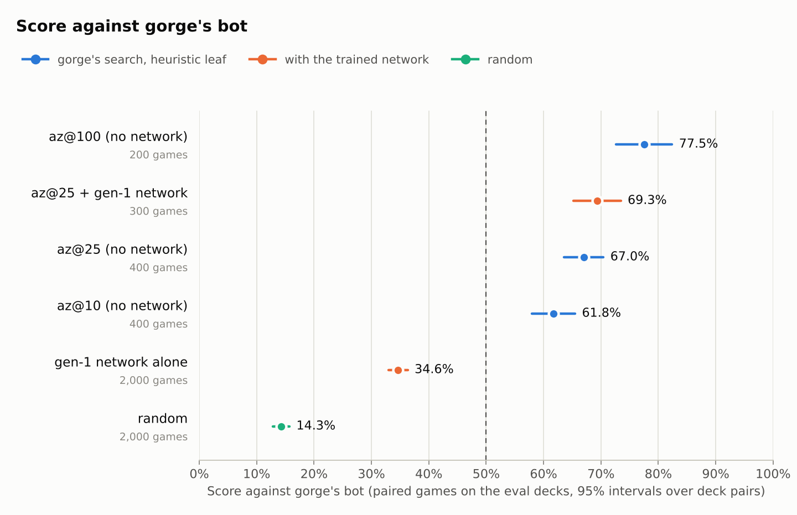
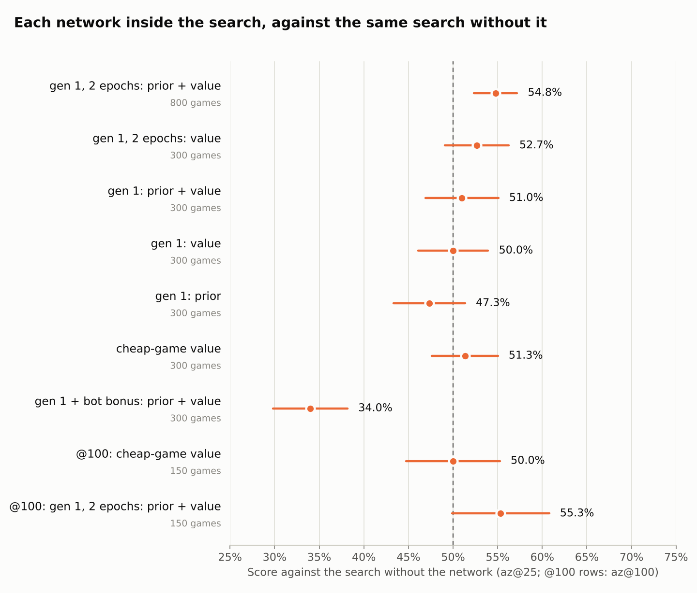

# Self-play on gorge: FDN games, search, a first network, and 17lands statistics

*6 October 2026. Dan asked how far DraftZero can train on [gorge](https://github.com/adams-shaun/gorge), the
fast Go rules engine compared in [docs/015](015-rules-engine-comparison.md): play FDN Limited games, measure games
an hour, port a DraftZero model or train a new one, and evaluate it against baselines and 17lands, as in
[docs/019](019-imitation-learning-report.md). [docs/025](025-mtg-kernel-fdn-self-play.md) asks the same of
mtg-kernel. **The code is on the
[`claude/gorge-fdn-selfplay`](https://github.com/danieljbrooks/draft-zero/tree/claude/gorge-fdn-selfplay) branch**
(folder [`gorge/`](https://github.com/danieljbrooks/draft-zero/tree/claude/gorge-fdn-selfplay/gorge)), not on main.
Every number here was measured on gorge `c9a422b70` (6 October) in this session's 4-vCPU cloud container (Intel
Xeon, 2.8 GHz). RunPod spend: $0 (§7).*

## Summary

**gorge is fast enough to make self-play cheap, and one AlphaZero generation on it already helps the search a little.
The engine is not the limit any more: what the network learns from is.**

- **Every FDN deck plays.** All 286 cards and all 31,516 of DraftZero's decks are supported at the pinned commit.
  192,350 games ran with no engine error or stall. No card was added.
- **Games an hour on 4 vCPUs:**
  - gorge's heuristic `bot` against itself: **611,000** (~150,000 per core, roughly 100× XMage's bot);
  - AlphaZero-style search for both seats: **4,400** at 25 simulations and 2,200 at 50;
  - the same search with the trained network for both seats: **2,500** at 25 simulations (630 per worker);
  - experiment #4's MLP searching on XMage at 100 simulations: 3.4 games an hour per worker (docs/020).
- **Search without a network beats `bot`**, more with more search: 62% at 10 simulations, 67% at 25, 78% at 100.
- **One AlphaZero generation, trained from scratch** with gorge's tools (1,800 self-play games at 50 simulations,
  48 minutes; 99k decisions; minutes of training):
  - The value judges positions as well as a 50-simulation search does (AUC 0.81).
  - The policy learned almost nothing: the visit counts it copies are nearly uniform at this budget.
  - The best network, trained 2 epochs rather than 12, makes the search win **54.8% [52.3, 57.2]** of 800 paired
    games against the same search without it, and 55% at 100 simulations. It doubles the cost of a decision, and
    at equal time it ties a search with twice the simulations (53.0% [48.3, 57.7]).
  - Alone, without search, the networks lose to `bot` (35–42%).
- **17lands statistics.** In 100,000 games of `bot` against itself, card win rates correlate with 17lands' at
  **0.21 on commons and 0.39 on all cards**. Sampling noise would allow ~0.98, so the gap is the bot's bias.
  - DraftZero's imitation networks reached 0.34–0.41 on commons on XMage (docs/019).
  - gorge's bot misjudges the same cards they did: removal and counterspells rank low, creatures high.
  - **Search helps:** 8,000 games of `az@10` against itself reach 0.30 on commons, against 0.17 for the same number
    of `bot`'s games.
  - Random play and the trained policy alone score about 0.
- **Porting DraftZero's network was blocked** (§6). Its weights are in a private Hugging Face repo this environment
  can't reach. Its input is MageZero's encoding of XMage positions, which gorge doesn't produce. A faithful port
  would take weeks; distilling it is the better route.
- **RunPod was blocked too** (§7): this environment's network policy refuses `api.runpod.io` and `huggingface.co`.
  Everything ran in the container; **$0 of the $10 was spent**.

## 1. Setup

### 1.1 The engine and the cards

- **gorge** is a pure-Go engine that compiles Forge's card scripts (docs/015). It moves fast: 11,056 commits, 1,193
  of them since 5 October. Everything here is pinned to `c9a422b70` (`gorge/GORGE_REF`), with Forge's card scripts at
  gorge's own pin (`ab2a79bd8`).
- **Every FDN card is supported.** All 286 cards in the pool (281 non-basic), and so all **31,516 of DraftZero's
  decks**, compile to primitives gorge implements (`dzgorge coverage`). gorge's FDN parameter census, which on 28
  September flagged 11 cards that played but not as printed, now flags none. The one card docs/015 found wrong at
  runtime, Nine-Lives Familiar, now has a passing test. The cards' behaviour is still unaudited: nothing checks it
  against XMage or Forge at this pin. No card was added or changed for this work.
- **The decks are DraftZero's pool**, converted to gorge's deck format under the same names (`gorge/decks.py`), so
  `assets/decks.tsv`'s split applies: 28,366 train decks and 3,150 eval decks. Every game draws two different decks.

### 1.2 The driver and the policies

`gorge/cmd/dzgorge` is a Go command built inside a pinned gorge checkout (`gorge/build.sh`), because it uses gorge's
internal search, network and game runner. It plays deck pairs in parallel and writes one JSON line a game: the
decks, the policies, the winner, turns, time, and every card each seat had in hand (its opening hand and every card
it drew or put into its hand from its library), for 17lands' games-in-hand statistics.

| Policy | What it is |
|---|---|
| `random` | uniform over the legal options, mana paid automatically (gorge's `sb-uniform`) |
| `bot` | gorge's production heuristic: no search |
| `az@N` | gorge's AlphaZero-style tree search (`internal/azmcts`): PUCT over the seat's own decisions, N simulations each, c = 1.5, up to 6 candidates. With no network it uses a uniform prior and gorge's heuristic leaf (a material, life and hand score), so `az@N` is the counterpart of docs/019's `heuristic@N` |
| `az@N+net` | the same search with a trained network's prior and value |
| `prior(net)` | the network's policy alone: its most likely candidate, no simulation |

- **Honest search.** Every simulation re-deals what the seat can't see: the opponent's hand and both libraries'
  order. The search knows the opponent's 40-card list, as docs/019 §4.2's bots did. It searches four kinds of
  decision (casting or passing, attacks, blocks, targets) when there are at least two candidates. Inside a
  simulation, the opponent's moves are gorge's `bot`'s.
- **Paired games**, as in docs/019: each deck pair is played twice on one seed, with the policies swapped, so each
  policy plays each deck once and goes first once. Intervals are 95%, computed over pairs. A game capped at 100
  turns (gorge counts both players' turns) would count half; none reached it.
- **No mulligans.** gorge's `bot` answers the London mulligan with a fixed one-in-three chance of a mulligan,
  whatever its hand holds (`botpolicy/policy.go`), and every policy here, the search included, delegates that
  decision to it. With the mulligan round on, the bot mulliganed 0.5 times a game. The round is off: every player
  keeps seven.

## 2. Games an hour

On the eval decks, 4 workers on this container's 4 vCPUs (`gorge/bench.sh`; one worker for the first two rows):

| Games | Games an hour | Per worker | Searched decisions a game | Time per searched decision | Turns |
|---|---:|---:|---:|---:|---:|
| `bot` against itself, 1 worker | 174,442 | 174,442 | – | – | 19.3 |
| `random` against itself, 1 worker | 49,637 | 49,637 | – | – | 27.6 |
| `bot` against itself | **610,974** | 152,744 | – | – | 19.2 |
| `random` against itself | 204,246 | 51,061 | – | – | 27.4 |
| `bot` against `random` | 406,628 | 101,657 | – | – | 20.1 |
| `az@10` against `bot` | 28,747 | 7,187 | 24 | 17 ms | 19.9 |
| `az@25` against `bot` | 9,585 | 2,396 | 27 | 50 ms | 19.5 |
| `az@100` against `bot` | 1,942 | 486 | 28 | 255 ms | 19.1 |
| `az@25` against itself | **4,390** | 1,097 | 59 | 52 ms | 21.1 |
| `az@100` against `az@25` | 1,659 | 415 | 53 | 161 ms (both seats) | 19.9 |
| *During training (§4):* | | | | | |
| `az@2` against itself (cheap value data) | 49,614 | 12,403 | 43 | 3.5 ms | 19.3 |
| `az@50` against itself (gen-0 self-play) | 2,231 | 558 | 55 | 115 ms | 20.2 |
| a network's policy alone against `bot` | 99,891 | 24,973 | – | – | 20.9 |
| a network's policy alone against itself | 29,238 | 7,310 | – | – | 26.5 |
| `az@25` + 2-epoch network against `az@25` | 3,281 | 820 | 57 | 74 ms (both seats) | 20.5 |
| **`az@25` + 2-epoch network against itself** | **2,528** | 632 | 52 | 106 ms | 20.1 |
| *For card statistics (§5):* | | | | | |
| `az@10` against itself (all decks) | 16,275 | 4,068 | 49 | 16 ms | 19.6 |

- **A simulation costs about 2–2.5 ms** of one core, with gorge's heuristic leaf. Cost grows linearly with the budget.
  The search answers only the decisions with two or more candidates: about 28 a seat a game, out of about 250
  decisions of the four searched kinds.
- **Against XMage**, roughly, with different machines:
  - Built-in bots: gorge's `bot` plays ~150,000–175,000 FDN games an hour on one core. XMage's cheapest real bot
    played 0.32–0.61 games a second on a laptop core (docs/015), 1,150–2,200 an hour: about 100× slower.
  - Search: experiment #4's MLP searching both seats at 100 simulations played 92 games an hour on a 27-worker RTX
    3090 pod, 3.4 a worker (docs/020). gorge's network-guided search for both seats plays ~630 a worker at 25
    simulations (~1,100 without the network), and `az@100` against `bot` ~490. The searches differ. A gorge
    simulation runs further, about 15 engine decisions per tree edge against MageZero's 1.4 (gorge's
    search-benchmark replication). gorge searches fewer decisions a game, about 55 against about 169. gorge's network
    is also ~50 times smaller than the MLP (§4.1).
- **In dollars**, assuming a RunPod vCPU runs gorge as fast as this container's: an 8-vCPU `cpu5c` pod ($0.28 an
  hour) would play about 1.2 million `bot` games an hour, about 8,800 `az@25` self-play games, or about 5,000 with
  the network: about 4 million, 31,000 and 18,000 games a dollar. docs/020's best XMage figure is 183 games a dollar
  at 100 simulations.

## 3. Strength without a network

Paired games on the eval decks:

| Match | Score | Games |
|---|---|---:|
| `bot` against `random` | **85.7%** [84.3, 87.1] | 2,000 |
| `az@10` against `bot` | **61.8%** [58.0, 65.5] | 400 |
| `az@25` against `bot` | **67.0%** [63.6, 70.4] | 400 |
| `az@100` against `bot` | **77.5%** [72.6, 82.4] | 200 |
| `az@100` against `az@25` | **61.0%** [55.7, 66.3] | 200 |

<picture>
  <source media="(prefers-color-scheme: dark)" srcset="img/026-ladder-dark.png">
  
</picture>

*Figure 1. Score against gorge's `bot`. Search beats it, more so with more simulations; the trained network adds
little at 25 simulations (§4) and loses to it on its own.*

- **More search wins more, without a network.** Each step up in budget adds 5–10 points against `bot`, and `az@100`
  beats `az@25` 61% of the time. That is win rate. Agreement with top players' decisions, which gorge's replication
  of our search benchmark (docs/016) measured, stayed flat from 100 to 10,000 simulations there.
- **These numbers flatter the search against `bot`.** Inside every simulation the opponent's moves are `bot`'s, and
  `bot` is also the opponent in the first four rows. gorge's author notes the same caveat. On gorge's constructed
  decks, `az@25` scored 64.7% against `bot` with honest worlds, close to the 67.0% here.
- **No game failed.** None of the benchmark's 17,400 games crashed, stalled or hit a cap, and no honest re-deal was
  refused.

## 4. Training a network by self-play

DraftZero's networks can't be loaded here (§6), so we trained new ones with gorge's own tools: one AlphaZero
generation, two variants of it, and a value trained on cheap games.

### 4.1 The recipe

- **The network** is gorge's pure-Go `policynet`: the position as hashed sparse features (gorge's "mz" set:
  MageZero-style per-card properties for both battlefields and the player's hand, mana, the stack), summed into a
  128-wide embedding; each candidate move scored by a one-hidden-layer MLP over [position ‖ move]; a value head with
  32 hidden units. About 2.2 million parameters, an 8.6 MB checkpoint, CPU-only, no autodiff.
- **Generation 0 plays itself.** `az@50` with no network plays both seats on the **train** decks. It samples its
  moves in proportion to the visit counts on the first four turns, for variety, and plays its best move after that.
  Every searched decision is recorded: the position, the candidates, the visit counts, and later the game's result
  (`gorge/azloop.sh 0`).
- **Training** is gorge's `policytrain -visits-corpus`, with the recipe gorge used for the same step (its "M1b"):
  - the policy learns the visit distribution;
  - the value learns the result, blended 5% with the search's root value;
  - 12 epochs, learning rate 0.1, gradient clip 5, holdout by deck pair.
- **Evaluation** is on the **eval** decks (`gorge/evalnet.sh`):
  - the network's policy alone against `bot` and `random`;
  - inside the search at 25 simulations, against the same search without the network, in three arms: the
    network's prior and value; its value only (uniform prior); its prior only (heuristic leaf);
  - the full network-guided search against `bot`.

### 4.2 Results

**Generation 0** played 1,800 games in 48 minutes: 2,230 games an hour, 115 ms a searched decision, 55 searched
decisions a game. That gave **98,997 searched decisions** to train on. In 44% of them the search overrode `bot`'s
answer.

**What the network learned**, on 8,680 searched decisions from 150 further `az@50` games on the *eval* decks
(`policytrain -visits-eval`):

| | gen 1 |
|---|---|
| Policy: cross-entropy with the search's visits | 1.077 (uniform: 1.086; the visits' own entropy: 1.042) |
| Policy: picks the search's most-visited move | 57.6% (always `bot`'s answer: 56.4%) |
| Value: AUC, all positions | **0.810** (the 50-simulation search's own root value: 0.801) |
| Value: AUC within a deck matchup | 0.766 (the search's root value: 0.775) |
| Value: AUC by turn: 1–6 / 7–12 / 13+ | 0.673 / 0.746 / 0.866 |
| Value: log loss | 0.553 (base rate: 0.693) |

- **The visit counts carry little to learn.** At 50 simulations over at most 6 candidates, the visits are nearly
  uniform: their entropy, 1.042, is close to the uniform 1.086. The network closes a fifth of that small gap. gorge
  hit the same wall on its constructed decks ("M1b").
- **The value is the useful part.** It ranks positions about as well as a 50-simulation search does, at the cost of
  one evaluation. Like gorge's own value heads and DraftZero's (docs/019 §4.1), it is weak early in the game.
- **12 epochs overfit the value.** Its holdout log loss was best after 2 epochs (0.518) and 0.563 after 12, while the
  policy's holdout top-1 kept rising (0.495 → 0.553). gorge's trainer has no early stopping, so we also trained a
  2-epoch network (below).

**In games** (paired, eval decks):

| Match | Score | Games |
|---|---|---:|
| gen 1's policy alone against `bot` | **34.6%** [33.0, 36.3] | 2,000 |
| gen 1's policy alone against `random` | 67.3% [65.6, 69.1] | 2,000 |
| `az@25` + gen 1 (prior and value) against `az@25` | **51.0%** [46.9, 55.1] | 300 |
| `az@25` + gen 1's value only against `az@25` | **50.0%** [46.1, 53.9] | 300 |
| `az@25` + gen 1's prior only against `az@25` | 47.3% [43.3, 51.4] | 300 |
| `az@25` + gen 1 against `bot` | 69.3% [65.2, 73.5] (`az@25` alone: 67.0%) | 300 |

- **The policy alone is weaker than `bot`**, as experiment #4's imitation policy was against MageZero's searching
  heuristic (38–40%, docs/019 §4.2), and as gorge's distilled students were (27% against `bot`).
- **Inside the search, gen 1 neither helps nor hurts** at 25 simulations. Its value is as good a leaf as gorge's
  heuristic, no better. (Trained for 2 epochs instead, it helps: §4.4–4.5.)
- **The prior is expensive.** With the network's prior and value, a searched decision took about 110 ms against
  52 ms without the network (the prior is evaluated at every point the walk passes). The value alone added ~12%.

### 4.3 More value data from cheap games

gorge's own review of its networks (`docs/superpowers/reports/2026-09-28-spellbench-policy-networks.md`) ranks
"value pretraining on cheap self-play" first: every game labels every position, and the value is what the search
uses. So we trained a value on 6.5 times the data:

- **Cheap games:** `az@2` against itself on the train decks. With two simulations the search never overrides the bot,
  so these are `bot`'s games, recorded at every decision with two or more candidates: **640,904 positions from 15,000
  games in 18 minutes** (49,600 games an hour).
- **Training:** the value on each game's result (no search value to blend), 3 epochs. The policy head copies `bot`'s
  answers and isn't used: in the search we give this network's value with a uniform prior.

| | gen 1 (99k searched positions) | cheap-game value (641k positions) |
|---|---|---|
| Value AUC on the eval decks' searched positions | 0.810 | 0.810 |
| … within a deck matchup | 0.766 | 0.771 |
| … by turn: 1–6 / 7–12 / 13+ | 0.673 / 0.746 / 0.866 | 0.658 / 0.724 / 0.877 |
| Log loss (base rate 0.693) | 0.553 | **0.525** |
| `az@25` with this value as the leaf, against `az@25` | 50.0% [46.1, 53.9] | **51.3%** [47.6, 55.0] |

Six and a half times the positions, from a weaker player, gave the same ranking of positions with better calibration,
and the same result in games.

### 4.4 Two variants of gen 1

The same gen-0 corpus, trained two other ways:

- **2 epochs instead of 12**, where the value's holdout loss was lowest (§4.2). Its prior is close to uniform.
- **A fixed bonus for `bot`'s answer** (`-residual-init 2`, gorge's best setting for a network playing alone). The
  network can't otherwise tell which candidate is `bot`'s.

| | gen 1 (12 epochs) | 2 epochs | `bot` bonus |
|---|---|---|---|
| Policy: picks the search's move / picks `bot`'s move (eval decks) | 57.6% / 55.5% | 47.1% / 56.1% | 53.3% / **92.4%** |
| Value: log loss / AUC within a matchup (eval decks) | 0.553 / 0.766 | **0.530 / 0.773** | 0.558 / 0.766 |
| Policy alone against `bot` | 34.6% | – | **42.1%** [40.8, 43.4] |
| `az@25` + network against `az@25` | 51.0% [46.9, 55.1] | **54.0%** [50.9, 57.1] | **34.0%** [29.8, 38.2] |
| `az@25` + network's value only against `az@25` | 50.0% [46.1, 53.9] | 52.7% [49.1, 56.2] | – |

- **The bonus trades search for imitation.** It makes the network pick `bot`'s move 92% of the time. Alone, that
  is better than gen 1 (42% against `bot`). As the search's prior it is ruinous, 34% against the plain search,
  because the search then rarely looks past `bot`'s move. gorge measured the same with a `bot`-copying prior
  (−21.7 points).
- **The 2-epoch network is the only one whose interval clears 50%,** and only just: one result among eight network
  arms, so we replayed it on fresh deck pairs (§4.5).

### 4.5 Confirming the 2-epoch network, and what it costs

| Match | Score | Games |
|---|---|---:|
| `az@25` + 2-epoch network against `az@25`, first run (§4.4) | 54.0% [50.9, 57.1] | 300 |
| the same, 250 fresh deck pairs on another seed | **55.2%** [51.8, 58.6] | 500 |
| **both runs** | **54.8%** [52.3, 57.2] | 800 |
| `az@100` + 2-epoch network against `az@100` | 55.3% [49.9, 60.8] | 150 |
| `az@100` + cheap-game value (uniform prior) against `az@100` | 50.0% [44.7, 55.3] | 150 |

<picture>
  <source media="(prefers-color-scheme: dark)" srcset="img/026-networks-dark.png">
  
</picture>

*Figure 2. Every network arm against the same search without the network. Only the 2-epoch network clears 50%.*

- **The gain holds up: about +5 points at equal simulations,** at 25 and at 100. That is the size of experiment #1's
  edge over plain search on XMage (55.8%, with a search that could see hidden cards: docs/003), here from 48 minutes
  of self-play on 4 vCPUs and an honest search. Experiment #2's networks scored 45–50% (docs/019 §5.1).
- **Where it comes from is not settled.** The 2-epoch network's value alone scored 52.7% [49.1, 56.2], and the
  cheap-game value, which ranks positions as well, scored 50% at both budgets. The softly learned prior, or a value
  trained on positions the search itself visits, may each contribute.

**At equal time it ties doubling the search.** The network's prior makes a decision about twice as expensive (§4.2),
so the fair comparison is with twice the simulations:

| Match | Score | Games | Time per searched decision |
|---|---|---:|---|
| `az@50` against `az@25` (no network) | 54.7% [50.3, 59.0] | 300 | 115 ms against 52 ms |
| `az@25` + 2-epoch network against `az@25` (above) | 54.8% [52.3, 57.2] | 800 | ~96 ms against 52 ms |
| `az@25` + 2-epoch network against `az@50` | 53.0% [48.3, 57.7] | 300 | about equal (106 ms, both seats) |

One generation of self-play bought what doubling the simulations buys, at the same cost. That isn't a win yet in
compute, but it's where AlphaZero's loop starts. The network's cost is mostly its prior, evaluated at every point
the walk passes: its value alone adds ~12% (§4.2).

## 5. 17lands statistics

As in docs/019 §4.4: a card's **games-in-hand win rate** is how often a seat wins the games in which it had the
card in hand (kept opening hand, or drawn), over self-play games with a winner. We compare each policy's rates with
17lands' FDN Premier Draft rates (`assets/reference/FDN_gih.json`) by Spearman rank correlation, over the commons and
over every non-basic card with at least 30 games in hand. Decks are drawn from the whole pool.

**The noise ceiling** is how well 17lands' own games, subsampled to the same number of player-games, correlate with
its full data (`tools/imitation_scale/gih_ceiling.py`, 20 samples each, medians):

| Player-games | 2,000 | 20,000 | 100,000 | 300,000 |
|---|---|---|---|---|
| Commons | 0.46 | 0.82 | 0.96 | 0.99 |
| All non-basic cards | 0.43 | 0.80 | 0.95 | 0.98 |

gorge's speed puts the cheap policies at 40,000–200,000 player-games, where noise barely limits the correlation: what
remains is the policy's bias, and the engine's.

| Self-play | Games | Player-games | Ceiling (commons) | Spearman, commons | Spearman, all cards | Spread of commons' rates | Colour pairs |
|---|---:|---:|---:|---:|---:|---:|---:|
| `random` | 20,000 | 39,998 | ~0.9 | −0.03 | 0.07 | 8.1 pts | −0.10 |
| gen 1's policy alone (§4) | 20,000 | 39,974 | ~0.9 | −0.03 | 0.07 | 7.0 pts | −0.15 |
| `bot` | 100,000 | 200,000 | ~0.98 | **0.21** | **0.39** | 5.2 pts | 0.13 |
| `bot`, 8,000 of those games (20 random subsamples: median [5–95%]) | 8,000 | 16,000 | ~0.78 | 0.17 [0.06, 0.24] | 0.32 [0.28, 0.37] | | |
| **`az@10`** | 8,000 | 16,000 | ~0.78 | **0.30** | **0.36** | 5.7 pts | 0.04 |
| `az@50`, gen 0's self-play (train decks; early moves sampled) | 1,800 | 3,600 | ~0.6 | 0.24 | 0.29 | 6.1 pts | 0.07 |
| *docs/019, on XMage: experiment #4's transformer policy* | *10,000* | *~17,700* | *0.82* | *0.41* | *0.43* | *~5 pts* | |
| *docs/019: experiment #4's MLP policy* | *10,000* | *~17,700* | *0.82* | *0.34* | *0.40* | *~5 pts* | |
| *17lands* | | | | | | *2.5 pts* | |

- **`bot` carries real signal, but less than DraftZero's imitation policies.** On every non-basic card it nearly
  matches experiment #4's networks (0.39 against 0.40–0.43). On commons it falls to half (0.21 against 0.34–0.41).
  The gap is bias, not noise: with 200,000 player-games, 17lands' own data would reach ~0.98.
- **Search makes the commons' ratings more human.** At the same 8,000 games, `az@10` reaches 0.30 on commons, above
  all 20 equal-sized subsamples of `bot`'s games (at most 0.25). On all cards its 0.36 sits inside the subsamples'
  range (0.28 to 0.39). Ten simulations a decision bring the commons near experiment #4's MLP (0.34), as docs/019 §4.4 expected
  of self-play with search.
- **gen 1's policy rates cards no better than random play.** It loses to `bot` 35–65 (§4), and its card ratings
  look like random play's.

<picture>
  <source media="(prefers-color-scheme: dark)" srcset="img/026-gih-dark.png">
  
</picture>

*Figure 3. Card win rates when drawn, in self-play against 17lands. Better play lines the cards up more with
17lands' order, but removal (ringed) stays near or below the middle for every policy.*

**Card by card, `bot`'s 100,000 games** (91 commons; win rates relative to each source's commons average, 50.3% for
the simulation and 54.0% for 17lands):

*17lands' six best commons, and where `bot`'s self-play ranks them (of 91):*

| 17lands rank | Card | 17lands | `bot` (rank) |
|---|---|---|---|
| 1 | Bake into a Pie | +4.0 | +0.2 (43) |
| 2 | Burst Lightning | +3.9 | −3.4 (69) |
| 3 | Stab | +3.9 | −2.9 (66) |
| 4 | Dazzling Angel | +3.8 | +9.9 (2) |
| 5 | Luminous Rebuke | +3.7 | +5.3 (18) |
| 6 | Refute | +3.6 | −5.5 (79) |

*`bot`'s six best and three worst commons, and where 17lands ranks them:*

| `bot` rank | Card | `bot` | 17lands (rank) |
|---|---|---|---|
| 1 | Cackling Prowler | +10.2 | +0.1 (46) |
| 2 | Dazzling Angel | +9.9 | +3.8 (4) |
| 3 | Vanguard Seraph | +9.4 | +0.5 (41) |
| 4 | Felidar Savior | +9.4 | +3.4 (10) |
| 5 | Treetop Snarespinner | +9.0 | +0.6 (39) |
| 6 | Apothecary Stomper | +8.4 | −2.4 (75) |
| 89 | Axgard Cavalry | −10.5 | −1.8 (73) |
| 90 | Involuntary Employment | −10.6 | +1.6 (28) |
| 91 | Sure Strike | −11.5 | −1.6 (70) |

- **The same blind spot as DraftZero's networks.** Removal and counterspells sink: Bake into a Pie, Stab, Burst
  Lightning and Refute, four of 17lands' six best commons, rank 43rd to 79th. Experiment #4's policies made the same
  mistake on XMage (Burst Lightning 83rd and 77th, docs/019 §4.4). Creatures rise: gorge's bot and experiment #4's
  policies both put Dazzling Angel, Vanguard Seraph and Felidar Savior near the top. Cards that need judgement to
  use well rank low for any policy that plays without looking ahead. That includes sacrifice outlets (Hungry Ghoul,
  87th) and Involuntary Employment, which steals a creature for a turn.
- **Card rates spread twice as wide as 17lands'** (5.2 points across the commons against 2.5), as in docs/019.
- **Colour pairs:** white-green first (57.4%), black-red last (43.3%), and the blue pairs other than white-blue near
  the bottom (blue-black 44.6%, blue-red 44.1%). The bot plays slow, controlling decks badly. Spearman with 17lands'
  colour-pair win rates: 0.13.
- **Search repairs some of it, not the removal.** In `az@10`'s self-play Stab rises from 66th to 53rd and Hungry
  Ghoul from 87th to 67th. Bake into a Pie (44th), Burst Lightning (76th) and Refute (78th) stay low. We haven't
  tested why. Two guesses: removal pays off over a longer horizon than ten simulations reach, and inside the search
  the opponent is `bot`, which misjudges the same cards.

## 6. Porting DraftZero's network

**Not done: blocked here, and a faithful port is a project of its own.** Experiment #4's MLP (docs/019) reads
MageZero's encoding of an XMage position, and nothing in gorge produces that encoding.

- **What the MLP reads.** MageZero v0.2's Java encoder walks a tree of names: player → zone → card name → ability rule
  text, with numbers as thresholds (`LifeTotal@0..19`) and the decision's text at the root. It hashes each path into
  a 31-bit id: about 800–1,500 ids a position. A vocabulary saved inside the checkpoint maps the ids seen in more than
  3 training positions to embedding rows, and silently drops the rest. The policy heads index MageZero's action
  vocabulary (`assets/vocab/FDN_SPG.tsv`: 644 keys such as `Cast Stab`, then hashed overflow), target names, and one
  yes/no per "attack with X?" question.
- **The weights can't be reached from here.** The only copy is in the private Hugging Face repo
  `danbrooks/draftzero-checkpoints` (`exp4/mlp_1ep/`). This container's network policy refuses huggingface.co, and
  no token is set. No checkpoint or feature vocabulary is committed to this repo.
- **gorge's "mz" features share no ids with MageZero's.** gorge's own network uses MageZero-*style* properties
  (types, power and toughness, keywords, tapped, counters), hand-written and hashed with FNV-1a into 16,384 rows
  (`internal/policynet/features.go`). The names are similar, but no id matches.
- **A port would have to re-create XMage's text.** An ability's rule text seeds the hash of everything below it,
  so one character of difference changes every id under it, and the vocabulary drops them all without an error.
  The same goes for counter names (gorge's `P1P1`, XMage's `+1/+1`), token names, XMage's merging of identical
  permanents, and flags each engine computes its own way. The decisions also have different shapes: gorge declares
  all attackers at once, where XMage asks about one creature at a time.
- **There is a head start.** gorge's unmerged branch `origin/mzrepro` (30 commits, last 3 October, 2,262 behind
  main) ports MageZero's hash, state encoder and action encoder, with XMage-style action labels. Its ability, effect
  and cost texts are stand-ins built from Oracle or Forge text. Its ids have never been compared with XMage's for the
  same position.
- **Estimate:** weeks, not days. A rough estimate is 4–6 weeks: export the weights, Go inference, a harness that
  encodes the same position in both engines and compares ids and outputs, and XMage's text for every FDN card. Each
  new set adds work. At 3.7 ms a position on a CPU core (docs/019 §3.1), the MLP would also cost more than gorge's
  whole simulation (~2 ms).

**Recommendation: train natively in gorge (§4), and if DraftZero's knowledge is wanted, distil it rather than port
it.** experiment #4's tables hold 12.1M top-player decisions as XMage positions. Running the MLP on them offline,
rebuilding the same positions in gorge, and training a gorge network on the MLP's policy and value plus the human
moves needs no encoder fidelity. gorge already rebuilds 17lands positions for its replication of our search
benchmark. The tables and the weights are on Hugging Face, so this also needs the network fix in §7.

## 7. Blockers and caveats

**Blockers.**

- **RunPod and Hugging Face are unreachable from this environment.** Its network policy refuses `api.runpod.io` and
  `huggingface.co` (HTTP 403 from the egress proxy), and no `RUNPOD_API_KEY` or `HF_TOKEN` is set. So everything
  ran on the container's 4 vCPUs, and none of the $10 RunPod budget was spent. To use them, add both hosts to the
  environment's allowed domains (claude.ai/code → the environment's settings → Network access, keeping the
  package-manager defaults) and store the keys as environment variables. 17lands' S3 bucket, GitHub, PyPI and the
  Go proxy are reachable.
- **DraftZero's networks can't be loaded here** (§6): weights on Hugging Face, and no shared encoding.

**Caveats.**

- **gorge's FDN behaviour is unaudited.** Every card compiles and no game here crashed, but no one has checked the
  cards' behaviour against XMage or Forge at this pin (§1.1).
- **gorge's bot has stand-ins.** It mulligans a random third of its hands (so mulligans are off here), takes the
  first mode of a modal spell, and so on (`botpolicy/policy.go`). The search inherits these for every decision it
  doesn't search, and uses `bot` as the opponent inside every simulation.
- **The search knows the opponent's decklist**, though not their hand or library order: docs/019 §4.2's setting,
  not the guessed deck of §4.6.
- **Games against `bot` flatter the search** (§3).
- **The XMage comparisons cross machines and search designs** (§2): treat them as orders of magnitude.
- **gorge moves fast.** Results hold for `c9a422b70`; re-measure after a bump.

## 8. Next steps

In rough order of value for the cost:

1. **Open the network.** Allow `api.runpod.io` and `huggingface.co` and add the keys (§7). The $10 budget buys
   about 300 vCPU-hours on RunPod's CPU pods ($0.03–0.035 a vCPU-hour, docs/020), some 15 times what this session
   used.
2. **Distil DraftZero instead of porting it** (§6): run experiment #4's MLP on its 12.1M human positions, rebuild
   them in gorge, and train gorge's network on the MLP's policy and value plus the human moves. That brings in what
   the human data taught, which a 50-simulation search can't (§4).
3. **Keep the AlphaZero loop going from the 2-epoch network** (§4.5), with sharper targets: hundreds of
   simulations, or Gumbel root selection with completed-Q targets, which gorge's own review recommends for 25–100
   simulations. Train with early stopping, and gate every generation against the last.
4. **Find out why the 2-epoch network helps** where equally good values don't (§4.5): its prior, or its value's
   training positions. That decides what the next generation should train on.
5. **A real mulligan decision** for gorge's bot, and an audit of its other stand-ins (§1.2, §7).
6. **Guess the opponent's deck** from 17lands decks, as docs/019 §4.6 did on XMage, so the search no longer knows
   the opponent's list.
7. **Audit gorge's FDN cards against XMage** on recorded 17lands turns (docs/008's turn replay), starting with the
   cards whose simulated win rates are furthest from 17lands' (§5).

## Reproducing

From the repo root, on the `claude/gorge-fdn-selfplay` branch, with Go 1.25+ and Python 3 with numpy (matplotlib
for the figures):

```bash
python tools/extract_decks.py --set FDN --format PremierDraft --min-winrate 0.60   # 17lands game data
python gorge/decks.py                  # the pool as gorge decks: data/gorge/{decks/,pool.tsv}
bash gorge/build.sh                    # gorge at gorge/GORGE_REF, plus dzgorge (GORGE_DIR, default ../ext/gorge)
bash gorge/bench.sh                    # §2-3: data/gorge/runs/bench/
bash gorge/gih_runs.sh                 # §5: bot and random self-play for card statistics
SIMS=50 PAIRS=1800 bash gorge/azloop.sh 0                     # §4.1-4.2: gen-0 self-play (48 min) and gen 1
bash gorge/experiments.sh              # §4.2-4.5, §5: held-out positions, every network, their games (~3.5 h)
python gorge/analyze.py wins data/gorge/runs/bench/*.jsonl
python gorge/analyze.py gih data/gorge/runs/gih/bot.jsonl
python tools/imitation_scale/gih_ceiling.py --n 2000 20000 100000 300000 --rarity common all --reps 20
python gorge/figures.py                # this doc's figures
```

Game records, visit corpora and checkpoints stay under `data/gorge/` (gitignored); this session's are not
published, because Hugging Face is unreachable from it (§7). Every game is a pure function of its seed, its policies
and the gorge pin, and `dzgorge` writes games and visit records in game order, so the networks retrain identically.
(Gen 0's corpus was written by an earlier build in completion order and sorted afterwards, `gorge/sortcorpus.py`.)
