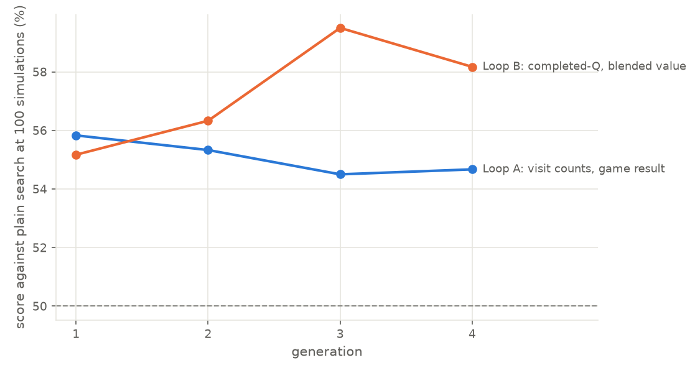

# Scaling up self-play on gorge: DraftZero's networks, games per dollar, and what limits learning

*Status: finished on 7 October 2026; the code is on the
[`claude/gorge-fdn-selfplay`](https://github.com/danieljbrooks/draft-zero/tree/claude/gorge-fdn-selfplay) branch, not on main.*

This report continues [docs/026](026-gorge-fdn-self-play.md) on gorge, the fast Go rules engine, with FDN Limited
decks (decks drafted from Magic's Foundations set): DraftZero's network architectures inside gorge's search, games
per dollar on rented GPUs, and the changes gorge's search needs for AlphaZero-style training. Training and most
games ran on r1, the machine with two RTX PRO 6000s that Dama lends us; the rest ran on three rented RunPod
community pods, for $6.75 of the $15 budget. Dama also reproduced docs/026 exactly on his own 32-core box
([his write-up](https://github.com/adams-shaun/draft-zero/blob/claude/gorge-fdn-selfplay/docs/027-gorge-fdn-selfplay-reproduction.md)).

## Summary

**Letting the search decide more of the game helped more than any change to the network, and a small network
running inside the engine makes the best bot. Rounds of self-play training (AlphaZero-style generations) improved it
only a little.**

A search at N *simulations* plays N short look-ahead games before each of its decisions. A *network* gives the
search a *policy* (which moves to try first) and a *value* (the chance of winning from a position); *plain search*
has no network. The *original search* is gorge's search as we found it: it searches only casting, attacks, blocks
and single targets, over at most six moves built around the answer of *gorge's bot*, its hand-written rule-based
player. *Paired games* play each pair of decks twice with the seats swapped. At 600 paired games, about 4 points is
within chance.

- **The best bot is the full search with a small MLP inside the engine.** The *full search* is gorge's search with
  our patches: it also decides modes (which option of a choose-one card), may-abilities (optional effects), small
  choices and multiple targets, chooses what to cast before mana is tapped, and puts the opponent's decisions in its
  tree. Its network is a 0.6M-parameter MLP (a plain stack of layers) that runs in Go on the CPU, trained on 50
  minutes of the full search's own cheap games. At 100 simulations it won 58.2% of 600 paired games against the full
  search without a network, and 53.5% of 600 head to head against the same MLP trained on the original search's
  games; both edges over that MLP are within chance at 600 games. In a final check on fresh deck pairs it won
  62.2% of 1,400 paired games against the original plain search, and 56.3% of 1,400 against
  the full search without a network (§4.5).
- **Searching more decisions worked best.** Without any network, searching modes, choices and multiple targets
  alone won 56.8% of 600 against the original plain search, and the full search 55.3%. With a network, the full
  search won 61–62% of 600.
- **More games made a better value.** A value trained on 57,000 cheap games (25 simulations, one decision in four
  kept) won 58.2% of 2,000 paired games against plain search, against 56.1% of the same 2,000 for one trained on
  generation 0's 11,400 games at 100 simulations. At 2,000 games about 2 points is within chance, and a rerun of its
  first 600 scored 54.0%, so the firmer evidence is its better held-out value (log loss, lower is better: 0.436
  against 0.449).
- **Small networks inside the engine are as good, and the first to pay for their cost.** A 0.6M-parameter MLP judges
  positions as well as a 4.7M-parameter transformer (a network in which cards attend to each other) and plays at
  least as well. Run in Go inside the engine, it plays 2.7 to 3 times the games an hour of the transformer served
  from a GPU. In the full search, at about equal time, it ties the full search with twice the simulations (50.8% of
  600).
- **Generations compounded only a little.** Each *generation*, the search plays itself and a network learns from
  those games; the next generation's games use that network. In *loop B* the policy learned from the search's value
  estimates (completed-Q) and the value from a target half the game's result and half the search's own estimate; in
  *loop A*, both learned from AlphaZero's own targets (the visit counts and the game's result). Over four
  generations loop B rose from 55.2% to 58.2% of 600 against plain search (59.5% at generation 3), while loop A
  stayed at about 55% and its value got slightly worse (both loops started each generation from the last network).
  Against the generation before, both loops rose to 53.2% of 600 by generation 4. Each step is within chance.
- **What did not matter:** the architecture (an MLP, a transformer and the graph network of Will, who wrote
  MageZero, scored 53.5–55.8% of 600 paired games each against plain search, within chance of each other), the
  search's settings (exploration, temperatures, fixed deals, and first-play urgency, which is how the search values
  moves it hasn't tried yet: 53.7–56.8% of 600 each), and value accuracy alone (the network with the best held-out
  value scored 55.3% of 600 paired games; the cheap-games network scored 58.8% and 54.0% in two runs of the same
  600).
- **Speed and cost.** Without a network, a $0.18-an-hour RTX 3080 Ti pod plays 7,800 self-play games an hour at 100
  simulations (43,000 a dollar). A network served from the GPU costs a factor of 3–6 (5,500 games a dollar with the
  transformer on a 3090 pod). DraftZero's search on XMage managed 183 games a dollar (docs/020).
- **The gorge fork, and what AlphaZero-style self-play costs.** Patches 0002–0007 (`gorge/patches/`, all opt-in)
  give gorge's search what self-play needs: casts searched before mana is tapped, candidates chosen by the
  network's prior, the opponent's decisions in the tree, a land-count heuristic for mulligans (redrawing a poor
  opening hand), the new decisions recorded for training, and modes, choices and multiple targets searched.
  Self-play with casts searched, the opponent in the tree and the transformer in both seats measured **4 times
  slower** than plain self-play: 3,670 games an hour on r1, against 14,600. Almost all of the cost is the GPU-served
  network.
- **The biggest limit is games, not positions:** a game's ~50 positions share one result, so the value memorises
  games within an epoch, and only more games teach it more.

## 1. What we built

### 1.1 Terms

- **Search:** gorge's AlphaZero-style tree search (`az@N`): before each of its decisions, a seat plays N
  **simulations**, short look-ahead games from the current position, and picks the move it visited most. Each
  simulation re-deals the cards the seat can't see (the opponent's hand and both libraries), so the search never
  sees hidden cards (though it does know the opponent's decklist; §7).
- **Network:** one model with two outputs. The **policy** scores each legal move (the search's prior: which moves
  to try first); the **value** estimates the chance of winning from a position (the search's leaf evaluation, in
  place of gorge's hand-written material-and-life score).
- **Generation:** search plays itself; a network learns from those games (the policy to predict the search's
  choices, the value to predict who won); the next round of games uses that network. Generation 0 has no network,
  so generation 1's network learns from generation 0's games, and generation 2's from games played with generation
  1's network.
- **Paired games:** each pair of decks is played twice with the two policies swapping seats, so each policy plays
  each deck once and goes first once. This removes most of the deck and seat luck. "Won 55% of 600 paired games"
  means 300 deck pairs. At 600 games, differences of about 4 points or less are within chance.
- **Plain search:** the same search with no network (uniform prior, gorge's heuristic leaf). Every network is
  scored against plain search at the same number of simulations unless the text says otherwise, on the 3,150 eval
  decks that no network trains on.
- **The original, new and full search:** the *original search* is gorge's search as pinned. It searches only
  casting or passing, attacks, blocks and single targets, over at most six candidates built around gorge's bot's
  answer, with the bot playing the opponent (§5.1). Our patches add opt-in keys (§5.2). The *new search*
  (`autopay:oppnodes`) also searches casts before mana is tapped and puts the opponent's decisions in the tree. The
  *full search* (`autopay:oppnodes:oppfull:morekinds`) also searches modes, may-abilities, small choices and
  multiple targets. §3 to §4.4 use the original search.
- **Mulligans:** gorge's bot mulligans a random third of its hands, so §3 to §4.4 play without mulligans. §4.5
  says which of its matches have both seats mulligan with a land-count heuristic (§5.2); all of §4.6's do.

### 1.2 How gorge describes a position, against XMage

The networks read gorge's own encoding of the searching seat's view (its `entity` feature set), not MageZero's:

| | XMage / MageZero (experiments #1–4) | gorge (this report) |
|---|---|---|
| State | a tree of names (player → zone → card → ability text), each path hashed to a 31-bit id: ~800–1,500 ids a position | 68 numbers (turn, phase, life, hand and library sizes, mana); ~176 hashed card-property features; and one 68-number vector per visible card (~18 a position) with its hashed name |
| Moves | fixed heads: a 644-key action vocabulary, a target head, one yes/no per attacker | every legal option scored from its own features, with pointers to the cards it involves; a candidate (e.g. a set of attackers) scores the sum of its options |
| Searched decisions | ~169 a game | In the original search ~55 a game: casting or passing, attacks, blocks, targets (at most 6 candidates); mulligans, modes and X values are gorge's bot's. The full search (§5.2) adds modes, choices and multiple targets. |

The content overlaps, since gorge's features were written to imitate MageZero's. No feature id matches, though, so
DraftZero's weights can't be loaded (docs/026 §6). The architectures carry over; the weights would have to be
distilled.

### 1.3 Three networks

`gorge/dzg/models.py`, PyTorch. Each scores every option on its own (an option never attends to another), so the
same network scores all of a decision's options in the search and the stored subset in training.

| Network | Modelled on | How it reads a position | Size |
|---|---|---|---|
| MLP | DraftZero's bag MLP (`BagMLPNet`, experiment #4) | each card's vector, summed and max-pooled per zone; the hashed features as a bag; residual MLP blocks | width 384, 3 blocks; 6.3M parameters |
| Transformer | DraftZero's transformer (experiment #4) | one token per card plus three global tokens, 4 self-attention layers; each option attends once over the tokens | width 192, 4 layers; 4.7M |
| GNN | Will's MageZero graph network (docs/023–024) | a tree: root → 2 players → 4 zones → cards → each card's features; attention from each node to its children, bottom up, then 2 global layers | width 128; 3.7M |

Each has one 16,384-row embedding table for hashed features, shared by all its inputs (2.1M of its parameters), as
gorge's own network does. gorge's own network (docs/026) has 2.2M parameters and runs in Go.

### 1.4 How the search calls a network

gorge's search is Go; the networks are PyTorch on a GPU. A small, opt-in patch to gorge
(`gorge/patches/0001`) lets its search use an external scorer; `dzgorge`'s remote client sends positions to
`python -m dzg.serve` over a Unix socket (`gorge/dzg/SPEC.md`):

- **Batching:** every game in the process shares one client. Requests from all games are merged into batches,
  and the server merges requests from all connections into one forward pass.
- **Caching:** answers are cached by the encoded position. A simulation usually needs one new evaluation (the
  position it expands, which gives both the prior and the value); revisits are free. About half of all network
  calls hit the cache.
- **More games than cores:** a game waiting on the GPU doesn't use a core, so we run two to four times as many games
  as cores (four on r1, with its two GPUs).

An MLP can also run inside the engine: `python -m dzg.export` writes its weights for a Go implementation in
`dzgorge` (the policy key `gonet=`), which matches PyTorch to within 3e-7 and needs no GPU (§2.3).

### 1.5 Training

Every searched decision of a self-play game is a training example: the position, the candidates, the search's
visit counts, and the game's result. The **policy** learns the visit distribution (its loss is the cross-entropy:
lower is better, and a uniform guess sets the ceiling); the **value** learns the result (its loss is the log loss:
lower is better, and always guessing the average result scores 0.691). AdamW, batch 512, bf16 on the GPU, a short
warm-up and a cosine schedule. Five per cent of the games are held out, and the eval decks' positions are a second
held-out set; the network kept is the one with the lowest total loss (policy plus value) on the 5% of held-out
training games (early stopping). An *epoch* is one pass
over the training positions. Each run writes its curves (`curves.jsonl`).

## 2. Speed

### 2.1 Training

Positions a second for one training step at batch 512 (`python -m dzg.bench`, on a held-out shard):

| Network | RTX 3090 (RunPod community, `dzg.bench`) | RTX PRO 6000 (r1, during the runs) |
|---|---:|---:|
| MLP | 29,600 | **16,000–47,000 (peaks to 92,000)** |
| Transformer | 21,800 | **10,000–60,000** |
| GNN | 18,200 | **~47,000** |

r1's rate varied from run to run, probably with the load from self-play running beside the training; the small MLPs
of §4.5 (0.6M and 1.3M parameters) trained at about 8,000.

**Training is never the bottleneck.** Every network in this report trained in under 6 minutes, most in under 4. The
kept network came after a quarter of an epoch to four epochs: within about an epoch for generation 1's networks and
the loops (§3, §4.2), and later for the smaller sets of cheap games (Figure 4) and some networks trained from scratch
(§4.5–4.6). Generation 0's 50 minutes of self-play made about 600,000 positions; a 3090 trains on them in about 25
seconds an epoch.

### 2.2 Games an hour, and per dollar

Two rented RunPod community pods, with the search on the eval decks: one seat searching against gorge's bot (as
in evaluation), or both seats searching (as in self-play). Without a network the GPU is idle, so the host CPU sets
the speed:

- **RTX 3080 Ti pod**, $0.18 an hour: an AMD Threadripper 7960X (Zen 4), 20 vCPUs of quota.
- **RTX 3090 pod**, $0.22 an hour: an AMD EPYC 7C13 (Zen 3), 17.85 vCPUs.

A second RTX 3090 pod ($0.22 an hour; an AMD Threadripper PRO 3995WX, Zen 2, 27 vCPUs) ran most of the tuning in
§4.5.


*Figure 1. Games an hour against simulations per searched decision. Cost grows linearly with the simulations; the
Zen 4 pod is about twice as fast as the Zen 3 one; a network costs the 3090 pod about a factor of four.*

| Simulations | 3080 Ti, vs bot | 3080 Ti, self-play | 3090, vs bot | 3090, self-play | 3090 + transformer, vs bot | 3090 + transformer, self-play |
|---|---:|---:|---:|---:|---:|---:|
| 100 | **14,900** | 7,800 | 9,500 | 4,200 | 2,400 | 1,200 |
| 1,000 | **1,040** | 650 | 500 | 290 | 190 | |
| 10,000 | **55** | 44 | 24 | | | |
| *Games a dollar, 100 simulations* | ***82,900*** | *43,400* | *43,100* | *19,300* | *10,900* | *5,500* |
| *Games a dollar, 1,000 simulations* | ***5,800*** | *3,600* | *2,300* | *1,300* | *840* | |
| *Games a dollar, 10,000 simulations* | ***310*** | *250* | *110* | | | |

- **At 100 simulations a $0.18 pod plays 43,000 self-play games a dollar without a network, and a $0.22 one about
  5,500 with the transformer.** docs/020's best figure for DraftZero's search on XMage was 183 games a dollar, so gorge
  is roughly 30 to 240 times cheaper per game.
- **10,000 simulations is slow in any engine:** 20 seconds per searched decision on the Zen 4 pod, 44 self-play games
  an hour. A game has about 55 searched decisions.
- **r1** (Dama's, free; a Ryzen 9950X with a 30-core quota) played generation 0's 12,000 self-play games at 100
  simulations at 14,600 an hour, and loop A's self-play with the transformer in both seats at 2,700–4,000 an hour.
- **The MLP and the GNN on the 3090 pod**, at 100 simulations: the MLP plays 2,200 games an hour against bot and 1,400
  in self-play; the GNN 1,500 and 800.

### 2.3 What a network costs inside the search

A simulation without a network costs about 1.5–2 ms of one core. With a network it needs about one new evaluation
(two calls, one of them cached), and the evaluation is the expensive part:

| How the network runs | Cost of an evaluation |
|---|---|
| No network (gorge's heuristic leaf) | – |
| The MLP in-process, in Go (`gonet=`; matches PyTorch to 3e-7) | 1–2 ms on one core |
| The same MLP through the Python server (`remote=`) | about 5–15 ms waiting, depending on the network and load |

An earlier run on the Mac at 50 simulations, not comparable with the 100-simulation timings below, had the served
MLP about three times as slow as the in-engine one (960 against 325 ms a searched decision).

- **Through the server, the wait is Python's,** not the GPU's: a forward pass takes the same 2–7 ms for 1 state or
  256, and one server process was 93% busy at 3,200 states a second on the 3090 pod. Three server processes sharing
  the GPU raised games an hour by 65%.
- **In-process, building the input costs more than the network's size.** At 100 simulations (Mac, both seats
  searching) a searched decision takes 238 ms without a network, 667 ms with the 6.3M-parameter MLP, and 518–543 ms
  with the small MLPs of §4.5 (1.3M and 0.6M parameters). A network ten times smaller saves only a fifth of the
  time; §5.3 says where the rest goes.
- **So a served network costs a factor of 3–6 in games an hour, and a small in-engine MLP about 2.** In strength,
  the served transformer at 100 simulations ties plain search at two to four times the simulations (§4.4), but it
  costs three to six times the time, so at equal time it is no better, and probably worse. The in-engine MLP ties the
  full search with twice the simulations at about equal time (§4.5).

## 3. Generation 1: three architectures on the same games

**Generation 0** is plain search playing itself: 12,000 games at 100 simulations on the 28,366 train decks, in 50
minutes on r1 (14,600 games an hour on 30 cores). On its first four turns a seat samples its move in proportion to
the visits, for variety. That gave **609,706 searched decisions**. A further 600 games on the eval decks are the
held-out set every network below is measured on.

All three networks trained on the same games, each for up to 10 epochs with early stopping.


*Figure 2. Generation 1's training curves, on the eval decks' held-out positions. Left: the value's log loss, held
out (solid) and on its own training games (dashed); the ringed point is the network we kept, chosen on the held-out
training games' total loss, so it need not be the lowest point on these eval-deck curves. Right: the policy's
cross-entropy with the search's visits, between a uniform guess (top line) and the most it could learn (the
targets' own entropy, bottom line).*

| | MLP | Transformer | GNN | *docs/026's gorge network (12 epochs, its own positions)* |
|---|---:|---:|---:|---:|
| Value log loss (always guessing the base rate: 0.691) | 0.476 | 0.449 | **0.447** | *0.553* |
| Value AUC (how well it ranks positions) | 0.867 | **0.872** | 0.871 | *0.81* |
| Policy cross-entropy (uniform 1.124; the floor 1.042) | **1.104** | 1.108 | 1.109 | *1.077 (uniform 1.086)* |
| Picks the search's most-visited move | **50.3%** | 49.7% | 49.3% | *57.6%* |

- **The value learns a lot, and then memorises.** All three values judge positions much better than gorge's own
  network did (log loss 0.45–0.48 against 0.53–0.55). They overfit after half an epoch to an epoch (the networks kept
  came at 0.75 epoch for the MLP and 0.5 for the others, against 2 epochs for docs/026's): their loss on their own
  games keeps falling while the held-out loss turns up (Figure 2, left). A game's ~50 positions all share one
  result, so 600,000 positions carry the information of about 12,000 results, and a network can learn to recognise
  a game's decks instead of judging its positions. §4.3 tests this directly.
- **The policy has almost nothing to learn.** With at most 6 candidates and 100 simulations, the search's visit
  counts are nearly uniform: their entropy (1.042) is close to a uniform guess (1.124). The networks recover a fifth
  to a quarter of that small gap, as gorge's own network (a fifth) did in docs/026.
- **The architectures are close.** The transformer and the GNN have slightly better values than the MLP; the MLP
  has a slightly better policy. Nothing here separates them by much.

**In games** (each network inside the search at 100 simulations against plain search, 600 paired games each on the
eval decks; the policy alone is 2,400 games against gorge's bot):

| How the search uses the network | MLP | Transformer | GNN | *docs/026's gorge network (2 epochs, 25 simulations)* |
|---|---:|---:|---:|---:|
| Prior and value | 53.5% | **55.8%** | 53.7% | *54.8% (800 games)* |
| Value only (uniform prior) | **53.2%** | 52.2% | 50.3% | *52.7% (300 games)* |
| Prior only (heuristic leaf) | **52.8%** | 50.0% | 48.7% | |
| The policy alone, against gorge's bot | **50.4%** | 49.6% | 41.3% | *34.6% (12 epochs)* |

- **Every network helps the search a little:** 53.5–55.8% against plain search at equal simulations. That's the
  size of docs/026's best result, from networks that judge positions far better.
- **Neither half alone gives the whole gain, and the value matters more.** With the network as the leaf only, the
  search scores 50.3–53.2%; as the prior only, 48.7–52.8%; with both, 53.5–55.8%. The prior is weak because the
  visit counts it learned from are close to uniform.
- **The policy alone now plays as well as gorge's bot** (MLP 50.4% of 2,400 games, transformer 49.6%), where gorge's
  own network won only 34.6% of 2,000 (docs/026). Part of that is a feature gorge's network didn't read: whether an
  option is part of the bot's own answer. The networks follow the bot's choice in about 55% of decisions.
- **The transformer goes forward** to the self-play loops (§4): it scored best with prior and value, its value is as
  good as the GNN's, and it plays as many games an hour as the MLP (§2.2).

## 4. Ways to learn from self-play

Each network below plays inside the search at 100 simulations, scored with 600 paired games on the eval decks
unless noted.

### 4.1 Sharper targets for the policy, steadier targets for the value

On generation 0's games, the MLP trained three other ways:

- **Completed-Q policy targets** (from Gumbel MuZero): instead of the visit counts, the policy learns a
  distribution built from the search's value estimate for each candidate, sharpened by a constant `c_scale`. The
  targets get much sharper (their entropy falls from 1.04 to 0.67 at `c_scale` 0.03 and 0.27 at 0.1).
- **A value target blended with the search's own estimate:** half the game's result, half the search's root
  value, which varies from position to position where the result doesn't.

| How the search uses the network | Visit counts, game result | Completed-Q, 0.03 | Completed-Q, 0.1 | Value blended 50/50 |
|---|---:|---:|---:|---:|
| Prior and value | 53.5% | 54.3% | 53.7% | **56.0%** |
| Prior only | **52.8%** | 49.0% | 50.7% | |
| Value only | **53.2%** | | | 52.7% |

All within chance of each other. Sharper policy targets don't make the prior useful: a prior-only search scores
49–51% with them. The blended value has the best held-out log loss of the four (0.448 against 0.476) and the best
score with prior and value, by an amount chance could produce.

### 4.2 Generations

Two loops ran side by side from generation 1, each with the transformer, 3,000 self-play games per generation (the
search with the latest network playing both seats), and the next network trained on every generation's games so
far, starting from the last network's weights:

- **Loop A** (r1): AlphaZero's targets, visit counts and the game's result.
- **Loop B** (the RTX 3080 Ti pod): completed-Q policy targets (`c_scale` 0.03) and the blended value target.

Each loop's generation 1 is a transformer trained on generation 0's games with that loop's targets (55.8% and 55.2%
of 600 against plain search). Loop B ends at generation 4: its pod shut itself down during generation 5's self-play,
when a timer set that morning ran out (§7). Its generation-4 scores (349 and 319 wins of 600) were read from the pod
before then; their files were not mirrored with the rest of the results.



*Figure 3. Each generation's network inside the search at 100 simulations against plain search, 600 paired games per
point; a difference of about 4 points is within chance. Loop A uses AlphaZero's targets; loop B completed-Q policy
targets and a value blended with the search's.*

Each generation also played the one before it, 600 paired games:

| Generation | Loop A against its previous generation | Loop B against its previous generation |
|---|---:|---:|
| 2 | 46.7% | **49.8%** |
| 3 | 50.3% | **51.2%** |
| 4 | 53.2% | 53.2% |

**Against plain search, loop A stayed at about 55% while loop B rose from 55.2% to 58–60%.** Against the generation
before, both loops rose to 53.2% of 600 by generation 4 (loop A from 46.7%, loop B from 49.8%). Each step alone is
within chance, so this is a hint, not proof, of generations compounding.

The training curves say why loop A stalled. Each of its generations kept the network from the first check, a
quarter of an epoch in, and its value got slightly worse, then held (held-out log loss 0.449, 0.455, 0.457, 0.457).
Started from the last network, which had already memorised generation 0's 12,000 games, training overfits at once;
3,000 new games a generation are too few to move it. Loop B started from its last network too, but its blended value
target varies within a game, which may be why it did not stall: its kept networks came up to three quarters of an
epoch in.

### 4.3 More games for the value

If the value is short of games, not positions, then many cheap games should help more than a few expensive ones.
gorge makes cheap games easy: search at 25 simulations played **60,000 games in 2.4 hours on 10 of r1's cores**,
and we recorded one searched decision in four, so they take the memory of 15,000 full games. We trained the
transformer from scratch on the first 3,500 to 57,000 of them. Game counts here are after the 5% held out, so
generation 0's 12,000 games count as 11,400.


*Figure 4. The value's data scaling. Left: the best held-out value log loss (eval decks, positions from search at
100 simulations) against the number of games trained on; the diamonds are generation 0's games (12,000 games at 100
simulations, every decision recorded) and both sets together. Right: the held-out value log loss while training,
one line per run: up to about 28,000 games, more games give a lower minimum, and it comes after fewer epochs (about 3
epochs at 3,500 games, 1 or less at 28,000 and 57,000), though after more training steps.*

The held-out log loss falls from 0.471 at 3,500 cheap games to 0.441 at 14,000 and 0.433 at 28,000, then flattens
(0.436 at 57,000; the AUC rises from 0.855 to 0.878). Four of these networks played games:

| Trained on | 57,000 cheap games | Generation 0's 11,400 games (generation 1's transformer) | Both (68,400 games) | Every game so far (77,000, adding loop A's) |
|---|---:|---:|---:|---:|
| Value log loss, held out | 0.436 | 0.449 | **0.431** | 0.433 |
| Against plain search | **58.8%** | 55.8% | 55.3% | 56.3% |

- **Games matter, positions don't.** 14,000 cheap games with a quarter of their decisions (190,000 positions) give a
  better value (0.441) than generation 0's 11,400 games at four times the simulations with every decision (578,000
  positions, 0.449).
- **The value keeps improving to about 30,000 games,** then flattens in this range (the 28,000- and 57,000-game
  runs differ by less than repeated runs vary).
- **In games, more games trained on may win more.** The cheap-games network won 58.2% of 2,000 paired games against
  plain search (58.8% of the first 600, 58.0% of 1,400 more on other deck pairs). Generation 1's transformer won
  56.1% of the same 2,000. At 2,000 games about 2 points is within chance, and a rerun of the first 600 on another
  machine scored 54.0% (§4.5), so the firmer evidence is the better held-out value (0.436 against 0.449). Head to
  head the two were within chance of each other (the cheap-games network won 51.6% of 1,000 paired games; at 1,000
  games about 3 points is within chance).
- **Value accuracy alone doesn't win.** The networks trained on both sets, with slightly better values, scored
  55–56% of 600: within chance of the cheap-games network's 58.8% and 54.0%, so the order among them is not settled.

### 4.4 Equal time and deeper search

A network makes each simulation slower (§2.3), so the fair comparison gives plain search more simulations. The
generation-1 transformer at 100 simulations won 55.8% of 600 paired games against plain search at 100 simulations,
51.3% against plain search at 200, and 49.3% against plain search at 400.

The network is worth about two to four times the simulations: in strength, the search with it at 100 simulations
sits between plain search at 200 and at 400. Served from a GPU, it costs more than that in time (§2.3).

**At 1,000 simulations the network may still help:** the generation-1 transformer won 54.5% of 200 paired games
against plain search at 1,000 simulations, the same edge as at 100, but at 200 games about 7 points is within chance.

### 4.5 Tuning: what makes a winning bot in this engine

Every match below is 600 paired games at 100 simulations on the eval decks unless noted. The network is the cheap-games
transformer (§4.3) unless the text names another. The search changes are described in §5.

**The search's own settings matter little** (no mulligans, with the network, against the original plain search,
all on the same 300 deck pairs):

| Setting (with the network) | Score |
|---|---:|
| The defaults (c = 1.5, first-play urgency 0.1, a fresh deal each simulation), two runs | 54.0% and 58.8% |
| Exploration constant c = 3 | 55.8% |
| First-play urgency 0 / 0.3 | 56.8% / 56.7% |
| 8 fixed deals per decision instead of one per simulation | 55.8% (no network: 50.2%) |
| Prior sharpened (temperature 0.5) / flattened (2.0) | 54.3% / 56.2% |
| Value sharpened (temperature 0.7) / flattened (1.5) | 53.7% / 54.0% |
| The prior picks 12 candidates (`topk=12`) instead of 6 around the bot's | 57.5% |

The two runs of the defaults, the same match on the same deck pairs on two machines, differ by almost 5 points:
every row here carries that much noise.

**Changing what the search decides matters more** (mulligans on, against the original plain search, on another 300
deck pairs; the network's arm uses `topk=6`):

| Search | No network | With the network |
|---|---:|---:|
| Casts and timing searched (`autopay`) | 51.8% | |
| The opponent in the tree (`oppnodes`) | 50.7% | |
| Modes, may-abilities, small choices and multiple targets searched (`morekinds`) | 56.8% | |
| All of them, the full search (`autopay:oppnodes:oppfull:morekinds`) | 55.3% | **61.0%** |

- **Searching the decisions the bot used to make is worth more than any setting:** modes, choices and the like alone
  add 6.8 points without a network. The changes don't add up: the full search without a network is within chance of
  `morekinds` alone. Without mulligans (on the settings' deck pairs), searching casts with the network and
  `topk=6` won 59.5% of 600 paired games, against 54.0% of 600 for the network in the original search in the same
  run (58.8% in the other run of the defaults).
- **The full search beats gorge's bot by less than the original search does** (71.8% of 600 against 76.3%), while
  beating the original search head to head. The original search plays a best response to the bot it simulates, so it
  exploits that bot best; the full search no longer assumes its opponent is the bot.
- The 1,400-game confirmation of the full search with the transformer was lost with the first 3090 pod (§7).

**Small networks are as good.** Two small MLPs (widths 64 and 128; 0.6M and 1.3M parameters, most of them the shared
feature table), trained on generation 0's games plus the cheap games, reach the same held-out value as the
transformer trained on those games (log loss 0.431, AUC 0.880). They run inside the engine (`gonet=`, no GPU). The
original search at 100 simulations with each network, without mulligans, on the settings' deck pairs:

| Against plain search at | Width-64 MLP, in the engine | Width-128 MLP, in the engine | Transformer on the same games, on a GPU |
|---|---:|---:|---:|
| 100 simulations | **57.3%** | 56.8% | 55.3% |
| 200 simulations | **53.8%** | 53.7% | |

**In the full search, a small MLP trained on the full search's own games makes the best bot.** To get those games,
the second 3090 pod ran 50 minutes of cheap self-play with the full search (25 simulations, mulligans on, one
decision in four recorded: 613,000 positions). A width-64 MLP trained on them reached a held-out value log loss of
0.457 on the full search's positions (not comparable with §4.3's, which are the original search's). All of these
matches ran on the second 3090 pod, with mulligans on, on the ablation's deck pairs:

| The full search at 100 simulations with | Width-64 MLP, the original search's games | Width-64 MLP, the full search's own games | The cheap-games transformer, on a GPU |
|---|---:|---:|---:|
| Against the full search without a network | 55.3% | **58.2%** | 55.2% |
| Against the original plain search | **62.3%** | | 61.0% |
| Against the full search without a network at 200 simulations (about equal time) | 50.8% | | |
| Head to head | 46.5% | **53.5%** | |
| Games an hour, in the first row's match | 5,600 | **6,100** | 2,100 |

- **The in-engine MLP pays for itself.** It matches the GPU-served transformer inside the full search at about 2.7
  times the games an hour, and at about equal time it ties the full search with twice the simulations:
  the first network in this report that does. In the original search, too, it won 60.0% of 600 against the original
  plain search with mulligans on.
- **Learning from the full search's own games helps.** The MLP trained on them beat the one trained on the original
  search's games head to head (53.5% of 600) and scored 2.8 points more against the full search without a network;
  both edges are within chance at 600 games. Its variant with the blended value target won 56.5% of 600 paired games
  against the full search without a network.
- **The best bot in this report** is the full search with the width-64 MLP trained on its own games, inside the
  engine (`autopay:oppnodes:oppfull:morekinds:topk=6:gonet=`, mulligans on). In a final check on 700 fresh deck pairs,
  it won 62.2% of 1,400 paired games against the original plain search and 56.3% of 1,400
  against the full search without a network.

### 4.6 Self-play under the new search

The networks above, except the last MLP, learned from games of the original search. **Generation 0′** is the new
search's own: 12,000 games at 100 simulations with casts searched and the opponent in the tree (`autopay:oppnodes`,
before `morekinds` existed), mulligans on, plus 40,000 cheap games at 25 simulations; 1.2 million recorded positions
(the cheap games keep one searched decision in four), at 16,800 games an hour on r1 (the original search: 14,600). Its visit counts are a little more
informative (entropy 0.98 against a uniform 1.06; the original search's 1.04 against 1.12). As generation 1 learned
from generation 0, **generation 1′**'s transformer and MLP learned from these games, and reach a held-out value log
loss of 0.468 and 0.463 on the new search's positions.

**Generation 2′** is the network from one round of AlphaZero-style self-play under the new search: the
generation-1′ transformer in both seats (`autopay:oppnodes:topk=6`, mulligans on) played 4,893 games (generation
1′'s games, run directory `g1full`) in 80 minutes on r1 before its time cap, **3,670 games an hour**, recording
255,000 searched decisions. A new transformer, generation 2′, trained from scratch on all of generation 0′'s and
1′'s games, with loop B's targets, for 5.5 epochs.

| The new search at 100 simulations with, against (mulligans on) | Generation 1′ transformer | Generation 2′ transformer |
|---|---:|---:|
| The new search without a network | 55.3% (with loop B's targets: 55.7%) | **56.2%** |
| The original plain search | **55.7%** | 53.5% |
| Head to head | 49.0% | **51.0%** |
| The original search with the cheap-games network | 48.8% | |

- **Generation 2′ is level with generation 1′:** 51.0% of 600 head to head, and within chance of it against both
  plain searches. Its 4,893 new games were under a tenth of the games it trained on, so it could not move far.
- **Without a network, the new search is within chance of the original** (51.7% of 600), and its networks don't beat the
  original search with the cheap-games network (48.8%). The full search's `morekinds`, which came later, is the
  change that mattered (§4.5).

### 4.7 A loop of cheap games with the in-engine MLP

The last experiment combines what worked: the full search, many cheap games, and a small MLP inside the engine, over
generations (r1, mulligans on). C1 plays 40 minutes of cheap full-search games (25 simulations, one searched decision
in four recorded) without a network; each later generation plays 40 minutes of cheap games with the previous
generation's MLP in the search (`topk=6`), and its MLP (width 64) is trained from scratch on every cheap game so far.
Each plays the full search without a network, and its predecessor, at 100 simulations (600 paired games each).

| Generation | Cheap games played (40 min on r1) | Positions trained on | Held-out value log loss | Against the full search without a network | Against the previous generation |
|---|---:|---:|---:|---:|---:|
| C1 (no network in its games) | 41,855 | 637,000 | 0.452 | 56.5% | |
| C2 (C1's MLP in its games) | 7,699 | 751,000 | **0.442** | **57.8%** | 52.2% |
| C3 (C2's MLP in its games) | PENDING | PENDING | PENDING | PENDING | PENDING |

- **C1 reproduces the best bot's network** (§4.5, whose weights were lost with its pod): 56.5% against the full search,
  within chance of the 58.2% of the original.
- **Each generation adds a little:** C2's value is better (log loss 0.442 against 0.452) and it beat C1 52.2% of 600,
  within chance on its own.
- **The network makes cheap games 5.5 times slower:** 11,500 games an hour with C1's MLP in the engine against 63,000
  without it, so C2 trained on far fewer new games. This is the cost §5.3 traces to building the network's input.

The networks of this report are on Hugging Face (private `draftzero-checkpoints`, folder `gorge027/`).

## 5. gorge's search, and what AlphaZero-style training needs

### 5.1 How the search decides today

Read from the code at the pinned commit (`internal/azmcts`):

1. **Only some decisions are searched:** casting or passing at priority, declaring attackers, declaring blockers,
   and single targets, and only with at least two candidates. gorge's heuristic bot answers everything else:
   mulligans, modes, X values, may-abilities, multi-target choices, land plays and mana. A priority decision where
   the bot would tap mana is not searched, and the bot taps mana one source at a time before it casts, so **the bot
   largely decides what gets cast and when.** About 28 decisions a game are searched for each player.
2. **At most 6 candidates, built around the bot's answer:** the bot's move, pass, then other options in an arbitrary
   order; attacks and blocks are the bot's choice with one creature changed, no attack, or all-in. The list is cut
   before the network sees it, so the network's prior only reweights six moves the bot picked.
3. **Each simulation re-deals the hidden cards** (the opponent's hand, both libraries) from the opponent's real
   decklist, then walks forward: the tree picks this player's searched moves by PUCT (c = 1.5), and **the bot plays
   every other decision of both players**, including every one of the opponent's, until this player's next searched
   decision. One new tree node a simulation; a leaf is about 2.3 turns ahead at 100 simulations.
4. **The leaf** is the network's value, or gorge's material-and-life score without a network; the player plays its
   most-visited move.

So the search is a best response to gorge's bot, over six moves the bot proposed. DraftZero's search on XMage
searched every decision kind, every legal option, and both players.

### 5.2 What AlphaZero-style self-play needs

| Needed | gorge today | Change | Status |
|---|---|---|---|
| The network decides what to cast and when | the bot's mana tapping decides; casts are met after mana floats | automatic payment, so every castable spell and pass is a candidate before mana is tapped | done (`autopay`, `gorge/patches/0002`; 0006 records these decisions for training) |
| The network's prior chooses the candidates | 6 candidates around the bot's answer | enumerate every legal option, keep the bot's plus the prior's best | done (`topk=K`, `gorge/patches/0003`) |
| Both players search (self-play means the network plays both sides) | the opponent is the bot inside every simulation | the opponent's decisions become tree nodes, chosen from the opponent's side with the network's prior | done (`oppnodes`, `gorge/patches/0004`; `oppfull` in 0007 also gives the opponent's points automatic payment and network-chosen candidates) |
| Every decision kind | 4 kinds | modes, may-abilities, small choices (X, names, cards) and multiple targets searched and recorded | done (`morekinds`, `gorge/patches/0007`); scry-like ordering and large choices are still the bot's |
| Mulligans | the bot mulligans a random third of its hands, so we turned mulligans off | a land-count heuristic to start (no mulligan model yet) | done (`-mulligans 2 -mull-heuristic`, `gorge/patches/0005`): 2–5 lands keep; beats gorge's random mulligan 55.6% of 40,000 bot games |
| A network the search can afford | about 5–15 ms a call through Python, depending on the network and load; about one call a simulation | in-process inference, or several simulations batched per call | in-process MLP done (`gonet=`, in `dzgorge`); batching several simulations not started |
| Sharp policy targets at 100 simulations | visit counts over ≤6 candidates, nearly uniform | Gumbel root selection with completed-Q targets | completed-Q targets tested (§4.1, loop B in §4.2); Gumbel root selection not started |

### 5.3 How much slower

Measured at 100 simulations, both seats searching, against plain self-play with the original search:

| Change | Cost per game | Measured on |
|---|---|---|
| Casts searched and the opponent in the tree, mulligans on | none (16,800 games an hour against 14,600) | r1, generation 0′ |
| Modes, choices and multiple targets searched too | about 10% more searched decisions, the same time per decision | Mac, 200 games |
| A network served from the GPU (the transformer) | 3.5× (4,200 → 1,200 games an hour) | 3090 pod |
| A network in the engine (Go) | 2.2–2.3× per searched decision for the small MLPs, 2.8× for the 6.3M-parameter one | Mac |
| All together: the new search with the transformer served to both seats | 4× (14,600 → 3,670 games an hour) | r1, generation 1′'s self-play |

**AlphaZero-style self-play measured 4 times slower than today's plain self-play.** Generation 1′'s self-play ran at
3,670 games an hour on r1, against 14,600 for the original search without a network and 16,800 for the new search
without one. Almost all of the cost is the served network. At the same factor a $0.18
RTX 3080 Ti pod would play about 2,000 self-play games an hour, some 11,000 games a dollar: still about 60 times
cheaper than XMage (183 games a dollar, docs/020).

Where the network's cost goes, in-process: only about a third is the MLP's arithmetic; the rest is building its input
(projecting the player's view and encoding every card) for every evaluation. Two changes would cut most of it:
encoding a position incrementally as the walk changes it, and evaluating several simulations' leaves together.

### 5.4 Against XMage and mtg-kernel

The three engines split a game into decisions differently, so their searches spend their simulations differently.
At 100 simulations a decision (1,000 in brackets), with the heuristic leaf:

| | XMage + MageZero (DraftZero) | mtg-kernel (docs/025) | gorge, original search | gorge, full search (our patches) |
|---|---|---|---|---|
| Searched decisions a game, both seats | **~169** | 98–117 | 51–53 | ~59 |
| What is searched | every decision with 2+ options: priority, each target, a yes/no per attacker and per blocker, modes, X | every decision with 2+ options except the mulligan; a whole combat is one move | casting or passing, the attack (up to 6 whole plans), the block, single targets | the same, plus modes, may-abilities, small choices and multiple targets |
| Candidates per searched decision | mean 3.0, no cap | mean 2.6–3.0, no cap | mean 3.2, at most 6 | at most 6 |
| Tree edges from the root to a leaf | **5.7** (11.1) | 4.4 (7.6) | 4.4 (7.9) | not measured |
| Turns from the root to a leaf | 0.26 (0.69) | 0.84 (1.3) | **2.3** (4.3) | not measured |
| The opponent's decisions in the tree | yes | yes | no: gorge's bot plays them | yes |
| One simulation | ~63 ms | **85–125 µs** | 1.5–2.5 ms | ~1.4 ms |
| Games an hour at 100 simulations | 92 (a 3090 pod) | **32,800–46,800** (a 3090 pod) | 4,200–14,600 | ~10,800 |

*Sources: docs/016, 020 (XMage); docs/025 and its run records, with depths measured from 124 self-play games a bot
(mtg-kernel); docs/026–027 and gorge's replication of our search benchmark (gorge). Depths come from different
setups, so read them as orders of magnitude.*

- **XMage searches the most decisions, at the finest grain:** one question per attacking creature, about 16 tree
  edges a turn. mtg-kernel makes a combat one move (about 5 edges a turn). gorge's bot answers about 90% of a seat's
  decisions, and the search spends about 2 edges a turn.
- **Tree depth is similar everywhere** (4–6 edges at 100 simulations, 8–11 at 1,000), **but the game time it covers is
  not:** a quarter of a turn on XMage, almost a turn on mtg-kernel, more than two turns on gorge, where most of the
  look-ahead is the bot playing, the opponent included.
- **Most of the speed difference is the engines,** before any network: a simulation costs ~63 ms on XMage, ~2 ms on
  gorge and ~85 µs on mtg-kernel, where our harness runs the network in Rust inside the engine (about 40 µs an
  evaluation, docs/025). In gorge, the in-engine MLP costs 1–2 ms an evaluation, mostly building its input (§5.3).
- **A fair comparison** would play the same FDN deck pairs on each engine with one re-dealt world, the heuristic leaf
  and 100 and 1,000 simulations, and count searched decisions a seat and each leaf's depth in edges, opponent edges,
  engine steps and turns in the same way.

## 6. What limits learning

1. **Games, not positions, limit the value.** A game's positions share one result, so the value memorises games after
   half an epoch, and positions sampled more densely from the same games add nothing. More games do help the value:
   trained on 57,000 cheap games it reached a held-out log loss of 0.436, against 0.449 for 11,400 slower games, and
   won 58.2% of 2,000 paired games against plain search, against 56.1%. That gap in games is within chance, and a
   rerun of the first 600 scored 54.0%. gorge plays about 75,000 cheap games an hour on r1 (measured for generation
   0′'s cheap games, §4.6), so this is the cheapest lever we have.
2. **The original search capped what any network could add.** With six candidates around the bot's move and the bot
   playing the opponent, every network scored 53–60% against plain search, whatever its architecture, targets or
   value accuracy. Letting the search decide what the bot used to (modes, choices, casts) is worth about as much as a
   network on its own, and the full search with a network reaches 61–62%.
3. **Visit counts teach the policy almost nothing at 100 simulations.** With at most six candidates the visits are
   nearly uniform, and a search with the prior alone scores 49–53%. Loop B's completed-Q targets and blended value
   improved a little against plain search over four generations where loop A's did not.
4. **Warm-starting with the game result as the only value target overfits at once.** Each of loop A's generations
   kept the network from its first check, and its value got slightly worse. Loop B warm-started the same way; its
   blended value target, which varies within a game, may be why it did not stall. Generation 2′, trained from
   scratch on all its games, was level with generation 1′ (51.0% of 600), but its new games were under a tenth of its
   data.
5. **A served network costs more than it gives at equal time; an in-engine one breaks even.** The transformer at 100
   simulations ties plain search at 200–400. The width-64 MLP inside the full search ties the full search at 200
   (50.8% of 600), and most of its cost is input encoding, which can be cut (§5.3).
6. **Architecture matters little at this data size.** The MLP, the transformer and the GNN are within chance of each
   other inside the search (53.5–55.8% of 600 against plain search), though the GNN's policy alone is clearly weaker
   against gorge's bot (41.3% of 2,400 games, against 49.6–50.4%), and a 0.6M-parameter MLP is as good as all of
   them.
7. **The search's settings don't matter;** what it decides does. Exploration constant, first-play urgency, prior and
   value temperatures and fixed deals all landed within chance.
8. **Beating gorge's bot is a misleading measure.** The original search, which simulates that bot, beats it by more
   than the full search does, while losing to the full search head to head.

## 7. Caveats

- **The search knows the opponent's decklist.** Each simulation re-deals the opponent's hidden cards from its real
  decklist (§5.1), which a human player would not know.
- **Mulligans are a heuristic:** a land-count rule (keep 2–5 lands), not learned. §3 to §4.4 ran without
  mulligans.
- **Noise.** About 4 points is within chance at 600 paired games, and repeats vary that much: the cheap-games
  network scored 58.8% and 54.0% in two runs of the same 600-game match on the same deck pairs.
- **Two pods were lost mid-run.** The RTX 3080 Ti pod and the first RTX 3090 pod shut themselves down at 11:47 and
  11:54 AM PT on 7 October, when timers set that morning ran out. Lost with them: loop B's generation 5, the
  1,400-game confirmation of the full search with the transformer, and two arms of the settings sweep (c = 0.75 and
  the opponent in the tree).
- **gorge's FDN cards are unaudited** (docs/026): every card plays, but nothing checks its behaviour against XMage or
  Forge.
- **Every result is at gorge `c9a422b70`** (`gorge/GORGE_REF`) with our patches 0001–0007.

## Reproducing

The Python is in [`gorge/dzg/`](https://github.com/danieljbrooks/draft-zero/tree/claude/gorge-fdn-selfplay/gorge/dzg),
the scripts are `gorge/dzg_*.sh`, and the driver is `gorge/cmd/dzgorge`. From the repo root on the
`claude/gorge-fdn-selfplay` branch, with Go 1.25+ and Python 3.11+ with numpy and PyTorch (matplotlib for the
figures):

```bash
python tools/extract_decks.py --set FDN --format PremierDraft --min-winrate 0.60   # 17lands decks
python gorge/decks.py           # the pool as gorge decks: data/gorge/{decks/,pool.tsv}
bash gorge/build.sh             # gorge at gorge/GORGE_REF with gorge/patches/0001-0007 applied, and dzgorge
# train on packed self-play (gorge/dzg_gen.sh writes OUT/pack; SPLIT=eval makes a held-out pack)
PYTHONPATH=gorge python -m dzg.train --arch transformer --train data/gorge/runs/g0/pack \
  --val evaldecks=data/gorge/runs/g0/pack_eval --out data/gorge/runs/g1/transformer --epochs 10 --patience 6 --in-ram
# serve it to the search (policy key remote=unix:/tmp/dzg.sock); the scripts start their own servers
PYTHONPATH=gorge python -m dzg.serve --ckpt data/gorge/runs/g1/transformer/best.pt --socket /tmp/dzg.sock
# or run an MLP inside the engine: policy key gonet=mlp64.dzgw
PYTHONPATH=gorge python -m dzg.export data/gorge/runs/small/mlp64/best.pt mlp64.dzgw
```

- **Scripts** (usage in each header): `gorge/dzg_gen.sh` (one generation's self-play, packed), `dzg_eval.sh` (a
  network's paired games), `dzg_loop.sh` (generations), `dzg_tune.sh` (any policy against any other),
  `dzg_bench.sh` (games an hour); `dzg_mirror.sh`, `dzg_collect.py` and `dzg_figures.py` gather every machine's
  results into `data/gorge/results/` and draw this doc's figures.
- **Policy keys** added for this report, as in `az:sims=100:autopay:oppnodes:oppfull:morekinds:topk=6:gonet=mlp64.dzgw`:
  `autopay` (0002), `topk=K` (0003), `oppnodes` (0004), `oppfull` and `morekinds` (0007), `remote=` a served network,
  `gonet=` an exported MLP in Go.
- **Play flags:** `-mulligans 2 -mull-heuristic` (land-count mulligans, 0005), `-record-features entity` (record
  searched decisions for training), `-record-every K` (keep one in K, for cheap games).

Checkpoints, corpora and the mirrored results stay under `data/gorge/` (gitignored).
