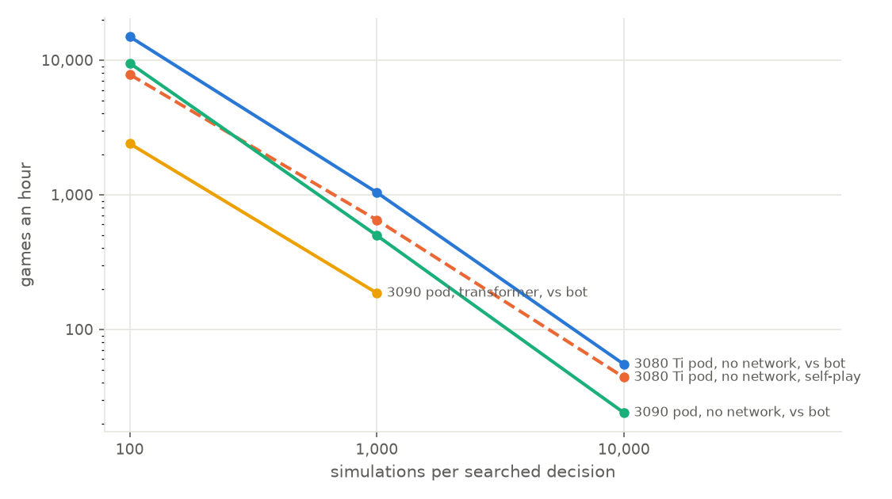
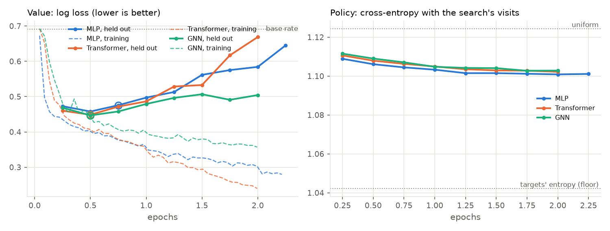
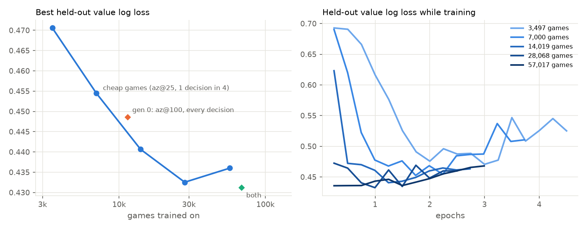

# Scaling up self-play on gorge: DraftZero's networks, games per dollar, and what limits learning

*7 October 2026. The code is on the
[`claude/gorge-fdn-selfplay`](https://github.com/danieljbrooks/draft-zero/tree/claude/gorge-fdn-selfplay) branch
(Python in [`gorge/dzg/`](https://github.com/danieljbrooks/draft-zero/tree/claude/gorge-fdn-selfplay/gorge/dzg),
scripts `gorge/dzg_*.sh`, the driver in `gorge/cmd/dzgorge`), not on main. It continues
[docs/026](026-gorge-fdn-self-play.md), which ran gorge's own small network on a 4-vCPU container, on FDN Limited
decks again. Dama reproduced docs/026 exactly on his own 32-core box (docs/027 on
[his fork](https://github.com/adams-shaun/draft-zero/blob/claude/gorge-fdn-selfplay/docs/027-gorge-fdn-selfplay-reproduction.md));
this report's training and most of its games ran on r1, the machine with two RTX PRO 6000s that Dama lends us, and
the rest on two rented RunPod community GPUs. RunPod spend: PENDING.*

## Summary

PENDING

## 1. What we built

### 1.1 Terms

- **Search:** gorge's AlphaZero-style tree search (`az@N`): before each of its decisions, a seat plays N
  **simulations**, short look-ahead games from the current position, and picks the move it visited most. Each
  simulation re-deals the cards the seat can't see (the opponent's hand and both libraries), so the search is honest.
- **Network:** one model with two outputs. The **policy** scores each legal move (the search's prior: which moves
  to try first); the **value** estimates the chance of winning from a position (the search's leaf evaluation, in
  place of gorge's hand-written material-and-life score).
- **Generation:** search plays itself; a network learns from those games (the policy to predict the search's
  choices, the value to predict who won); the next round of games uses that network. Generation 0 has no network.
- **Paired games:** each pair of decks is played twice with the two policies swapping seats, so each policy plays
  each deck once and goes first once. This removes most of the deck and seat luck. "Won 55% of 600 paired games"
  means 300 deck pairs. At 600 games, differences of about 4 points or less are within chance.
- **Plain search:** the same search with no network (uniform prior, gorge's heuristic leaf). Every network is
  scored against plain search at the same number of simulations unless the text says otherwise, on the 3,150 eval
  decks that no network trains on.

### 1.2 How gorge describes a position, against XMage

The networks read gorge's own encoding of the searching seat's view (its `entity` feature set), not MageZero's:

| | XMage / MageZero (experiments #1–4) | gorge (this report) |
|---|---|---|
| State | a tree of names (player → zone → card → ability text), each path hashed to a 31-bit id: ~800–1,500 ids a position | 68 numbers (turn, phase, life, hand and library sizes, mana); ~176 hashed card-property features; and **one 68-number vector per visible card** (~18 a position) with its hashed name |
| Moves | fixed heads: a 644-key action vocabulary, a target head, one yes/no per attacker | every legal option scored from its own features, with pointers to the cards it involves; a candidate (e.g. a set of attackers) scores the sum of its options |
| Searched decisions | ~169 a game | ~55 a game: casting or passing, attacks, blocks, targets (at most 6 candidates); mulligans, modes and X values are gorge's bot's |

The content overlaps, since gorge's features were written to imitate MageZero's. No feature id matches, though, so
DraftZero's weights can't be loaded (docs/026 §6). The architectures carry over; the weights would have to be
distilled.

### 1.3 Three networks

`gorge/dzg/models.py`, PyTorch. Each scores every option on its own (an option never attends to another), so the
same network scores all of a decision's options in the search and the stored subset in training.

| Network | Modelled on | How it reads a position | Size |
|---|---|---|---|
| **MLP** | DraftZero's bag MLP (`BagMLPNet`, experiment #4) | each card's vector, summed and max-pooled per zone; the hashed features as a bag; residual MLP blocks | width 384, 3 blocks; 6.3M parameters |
| **Transformer** | DraftZero's transformer (experiment #4) | one token per card plus three global tokens, 4 self-attention layers; each option attends once over the tokens | width 192, 4 layers; 4.7M |
| **GNN** | Will's MageZero graph network (docs/023–024) | a tree: root → 2 players → 4 zones → cards → each card's features; attention from each node to its children, bottom up, then 2 global layers | width 128; 3.7M |

All three share one 16,384-row embedding table (2.1M of their parameters) for hashed features, as gorge's own
network does. gorge's own network (docs/026) has 2.2M parameters and runs in Go.

### 1.4 How the search calls a network

gorge's search is Go; the networks are PyTorch on a GPU. A small, opt-in patch to gorge
(`gorge/patches/0001`) lets its search use an external scorer; `dzgorge`'s remote client sends positions to
`python -m dzg.serve` over a Unix socket (`gorge/dzg/SPEC.md`):

- **Batching:** every game in the process shares one client. Requests from all games are merged into batches,
  and the server merges requests from all connections into one forward pass.
- **Caching:** answers are cached by the encoded position. A simulation usually needs one new evaluation (the
  position it expands, which gives both the prior and the value); revisits are free. About half of all network
  calls hit the cache.
- **More games than cores:** a game waiting on the GPU doesn't use a core, so we run about twice as many games as
  cores.

### 1.5 Training

Every searched decision of a self-play game is a training example: the position, the candidates, the search's
visit counts, and the game's result. The **policy** learns the visit distribution (cross-entropy); the **value**
learns the result (log loss). AdamW, batch 512, bf16 on the GPU, a short warm-up and a cosine schedule. Five per
cent of the games are held out, and the eval decks' positions are a second held-out set; the network kept is the one
with the lowest held-out loss (early stopping). Each run writes its curves (`curves.jsonl`).

## 2. Speed

### 2.1 Training

Positions a second for one training step at batch 512 (`python -m dzg.bench`, on a held-out shard):

| Network | RTX 3090 (RunPod community, `dzg.bench`) | RTX PRO 6000 (r1, during the runs) |
|---|---:|---:|
| MLP | 29,600 | 47,000–92,000 |
| Transformer | 21,800 | 44,000–57,000 |
| GNN | 18,200 | ~47,000 |

**Training is never the bottleneck.** Every network in this report trained in 1–3 minutes on r1, because the best
checkpoint always came within an epoch (§3). An hour of self-play makes about 600,000 positions; a 3090 trains on
them in about 25 seconds an epoch.

### 2.2 Games an hour, and per dollar

Two rented RunPod community pods, with the search on the eval decks: one seat searching against gorge's bot (as
in evaluation), or both seats searching (as in self-play). Without a network the GPU is idle, so the host CPU sets
the speed:

- **RTX 3080 Ti pod**, $0.18 an hour: an AMD Threadripper 7960X (Zen 4), 20 vCPUs of quota.
- **RTX 3090 pod**, $0.22 an hour: an AMD EPYC 7C13 (Zen 3), 17.85 vCPUs.

*Figure 2. Games an hour against simulations per searched decision. Cost grows linearly with the simulations; the
Zen 4 pod is about twice as fast as the Zen 3 one; a network costs the 3090 pod about a factor of four.*

| Simulations | 3080 Ti, vs bot | 3080 Ti, self-play | 3090, vs bot | 3090, self-play | 3090 + transformer, vs bot | 3090 + transformer, self-play |
|---|---:|---:|---:|---:|---:|---:|
| 100 | **14,900** | 7,800 | 9,500 | 4,200 | 2,400 | 1,200 |
| 1,000 | **1,040** | 650 | 500 | 290 | 190 | |
| 10,000 | **55** | 44 | 24 | | | |
| *Games a dollar, 100 simulations* | ***82,900*** | *43,400* | *43,100* | *19,300* | *10,900* | *5,500* |

- **At 100 simulations a $0.18 pod plays 43,000 self-play games a dollar without a network, and a $0.22 one about
  5,500 with the transformer.** docs/020's best figure for DraftZero's search on XMage was 183 games a dollar, so gorge
  is roughly 30 to 240 times cheaper per game.
- **10,000 simulations is slow in any engine:** 20 seconds per searched decision on the Zen 4 pod, 44 self-play games
  an hour. A game has about 55 searched decisions.
- **r1** (Dama's, free; a Ryzen 9950X with a 30-core quota) played generation 0's 12,000 self-play games at 100
  simulations at 14,600 an hour, and loop A's self-play with the transformer in both seats at about 4,000 an hour.
- **The MLP and the GNN on the 3090 pod**, at 100 simulations: the MLP plays 2,200 games an hour against bot and 1,400
  in self-play; the GNN 1,500 and 800.

### 2.3 What a network costs inside the search

A simulation without a network costs about 1.5–2 ms of one core. With a network it needs about one new evaluation
(two calls, one of them cached), and the evaluation is the expensive part:

| How the network runs | Cost of an evaluation | Searched decision at 50 simulations (Mac, both seats) |
|---|---|---:|
| No network (gorge's heuristic leaf) | – | 55 ms |
| The MLP in-process, in Go (`gonet=`; matches PyTorch to 3e-7) | 1–2 ms on one core | 325 ms |
| The same MLP through the Python server (`remote=`) | 2–12 ms waiting, depending on load | 960 ms |

- **Through the server, the wait is Python's,** not the GPU's: a forward pass takes the same 2–7 ms for 1 state or
  256, and one server process was 93% busy at 3,200 states a second on the 3090 pod. Three server processes sharing
  the GPU raised games an hour by 65%.
- **In-process, the MLP's size is the cost:** about 4 million multiply-adds an evaluation in pure Go. PENDING: the
  small MLPs (§4.5).
- **So a network costs a factor of 3–6 in games an hour today,** and at equal time it ties the plain search (§4.4).

## 3. Generation 1: three architectures on the same games

**Generation 0** is plain search playing itself: 12,000 games at 100 simulations on the 28,366 train decks, in 50
minutes on r1 (14,600 games an hour on 30 cores). On its first four turns a seat samples its move in proportion to
the visits, for variety. That gave **609,706 searched decisions**. A further 600 games on the eval decks are the
held-out set every network below is measured on.

All three networks trained on the same games, each for up to 10 epochs with early stopping.

*Figure 1. Generation 1's training curves, on the eval decks' held-out positions. Left: the value's log loss, held
out (solid) and on its own training games (dashed); the ringed point is the network we kept. Right: the policy's
cross-entropy with the search's visits, between a uniform guess (top line) and the most it could learn (the
targets' own entropy, bottom line).*

| | MLP | Transformer | GNN | docs/026's gorge network |
|---|---:|---:|---:|---:|
| Value log loss (always guessing the base rate: 0.691) | 0.476 | 0.449 | **0.447** | 0.553 |
| Value AUC (how well it ranks positions) | 0.867 | **0.872** | 0.871 | 0.81 |
| Policy cross-entropy (uniform 1.124; the floor 1.042) | **1.104** | 1.108 | 1.109 | 1.077 (uniform 1.086) |
| Picks the search's most-visited move | **50.3%** | 49.7% | 49.3% | 57.6% |
| Best after | 0.75 epoch | 0.5 epoch | 0.5 epoch | 2 epochs |

- **The value learns a lot, and then memorises.** All three values judge positions much better than gorge's own
  network did (log loss 0.45–0.48 against 0.55). They overfit after half an epoch to an epoch: their loss on their
  own games keeps falling while the held-out loss turns up (Figure 1, left). A game's ~50 positions all share one
  result, so 600,000 positions carry the information of about 12,000 results, and a network can learn to recognise
  a game's decks instead of judging its positions. §4.3 tests this directly.
- **The policy has almost nothing to learn.** With at most 6 candidates and 100 simulations, the search's visit
  counts are nearly uniform: their entropy (1.042) is close to a uniform guess (1.124). The networks recover about a
  quarter of that small gap, as gorge's own network did in docs/026.
- **The architectures are close.** The transformer and the GNN have slightly better values than the MLP; the MLP
  has a slightly better policy. Nothing here separates them by much.

**In games** (each network inside the search at 100 simulations against plain search, 600 paired games each on the
eval decks; the policy alone is 2,400 games against gorge's bot):

| How the search uses the network | MLP | Transformer | GNN | *docs/026's gorge network (2 epochs, 25 simulations)* |
|---|---:|---:|---:|---:|
| Prior and value | 53.5% | **55.8%** | 53.7% | *54.8% (800 games)* |
| Value only (uniform prior) | **53.2%** | 52.2% | 50.3% | *52.7% (300 games)* |
| Prior only (heuristic leaf) | **52.8%** | 50.0% | 48.7% | |
| The policy alone, against gorge's bot | **50.4%** | 49.6% | 41.3% | *34.6% (12 epochs)* |

- **Every network helps the search a little:** 53.5–55.8% against plain search at equal simulations. That's the
  size of docs/026's best result, from networks that judge positions far better.
- **Neither half alone gives the whole gain, and the value matters more.** With the network as the leaf only, the
  search scores 50.3–53.2%; as the prior only, 48.7–52.8%; with both, 53.5–55.8%. The prior is weak because the
  visit counts it learned from are close to uniform.
- **The policy alone now plays as well as gorge's bot** (MLP 50.4% of 2,400 games, transformer 49.6%), where gorge's
  own network lost 35–65. Part of that is a feature gorge's network didn't read: whether an option is part of the
  bot's own answer. The networks follow the bot's choice in about 55% of decisions.
- **The transformer goes forward** to the self-play loops (§4): it scored best with prior and value, it has the
  best value of the three, and in practice it costs the same as the MLP (§2.3).

## 4. Ways to learn from self-play

Four approaches, each scored against plain search at 100 simulations (600 paired games unless noted).

### 4.1 Sharper targets for the policy, steadier targets for the value

On generation 0's games, the MLP trained three other ways:

- **Completed-Q policy targets** (from Gumbel MuZero): instead of the visit counts, the policy learns a
  distribution built from the search's value estimate for each candidate, sharpened by a constant `c_scale`. The
  targets get much sharper (their entropy falls from 1.04 to 0.67 at `c_scale` 0.03 and 0.27 at 0.1).
- **A value target blended with the search's own estimate:** half the game's result, half the search's root
  value, which varies from position to position where the result doesn't.

| How the search uses the network | Visit counts, game result | Completed-Q, 0.03 | Completed-Q, 0.1 | Value blended 50/50 |
|---|---:|---:|---:|---:|
| Prior and value | 53.5% | 54.3% | 53.7% | **56.0%** |
| Prior only | **52.8%** | 49.0% | 50.7% | |
| Value only | **53.2%** | | | 52.7% |

All within chance of each other. Sharper policy targets don't make the prior useful: a prior-only search scores
49–51% with them. The blended value has the best held-out log loss of the four (0.448 against 0.476) and the best
score with prior and value, by an amount chance could produce.

### 4.2 Generations

Two loops ran side by side from generation 1, each with the transformer, 3,000 self-play games per generation (the
search with the latest network playing both seats), and the next network trained on every generation's games so
far, starting from the last network's weights:

- **Loop A** (r1): AlphaZero's targets, visit counts and the game's result.
- **Loop B** (the RTX 3080 Ti): completed-Q policy targets (`c_scale` 0.03) and the blended value target.

PENDING: generations figure

| Generation | Loop A against plain search | Loop A against its previous generation | Loop B against plain search | Loop B against its previous generation |
|---|---:|---:|---:|---:|
| 1 (generation 0's games) | **55.8%** | | 55.2% | |
| 2 | 55.3% | 46.7% | **56.3%** | 49.8% |
| 3 | 54.5% | 50.3% | **59.5%** | 51.2% |
| 4 | **54.7%** | 53.2% | PENDING | PENDING |

**Loop A didn't improve; loop B may have.** Loop A scores about 55% against plain search at every generation and
about 50% against the one before it. Loop B rose from 55.2% to 59.5% over two generations. Each step is within
chance, so loop B continues (generations 4 and 5, below). The training curves say why: every generation's best network came at its first check, a quarter of an
epoch in, and loop A's value got slightly worse each time (held-out log loss 0.449, 0.455, 0.457, 0.457). Started
from the last network, which had already memorised generation 0's 12,000 games, training overfits at once; 3,000
new games a generation are too few to move it.

### 4.3 More games for the value

If the value is short of games, not positions, then many cheap games should help more than a few expensive ones.
gorge makes cheap games easy: search at 25 simulations played **60,000 games in 2.4 hours on 10 of r1's cores**,
and we recorded one searched decision in four, so they take the memory of 15,000 full games. We trained the
transformer from scratch on the first 3,500 to 57,000 of them.

*Figure 3. The value's data scaling. Left: the best held-out value log loss (eval decks, positions from search at
100 simulations) against the number of games trained on; the diamonds are generation 0's games (12,000 games at 100
simulations, every decision recorded) and both sets together. Right: the held-out value log loss while training,
one line per run: with more games, the minimum is lower and comes later.*

| Trained on | Games | Decisions | Value log loss | Value AUC | Against plain search |
|---|---:|---:|---:|---:|---:|
| Cheap games (25 simulations, 1 decision in 4) | 3,500 | 47,000 | 0.471 | 0.855 | |
| | 7,000 | 95,000 | 0.455 | 0.864 | |
| | 14,000 | 190,000 | 0.441 | 0.875 | |
| | 28,000 | 380,000 | 0.433 | 0.878 | |
| | 57,000 | 772,000 | 0.436 | 0.877 | **58.8%** |
| Generation 0 (100 simulations, every decision) | 11,400 | 578,000 | 0.449 | 0.872 | 55.8% |
| Generation 0 and the cheap games | 68,400 | 1,350,000 | **0.431** | **0.880** | 55.3% |
| Every game so far (adds loop A's) | 77,000 | 1,785,000 | 0.433 | **0.880** | 56.3% |

- **Games matter, positions don't.** 14,000 cheap games with a quarter of their decisions (190,000 positions) give a
  better value than 11,400 games at four times the simulations with every decision (578,000 positions).
- **The value keeps improving to about 30,000 games,** then flattens in this range (the 28,000- and 57,000-game
  runs differ by less than repeated runs vary).
- **In games, more games trained on wins more.** The cheap-games network won **58.2% of 2,000 paired games** against
  plain search (58.8% of the first 600, 58.0% of 1,400 more on other deck pairs), against 55.8% of 600 for generation
  1's transformer; head to head it beat that transformer 51.6% of 1,000 games. The pooled networks, with values as
  good, scored 55–56% of 600: within chance of 58%, so the order among them is not settled.

### 4.4 Equal time and deeper search

A network makes each simulation slower (§2.3), so the fair comparison gives plain search more simulations:

| The gen-1 transformer at 100 simulations against | Score |
|---|---:|
| plain search at 100 simulations | **55.8%** |
| plain search at 200 | 51.3% |
| plain search at 400 | 49.3% |

The network is worth about two to four times the simulations: in strength, the search with it at 100 simulations
sits between plain search at 200 and at 400. It costs more than that in time on these machines (§2.3).

**At 1,000 simulations the network still helps:** the gen-1 transformer won 54.5% of 200 paired games against plain
search at 1,000 simulations, the same edge as at 100.

## 5. gorge's search, and what AlphaZero-style training needs

### 5.1 How the search decides today

Read from the code at the pinned commit (`internal/azmcts`):

1. **Only some decisions are searched:** casting or passing at priority, declaring attackers, declaring blockers,
   and single targets, and only with at least two candidates. gorge's heuristic bot answers everything else:
   mulligans, modes, X values, may-abilities, multi-target choices, land plays and mana. A priority decision where
   the bot would tap mana is not searched, and the bot taps mana one source at a time before it casts, so **the bot
   largely decides what gets cast and when.** About 28 decisions a game are searched for each player.
2. **At most 6 candidates, built around the bot's answer:** the bot's move, pass, then other options in an arbitrary
   order; attacks and blocks are the bot's choice with one creature changed, no attack, or all-in. The list is cut
   before the network sees it, so the network's prior only reweights six moves the bot picked.
3. **Each simulation re-deals the hidden cards** (the opponent's hand, both libraries) from the opponent's real
   decklist, then walks forward: the tree picks this player's searched moves by PUCT (c = 1.5), and **the bot plays
   every other decision of both players**, including every one of the opponent's, until this player's next searched
   decision. One new tree node a simulation; a leaf is about 2.3 turns ahead at 100 simulations.
4. **The leaf** is the network's value, or gorge's material-and-life score without a network; the player plays its
   most-visited move.

So the search is a best response to gorge's bot, over six moves the bot proposed. DraftZero's search on XMage
searched every decision kind, every legal option, and both players.

### 5.2 What AlphaZero-style self-play needs

| Needed | gorge today | Change | Status |
|---|---|---|---|
| The network decides what to cast and when | the bot's mana tapping decides; casts are met after mana floats | automatic payment, so every castable spell and pass is a candidate before mana is tapped | **done** (`autopay`, `gorge/patches/0002`) |
| The network's prior chooses the candidates | 6 candidates around the bot's answer | enumerate every legal option, keep the bot's plus the prior's best | **done** (`topk=K`, `gorge/patches/0003`) |
| Both players search (self-play means the network plays both sides) | the opponent is the bot inside every simulation | the opponent's decisions become tree nodes, chosen from the opponent's side with the network's prior | **done** (`oppnodes`, `gorge/patches/0004`); the opponent's own land plays and mana are still the bot's |
| Every decision kind | 4 kinds | modes, X, may-abilities, multiple targets, scry-like choices | PENDING |
| Mulligans | the bot mulligans a random third of its hands, so we turned mulligans off | a land-count heuristic to start (no mulligan model yet) | **done** (`-mulligans 2 -mull-heuristic`, `gorge/patches/0005`): 2–5 lands keep; beats gorge's random mulligan 55.6% of 40,000 bot games |
| A network the search can afford | 2–9 ms a call through Python, about one call a simulation | in-process inference, or several simulations batched per call | not started |
| Sharp policy targets at 100 simulations | visit counts over ≤6 candidates, nearly uniform | Gumbel root selection with completed-Q targets | the targets tested offline (§4.1) |

### 5.3 How much slower

PENDING: measured cost of each change, and the estimate for full AlphaZero-style self-play.

## 6. What limits learning

PENDING

## Reproducing

PENDING
